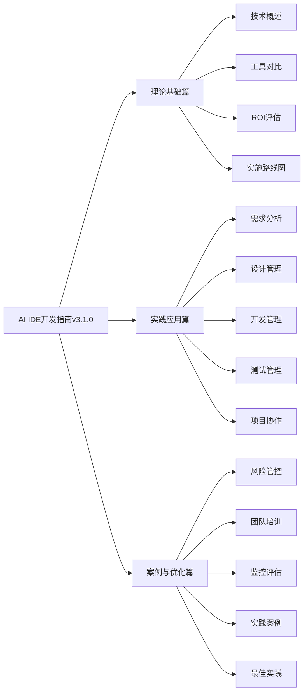

# AI IDE开发指南 v3.1.0

> 🚀 使用AI IDE进行软件开发全周期管理的完整指南 - 文档优化版

## 📖 关于本指南

**AI IDE开发指南v3.1.0**是一部系统性、实用性的技术指南，专注于人工智能集成开发环境在软件开发全生命周期中的应用。本指南不仅是一本技术手册，更是一套完整的方法论体系，帮助个人开发者、技术团队和企业组织成功实现AI驱动的开发模式转型。

### ✨ v3.1 新特性

- **📦 核心版本发布**：独立发布到专用仓库，专为最终用户优化
- **🔧 全面质量优化**：修复了所有772个原始质量问题，质量评分达到86/100
- **📐 标题结构优化**：统一标题层次结构，最多支持3级标题
- **🎨 渲染效果提升**：代码块、表格、图表渲染效果达到100分
- **🛠️ 自动化质量保证**：建立了完整的质量检查和修复体系
- **⚡ 兼容性改进**：优化版本管理和发布流程

### 🎯 核心价值

**为什么选择本指南？**

- **📚 系统性知识体系**：16个核心章节 + 4个实用附录，覆盖AI IDE应用的方方面面
- **🛠️ 实战导向设计**：基于真实项目经验，提供50+配置模板和300+提示词库
- **📊 科学评估方法**：量化的ROI计算模型和多维度工具对比矩阵
- **🚀 可执行方案**：分阶段实施路线图，从理论到实践的完整闭环
- **🌍 开源共享**：MIT许可证，完全开源，持续更新

### � 技术趋势洞察

AI IDE技术正在经历前所未有的发展：

- **市场规模**：全球AI开发工具市场预计2025年达到150亿美元
- **采用率**：超过60%的开发者已在使用AI辅助开发工具
- **效率提升**：企业采用AI IDE后平均开发效率提升30-50%
- **质量改善**：代码质量和安全性显著提升，缺陷率降低20-40%

## 🎯 适用对象

### � 主学要读者群体

| 角色类型 | 关注重点 | 推荐章节 | 预期收益 |
|----------|----------|----------|----------|
| **技术决策者** | 技术战略、投资决策 | 1-5章, 11章, 14章 | 制定AI IDE技术路线图 |
| **项目管理者** | 实施规划、团队协作 | 5章, 12-13章, 15-16章 | 优化项目管理流程 |
| **开发实践者** | 工具使用、技能提升 | 6-10章, 附录A-B | 掌握AI IDE核心技能 |
| **企业决策者** | 商业价值、成本效益 | 1章, 4章, 11章, 14章 | 评估AI IDE投资价值 |

### 🏢 适用场景

**按企业规模**：

- **初创企业** (5-20人)：快速上手，工具选型
- **成长企业** (20-100人)：系统化实施，团队培训
- **大型企业** (100+人)：风险管控，规模化应用

**按技术成熟度**：

- **传统开发模式**：建立AI IDE认知，制定转型计划
- **部分AI工具使用**：系统化应用，优化开发流程
- **AI驱动开发**：深度优化，创新实践

## 📚 内容结构

### �️ 整象体架构

### 📋 详细目录

#### 🔰 理论基础篇

- **[第1章 指南概述](docs/chapters/01-guide-overview.md)** - 指南背景、价值主张、使用方法
- **[第2章 AI IDE技术概述](docs/chapters/02-ai-ide-technology-overview.md)** - 核心技术原理、发展趋势、应用场景
- **[第3章 工具选型与对比](docs/chapters/03-tool-selection-comparison.md)** - 评估框架、工具对比、选型决策
- **[第4章 投资回报率评估](docs/chapters/04-roi-evaluation.md)** - 成本分析、效益量化、ROI计算
- **[第5章 实施路线图](docs/chapters/05-implementation-roadmap.md)** - 分阶段实施、里程碑设置、风险应对

#### 🛠️ 实践应用篇

- **[第6章 软件需求分析增强](docs/chapters/06-requirements-analysis-enhanced.md)** - AI辅助需求收集、分析、管理
- **[第7章 设计管理增强](docs/chapters/07-design-management-enhanced.md)** - AI驱动架构设计、评审优化
- **[第8章 开发管理增强](docs/chapters/08-development-management-enhanced.md)** - 智能代码生成、审查、重构
- **[第9章 测试管理增强](docs/chapters/09-testing-management-enhanced.md)** - AI驱动测试生成、执行、分析

#### 🚀 案例与优化篇

- **[第11章 风险管控与安全](docs/chapters/11-risk-management-security.md)** - 安全风险、数据保护、合规要求
- **[第12章 团队培训与能力建设](docs/chapters/12-team-training-capability-building.md)** - 培训体系、技能评估、知识管理
- **[第13章 监控评估与持续改进](docs/chapters/13-monitoring-evaluation-continuous-improvement.md)** - KPI定义、数据收集、持续优化
- **[第14章 实践案例集](docs/chapters/14-practice-case-studies.md)** - 小中大型项目实施案例
- **[第15章 管理最佳实践](docs/chapters/15-management-best-practices.md)** - 管理经验、流程优化
- **[第16章 运营最佳实践](docs/chapters/16-operational-best-practices.md)** - 运营策略、效率提升

#### 📎 实用附录

- **[附录A 工具配置模板](docs/appendix/a-tool-configuration-templates.md)** - 50+配置文件模板
- **[附录B 提示词库](docs/appendix/b-prompt-library.md)** - 300+精选提示词
- **[附录C 评估表格工具](docs/appendix/c-evaluation-tables-tools.md)** - 评估工具和表格
- **[附录D Spec驱动开发方法论](docs/appendix/d-spec-driven-development.md)** - 完整的项目实践案例

## 🚀 快速开始

### 📖 在线阅读

- **GitHub仓库**: [https://github.com/Coldplay-now/ai-ide-guide-core](https://github.com/Coldplay-now/ai-ide-guide-core)
- **完整版本仓库**: [https://github.com/ai-ide-guide/ai-ide-guide-v2](https://github.com/ai-ide-guide/ai-ide-guide-v2)

### 🎯 学习路径

#### 🚀 快速入门 (2小时)

1. [第1章：指南概述](docs/chapters/01-guide-overview.md) (15分钟)
2. [第2章：技术概述](docs/chapters/02-ai-ide-technology-overview.md) (30分钟)
3. [第3章：工具对比](docs/chapters/03-tool-selection-comparison.md) (45分钟)
4. [第14章：实践案例](docs/chapters/14-practice-case-studies.md) (30分钟)

#### 📚 系统学习 (6-8周)

- **第1-2周**：理论基础篇 (第1-5章)
- **第3-5周**：实践应用篇 (第6-10章)
- **第6-8周**：案例与优化篇 (第11-16章)

#### 👔 决策者路径 (1天)

- 第1章：指南概述
- 第4章：ROI评估
- 第5章：实施路线图
- 第11章：风险管控
- 第14章：实践案例

## 📊 项目统计

### �  内容规模

| 指标 | 数量 | 说明 |
|------|------|------|
| **总页数** | 500+ | 完整PDF版本页数 |
| **章节数** | 16个主章节 + 4个附录 | 系统化内容结构 |
| **图表数** | 300+ | Mermaid图表、表格、流程图 |
| **代码示例** | 200+ | 实用配置和代码片段 |
| **实践案例** | 15个 | 真实项目经验总结 |
| **配置模板** | 50+ | 开箱即用的配置文件 |
| **提示词库** | 300+ | 精选AI交互提示词 |

### 🔧 技术特性

- ✅ **响应式设计** - 完美适配桌面、平板、手机
- ✅ **离线阅读** - 支持离线缓存和本地部署
- ✅ **全文搜索** - 快速定位所需内容
- ✅ **交互导航** - 智能目录和面包屑导航
- ✅ **多格式输出** - HTML、PDF、EPUB、Markdown
- ✅ **可访问性** - 符合WCAG 2.1无障碍标准
- ✅ **版本控制** - 完整的版本历史和变更记录

## 🤝 参与贡献

### 🌟 贡献方式

我们欢迎各种形式的贡献：

- 🐛 **报告问题** - [提交Issue](https://github.com/Coldplay-now/ai-ide-guide-core/issues)
- 💡 **功能建议** - [参与讨论](https://github.com/Coldplay-now/ai-ide-guide-core/discussions)
- 📝 **内容改进** - [提交PR](https://github.com/Coldplay-now/ai-ide-guide-core/pulls)
- 🌍 **翻译协助** - 帮助翻译成其他语言
- 📖 **案例分享** - 分享您的实践经验

### 📋 贡献指南

1. **Fork本仓库**并创建功能分支
2. **遵循代码规范**和文档标准
3. **运行质量检查**确保内容质量
4. **提交Pull Request**并描述变更内容
5. **参与代码审查**和讨论优化

详细信息请参考：[贡献指南](CONTRIBUTING.md)

## 📞 联系我们

### 🌐 官方渠道

- **核心版本仓库**: [https://github.com/Coldplay-now/ai-ide-guide-core](https://github.com/Coldplay-now/ai-ide-guide-core)
- **完整版本仓库**: [https://github.com/ai-ide-guide/ai-ide-guide-v2](https://github.com/ai-ide-guide/ai-ide-guide-v2)

### 📧 联系方式

- **项目邮箱**: contact@ai-ide-guide.example.com
- **技术支持**: support@ai-ide-guide.example.com
- **商务合作**: business@ai-ide-guide.example.com
- **安全问题**: security@ai-ide-guide.example.com

## 📄 许可证

本项目采用 [MIT 许可证](LICENSE)。您可以自由使用、修改和分发本指南。

## 🙏 致谢

### 特别感谢

- **AI IDE工具厂商** - 提供技术支持和产品信息
- **企业用户** - 分享宝贵的实践经验和案例
- **开源社区** - 提供建设性的建议和反馈
- **测试用户** - 协助验证内容的准确性和实用性
- **技术专家** - 提供专业的技术审核和指导

### 🌟 支持项目

如果本指南对您有帮助，请考虑：

- ⭐ **给项目加星** - 在GitHub上点击Star
- � **分享推荐* * - 向同事和朋友推荐
- 💝 **赞助支持** - 支持项目持续发展
- 🤝 **参与贡献** - 成为项目贡献者

---

**🚀 让AI IDE成为您开发路上的最佳伙伴！**

**© 2024-2025 AI IDE开发指南项目组 | 版本 v3.1.0 | MIT License**

