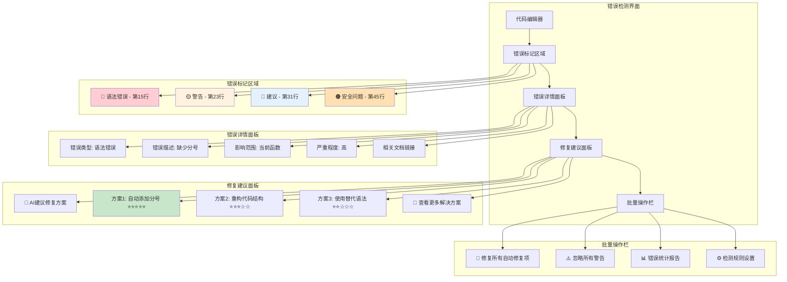
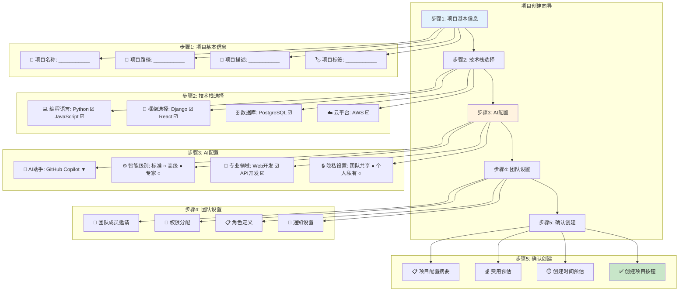

# AI IDE界面线框图和原型


## AI IDE主界面布局线框图


### 桌面版主界面线框图


<div class="chart-container">
```mermaid
graph TB
    subgraph "主窗口布局"
        A[标题栏 - 文件名 | AI IDE | 窗口控制]
        B[菜单栏 - 文件 编辑 视图 AI助手 工具 帮助]
        C[工具栏 - 新建 打开 保存 | 运行 调试 | AI功能快捷键]
        
        subgraph "主工作区"
            D[侧边栏]
            E[编辑器区域]
            F[右侧面板]
        end
        
        G[状态栏 - 行列信息 | 语言模式 | AI状态 | 错误统计]
    end
    
    subgraph "侧边栏内容"
        D1[文件浏览器]
        D2[搜索面板]
        D3[版本控制]
        D4[AI助手面板]
        D5[插件管理]
    end
    
    subgraph "编辑器区域"
        E1[标签页 - 打开的文件]
        E2[代码编辑器]
        E3[AI补全提示]
        E4[错误标记]
        E5[代码折叠]
    end
    
    subgraph "右侧面板"
        F1[大纲视图]
        F2[AI建议面板]
        F3[问题面板]
        F4[终端/控制台]
    end
    
    A --> B
    B --> C
    C --> D
    C --> E
    C --> F
    E --> G
    
    D --> D1
    D --> D2
    D --> D3
    D --> D4
    D --> D5
    
    E --> E1
    E --> E2
    E --> E3
    E --> E4
    E --> E5
    
    F --> F1
    F --> F2
    F --> F3
    F --> F4
    
    style A fill:#e3f2fd
    style E2 fill:#e8f5e8
    style D4 fill:#fff3e0
    style F2 fill:#fff3e0

```

### Web版界面线框图


<div class="chart-container">
```mermaid
graph TB
    subgraph "Web界面布局"
        A[顶部导航栏 - Logo | 项目名 | 用户菜单]
        
        subgraph "主内容区"
            B[左侧导航]
            C[编辑器容器]
            D[右侧工具栏]
        end
        
        E[底部状态栏]
    end
    
    subgraph "左侧导航"
        B1[📁 项目文件]
        B2[🔍 全局搜索]
        B3[🔄 Git状态]
        B4[🤖 AI助手]
        B5[⚙️ 设置]
    end
    
    subgraph "编辑器容器"
        C1[文件标签栏]
        C2[代码编辑区域]
        C3[AI补全弹窗]
        C4[错误提示浮层]
    end
    
    subgraph "右侧工具栏"
        D1[📋 代码大纲]
        D2[💡 AI建议]
        D3[🐛 问题列表]
        D4[📊 代码统计]
    end
    
    subgraph "底部状态栏"
        E1[当前位置]
        E2[语言模式]
        E3[AI状态指示器]
        E4[在线用户]
    end
    
    A --> B
    A --> C
    A --> D
    C --> E
    
    B --> B1
    B --> B2
    B --> B3
    B --> B4
    B --> B5
    
    C --> C1
    C --> C2
    C --> C3
    C --> C4
    
    D --> D1
    D --> D2
    D --> D3
    D --> D4
    
    E --> E1
    E --> E2
    E --> E3
    E --> E4
    
    style A fill:#e1f5fe
    style C2 fill:#e8f5e8
    style B4 fill:#fff3e0
    style D2 fill:#fff3e0

```

## AI功能界面设计


### AI代码补全界面线框图


<div class="chart-container">
```mermaid
graph TB
    subgraph "代码补全界面"
        A[编辑器窗口]
        B[补全触发位置]
        C[补全建议列表]
        D[建议详情面板]
        E[快捷操作栏]
    end
    
    subgraph "补全建议列表"
        C1[建议1 - 函数名 | 类型 | 置信度★★★★☆]
        C2[建议2 - 变量名 | 类型 | 置信度★★★☆☆]
        C3[建议3 - 关键字 | 类型 | 置信度★★★★★]
        C4[建议4 - 代码片段 | 类型 | 置信度★★★☆☆]
        C5[更多建议... | 展开按钮]
    end
    
    subgraph "建议详情面板"
        D1[选中建议预览]
        D2[参数信息]
        D3[使用示例]
        D4[相关文档链接]
    end
    
    subgraph "快捷操作栏"
        E1[Tab - 接受建议]
        E2[Esc - 取消]
        E3[Ctrl+Space - 手动触发]
        E4[⚙️ - 补全设置]
    end
    
    A --> B
    B --> C
    C --> D
    C --> E
    
    C --> C1
    C --> C2
    C --> C3
    C --> C4
    C --> C5
    
    D --> D1
    D --> D2
    D --> D3
    D --> D4
    
    E --> E1
    E --> E2
    E --> E3
    E --> E4
    
    style B fill:#ffebee
    style C fill:#e8f5e8
    style D fill:#e1f5fe

```

### AI代码生成界面线框图


<div class="chart-container">
```mermaid
graph TB
    subgraph "代码生成界面"
        A[生成触发区域]
        B[意图输入框]
        C[生成选项面板]
        D[代码预览区域]
        E[操作按钮组]
    end
    
    subgraph "意图输入框"
        B1[💬 描述你想要生成的代码...]
        B2[🎯 示例: "创建一个用户登录API接口"]
        B3[📝 支持自然语言描述]
    end
    
    subgraph "生成选项面板"
        C1[🔧 语言选择: Python ▼]
        C2[📚 框架选择: FastAPI ▼]
        C3[🎨 代码风格: PEP8 ▼]
        C4[📊 复杂度: 中等 ▼]
        C5[🔒 安全级别: 高 ▼]
    end
    
    subgraph "代码预览区域"
        D1[生成的代码预览]
        D2[语法高亮显示]
        D3[行号显示]
        D4[错误标记]
        D5[AI信心度指示器]
    end
    
    subgraph "操作按钮组"
        E1[✅ 接受代码]
        E2[🔄 重新生成]
        E3[✏️ 编辑后接受]
        E4[❌ 取消]
        E5[💾 保存为模板]
    end
    
    A --> B
    B --> C
    C --> D
    D --> E
    
    B --> B1
    B --> B2
    B --> B3
    
    C --> C1
    C --> C2
    C --> C3
    C --> C4
    C --> C5
    
    D --> D1
    D --> D2
    D --> D3
    D --> D4
    D --> D5
    
    E --> E1
    E --> E2
    E --> E3
    E --> E4
    E --> E5
    
    style B1 fill:#e8f5e8
    style D1 fill:#e1f5fe
    style E1 fill:#c8e6c9
    style E4 fill:#ffcdd2

```

### AI错误检测界面线框图


<div class="chart-container">


## 工作流程界面设计


### 项目创建工作流界面


<div class="chart-container">


### 代码审查工作流界面


<div class="chart-container">
```mermaid
graph TB
    subgraph "代码审查界面"
        A[审查请求列表]
        B[代码差异视图]
        C[AI审查建议]
        D[人工审查面板]
        E[审查决策区域]
    end
    
    subgraph "审查请求列表"
        A1[PR #123 - 用户认证功能 | 👤 张三 | ⏰ 2小时前]
        A2[PR #124 - 数据库优化 | 👤 李四 | ⏰ 1天前]
        A3[PR #125 - UI界面更新 | 👤 王五 | ⏰ 3天前]
        A4[🔍 筛选: 待审查 ▼ | 排序: 时间 ▼]
    end
    
    subgraph "代码差异视图"
        B1[文件列表 | 修改统计]
        B2[- 删除的代码行 (红色背景)]
        B3[+ 新增的代码行 (绿色背景)]
        B4[📝 行内注释功能]
        B5[🔍 代码搜索]
    end
    
    subgraph "AI审查建议"
        C1[🤖 AI自动审查结果]
        C2[✅ 代码质量: 良好 (85分)]
        C3[⚠️ 发现3个潜在问题]
        C4[💡 5条改进建议]
        C5[🔒 安全检查: 通过]
    end
    
    subgraph "人工审查面板"
        D1[📝 审查评论输入框]
        D2[🏷️ 标签: bug ☑️ enhancement ☑️]
        D3[👥 @提及相关人员]
        D4[📎 附件上传]
    end
    
    subgraph "审查决策区域"
        E1[✅ 批准合并]
        E2[🔄 请求修改]
        E3[❌ 拒绝合并]
        E4[💬 仅评论]
        E5[📊 审查统计]
    end
    
    A --> B
    B --> C
    C --> D
    D --> E
    
    A --> A1
    A --> A2
    A --> A3
    A --> A4
    
    B --> B1
    B --> B2
    B --> B3
    B --> B4
    B --> B5
    
    C --> C1
    C --> C2
    C --> C3
    C --> C4
    C --> C5
    
    D --> D1
    D --> D2
    D --> D3
    D --> D4
    
    E --> E1
    E --> E2
    E --> E3
    E --> E4
    E --> E5
    
    style C fill:#fff3e0
    style E1 fill:#c8e6c9
    style E3 fill:#ffcdd2

```

## 配置界面设计


### AI IDE配置界面线框图

```mermaid
graph TB
    subgraph "配置界面主布局"
        A[配置导航菜单]
        B[配置内容区域]
        C[预览/测试区域]
        D[保存/重置按钮]
    end
    
    subgraph "配置导航菜单"
        A1[⚙️ 基本设置]
        A2[🤖 AI配置]
        A3[🎨 界面主题]
        A4[⌨️ 快捷键]
        A5[🔌 插件管理]
        A6[👥 团队设置]
        A7[🔒 安全设置]
        A8[📊 性能优化]
    end
    
    subgraph "AI配置详细设置"
        B1[AI服务提供商选择]
        B2[智能补全设置]
        B3[代码生成偏好]
        B4[错误检测级别]
        B5[学习模式配置]
        B6[隐私保护设置]
    end
    
    subgraph "智能补全设置"
        B21[🔄 自动触发: 开启 ●○]
        B22[⏱️ 触发延迟: 200ms ▼]
        B23[📊 最大建议数: 10 ▼]
        B24[🎯 置信度阈值: 70% ▼]
        B25[📝 包含注释: 是 ●○]
    end
    
    subgraph "代码生成偏好"
        B31[🎨 代码风格: Google Style ▼]
        B32[📏 最大行长度: 80 ▼]
        B33[🔧 优先框架: React, Django ▼]
        B34[💡 创新程度: 保守 ○ 平衡 ● 激进 ○]
        B35[🔍 包含测试代码: 是 ●○]
    end
    
    subgraph "预览/测试区域"
        C1[⚡ 实时预览效果]
        C2[🧪 配置测试工具]
        C3[📈 性能影响评估]
        C4[💾 配置导入/导出]
    end
    
    A --> B
    B --> C
    C --> D
    
    A --> A1
    A --> A2
    A --> A3
    A --> A4
    A --> A5
    A --> A6
    A --> A7
    A --> A8
    
    B --> B1
    B --> B2
    B --> B3
    B --> B4
    B --> B5
    B --> B6
    
    B2 --> B21
    B2 --> B22
    B2 --> B23
    B2 --> B24
    B2 --> B25
    
    B3 --> B31
    B3 --> B32
    B3 --> B33
    B3 --> B34
    B3 --> B35
    
    C --> C1
    C --> C2
    C --> C3
    C --> C4
    
    style A2 fill:#fff3e0
    style B2 fill:#e8f5e8
    style B3 fill:#e1f5fe
    style C2 fill:#f3e5f5

```


<div class="chart-container">


## 报告展示界面设计


### AI使用统计报告界面


<div class="chart-container">
```mermaid
graph TB
    subgraph "报告仪表板"
        A[报告导航栏]
        B[关键指标卡片]
        C[图表展示区域]
        D[详细数据表格]
        E[导出/分享功能]
    end
    
    subgraph "关键指标卡片"
        B1[📊 AI使用率: 85% ↗️ +5%]
        B2[⚡ 效率提升: 35% ↗️ +3%]
        B3[🐛 错误减少: 42% ↗️ +8%]
        B4[💰 成本节省: ¥15,000 ↗️ +12%]
    end
    
    subgraph "图表展示区域"
        C1[📈 使用趋势图 (时间序列)]
        C2[🥧 功能使用分布饼图]
        C3[📊 团队效率对比柱状图]
        C4[🗺️ 代码质量热力图]
    end
    
    subgraph "详细数据表格"
        D1[用户 | 使用时长 | 补全次数 | 生成代码行数 | 错误修复数]
        D2[张三 | 8.5h | 245 | 1,250 | 15]
        D3[李四 | 7.2h | 189 | 980 | 12]
        D4[王五 | 6.8h | 156 | 750 | 8]
        D5[... | ... | ... | ... | ...]
    end
    
    subgraph "导出/分享功能"
        E1[📄 导出PDF报告]
        E2[📊 导出Excel数据]
        E3[🔗 生成分享链接]
        E4[📧 邮件发送报告]
        E5[📅 定期报告设置]
    end
    
    A --> B
    B --> C
    C --> D
    D --> E
    
    B --> B1
    B --> B2
    B --> B3
    B --> B4
    
    C --> C1
    C --> C2
    C --> C3
    C --> C4
    
    D --> D1
    D --> D2
    D --> D3
    D --> D4
    D --> D5
    
    E --> E1
    E --> E2
    E --> E3
    E --> E4
    E --> E5
    
    style B1 fill:#e3f2fd
    style B2 fill:#e8f5e8
    style B3 fill:#fff3e0
    style B4 fill:#f3e5f5
    style C1 fill:#e1f5fe

```

### 团队协作报告界面


<div class="chart-container">
```mermaid
graph TB
    subgraph "团队协作仪表板"
        A[时间范围选择器]
        B[团队概览面板]
        C[协作指标区域]
        D[活动时间线]
        E[成员详情面板]
    end
    
    subgraph "团队概览面板"
        B1[👥 团队成员: 12人]
        B2[📈 活跃度: 92%]
        B3[🤝 协作项目: 8个]
        B4[📊 代码贡献: 15,420行]
    end
    
    subgraph "协作指标区域"
        C1[📝 代码审查]
        C2[💬 讨论参与]
        C3[🔄 知识分享]
        C4[🎯 目标完成]
    end
    
    subgraph "代码审查指标"
        C11[审查请求: 45个]
        C12[平均审查时间: 2.3小时]
        C13[审查通过率: 87%]
        C14[AI辅助审查: 78%]
    end
    
    subgraph "活动时间线"
        D1[📅 今天]
        D2[🔄 张三 提交了代码审查]
        D3[💡 李四 分享了最佳实践]
        D4[🐛 王五 修复了关键bug]
        D5[📊 团队完成了里程碑]
    end
    
    subgraph "成员详情面板"
        E1[成员列表 | 贡献度 | AI使用率 | 协作分数]
        E2[张三 | ████████░░ 80% | 85% | 9.2]
        E3[李四 | ███████░░░ 70% | 92% | 8.8]
        E4[王五 | ██████░░░░ 60% | 78% | 8.5]
        E5[详细分析 →]
    end
    
    A --> B
    B --> C
    C --> D
    D --> E
    
    B --> B1
    B --> B2
    B --> B3
    B --> B4
    
    C --> C1
    C --> C2
    C --> C3
    C --> C4
    
    C1 --> C11
    C1 --> C12
    C1 --> C13
    C1 --> C14
    
    D --> D1
    D --> D2
    D --> D3
    D --> D4
    D --> D5
    
    E --> E1
    E --> E2
    E --> E3
    E --> E4
    E --> E5
    
    style B fill:#e1f5fe
    style C1 fill:#fff3e0
    style D fill:#e8f5e8
    style E fill:#f3e5f5

```

## 移动端界面适配


### 移动端主界面线框图


<div class="chart-container">
```mermaid
graph TB
    subgraph "移动端界面布局"
        A[顶部标题栏]
        B[主导航标签]
        C[内容滚动区域]
        D[浮动操作按钮]
        E[底部工具栏]
    end
    
    subgraph "顶部标题栏"
        A1[☰ 菜单 | 项目名称 | 🔔 通知]
    end
    
    subgraph "主导航标签"
        B1[📁 文件 | 🤖 AI助手 | 🔍 搜索 | ⚙️ 设置]
    end
    
    subgraph "内容滚动区域"
        C1[文件列表视图]
        C2[代码编辑器 (简化版)]
        C3[AI建议卡片]
        C4[快速操作面板]
    end
    
    subgraph "浮动操作按钮"
        D1[+ 新建文件]
        D2[🤖 AI助手]
        D3[💾 快速保存]
    end
    
    subgraph "底部工具栏"
        E1[◀️ 返回 | 🏠 首页 | 📊 统计 | 👤 个人]
    end
    
    A --> B
    B --> C
    C --> D
    C --> E
    
    A --> A1
    B --> B1
    C --> C1
    C --> C2
    C --> C3
    C --> C4
    D --> D1
    D --> D2
    D --> D3
    E --> E1
    
    style A fill:#e3f2fd
    style B1 fill:#fff3e0
    style C2 fill:#e8f5e8
    style D fill:#f3e5f5

```

### 移动端AI交互界面


<div class="chart-container">
```mermaid
graph TB
    subgraph "移动端AI交互"
        A[语音输入按钮]
        B[文本输入框]
        C[AI响应区域]
        D[快捷操作按钮]
        E[历史对话]
    end
    
    subgraph "语音输入界面"
        A1[🎤 点击说话]
        A2[🔊 语音识别中...]
        A3[📝 转换为文本]
        A4[✅ 确认 | 🔄 重录]
    end
    
    subgraph "AI响应区域"
        C1[💭 AI思考中...]
        C2[📝 生成的代码]
        C3[💡 解释说明]
        C4[🔗 相关链接]
        C5[👍 👎 反馈按钮]
    end
    
    subgraph "快捷操作按钮"
        D1[📋 复制代码]
        D2[📤 分享]
        D3[💾 保存]
        D4[🔄 重新生成]
    end
    
    A --> B
    B --> C
    C --> D
    D --> E
    
    A --> A1
    A --> A2
    A --> A3
    A --> A4
    
    C --> C1
    C --> C2
    C --> C3
    C --> C4
    C --> C5
    
    D --> D1
    D --> D2
    D --> D3
    D --> D4
    
    style A fill:#fff3e0
    style C fill:#e8f5e8
    style D fill:#e1f5fe

```