# AI IDE流程和时序图

## AI IDE开发流程时序图

### 代码补全流程时序图

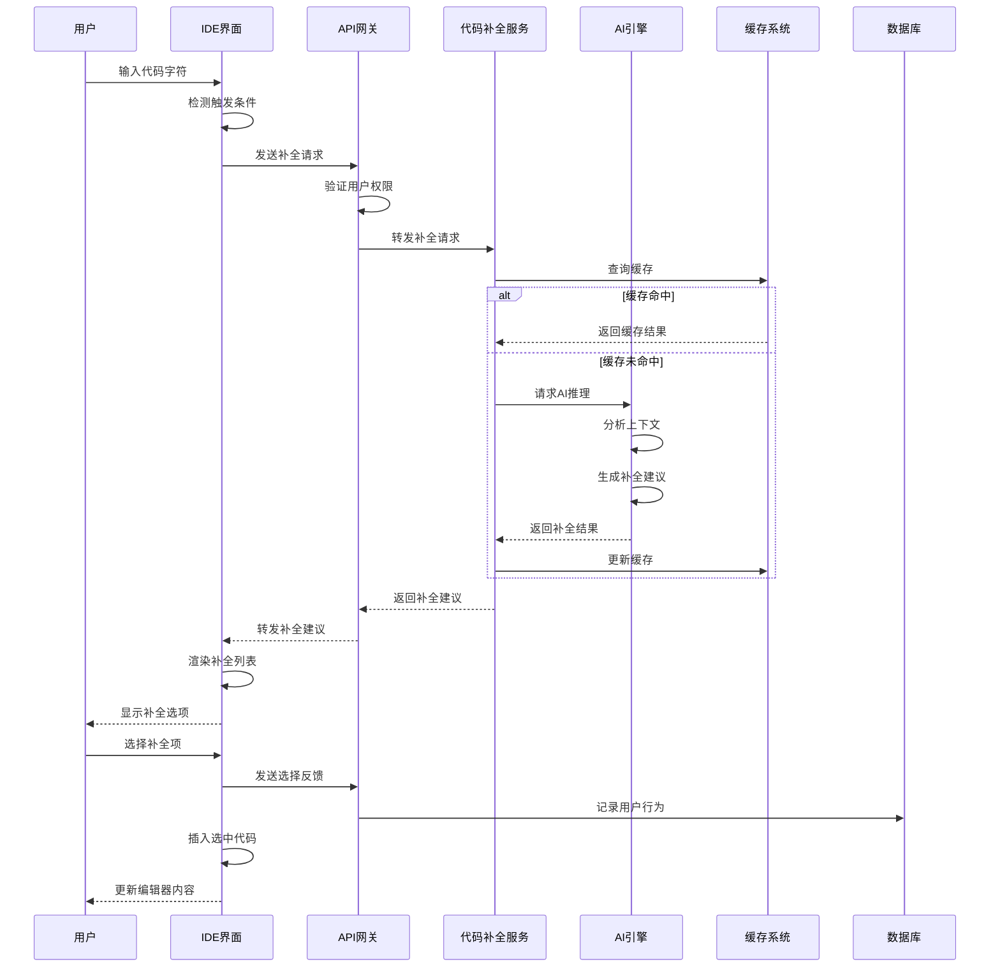

### 代码生成流程时序图

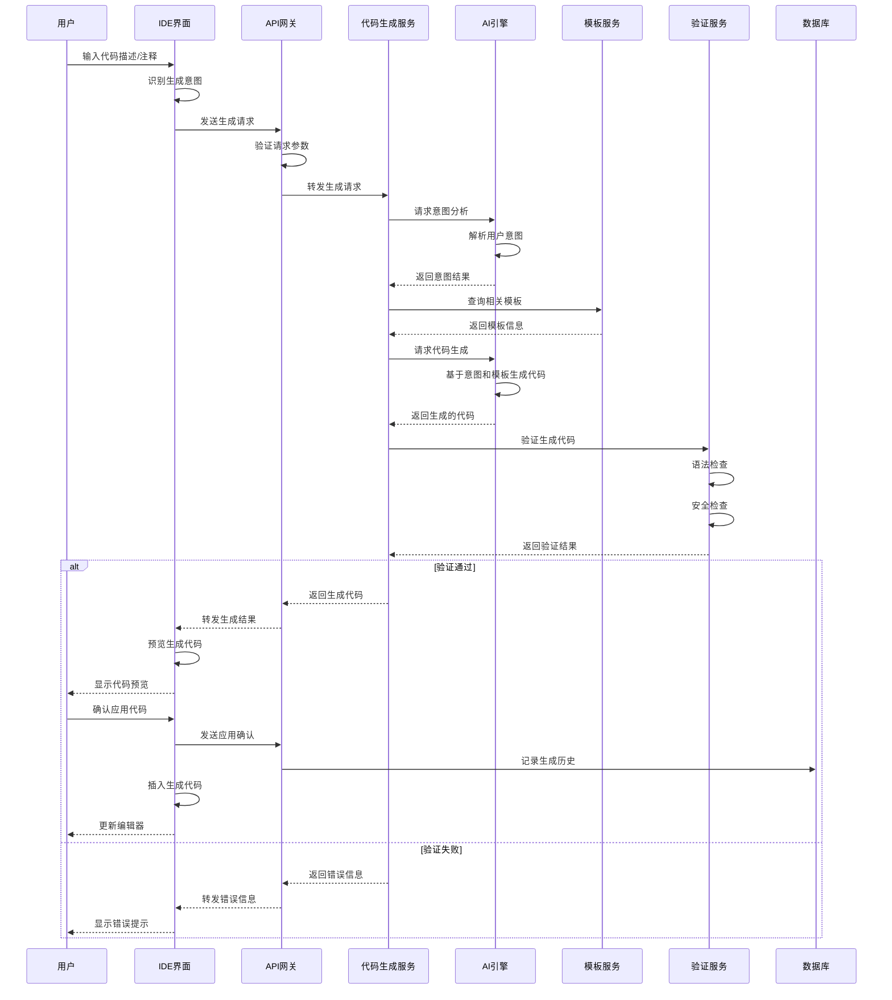

### 错误检测和修复流程时序图

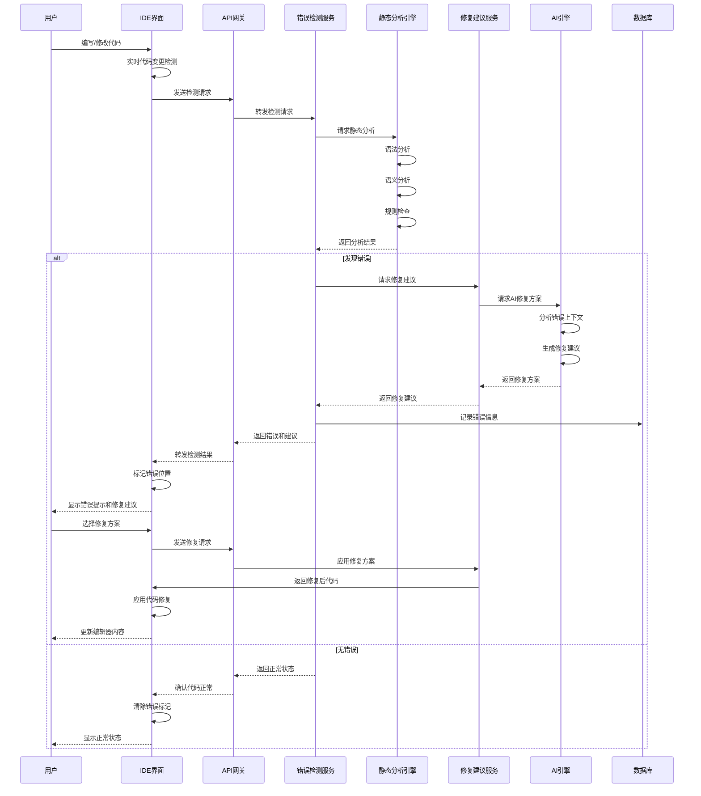

## 团队协作流程时序图

### 代码审查协作流程

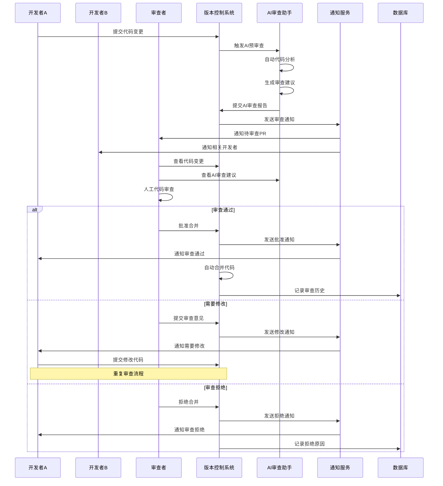

### 团队知识共享流程

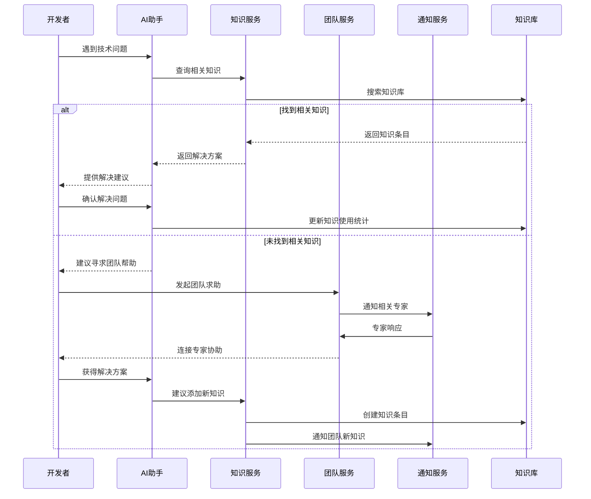

## 部署流程时序图

### CI/CD部署流程

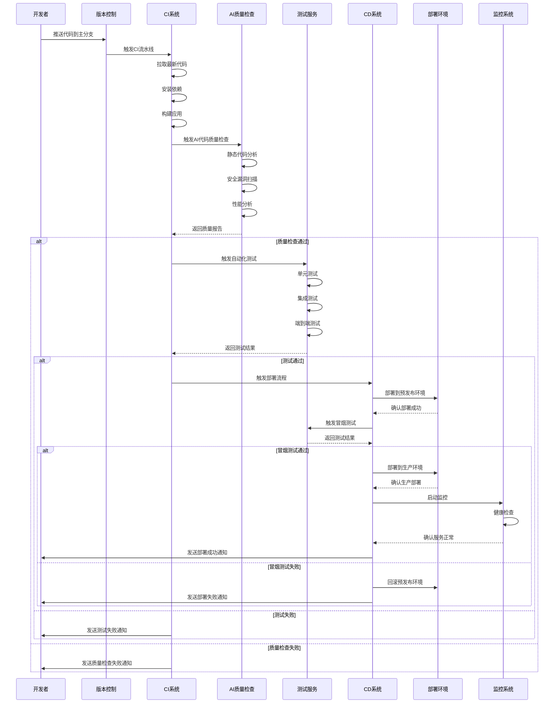

## 工具选型决策流程图

### AI IDE选型决策流程

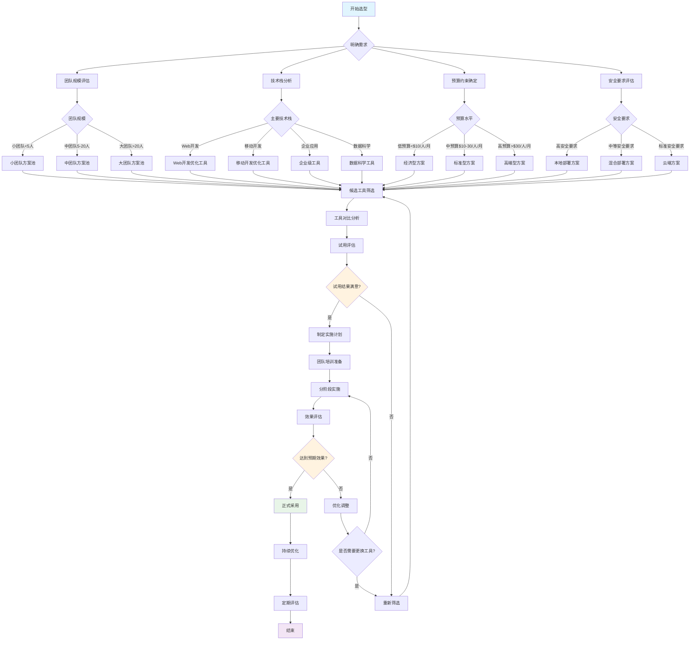

## 实施路线图流程图

### AI IDE实施路线图

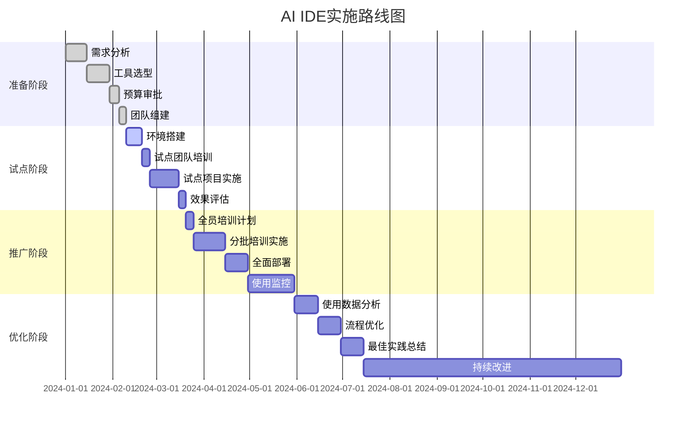

### 风险应对流程图

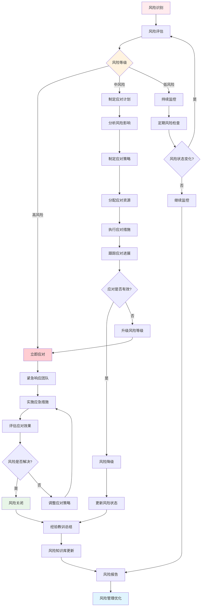

## 用户体验流程图

### 新用户上手流程

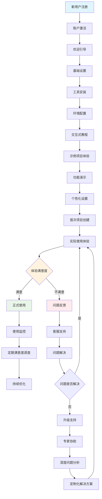

### 用户反馈处理流程

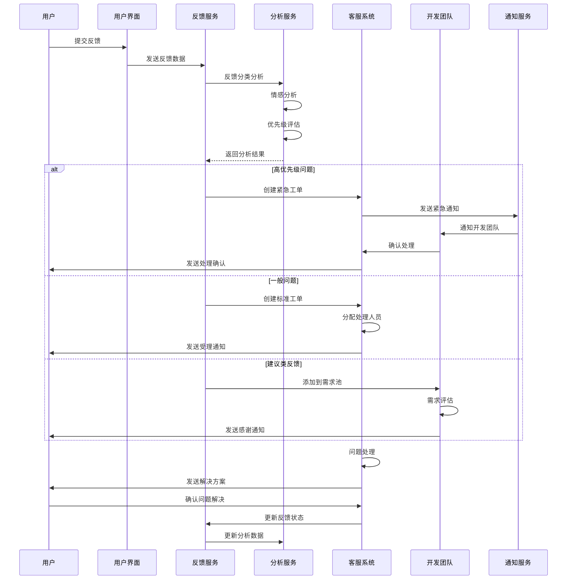