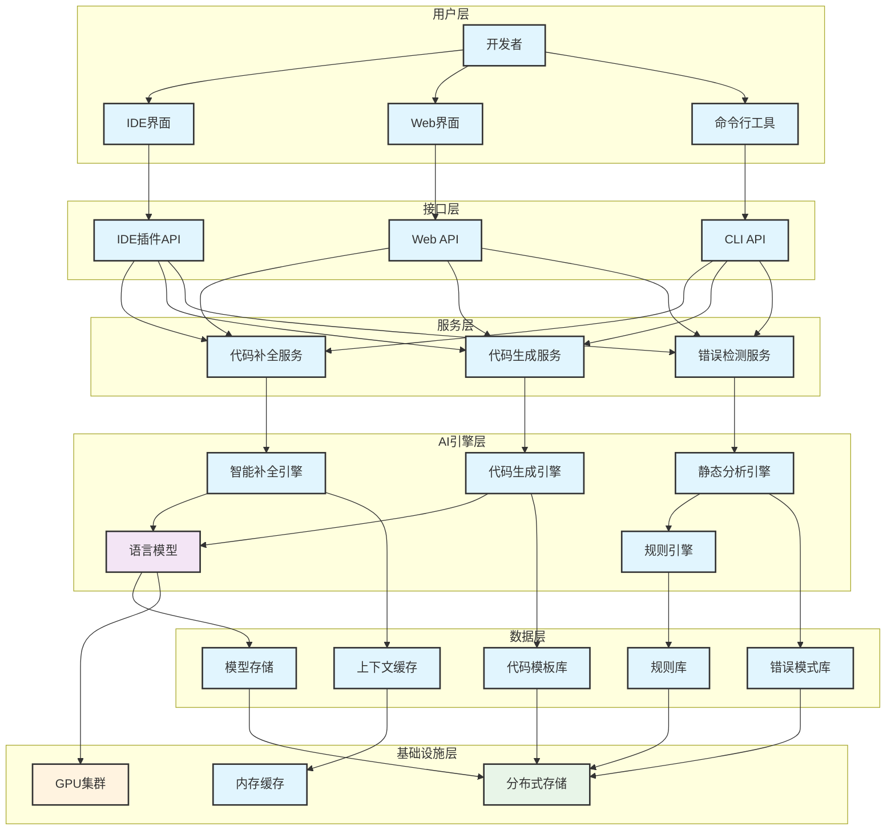
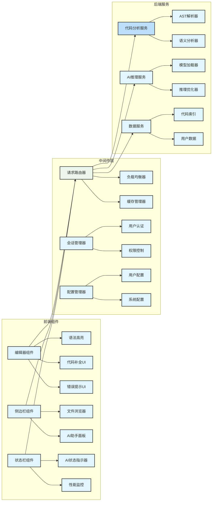
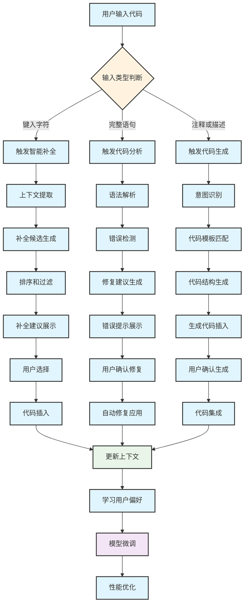
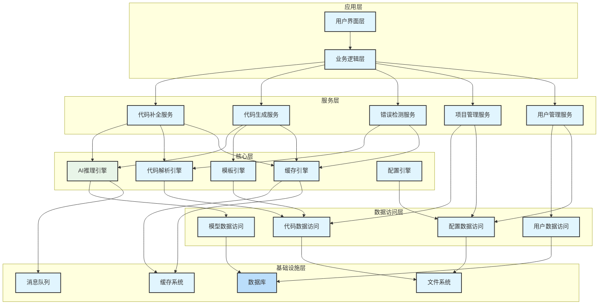
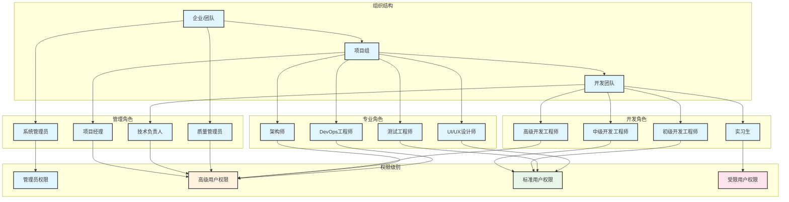
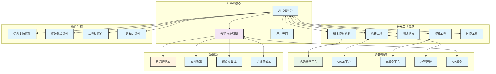
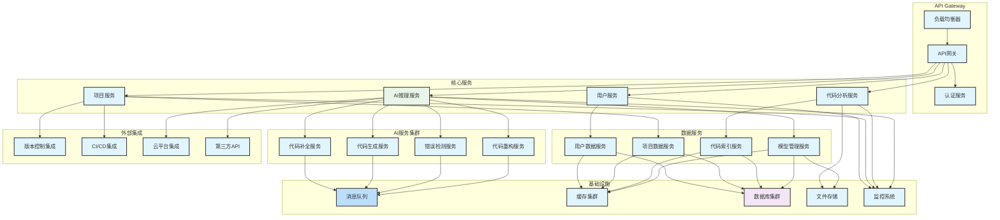
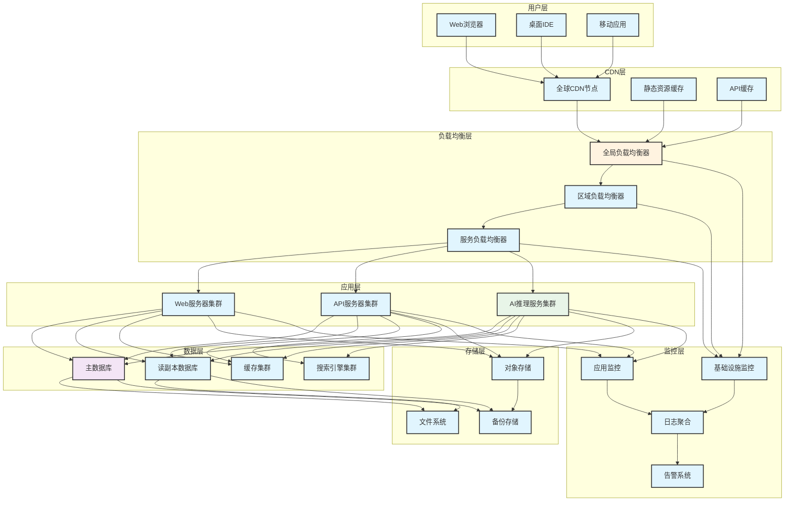

# AI IDE系统架构和关系图


## AI IDE系统整体架构图


<div class="chart-container">



## AI IDE核心组件关系图


<div class="chart-container">



## AI IDE数据流关系图


<div class="chart-container">



## AI IDE组件依赖关系图


<div class="chart-container">



## 用户角色关系图


<div class="chart-container">



## AI IDE与开发工具生态系统关系图


<div class="chart-container">



## AI IDE实体关系图(ERD)


<div class="chart-container">

```mermaid
erDiagram
    USER {
        string user_id PK
        string username
        string email
        string role
        datetime created_at
        datetime last_login
        json preferences
    }
    
    PROJECT {
        string project_id PK
        string name
        string description
        string owner_id FK
        string language
        json settings
        datetime created_at
        datetime updated_at
    }
    
    CODE_FILE {
        string file_id PK
        string project_id FK
        string file_path
        string language
        text content
        string hash
        datetime modified_at
        int size
    }
    
    AI_SESSION {
        string session_id PK
        string user_id FK
        string project_id FK
        datetime start_time
        datetime end_time
        json context
        int interactions_count
    }
    
    CODE_COMPLETION {
        string completion_id PK
        string session_id FK
        string file_id FK
        int line_number
        int column_number
        text prompt
        text suggestion
        boolean accepted
        datetime timestamp
        float confidence_score
    }
    
    CODE_GENERATION {
        string generation_id PK
        string session_id FK
        string file_id FK
        text description
        text generated_code
        boolean applied
        datetime timestamp
        json metadata
    }
    
    ERROR_DETECTION {
        string error_id PK
        string file_id FK
        string error_type
        int line_number
        string message
        text suggestion
        string severity
        boolean resolved
        datetime detected_at
    }
    
    USER_FEEDBACK {
        string feedback_id PK
        string user_id FK
        string completion_id FK
        string feedback_type
        int rating
        text comment
        datetime created_at
    }
    
    MODEL_USAGE {
        string usage_id PK
        string user_id FK
        string model_name
        int tokens_used
        float processing_time
        datetime timestamp
        string operation_type
    }
    
| USER | - | --o{ PROJECT : owns |
| USER | - | --o{ AI_SESSION : creates |
| PROJECT | - | --o{ CODE_FILE : contains |
| PROJECT | - | --o{ AI_SESSION : "used in" |
| AI_SESSION | - | --o{ CODE_COMPLETION : generates |
| AI_SESSION | - | --o{ CODE_GENERATION : produces |
| CODE_FILE | - | --o{ ERROR_DETECTION : "has errors" |
| CODE_COMPLETION | - | --o{ USER_FEEDBACK : receives |
| USER | - | --o{ MODEL_USAGE : tracks |
| USER | - | --o{ USER_FEEDBACK : provides |

```

## AI IDE微服务架构图


<div class="chart-container">



## AI IDE部署架构图


<div class="chart-container">


