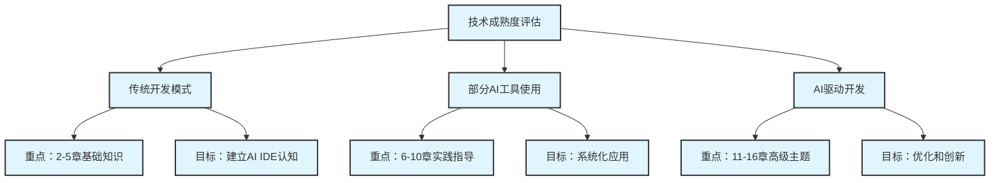
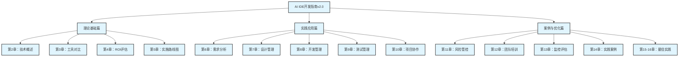

# 第1章 指南概述与摘要

> **章节概述**: 本章为读者提供AI IDE开发指南的全面概览，介绍指南的目标、结构、适用对象以及核心价值主张。
> 
> **预计阅读时间**: 15分钟
> 
> **前置知识**: 基础的软件开发概念

## 本章导读

### 学习目标

完成本章学习后，您将能够：
- 理解AI IDE技术的核心价值和发展趋势
- 明确本指南的适用场景和目标读者
- 掌握指南的整体结构和使用方法
- 制定个人或团队的AI IDE学习路径

### 章节结构

- **第一部分**: 指南背景与价值主张
- **第二部分**: 目标读者与适用场景
- **第三部分**: 指南结构与使用指导
- **第四部分**: 学习路径与实施建议

## 1.1 指南背景与价值主张

### 1.1.1 AI IDE技术革命

人工智能正在重塑软件开发的每一个环节。从代码生成到测试自动化，从需求分析到项目管理，AI IDE（人工智能集成开发环境）正在成为现代软件开发的核心工具。

**技术发展趋势**：
- **代码生成能力**：从简单的代码补全发展到复杂的功能实现
- **智能化程度**：从被动工具转变为主动的开发伙伴
- **集成深度**：从单一功能扩展到全生命周期管理
- **协作模式**：从个人工具演进为团队协作平台

**市场现状**：
- 全球AI开发工具市场预计2025年将达到150亿美元
- 超过60%的开发者已经在使用某种形式的AI辅助工具
- 企业采用AI IDE后平均开发效率提升30-50%
- 代码质量和安全性显著改善

### 1.1.2 为什么需要这本指南

**行业痛点**：
- **工具选择困难**：市场上AI IDE工具众多，缺乏系统性对比
- **实施经验不足**：缺乏成熟的实施方法论和最佳实践
- **ROI评估困难**：难以量化AI IDE投资的实际回报
- **团队转型挑战**：传统开发团队向AI驱动模式转型面临阻力

**指南价值**：
- **系统性知识体系**：从理论到实践的完整覆盖
- **实战经验总结**：基于真实项目的经验分享
- **决策支持工具**：提供量化的评估和选型方法
- **实施路线图**：分阶段、可操作的实施指导

### 1.1.3 核心价值主张

本指南致力于为读者提供：

**🎯 明确的方向指引**
- 清晰的AI IDE技术发展脉络
- 基于数据的工具选型建议
- 量化的投资回报评估方法

**🛠️ 实用的工具资源**
- 50+个配置模板和代码示例
- 7个自动化质量保证工具
- 300+个精选提示词库

**📊 科学的评估体系**
- 标准化的ROI计算模型
- 多维度的工具对比矩阵
- 量化的效果评估指标

**🚀 可执行的实施方案**
- 分阶段的实施路线图
- 详细的任务清单和时间规划
- 风险识别和应对策略

## 1.2 目标读者与适用场景

### 1.2.1 主要目标读者

**技术决策者**
- **CTO/技术总监**：制定技术战略和投资决策
- **架构师**：设计技术架构和选型方案
- **技术团队负责人**：推动团队技术升级

**项目管理者**
- **项目经理**：评估项目可行性和资源需求
- **产品经理**：理解技术能力对产品的影响
- **敏捷教练**：优化开发流程和团队协作

**开发实践者**
- **高级开发工程师**：掌握AI IDE使用技巧
- **DevOps工程师**：集成AI工具到CI/CD流程
- **质量保证工程师**：利用AI提升测试效率

**企业决策者**
- **CEO/创始人**：评估技术投资的商业价值
- **CFO**：进行成本效益分析
- **人力资源负责人**：制定人才培养策略

### 1.2.2 适用场景分析

**按企业规模分类**：

| 企业规模 | 团队特点 | 主要关注点 | 适用章节 |
|----------|----------|------------|----------|
| 初创企业 (5-20人) | 资源有限，追求快速迭代 | 工具选型、快速上手 | 2-5章, 14章案例1 |
| 成长企业 (20-100人) | 团队扩张，流程规范化 | 实施路线图、团队培训 | 全部章节 |
| 大型企业 (100+人) | 复杂组织，风险管控 | ROI评估、风险管理 | 4,11,13章重点 |

**按技术成熟度分类**：

### 1.2.3 学习路径建议

**快速入门路径** (适合时间有限的读者)
1. 第1章：指南概述 (15分钟)
2. 第2章：技术概述 (30分钟)
3. 第3章：工具对比 (45分钟)
4. 第14章：实践案例 (60分钟)

**系统学习路径** (适合深度学习的读者)
1. **基础认知阶段** (1-2周)：第1-5章
2. **实践应用阶段** (3-4周)：第6-10章
3. **高级优化阶段** (2-3周)：第11-16章
4. **持续改进阶段** (持续)：定期回顾和更新

**角色定制路径**：

**决策者路径**：
- 第1章：指南概述
- 第4章：ROI评估
- 第5章：实施路线图
- 第11章：风险管控
- 第14章：实践案例

**实施者路径**：
- 第1-3章：基础知识
- 第6-10章：实践指导
- 第12章：团队培训
- 第13章：监控评估
- 附录：工具和模板

## 1.3 指南结构与核心内容

### 1.3.1 整体架构设计

本指南采用"理论-实践-案例"三位一体的架构设计：

### 1.3.2 核心章节详解

**理论基础篇** - 建立认知框架

- **第2章 AI IDE技术概述**
  - 核心技术原理和架构
  - 主流产品分析和发展趋势
  - 技术能力边界和应用场景

- **第3章 工具选型与对比**
  - 评估维度和标准框架
  - 主流工具详细对比矩阵
  - 选型决策树和实施建议

- **第4章 投资回报率评估**
  - 成本分析模型和计算方法
  - 效益量化指标和评估工具
  - ROI计算实例和敏感性分析

- **第5章 实施路线图**
  - 分阶段实施策略和时间规划
  - 里程碑设置和成功标准
  - 资源配置和风险应对

**实践应用篇** - 掌握核心技能

- **第6章 软件需求分析增强**
  - AI辅助需求收集和分析
  - 智能化需求管理工具
  - 需求变更和追踪优化

- **第7章 设计管理增强**
  - AI驱动的架构设计
  - 智能化设计评审和优化
  - 设计文档自动生成

- **第8章 开发管理增强**
  - 智能代码生成和补全
  - AI辅助代码审查
  - 自动化重构和优化

- **第9章 测试管理增强**
  - AI驱动的测试用例生成
  - 智能化测试执行和分析
  - 缺陷预测和质量保证

**案例与优化篇** - 提升实战能力

- **第11章 风险管控与安全**
  - AI IDE使用中的安全风险
  - 数据保护和隐私合规
  - 安全事件应急响应

- **第12章 团队培训与能力建设**
  - 分层次培训体系设计
  - 技能评估和认证标准
  - 持续学习和知识管理

- **第14章 实践案例集**
  - 小型项目快速实施案例
  - 中型项目系统化应用案例
  - 大型项目企业级实施案例

### 1.3.3 特色资源与工具

**配置模板库** (50+个)
- AI IDE工具配置文件
- 项目初始化模板
- CI/CD集成配置
- 代码规范和检查规则

**提示词库** (300+个)
- 代码生成提示词
- 文档编写提示词
- 测试用例生成提示词
- 代码审查提示词

**自动化工具集** (7个)
- 文档格式标准化工具
- 样式和质量验证工具
- 图表质量检查工具
- 设备兼容性测试工具
- 发布准备和分发工具

**评估表格** (20+个)
- 工具选型评估表
- ROI计算表格
- 风险评估矩阵
- 团队技能评估表

**Spec驱动开发案例** (完整实践)
- 标准化需求文档 (EARS格式)
- 系统化设计文档 (架构和数据模型)
- 可执行任务清单 (39个主要任务)
- 完整的项目实施过程

## 1.4 如何使用本指南

### 1.4.1 阅读建议

**首次阅读**：
1. 通读第1章了解整体框架
2. 根据角色选择重点章节
3. 结合实际项目进行实践
4. 定期回顾和更新认知

**深度学习**：
1. 系统学习理论基础
2. 动手实践每个环节
3. 参考案例进行对比
4. 总结经验形成方法论

**团队学习**：
1. 组织读书会讨论
2. 分工学习不同章节
3. 共同制定实施计划
4. 定期分享学习心得

### 1.4.2 实践建议

**循序渐进**：
- 从小规模试点开始
- 逐步扩大应用范围
- 持续收集反馈优化
- 形成标准化流程

**注重实效**：
- 关注实际业务价值
- 量化效果和收益
- 及时调整策略方向
- 避免为了技术而技术

**持续学习**：
- 跟踪技术发展趋势
- 参与社区交流讨论
- 分享实践经验心得
- 贡献开源项目

### 1.4.3 获取支持

**在线资源**：
- 官方网站：https://ai-ide-guide.example.com
- GitHub仓库：https://github.com/ai-ide-guide/ai-ide-guide-v2
- API接口：https://api.ai-ide-guide.example.com/v1

**社区支持**：
- 微信讨论群：扫描二维码加入
- GitHub Discussions：技术讨论和问答
- 定期线上分享会：实践经验交流

**专业服务**：
- 企业培训服务
- 实施咨询服务
- 定制化解决方案

## 1.5 指南特色与创新点

### 1.5.1 内容特色

**系统性**：
- 覆盖AI IDE应用的全生命周期
- 理论与实践紧密结合
- 从个人技能到团队协作的完整体系

**实用性**：
- 基于真实项目经验总结
- 提供可直接使用的工具和模板
- 包含详细的操作步骤和配置示例

**前瞻性**：
- 跟踪最新技术发展趋势
- 预测未来发展方向
- 提供技术演进路线图

**科学性**：
- 基于数据的分析和建议
- 量化的评估方法和指标
- 严谨的实验验证过程

### 1.5.2 技术创新

**自动化质量保证**：
- 文档格式自动标准化
- 多维度质量自动验证
- 设备兼容性自动测试

**智能化内容生成**：
- 基于模板的快速内容生成
- 智能化的配置文件生成
- 自动化的报告和分析

**多格式发布支持**：
- HTML、PDF、EPUB多格式输出
- 响应式设计支持多设备
- 离线阅读和在线更新

### 1.5.3 社区价值

**开源贡献**：
- 完全开源，MIT许可证
- 欢迎社区贡献和改进
- 建立可持续的维护机制

**知识共享**：
- 促进行业经验交流
- 推动标准化和规范化
- 培养AI IDE专业人才

**生态建设**：
- 连接工具厂商和用户
- 促进产学研合作
- 推动技术创新发展

## 本章小结

### 关键要点

1. **AI IDE技术正在重塑软件开发**：从工具辅助到智能协作的根本性转变
2. **本指南提供系统性解决方案**：理论、实践、案例三位一体的完整体系
3. **适用于不同角色和场景**：从个人开发者到企业决策者的全覆盖
4. **强调实用性和可操作性**：提供丰富的工具、模板和实践指导

### 实践检查清单

- [ ] 明确自己的角色定位和学习目标
- [ ] 选择适合的学习路径和重点章节
- [ ] 评估当前团队的技术成熟度
- [ ] 制定个人或团队的AI IDE学习计划
- [ ] 准备实践环境和必要的工具资源

### 下一步行动

1. **评估现状**：分析当前开发模式和工具使用情况
2. **设定目标**：明确希望通过AI IDE实现的具体目标
3. **制定计划**：根据指南建议制定详细的学习和实施计划
4. **开始实践**：从第2章开始深入学习AI IDE技术概述

---

**章节信息**
- **作者**: AI IDE开发指南项目组
- **创建日期**: 2025-08-21
- **最后更新**: 2025-08-21
- **版本**: v2.0.0
- **审核状态**: 已审核

**变更记录**
| 版本 | 日期 | 变更内容 | 作者 |
|------|------|----------|------|
| v2.0.0 | 2025-08-21 | 初始版本，完整的指南概述 | AI IDE开发指南项目组 |