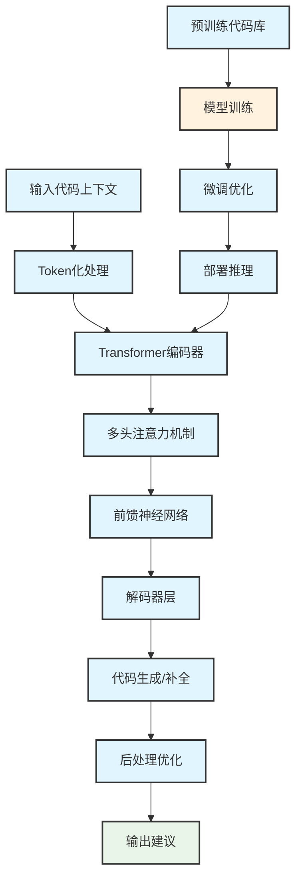
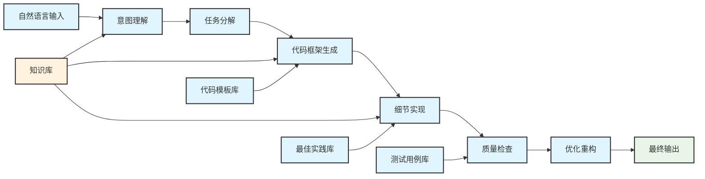
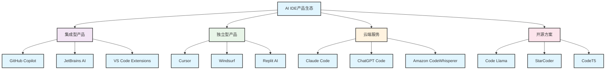
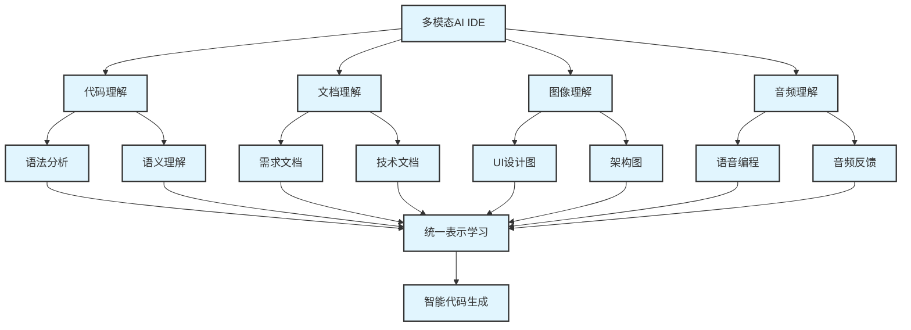
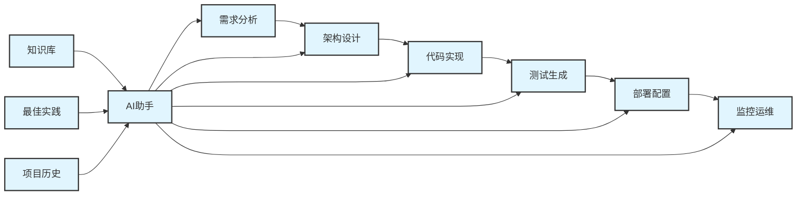

# 第2章 AI IDE技术概述


## 2.1 AI IDE核心技术原理


### 2.1.1 大语言模型基础架构


AI IDE的核心技术基于大语言模型(Large Language Model, LLM)，这些模型通过Transformer架构实现对代码的理解和生成。


<div class="chart-container">



#### 2.1.1.1 关键技术组件


**1. 代码理解模块**

- **语法分析器**: 解析代码的抽象语法树(AST)，理解代码结构
- **语义分析器**: 分析变量作用域、类型信息和函数调用关系
- **上下文感知器**: 理解文件间依赖关系和项目整体架构
- **模式识别器**: 识别常见的编程模式和设计模式

**2. 代码生成引擎**

- **序列到序列模型**: 基于Transformer的编码器-解码器架构
- **注意力机制**: 动态关注相关的代码片段和上下文信息
- **束搜索算法**: 生成多个候选方案并按概率排序
- **约束解码**: 确保生成的代码符合语法和语义规则

**3. 质量评估系统**

- **语法验证器**: 实时检查代码语法正确性
- **类型检查器**: 验证变量类型和函数签名匹配
- **逻辑分析器**: 检测潜在的逻辑错误和边界条件
- **安全扫描器**: 识别常见的安全漏洞和风险代码

### 2.1.2 智能补全技术演进


AI IDE的智能补全技术经历了从规则驱动到AI驱动的重要演进：

| 阶段 | 时期 | 技术特点 | 代表产品 | 准确率 |
| ------ | ------ | ---------- | ---------- | -------- |
| 1.0 静态补全 | 2010-2015 | 基于语法规则和关键字匹配 | IntelliSense, Eclipse | 60-70% |
| 2.0 统计补全 | 2016-2019 | 基于代码统计和n-gram模型 | Kite, TabNine | 70-80% |
| 3.0 深度学习 | 2020-2022 | 基于神经网络的序列预测 | GitHub Copilot | 80-85% |
| 4.0 大模型时代 | 2023-现在 | 基于大语言模型的智能生成 | Cursor, Claude Code | 85-90% |

#### 2.1.2.1 核心算法原理


**上下文编码算法**

```python
def encode_context(code_context, max_length=2048):
    """
    编码代码上下文为向量表示
    """
    # 1. 语法特征提取
    syntax_features = extract_ast_features(code_context)
    
    # 2. 语义特征提取
    semantic_features = extract_semantic_features(code_context)
    
    # 3. 位置编码
    position_encoding = generate_position_encoding(len(code_context))
    
    # 4. 多层Transformer编码
    context_vector = transformer_encoder(
        input_features=syntax_features + semantic_features,
        position_encoding=position_encoding,
        max_length=max_length
    )
    
    return context_vector

```

**候选生成与排序**

```python
def generate_code_candidates(context_vector, model, num_candidates=5):
    """
    生成并排序代码候选
    """
    # 1. 解码生成多个候选
    raw_candidates = model.decode(
        context_vector,
        num_beams=num_candidates * 2,
        temperature=0.7,
        max_new_tokens=100
    )
    
    # 2. 语法过滤
    valid_candidates = [
        candidate for candidate in raw_candidates
        if is_syntactically_valid(candidate)
    ]
    
    # 3. 语义评分
    scored_candidates = [
        (candidate, calculate_semantic_score(candidate, context_vector))
        for candidate in valid_candidates
    ]
    
    # 4. 按分数排序并返回前N个
    ranked_candidates = sorted(
        scored_candidates, 
        key=lambda x: x[1], 
        reverse=True
    )
    
    return [candidate for candidate, score in ranked_candidates[:num_candidates]]

```

### 2.1.3 代码生成技术架构


现代AI IDE采用多层次的代码生成架构，确保生成代码的质量和可靠性：


<div class="chart-container">



#### 2.1.3.1 生成策略分类


**1. 模板驱动生成**

- 适用场景: 标准化的代码结构(如CRUD操作、API接口)
- 技术特点: 基于预定义模板，参数化填充
- 优势: 生成速度快，结构规范
- 局限: 灵活性有限，难以处理复杂逻辑

**2. 示例驱动生成**

- 适用场景: 有相似代码参考的场景
- 技术特点: 基于代码库中的相似示例进行模式匹配和适配
- 优势: 符合项目风格，复用性好
- 局限: 依赖示例质量，可能传播不良实践

**3. 意图驱动生成**

- 适用场景: 复杂业务逻辑实现
- 技术特点: 基于自然语言描述理解用户意图
- 优势: 灵活性高，能处理创新需求
- 局限: 理解准确性依赖模型能力

## 2.2 主流AI IDE产品分析


### 2.2.1 产品生态概览


当前AI IDE市场呈现多元化竞争格局，主要产品可分为以下几类：


<div class="chart-container">



### 2.2.2 核心产品对比分析


#### 2.2.2.1 GitHub Copilot - 市场领导者


**技术架构**

- 基础模型: OpenAI Codex (GPT-3.5/GPT-4)
- 训练数据: GitHub公开代码库
- 支持语言: 50+编程语言
- 集成方式: IDE插件形式

**核心优势**

- 代码建议准确度高(35-46%接受率)
- 与GitHub生态系统深度集成
- 支持多种主流IDE和编辑器
- 持续学习和模型更新

**技术特色**

```python
# 第2章 Copilot的上下文感知示例

def calculate_fibonacci(n):
    """计算斐波那契数列的第n项"""
    # Copilot会基于函数名和注释自动生成实现
    if n <= 1:
        return n
    return calculate_fibonacci(n-1) + calculate_fibonacci(n-2)

```

**适用场景**

- 个人开发者和小团队
- 需要广泛语言支持的项目
- 与GitHub工作流深度集成的团队

#### 2.2.2.2 Cursor - 新兴挑战者


**技术架构**

- 多模型支持: GPT-4, Claude-3, 自定义模型
- 独立IDE: 基于VS Code深度定制
- 本地处理: 部分功能支持离线运行
- API集成: 支持多种AI服务

**核心优势**

- 响应速度快(100-300ms)
- 多文件上下文理解能力强
- 用户界面设计优秀
- 支持自定义AI模型

**技术特色**

```typescript
// Cursor的多文件理解示例
// 文件1: types.ts
interface User {
  id: string;
  name: string;
  email: string;
}

// 文件2: api.ts
// Cursor能理解跨文件的类型关系
async function createUser(userData: User): Promise<User> {
  // 自动生成符合User接口的实现
}

```

**适用场景**

- 注重开发体验的团队
- 需要快速响应的实时协作
- 对AI模型有定制需求的企业

#### 2.2.2.3 Claude Code - 安全专家


**技术架构**

- 基础模型: Claude-3 Opus/Sonnet
- 安全优先: 内置安全检查机制
- 解释能力: 强大的代码解释功能
- API服务: 主要通过API提供服务

**核心优势**

- 代码安全性检查能力强
- 代码解释和教学功能优秀
- 对复杂逻辑的理解能力突出
- 较低的有害代码生成风险

**技术特色**

```python
# 第2章 Claude Code的安全检查示例

def process_user_input(user_input):
    # Claude会自动识别安全风险并提供安全的实现
    # 避免SQL注入、XSS等常见安全问题
    sanitized_input = html.escape(user_input)
    # 使用参数化查询而不是字符串拼接
    query = "SELECT * FROM users WHERE name = %s"
    return execute_query(query, (sanitized_input,))

```

**适用场景**

- 安全要求高的企业应用
- 教育和培训场景
- 需要代码解释和文档生成的项目

### 2.2.3 产品选型决策矩阵


| 评估维度 | GitHub Copilot | Cursor | Claude Code | Tabnine | Windsurf |
| ---------- | ---------------- | -------- | ------------- | --------- | ---------- |
| **功能完整性** | ⭐⭐⭐⭐⭐ | ⭐⭐⭐⭐⭐ | ⭐⭐⭐⭐ | ⭐⭐⭐⭐ | ⭐⭐⭐⭐⭐ |
| **代码质量** | ⭐⭐⭐⭐ | ⭐⭐⭐⭐⭐ | ⭐⭐⭐⭐⭐ | ⭐⭐⭐⭐ | ⭐⭐⭐⭐ |
| **响应速度** | ⭐⭐⭐ | ⭐⭐⭐⭐⭐ | ⭐⭐⭐ | ⭐⭐⭐⭐⭐ | ⭐⭐⭐⭐ |
| **安全性** | ⭐⭐⭐ | ⭐⭐⭐⭐ | ⭐⭐⭐⭐⭐ | ⭐⭐⭐⭐⭐ | ⭐⭐⭐⭐ |
| **集成能力** | ⭐⭐⭐⭐⭐ | ⭐⭐⭐⭐ | ⭐⭐⭐ | ⭐⭐⭐⭐⭐ | ⭐⭐⭐⭐ |
| **成本效益** | ⭐⭐⭐⭐ | ⭐⭐⭐ | ⭐⭐⭐⭐ | ⭐⭐⭐⭐ | ⭐⭐⭐⭐⭐ |
| **学习曲线** | ⭐⭐⭐⭐⭐ | ⭐⭐⭐⭐ | ⭐⭐⭐⭐ | ⭐⭐⭐⭐⭐ | ⭐⭐⭐⭐ |
| **企业支持** | ⭐⭐⭐⭐⭐ | ⭐⭐⭐ | ⭐⭐⭐⭐ | ⭐⭐⭐⭐⭐ | ⭐⭐⭐ |

## 2.3 技术发展趋势分析


### 2.3.1 短期趋势 (2024-2025)


#### 2.3.1.1 模型能力增强方向


**1. 参数规模扩展**

- 当前主流模型: 7B-175B参数
- 发展趋势: 向1T+参数规模发展
- 技术挑战: 计算资源需求、推理延迟
- 解决方案: 模型压缩、量化技术、边缘部署

**2. 多模态融合**


<div class="chart-container">



**3. 实时学习能力**

- 在线学习: 基于用户反馈的实时模型调整
- 个性化适应: 学习个人和团队的编程风格
- 上下文记忆: 长期对话和项目上下文维护

#### 2.3.1.2 用户体验优化


**1. 响应速度提升**

- 目标延迟: 从当前200-500ms降低到50ms以下
- 技术路径: 
  - 模型蒸馏和压缩
  - 边缘计算部署
  - 预测性缓存
  - 异步处理架构

**2. 智能交互增强**

```python
# 第2章 未来的自然语言编程示例

def natural_language_programming():
    """
    用户: "创建一个用户注册API，包含邮箱验证和密码强度检查"
    AI: 自动生成完整的API实现，包括:
    - 路由定义
    - 数据验证
    - 邮箱验证逻辑
    - 密码强度检查
    - 错误处理
    - 单元测试

    """
    pass

```

### 2.3.2 中期趋势 (2025-2027)


#### 2.3.2.1 全栈开发助手


**1. 端到端开发支持**


<div class="chart-container">



**2. 智能架构设计**

- 自动化系统架构生成
- 基于需求的技术栈推荐
- 性能和可扩展性优化建议
- 安全架构模式应用

**3. 协作智能化**

- AI驱动的代码审查
- 智能冲突解决
- 自动化文档生成
- 团队知识管理

#### 2.3.2.2 跨语言和跨平台能力


**1. 语言转换和迁移**

```python
# 第2章 自动语言转换示例

# 第2章 输入: Python代码

def fibonacci(n):
    if n <= 1:
        return n
    return fibonacci(n-1) + fibonacci(n-2)

# 第2章 AI自动转换为Java

"""
public class Fibonacci {
    public static int fibonacci(int n) {
        if (n <= 1) {
            return n;
        }
        return fibonacci(n-1) + fibonacci(n-2);
    }
}
"""

```

**2. API和框架适配**

- 跨平台API自动适配
- 框架迁移工具
- 依赖管理优化
- 兼容性检查

### 2.3.3 长期趋势 (2027-2030)


#### 2.3.3.1 通用人工智能应用


**1. 自主编程能力**

- 完全自主的软件开发
- 创新解决方案设计
- 复杂业务逻辑推理
- 自我学习和进化

**2. 创新驱动开发**

- AI驱动的技术创新
- 自动化专利生成
- 新算法发现
- 优化策略创新

#### 2.3.3.2 新兴技术集成


**1. 量子计算支持**

```python
# 第2章 量子编程AI助手示例

def quantum_algorithm_generation():
    """
    用户: "设计一个量子搜索算法"
    AI: 自动生成Grover算法实现
    - 量子电路设计
    - 量子门操作
- 测量和结果处理
    - 经典-量子混合优化

    """
    pass

```

**2. 生物计算融合**

- DNA编程支持
- 生物神经网络模拟
- 进化算法应用
- 生物启发式优化

## 2.4 应用场景分类框架


### 2.4.1 按开发阶段分类


#### 2.4.1.1 需求分析阶段

- **自然语言需求解析**: 将业务需求转换为技术规格
- **用例图自动生成**: 基于需求描述生成UML用例图
- **API接口设计**: 根据功能需求设计RESTful API
- **数据模型设计**: 自动生成数据库表结构和关系

#### 2.4.1.2 设计阶段

- **架构模式推荐**: 基于项目特征推荐合适的架构模式
- **设计模式应用**: 自动识别和应用设计模式
- **组件依赖分析**: 分析和优化组件间依赖关系
- **性能预测评估**: 预测系统性能瓶颈和优化点

#### 2.4.1.3 实现阶段

- **代码自动生成**: 根据设计文档生成代码框架
- **算法实现优化**: 提供高效算法实现建议
- **代码重构建议**: 识别代码异味并提供重构方案
- **单元测试生成**: 自动生成测试用例和测试代码

#### 2.4.1.4 测试阶段

- **测试用例设计**: 基于代码逻辑生成测试用例
- **边界条件识别**: 自动识别需要测试的边界条件
- **性能测试脚本**: 生成性能测试和压力测试脚本
- **缺陷预测分析**: 预测潜在的缺陷和风险点

#### 2.4.1.5 部署运维阶段

- **部署脚本生成**: 自动生成CI/CD配置和部署脚本
- **监控配置**: 生成系统监控和日志配置
- **故障诊断**: 基于日志和监控数据进行故障分析
- **性能优化**: 提供系统性能优化建议

### 2.4.2 按项目规模分类


#### 2.4.2.1 个人项目 (1人)

**特点**: 快速原型开发，学习新技术
**AI IDE应用**:

- 快速代码生成和补全
- 学习新语言和框架
- 代码质量检查
- 文档自动生成

**推荐工具配置**:

```yaml
个人开发者配置:
  主要工具: GitHub Copilot / Windsurf
  辅助工具: ChatGPT Code Interpreter
  预算: $10-20/月
  重点功能:
    - 代码补全
    - 错误检测
    - 学习辅助
    - 快速原型

```

#### 2.4.2.2 小团队项目 (2-10人)

**特点**: 敏捷开发，快速迭代
**AI IDE应用**:

- 团队代码风格统一
- 协作开发支持
- 代码审查辅助
- 知识共享

**推荐工具配置**:

```yaml
小团队配置:
  主要工具: Cursor / Tabnine Team
  协作工具: GitHub Copilot for Business
  预算: $200-500/月
  重点功能:
    - 团队协作
    - 代码标准化
    - 审查辅助
    - 知识管理

```

#### 2.4.2.3 中型项目 (10-50人)

**特点**: 规范化开发，质量控制
**AI IDE应用**:

- 企业级安全控制
- 代码质量监控
- 技术债务管理
- 培训和能力建设

**推荐工具配置**:

```yaml
中型团队配置:
  主要工具: 企业版AI IDE
  安全工具: 代码安全扫描
  管理工具: 使用统计和分析
  预算: $1000-3000/月
  重点功能:
    - 安全合规
    - 质量控制
    - 团队管理
    - 技能培训

```

#### 2.4.2.4 大型项目 (50+人)

**特点**: 企业级开发，严格治理
**AI IDE应用**:

- 本地化部署
- 定制化模型训练
- 企业级集成
- 全面监控和审计

**推荐工具配置**:

```yaml
大型企业配置:
  部署方式: 本地化/混合云
  定制需求: 专用模型训练
  集成要求: 企业系统集成
  预算: $5000+/月
  重点功能:
    - 数据安全
    - 合规审计
    - 定制化
    - 规模化管理

```

### 2.4.3 按技术领域分类


#### 2.4.3.1 Web开发

**前端开发**

- React/Vue/Angular组件生成
- CSS样式自动生成
- 响应式设计实现
- 前端性能优化

**后端开发**

- RESTful API实现
- 数据库操作代码
- 微服务架构实现
- 中间件开发

#### 2.4.3.2 移动开发

**原生开发**

- iOS Swift/Objective-C
- Android Kotlin/Java
- 跨平台框架(React Native, Flutter)
- 移动端性能优化

#### 2.4.3.3 数据科学

**机器学习**

- 数据预处理脚本
- 模型训练代码
- 特征工程实现
- 模型评估和优化

**数据分析**

- 数据可视化代码
- 统计分析脚本
- 报表生成程序
- ETL流程实现

#### 2.4.3.4 系统编程

**操作系统开发**

- 内核模块开发
- 设备驱动程序
- 系统调用实现
- 性能优化代码

**嵌入式开发**

- 单片机程序
- 实时系统开发
- 硬件抽象层
- 低功耗优化

### 2.4.4 应用场景选择指南


#### 2.4.4.1 评估框架


**1. 技术复杂度评估**

```python
def assess_technical_complexity(project):
    """
    评估项目技术复杂度
    """
    complexity_score = 0
    
    # 技术栈复杂度 (1-5分)
    tech_stack_complexity = evaluate_tech_stack(project.technologies)
    complexity_score += tech_stack_complexity
    
    # 业务逻辑复杂度 (1-5分)
    business_logic_complexity = evaluate_business_logic(project.requirements)
    complexity_score += business_logic_complexity
    
    # 集成复杂度 (1-5分)
    integration_complexity = evaluate_integrations(project.dependencies)
    complexity_score += integration_complexity
    
    # 性能要求复杂度 (1-5分)
    performance_complexity = evaluate_performance_requirements(project.sla)
    complexity_score += performance_complexity
    
    return complexity_score / 4  # 平均分

```

**2. AI IDE适用性评分**

```python
def calculate_ai_ide_suitability(project, complexity_score):
    """
    计算AI IDE适用性评分
    """
    suitability_factors = {
        'code_generation_benefit': 0.3,  # 代码生成收益
        'learning_curve_impact': 0.2,    # 学习曲线影响
        'security_requirements': 0.2,    # 安全要求
        'team_experience': 0.15,         # 团队经验
        'project_timeline': 0.15         # 项目时间线
    }
    
    scores = {}
    for factor, weight in suitability_factors.items():
        factor_score = evaluate_factor(project, factor, complexity_score)
        scores[factor] = factor_score * weight
    
    total_score = sum(scores.values())
    return total_score, scores

```

#### 2.4.4.2 决策矩阵


| 项目特征 | 高适用性 | 中适用性 | 低适用性 |
| ---------- | ---------- | ---------- | ---------- |
| **代码重复度** | 高重复性任务 | 中等重复性 | 高度定制化 |
| **团队经验** | 有AI工具经验 | 部分经验 | 无相关经验 |
| **安全要求** | 一般安全要求 | 中等安全要求 | 极高安全要求 |
| **项目时间** | 紧急项目 | 正常时间线 | 充裕时间 |
| **创新程度** | 标准实现 | 部分创新 | 高度创新 |
| **维护需求** | 长期维护 | 中期维护 | 短期项目 |

---

*本章总结*: AI IDE技术基于大语言模型和深度学习技术，通过智能代码理解、生成和优化，显著提升开发效率。不同产品各有特色，选择时需要综合考虑技术需求、团队规模、安全要求和成本预算等因素。随着技术不断发展，AI IDE将向更智能、更安全、更个性化的方向演进。
