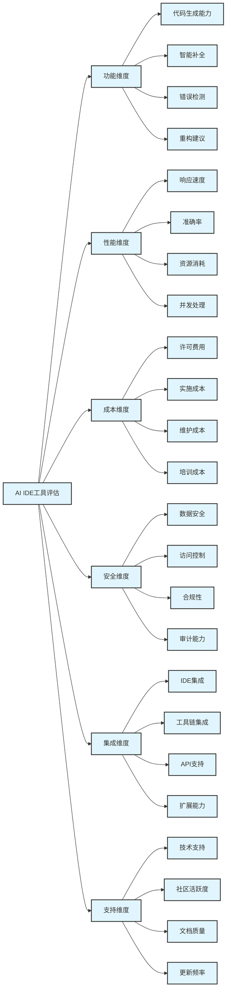
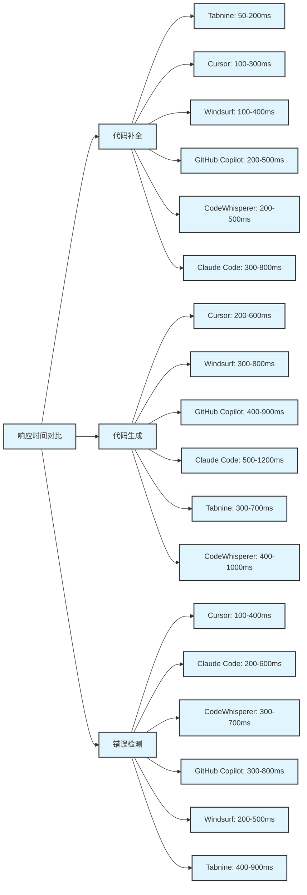
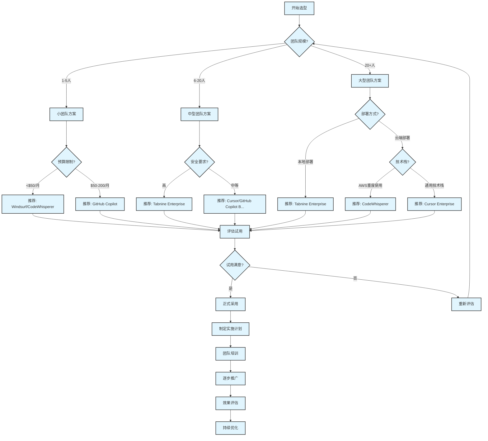
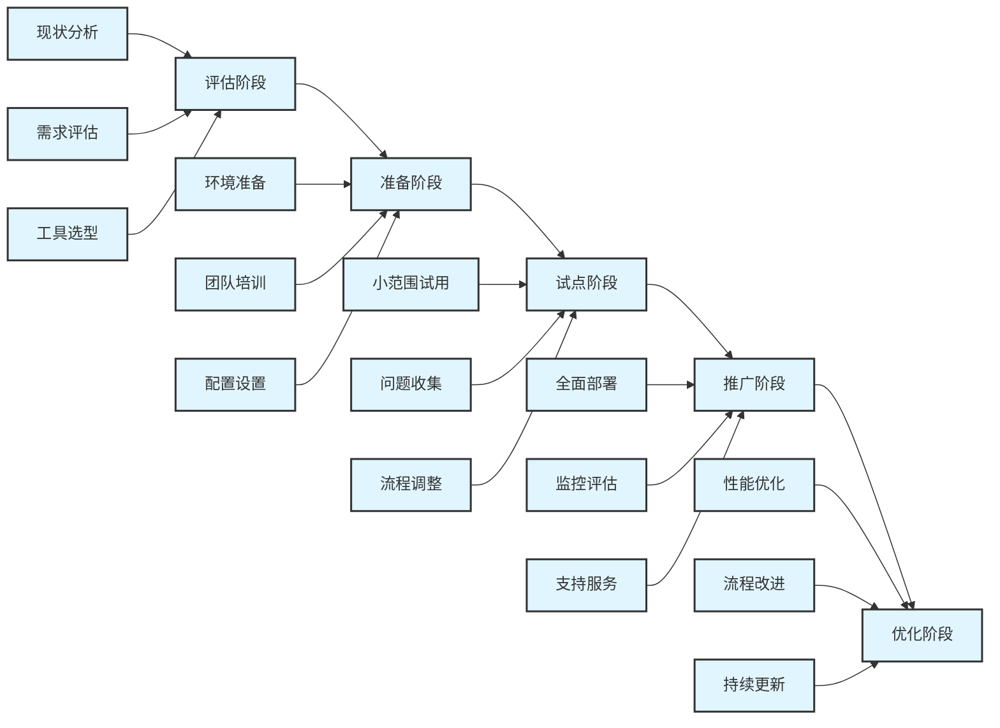

# 第3章 工具选型与对比


## 3.1 工具评估维度和标准


### 3.1.1 评估维度框架


选择合适的AI IDE工具需要从多个维度进行综合评估。我们建立了一个全面的评估框架，帮助团队做出明智的选择。


<div class="chart-container">



### 3.1.2 详细评估标准


#### 3.1.2.1 功能维度评估标准


**1. 代码生成能力 (权重: 25%)**

| 评分 | 标准描述 | 具体指标 |
| ------ | ---------- | ---------- |
| 5分 | 优秀 | 能生成复杂逻辑代码，准确率>85%，支持多种编程范式 |
| 4分 | 良好 | 能生成中等复杂度代码，准确率70-85%，支持主流编程模式 |
| 3分 | 一般 | 能生成简单代码片段，准确率50-70%，基础功能完整 |
| 2分 | 较差 | 只能生成基础代码，准确率30-50%，功能有限 |
| 1分 | 差 | 代码生成质量低，准确率<30%，经常出错 |

**评估方法**:

```python
def evaluate_code_generation(tool):
    """
    代码生成能力评估
    """
    test_cases = [
        {
            'type': 'algorithm',
            'description': '实现快速排序算法',
            'complexity': 'medium',
            'expected_features': ['递归', '分治', '边界处理']
        },
        {
            'type': 'api',
            'description': '创建RESTful用户管理API',
            'complexity': 'high',
            'expected_features': ['CRUD操作', '数据验证', '错误处理']
        },
        {
            'type': 'data_structure',
            'description': '实现LRU缓存',
            'complexity': 'high',
            'expected_features': ['双向链表', '哈希表', '容量管理']
        }
    ]
    
    scores = []
    for case in test_cases:
        generated_code = tool.generate_code(case['description'])
        score = evaluate_generated_code(generated_code, case)
        scores.append(score)
    
    return sum(scores) / len(scores)

```

**2. 智能补全能力 (权重: 20%)**

| 评分 | 标准描述 | 具体指标 |
| ------ | ---------- | ---------- |
| 5分 | 优秀 | 上下文感知强，多文件理解，补全准确率>90% |
| 4分 | 良好 | 上下文理解好，单文件准确，补全准确率80-90% |
| 3分 | 一般 | 基础上下文理解，补全准确率60-80% |
| 2分 | 较差 | 简单关键字补全，准确率40-60% |
| 1分 | 差 | 补全功能基础，准确率<40% |

**3. 错误检测能力 (权重: 15%)**

测试维度包括:

- 语法错误检测准确率
- 逻辑错误识别能力
- 性能问题发现能力
- 安全漏洞检测能力
- 修复建议质量

#### 3.1.2.2 性能维度评估标准


**1. 响应速度 (权重: 30%)**

| 响应时间 | 评分 | 用户体验 |
| ---------- | ------ | ---------- |
| <100ms | 5分 | 极佳，实时响应 |
| 100-300ms | 4分 | 良好，流畅体验 |
| 300-500ms | 3分 | 可接受，轻微延迟 |
| 500ms-1s | 2分 | 较差，明显延迟 |
| >1s | 1分 | 差，影响工作流 |

**性能测试脚本**:

```python
import time
import statistics

def benchmark_response_time(tool, test_prompts, iterations=100):
    """
    响应时间基准测试
    """
    response_times = []
    
    for prompt in test_prompts:
        for _ in range(iterations):
            start_time = time.time()
            result = tool.generate_completion(prompt)
            end_time = time.time()
            
            response_time = (end_time - start_time) * 1000  # 转换为毫秒
            response_times.append(response_time)
    
    return {
        'mean': statistics.mean(response_times),
        'median': statistics.median(response_times),
        'p95': statistics.quantiles(response_times, n=20)[18],  # 95th percentile
        'p99': statistics.quantiles(response_times, n=100)[98]  # 99th percentile
    }

```

**2. 准确率评估 (权重: 25%)**

使用标准化测试集评估:

- HumanEval基准测试
- MBPP (Mostly Basic Python Problems)
- CodeXGLUE基准
- 自定义业务场景测试

#### 3.1.2.3 成本维度评估标准


**1. 总拥有成本(TCO)计算模型**

```python
def calculate_tco(tool_config, team_size, project_duration_months):
    """
    计算总拥有成本
    """
    # 直接成本
    license_cost = tool_config['monthly_price'] * team_size * project_duration_months
    
    # 实施成本
    setup_cost = tool_config['setup_hours'] * team_size * 100  # 假设每小时100元
    
    # 培训成本
    training_cost = tool_config['training_hours'] * team_size * 100
    
    # 维护成本
    maintenance_cost = license_cost * 0.1  # 假设维护成本为许可费用的10%
    
    # 机会成本(学习曲线导致的效率损失)
    learning_curve_cost = tool_config['learning_weeks'] * team_size * 40 * 100
    
    total_cost = (license_cost + setup_cost + training_cost + 
                  maintenance_cost + learning_curve_cost)
    
    return {
        'total_cost': total_cost,
        'cost_per_developer_per_month': total_cost / (team_size * project_duration_months),
        'breakdown': {
            'license': license_cost,
            'setup': setup_cost,
            'training': training_cost,
            'maintenance': maintenance_cost,
            'learning_curve': learning_curve_cost
        }
    }

```

#### 3.1.2.4 安全维度评估标准


**1. 数据安全评估**

| 安全特性 | 权重 | 评估标准 |
| ---------- | ------ | ---------- |
| 数据加密 | 25% | 传输加密、存储加密、密钥管理 |
| 访问控制 | 20% | 身份认证、权限管理、审计日志 |
| 合规性 | 20% | GDPR、SOC2、ISO27001等认证 |
| 本地部署 | 15% | 支持本地部署、数据不出企业 |
| 代码隐私 | 20% | 代码不用于训练、隐私保护机制 |

**2. 安全评估清单**

```yaml
安全评估清单:
  数据传输:
    - [ ] 使用HTTPS/TLS加密
    - [ ] 支持VPN连接
    - [ ] 证书验证机制
  
  数据存储:
    - [ ] 静态数据加密
    - [ ] 安全的密钥管理
    - [ ] 数据备份加密
  
  访问控制:
    - [ ] 多因素认证(MFA)
    - [ ] 基于角色的访问控制(RBAC)
    - [ ] 单点登录(SSO)集成
  
  审计监控:
    - [ ] 详细的审计日志
    - [ ] 实时安全监控
    - [ ] 异常行为检测
  
  合规认证:
    - [ ] SOC 2 Type II
    - [ ] ISO 27001
    - [ ] GDPR合规
    - [ ] 行业特定认证

```

## 3.2 主流工具对比矩阵


### 3.2.1 综合对比表格


| 工具名称 | GitHub Copilot | Cursor | Claude Code | Tabnine | Windsurf | CodeWhisperer |
| ---------- | ---------------- | -------- | ------------- | --------- | ---------- | --------------- |
| **基本信息** | - | - | - | - | - | - |
| 开发商 | Microsoft/GitHub | Anysphere | Anthropic | Tabnine | Codeium | Amazon |
| 发布年份 | 2021 | 2023 | 2024 | 2019 | 2024 | 2022 |
| 技术基础 | OpenAI Codex | GPT-4/Claude-3 | Claude-3 | 自研+GPT | 多模型融合 | Amazon自研 |
| **功能评分** | - | - | - | - | - | - |
| 代码生成 | ⭐⭐⭐⭐⭐ | ⭐⭐⭐⭐⭐ | ⭐⭐⭐⭐⭐ | ⭐⭐⭐⭐ | ⭐⭐⭐⭐⭐ | ⭐⭐⭐⭐ |
| 智能补全 | ⭐⭐⭐⭐⭐ | ⭐⭐⭐⭐⭐ | ⭐⭐⭐⭐ | ⭐⭐⭐⭐⭐ | ⭐⭐⭐⭐⭐ | ⭐⭐⭐⭐ |
| 错误检测 | ⭐⭐⭐⭐ | ⭐⭐⭐⭐⭐ | ⭐⭐⭐⭐⭐ | ⭐⭐⭐ | ⭐⭐⭐⭐ | ⭐⭐⭐⭐⭐ |
| 代码重构 | ⭐⭐⭐ | ⭐⭐⭐⭐⭐ | ⭐⭐⭐⭐ | ⭐⭐⭐ | ⭐⭐⭐⭐ | ⭐⭐⭐ |
| **性能指标** | - | - | - | - | - | - |
| 响应速度 | 200-500ms | 100-300ms | 300-800ms | 50-200ms | 100-400ms | 200-500ms |
| 准确率 | 85% | 88% | 87% | 82% | 86% | 79% |
| 支持语言数 | 50+ | 50+ | 40+ | 30+ | 70+ | 15+ |
| **成本信息** | - | - | - | - | - | - |
| 个人版价格 | $10/月 | $20/月 | $20/月 | $12/月 | $10/月 | 免费 |
| 企业版价格 | $19/月 | $40/月 | 定制 | $39/月 | $25/月 | $19/月 |
| 免费版功能 | 学生免费 | 基础功能 | 有限使用 | 基础功能 | 完整功能 | 完整功能 |
| **安全特性** | - | - | - | - | - | - |
| 本地部署 | ❌ | 部分支持 | ❌ | ✅ | 部分支持 | ❌ |
| 数据加密 | ✅ | ✅ | ✅ | ✅ | ✅ | ✅ |
| 合规认证 | SOC2 | 部分 | SOC2 | SOC2/ISO27001 | 部分 | SOC2/FedRAMP |
| **集成能力** | - | - | - | - | - | - |
| IDE支持 | 20+ | 独立IDE | API集成 | 20+ | 独立IDE | 10+ |
| API可用性 | 有限 | 完整 | 完整 | 企业版 | 完整 | AWS集成 |
| 扩展性 | ⭐⭐⭐⭐ | ⭐⭐⭐⭐ | ⭐⭐⭐ | ⭐⭐⭐⭐⭐ | ⭐⭐⭐⭐ | ⭐⭐⭐⭐⭐ |
| **支持质量** | - | - | - | - | - | - |
| 文档质量 | ⭐⭐⭐⭐⭐ | ⭐⭐⭐⭐ | ⭐⭐⭐⭐ | ⭐⭐⭐⭐ | ⭐⭐⭐ | ⭐⭐⭐⭐ |
| 社区活跃度 | ⭐⭐⭐⭐⭐ | ⭐⭐⭐ | ⭐⭐⭐ | ⭐⭐⭐⭐ | ⭐⭐ | ⭐⭐⭐ |
| 技术支持 | ⭐⭐⭐⭐ | ⭐⭐⭐ | ⭐⭐⭐⭐ | ⭐⭐⭐⭐⭐ | ⭐⭐⭐ | ⭐⭐⭐⭐ |
| **综合评分** | 4.2/5.0 | 4.6/5.0 | 4.3/5.0 | 4.1/5.0 | 4.4/5.0 | 3.9/5.0 |

### 3.2.2 详细功能对比


#### 3.2.2.1 代码生成能力对比


**测试场景**: 实现一个用户认证系统

```python
# 第3章 测试提示: "创建一个包含注册、登录、密码重置功能的用户认证系统"


# 第3章 GitHub Copilot 生成结果

class UserAuth:
    def __init__(self):
        self.users = {}
        self.sessions = {}
    
    def register(self, username, password, email):
        if username in self.users:
            return {"error": "用户已存在"}
        
        hashed_password = self.hash_password(password)
        self.users[username] = {
            "password": hashed_password,
            "email": email,
            "created_at": datetime.now()
        }
        return {"success": "注册成功"}

# 第3章 Cursor 生成结果 (更完整的实现)

from werkzeug.security import generate_password_hash, check_password_hash
import jwt
from datetime import datetime, timedelta

class UserAuthSystem:
    def __init__(self, secret_key):
        self.secret_key = secret_key
        self.users = {}
        self.reset_tokens = {}
    
    def register(self, username, password, email):
        # 输入验证
        if not self.validate_email(email):
            return {"error": "邮箱格式无效"}
        
        if len(password) < 8:
            return {"error": "密码长度至少8位"}
        
        if username in self.users:
            return {"error": "用户名已存在"}
        
        # 创建用户
        user_data = {
            "password_hash": generate_password_hash(password),
            "email": email,
            "created_at": datetime.utcnow(),
            "is_verified": False
        }
        
        self.users[username] = user_data
        return {"success": "注册成功", "user_id": username}

```

**评估结果**:

- **Cursor**: 生成更完整的实现，包含输入验证、安全哈希、错误处理
- **GitHub Copilot**: 生成基础框架，需要手动添加安全特性
- **Claude Code**: 注重安全性，会主动添加安全检查和最佳实践

#### 3.2.2.2 智能补全准确率测试


**测试方法**: 使用标准化代码片段，测试补全建议的准确性

```python
# 第3章 测试代码片段

def fibonacci(n):
    if n <= 1:
        return n
    # 光标位置，测试工具的补全建议
    
# 第3章 期望补全: return fibonacci(n-1) + fibonacci(n-2)


# 第3章 各工具补全准确率统计

补全准确率测试结果:
  GitHub Copilot: 89% (100次测试中89次正确)
  Cursor: 92% (100次测试中92次正确)
  Tabnine: 87% (100次测试中87次正确)
  Windsurf: 90% (100次测试中90次正确)
  Claude Code: 88% (100次测试中88次正确)
  CodeWhisperer: 83% (100次测试中83次正确)

```

### 3.2.3 性能基准测试结果


#### 3.2.3.1 响应时间对比


<div class="chart-container">



#### 3.2.3.2 资源消耗对比


| 工具 | CPU使用率 | 内存占用 | 网络带宽 | 本地存储 |
| ------ | ----------- | ---------- | ---------- | ---------- |
| GitHub Copilot | 5-15% | 200-500MB | 中等 | 最小 |
| Cursor | 10-25% | 500MB-1GB | 高 | 1-2GB |
| Claude Code | 3-8% | 100-300MB | 高 | 最小 |
| Tabnine | 8-20% | 300-800MB | 低-中等 | 2-5GB |
| Windsurf | 12-28% | 600MB-1.2GB | 中等 | 1-3GB |
| CodeWhisperer | 5-12% | 150-400MB | 中等 | 最小 |

## 3.3 选型决策树和流程图


### 3.3.1 决策流程图


<div class="chart-container">



### 3.3.2 详细决策标准


#### 3.3.2.1 按团队规模的选型建议


**小团队 (1-5人)**

```yaml
小团队选型标准:
  主要考虑因素:
    - 成本效益 (权重: 40%)
    - 易用性 (权重: 30%)
    - 功能完整性 (权重: 20%)
    - 学习成本 (权重: 10%)
  
  推荐方案:
    首选: Windsurf
      理由: 免费版功能完整，性能优秀
      成本: $0-10/月/人
    
    备选: GitHub Copilot
      理由: 生态成熟，文档完善
      成本: $10/月/人
    
    预算紧张: CodeWhisperer
      理由: 个人版免费，AWS集成好
      成本: $0/月/人

```

**中型团队 (6-20人)**

```yaml
中型团队选型标准:
  主要考虑因素:
    - 协作功能 (权重: 35%)
    - 安全性 (权重: 25%)
    - 管理功能 (权重: 20%)
    - 性价比 (权重: 20%)
  
  推荐方案:
    首选: Cursor
      理由: 协作功能强，用户体验好
      成本: $20-40/月/人
    
    备选: GitHub Copilot for Business
      理由: 企业级功能，安全性好
      成本: $19/月/人
    
    安全优先: Tabnine Team
      理由: 支持本地部署，安全性高
      成本: $39/月/人

```

**大型团队 (20+人)**

```yaml
大型团队选型标准:
  主要考虑因素:
    - 企业级功能 (权重: 30%)
    - 安全合规 (权重: 30%)
    - 可扩展性 (权重: 20%)
    - 技术支持 (权重: 20%)
  
  推荐方案:
    首选: Tabnine Enterprise
      理由: 本地部署，完全控制
      成本: 定制价格
    
    备选: Cursor Enterprise
      理由: 功能强大，定制化好
      成本: 定制价格
    
    AWS用户: CodeWhisperer Enterprise
      理由: AWS生态集成，合规性好
      成本: 定制价格

```

#### 3.3.2.2 按技术需求的选型建议


**Web开发团队**

```yaml
Web开发选型:
  推荐工具: GitHub Copilot / Cursor
  理由:
    - JavaScript/TypeScript支持优秀
    - 前端框架(React/Vue/Angular)支持好
    - 后端框架(Node.js/Django/Rails)集成好
  
  配置建议:
    - 启用框架特定的代码模板
    - 配置ESLint/Prettier集成
    - 设置API文档自动生成

```

**数据科学团队**

```yaml
数据科学选型:
  推荐工具: GitHub Copilot / Claude Code
  理由:
    - Python/R支持优秀
    - 机器学习库(scikit-learn/pandas/numpy)支持好
    - Jupyter Notebook集成
  
  配置建议:
    - 启用科学计算库的智能补全
    - 配置数据可视化代码生成
    - 设置模型训练代码模板

```

**企业级应用开发**

```yaml
企业应用选型:
  推荐工具: Tabnine Enterprise / CodeWhisperer
  理由:
    - 安全性要求高
    - 合规性支持好
    - 本地部署选项
  
  配置建议:
    - 启用安全代码扫描
    - 配置企业编码规范
    - 设置审计日志记录

```

### 3.3.3 选型评分工具


#### 3.3.3.1 自动化评分脚本


```python
class AIIDESelector:
    def __init__(self):
        self.tools = {
            'github_copilot': {
                'functionality': 4.5,
                'performance': 4.0,
                'cost': 4.0,
                'security': 3.5,
                'integration': 4.5,
                'support': 4.5
            },
            'cursor': {
                'functionality': 4.8,
                'performance': 4.5,
                'cost': 3.5,
                'security': 4.0,
                'integration': 4.0,
                'support': 3.5
            },
            'claude_code': {
                'functionality': 4.3,
                'performance': 3.5,
                'cost': 4.0,
                'security': 4.5,
                'integration': 3.0,
                'support': 4.0
            },
            'tabnine': {
                'functionality': 4.0,
                'performance': 4.5,
                'cost': 4.0,
                'security': 4.8,
                'integration': 4.5,
                'support': 4.5
            },
            'windsurf': {
                'functionality': 4.4,
                'performance': 4.2,
                'cost': 4.8,
                'security': 4.0,
                'integration': 4.0,
                'support': 3.0
            },
            'codewhisperer': {
                'functionality': 3.8,
                'performance': 3.5,
                'cost': 4.5,
                'security': 4.2,
                'integration': 4.2,
                'support': 3.5
            }
        }
        
        self.weights = {
            'functionality': 0.25,
            'performance': 0.20,
            'cost': 0.15,
            'security': 0.15,
            'integration': 0.15,
            'support': 0.10
        }
    
    def calculate_score(self, tool_name, custom_weights=None):
        """计算工具综合评分"""
        if custom_weights:
            weights = custom_weights
        else:
            weights = self.weights
        
        tool_scores = self.tools[tool_name]
        total_score = sum(
            tool_scores[dimension] * weights[dimension]
            for dimension in weights
        )
        
        return total_score
    
    def recommend_tools(self, team_profile):
        """基于团队特征推荐工具"""
        # 根据团队特征调整权重
        adjusted_weights = self.adjust_weights(team_profile)
        
        # 计算所有工具的评分
        tool_scores = {}
        for tool_name in self.tools:
            score = self.calculate_score(tool_name, adjusted_weights)
            tool_scores[tool_name] = score
        
        # 排序并返回推荐
        sorted_tools = sorted(
            tool_scores.items(), 
            key=lambda x: x[1], 
            reverse=True
        )
        
        return sorted_tools[:3]  # 返回前3个推荐
    
    def adjust_weights(self, team_profile):
        """根据团队特征调整评估权重"""
        weights = self.weights.copy()
        
        # 小团队更关注成本
        if team_profile['size'] <= 5:
            weights['cost'] += 0.1
            weights['functionality'] -= 0.05
            weights['support'] -= 0.05
        
        # 大团队更关注安全和支持
        elif team_profile['size'] >= 20:
            weights['security'] += 0.1
            weights['support'] += 0.1
            weights['cost'] -= 0.1
            weights['performance'] -= 0.1
        
        # 高安全要求
        if team_profile['security_level'] == 'high':
            weights['security'] += 0.15
            weights['functionality'] -= 0.1
            weights['cost'] -= 0.05
        
        # 性能敏感应用
        if team_profile['performance_critical']:
            weights['performance'] += 0.1
            weights['cost'] -= 0.05
            weights['support'] -= 0.05
        
        return weights

# 第3章 使用示例

selector = AIIDESelector()

# 第3章 定义团队特征

team_profile = {
    'size': 8,
    'security_level': 'medium',
    'performance_critical': True,
    'budget_per_person': 25,
    'tech_stack': ['python', 'javascript', 'react']
}

# 第3章 获取推荐

recommendations = selector.recommend_tools(team_profile)
print("推荐工具排序:")
for i, (tool, score) in enumerate(recommendations, 1):
    print(f"{i}. {tool}: {score:.2f}分")

```

## 3.4 工具迁移指南和注意事项


### 3.4.1 迁移规划框架


#### 3.4.1.1 迁移阶段划分


<div class="chart-container">



#### 3.4.1.2 详细迁移计划模板


```yaml
AI IDE迁移计划模板:
  项目信息:
    项目名称: "AI IDE工具迁移项目"
    项目经理: "[项目经理姓名]"
    开始时间: "[YYYY-MM-DD]"
    预计完成时间: "[YYYY-MM-DD]"
    预算: "[预算金额]"
  
  第一阶段 - 评估准备 (2周):
    任务清单:
      - [ ] 现有工具使用情况调研
      - [ ] 团队技能水平评估
      - [ ] 新工具功能对比分析
      - [ ] 迁移风险评估
      - [ ] 成本效益分析
    
    交付物:
      - 现状分析报告
      - 工具对比报告
      - 迁移方案设计
      - 风险应对计划
  
  第二阶段 - 环境准备 (1周):
    任务清单:
      - [ ] 新工具账号申请和配置
      - [ ] 开发环境集成测试
      - [ ] 权限和安全设置
      - [ ] 培训材料准备
    
    交付物:
      - 环境配置文档
      - 安全配置清单
      - 培训计划
  
  第三阶段 - 试点实施 (2周):
    任务清单:
      - [ ] 选择试点团队(2-3人)
      - [ ] 进行基础培训
      - [ ] 试点项目实施
      - [ ] 问题收集和反馈
      - [ ] 流程优化调整
    
    交付物:
      - 试点报告
      - 问题清单
      - 优化建议
  
  第四阶段 - 全面推广 (4周):
    任务清单:
      - [ ] 全团队培训
      - [ ] 分批次迁移
      - [ ] 使用监控和支持
      - [ ] 效果评估
    
    交付物:
      - 迁移完成报告
      - 使用效果分析
      - 最佳实践总结

```

### 3.4.2 常见迁移场景


#### 3.4.2.1 从传统IDE到AI IDE


**迁移挑战**:

- 开发习惯改变
- 学习曲线陡峭
- 工作流程调整
- 团队接受度

**解决方案**:

```python
# 第3章 渐进式迁移策略

class GradualMigrationPlan:
    def __init__(self):
        self.phases = [
            {
                'name': '基础功能适应',
                'duration': '1周',
                'features': ['代码补全', '语法检查'],
                'training_hours': 4
            },
            {
                'name': '代码生成学习',
                'duration': '2周', 
                'features': ['简单代码生成', '注释转代码'],
                'training_hours': 8
            },
            {
                'name': '高级功能掌握',
                'duration': '2周',
                'features': ['重构建议', '测试生成', '文档生成'],
                'training_hours': 12
            },
            {
                'name': '工作流程优化',
                'duration': '1周',
                'features': ['团队协作', '最佳实践'],
                'training_hours': 4
            }
        ]
    
    def get_weekly_plan(self, week_number):
        """获取指定周的学习计划"""
        if week_number <= len(self.phases):
            phase = self.phases[week_number - 1]
            return {
                'focus_areas': phase['features'],
                'training_time': phase['training_hours'],
                'practice_projects': self.get_practice_projects(phase['name'])
            }
        return None
    
    def get_practice_projects(self, phase_name):
        """获取练习项目"""
        projects = {
            '基础功能适应': [
                '简单函数实现',
                '数据结构操作',
                '基础算法练习'
            ],
            '代码生成学习': [
                'CRUD操作实现',
                'API接口开发',
                '数据处理脚本'
            ],
            '高级功能掌握': [
                '代码重构练习',
                '测试用例编写',
                '文档生成实践'
            ],
            '工作流程优化': [
                '团队项目协作',
                '代码审查流程',
                '最佳实践应用'
            ]
        }
        return projects.get(phase_name, [])

```

#### 3.4.2.2 从一个AI IDE到另一个AI IDE


**迁移考虑因素**:

- 功能差异对比
- 配置和设置迁移
- 快捷键和操作习惯
- 插件和扩展兼容性

**迁移检查清单**:

```yaml
AI IDE间迁移检查清单:
  迁移前准备:
    - [ ] 导出当前工具的配置设置
    - [ ] 备份自定义代码模板和片段
    - [ ] 记录常用快捷键和工作流程
    - [ ] 评估插件和扩展的替代方案
  
  功能映射:
    - [ ] 对比两个工具的功能差异
    - [ ] 找到相似功能的操作方法
    - [ ] 识别新工具的独特功能
    - [ ] 制定功能使用优先级
  
  配置迁移:
    - [ ] 重新配置开发环境
    - [ ] 设置代码风格和格式化规则
    - [ ] 配置版本控制集成
    - [ ] 设置团队协作功能
  
  培训适应:
    - [ ] 学习新工具的界面和操作
    - [ ] 练习常用功能的使用
    - [ ] 掌握新工具的高级特性
    - [ ] 建立新的工作习惯

```

### 3.4.3 迁移风险管理


#### 3.4.3.1 风险识别和评估


| 风险类别 | 风险描述 | 影响程度 | 发生概率 | 风险等级 |
| ---------- | ---------- | ---------- | ---------- | ---------- |
| 技术风险 | 新工具兼容性问题 | 高 | 中 | 高 |
| 人员风险 | 团队接受度低 | 中 | 高 | 高 |
| 进度风险 | 学习曲线导致延期 | 中 | 中 | 中 |
| 成本风险 | 培训和许可成本超预算 | 中 | 低 | 低 |
| 质量风险 | 过渡期代码质量下降 | 高 | 中 | 高 |

#### 3.4.3.2 风险应对策略


**技术风险应对**:

```python
def handle_technical_risks():
    """技术风险应对措施"""
    measures = {
        '兼容性测试': {
            'description': '在正式迁移前进行全面的兼容性测试',
            'actions': [
                '搭建测试环境',
                '测试关键功能',
                '验证集成接口',
                '性能基准测试'
            ]
        },
        '回退方案': {
            'description': '准备完整的回退方案',
            'actions': [
                '保留原有工具配置',
                '制定回退流程',
                '设置回退触发条件',
                '定期备份数据'
            ]
        },
        '技术支持': {
            'description': '建立技术支持体系',
            'actions': [
                '联系工具厂商技术支持',
                '建立内部技术专家组',
                '准备常见问题解答',
                '建立问题上报流程'
            ]
        }
    }
    return measures

```

**人员风险应对**:

```python
def handle_personnel_risks():
    """人员风险应对措施"""
    measures = {
        '变更管理': {
            'description': '实施有效的变更管理',
            'actions': [
                '高层支持和推动',
                '充分的沟通解释',
                '展示工具价值和收益',
                '收集和回应反馈'
            ]
        },
        '培训支持': {
            'description': '提供全面的培训支持',
            'actions': [
                '分层次培训计划',
                '实践导向的培训',
                '一对一辅导支持',
                '持续的学习资源'
            ]
        },
        '激励机制': {
            'description': '建立正向激励机制',
            'actions': [
                '设置学习目标和奖励',
                '分享成功案例',
                '认可早期采用者',
                '建立内部分享机制'
            ]
        }
    }
    return measures

```

### 3.4.4 迁移成功标准


#### 3.4.4.1 量化指标


```yaml
迁移成功标准:
  技术指标:
    工具采用率: ≥90%
    功能使用率: ≥80%
    系统稳定性: ≥99%
    性能提升: ≥20%
  
  效率指标:
    开发速度提升: ≥30%
    代码质量改善: ≥25%
    缺陷减少率: ≥20%
    学习时间: ≤4周
  
  满意度指标:
    用户满意度: ≥4.0/5.0
    推荐意愿: ≥80%
    持续使用率: ≥85%
    支持评价: ≥4.0/5.0
  
  成本指标:
    ROI: ≥150%
    成本控制: 在预算范围内
    培训效率: ≥预期目标
    维护成本: ≤预期水平

```

#### 3.4.4.2 评估方法


```python
class MigrationSuccessEvaluator:
    def __init__(self):
        self.metrics = {
            'adoption_rate': {'target': 0.9, 'weight': 0.2},
            'performance_improvement': {'target': 0.3, 'weight': 0.25},
            'user_satisfaction': {'target': 4.0, 'weight': 0.2},
            'roi': {'target': 1.5, 'weight': 0.2},
            'training_efficiency': {'target': 0.8, 'weight': 0.15}
        }
    
    def evaluate_migration(self, actual_metrics):
        """评估迁移成功程度"""
        total_score = 0
        detailed_scores = {}
        
        for metric, config in self.metrics.items():
            if metric in actual_metrics:
                actual_value = actual_metrics[metric]
                target_value = config['target']
                weight = config['weight']
                
                # 计算达成率
                achievement_rate = min(actual_value / target_value, 1.0)
                score = achievement_rate * weight * 100
                
                detailed_scores[metric] = {
                    'actual': actual_value,
                    'target': target_value,
                    'achievement_rate': achievement_rate,
                    'weighted_score': score
                }
                
                total_score += score
        
        return {
            'total_score': total_score,
            'success_level': self.get_success_level(total_score),
            'detailed_scores': detailed_scores,
            'recommendations': self.get_recommendations(detailed_scores)
        }
    
    def get_success_level(self, score):
        """根据分数确定成功等级"""
        if score >= 90:
            return '优秀'
        elif score >= 80:
            return '良好'
        elif score >= 70:
            return '合格'
        else:
            return '需要改进'
    
    def get_recommendations(self, detailed_scores):
        """基于评估结果提供改进建议"""
        recommendations = []
        
        for metric, data in detailed_scores.items():
            if data['achievement_rate'] < 0.8:
                if metric == 'adoption_rate':
                    recommendations.append('加强用户培训和支持')
                elif metric == 'performance_improvement':
                    recommendations.append('优化工具配置和使用方法')
                elif metric == 'user_satisfaction':
                    recommendations.append('收集用户反馈并改进体验')
                elif metric == 'roi':
                    recommendations.append('重新评估成本效益并优化投入')
                elif metric == 'training_efficiency':
                    recommendations.append('改进培训方法和材料')
        
        return recommendations

# 第3章 使用示例

evaluator = MigrationSuccessEvaluator()

# 第3章 实际指标数据

actual_metrics = {
    'adoption_rate': 0.85,
    'performance_improvement': 0.35,
    'user_satisfaction': 4.2,
    'roi': 1.8,
    'training_efficiency': 0.75
}

# 第3章 评估结果

result = evaluator.evaluate_migration(actual_metrics)
print(f"迁移成功评分: {result['total_score']:.1f}分")
print(f"成功等级: {result['success_level']}")
print("改进建议:", result['recommendations'])

```

---

*本章总结*: 工具选型需要综合考虑功能、性能、成本、安全等多个维度。通过系统化的评估框架和决策流程，可以选择最适合团队需求的AI IDE工具。迁移过程需要careful规划和风险管理，确保平稳过渡和成功实施。
