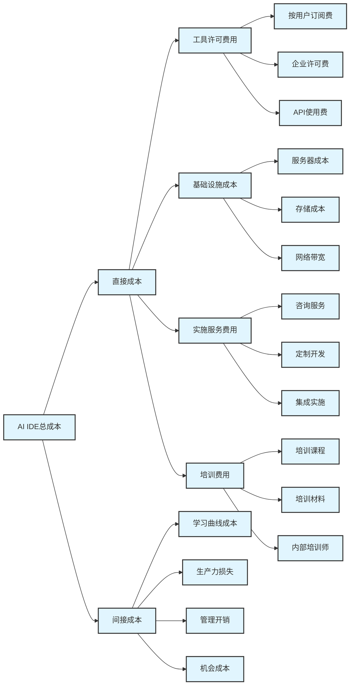
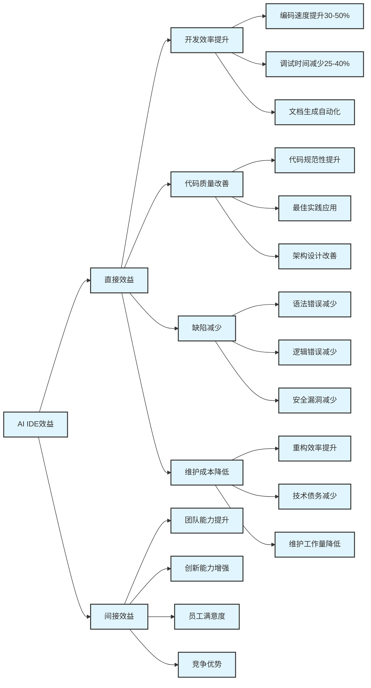
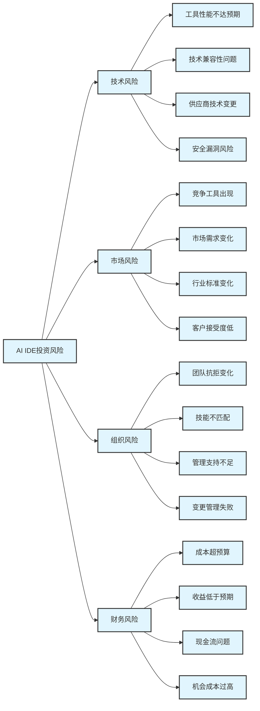

# 第4章 投资回报率评估


## 4.1 成本分析模型和计算方法


### 4.1.1 成本分析框架


AI IDE投资的成本分析需要考虑直接成本和间接成本，以及一次性成本和持续成本。


<div class="chart-container">



### 4.1.2 详细成本计算模型


**直接成本计算**


**1. 工具许可费用**

```python
def calculate_license_cost(team_size, tool_config, duration_months):
    """
    计算工具许可费用
    """
    cost_structure = {
        'subscription_per_user': tool_config.get('monthly_price_per_user', 0),
        'enterprise_license': tool_config.get('enterprise_license_fee', 0),
        'api_usage_cost': tool_config.get('api_cost_per_request', 0),
        'setup_fee': tool_config.get('one_time_setup_fee', 0)
    }
    
    # 按用户订阅费用
    subscription_cost = (cost_structure['subscription_per_user'] * 
                        team_size * duration_months)
    
    # 企业许可费用(如果适用)
    enterprise_cost = cost_structure['enterprise_license']
    
    # API使用费用(估算)
    estimated_api_calls = team_size * 1000 * duration_months  # 每人每月1000次调用
    api_cost = estimated_api_calls * cost_structure['api_usage_cost']
    
    # 一次性设置费用
    setup_cost = cost_structure['setup_fee']
    
    total_license_cost = subscription_cost + enterprise_cost + api_cost + setup_cost
    
    return {
        'subscription_cost': subscription_cost,
        'enterprise_cost': enterprise_cost,
        'api_cost': api_cost,
        'setup_cost': setup_cost,
        'total_license_cost': total_license_cost
    }

```

**2. 基础设施成本**

```python
def calculate_infrastructure_cost(deployment_type, team_size, duration_months):
    """
    计算基础设施成本
    """
    if deployment_type == 'cloud':
        # 云端部署成本较低
        monthly_cost = team_size * 50  # 每人每月50元云服务费
        total_cost = monthly_cost * duration_months
        
    elif deployment_type == 'on_premise':
        # 本地部署需要服务器和维护
        server_cost = 50000  # 一次性服务器采购
        maintenance_cost = 5000 * duration_months  # 每月维护费
        total_cost = server_cost + maintenance_cost
        
    elif deployment_type == 'hybrid':
        # 混合部署
        cloud_cost = team_size * 30 * duration_months
        on_premise_cost = 30000 + (3000 * duration_months)
        total_cost = cloud_cost + on_premise_cost
    
    return {
        'deployment_type': deployment_type,
        'total_infrastructure_cost': total_cost,
        'monthly_average': total_cost / duration_months
    }

```**

1. 培训和实施成本**

```python
def calculate_training_implementation_cost(team_size, complexity_level):
def calculate_training_implementation_cost(team_size, complexity_level):
    """
    计算培训和实施成本
    """
    # 基础培训成本
    base_training_hours = {
        'simple': 8,    # 简单工具8小时
        'medium': 16,   # 中等复杂度16小时
        'complex': 32   # 复杂工具32小时
    }
    
    training_hours = base_training_hours[complexity_level]
    hourly_rate = 200  # 每小时培训成本200元
    
    # 培训成本
    training_cost = training_hours * team_size * hourly_rate
    
    # 实施服务成本
    implementation_cost = {
        'simple': 10000,   # 简单实施
        'medium': 25000,   # 中等实施
        'complex': 50000   # 复杂实施
    }
    
    # 培训材料和资源成本
    material_cost = team_size * 500  # 每人500元材料费
    
    total_cost = (training_cost + 
                  implementation_cost[complexity_level] + 
                  material_cost)
    
    return {
        'training_cost': training_cost,
        'implementation_cost': implementation_cost[complexity_level],
        'material_cost': material_cost,
        'total_training_implementation_cost': total_cost
    }
```

**间接成本计算**


**1. 学习曲线成本**

```python
def calculate_learning_curve_cost(team_size, avg_salary, learning_weeks):
def calculate_learning_curve_cost(team_size, avg_salary, learning_weeks):
    """
    计算学习曲线导致的生产力损失成本
    """
    # 学习期间的生产力损失曲线
    productivity_loss_curve = {
        1: 0.6,  # 第1周生产力损失60%
        2: 0.4,  # 第2周生产力损失40%
        3: 0.25, # 第3周生产力损失25%
        4: 0.15, # 第4周生产力损失15%
        5: 0.1,  # 第5周生产力损失10%
        6: 0.05  # 第6周生产力损失5%
    }
    
    weekly_salary = avg_salary / 52  # 周薪
    total_loss_cost = 0
    
    for week in range(1, min(learning_weeks + 1, 7)):
        if week in productivity_loss_curve:
            loss_rate = productivity_loss_curve[week]
            week_loss = weekly_salary * team_size * loss_rate
            total_loss_cost += week_loss
    
    return {
        'total_learning_curve_cost': total_loss_cost,
        'average_loss_per_person': total_loss_cost / team_size,
        'learning_weeks': learning_weeks
    }
```

**2. 管理开销成本**

```python
def calculate_management_overhead(team_size, project_duration_months):
def calculate_management_overhead(team_size, project_duration_months):
    """
    计算管理开销成本
    """
    # 项目管理成本
    pm_hours_per_month = max(20, team_size * 2)  # 每月至少20小时，大团队更多
    pm_hourly_rate = 300  # 项目经理时薪300元
    pm_cost = pm_hours_per_month * project_duration_months * pm_hourly_rate
    
    # 技术支持成本
    tech_support_cost = team_size * 100 * project_duration_months  # 每人每月100元
    
    # 工具管理和维护成本
    tool_admin_cost = max(5000, team_size * 50) * project_duration_months
    
    total_overhead = pm_cost + tech_support_cost + tool_admin_cost
    
    return {
        'project_management_cost': pm_cost,
        'technical_support_cost': tech_support_cost,
        'tool_administration_cost': tool_admin_cost,
        'total_management_overhead': total_overhead
    }
```

### 4.1.3 成本分析实例


**小团队成本分析 (5人团队)**


```python
```

# 小团队成本分析示例

def small_team_cost_analysis():
    team_config = {
        'team_size': 5,
        'avg_salary': 120000,  # 年薪12万
        'project_duration': 12,  # 12个月
        'tool': 'github_copilot'
    }
    
    tool_config = {
        'monthly_price_per_user': 10,
        'setup_fee': 0,
        'complexity_level': 'simple'
    }
    
    # 计算各项成本
    license_cost = calculate_license_cost(
        team_config['team_size'], 
        tool_config, 
        team_config['project_duration']
    )
    
    infrastructure_cost = calculate_infrastructure_cost(
        'cloud', 
        team_config['team_size'], 
        team_config['project_duration']
    )
    
    training_cost = calculate_training_implementation_cost(
        team_config['team_size'], 
        tool_config['complexity_level']
    )
    
    learning_cost = calculate_learning_curve_cost(
        team_config['team_size'], 
        team_config['avg_salary'], 
        2  # 2周学习期
    )
    
    management_cost = calculate_management_overhead(
        team_config['team_size'], 
        team_config['project_duration']
    )
    
    # 总成本汇总
    total_cost = (license_cost['total_license_cost'] +
                  infrastructure_cost['total_infrastructure_cost'] +
                  training_cost['total_training_implementation_cost'] +
                  learning_cost['total_learning_curve_cost'] +
                  management_cost['total_management_overhead'])
    
    return {
        'team_config': team_config,
        'cost_breakdown': {
            'license': license_cost['total_license_cost'],
            'infrastructure': infrastructure_cost['total_infrastructure_cost'],
            'training': training_cost['total_training_implementation_cost'],
            'learning_curve': learning_cost['total_learning_curve_cost'],
            'management': management_cost['total_management_overhead']
        },
        'total_cost': total_cost,
        'cost_per_person_per_month': total_cost / (team_config['team_size'] * team_config['project_duration'])
    }

# 执行分析

small_team_analysis = small_team_cost_analysis()
print(f"小团队总成本: ¥{small_team_analysis['total_cost']:,.0f}")
print(f"人均月成本: ¥{small_team_analysis['cost_per_person_per_month']:,.0f}")
```

```

## 4.2 效益量化评估框架


### 4.2.1 效益分类体系


AI IDE带来的效益可以分为直接效益和间接效益，量化效益和定性效益。


<div class="chart-container">



### 4.2.2 量化效益计算方法


**开发效率提升效益**


**1. 编码速度提升**

```python
def calculate_coding_speed_benefit(team_size, avg_salary, speed_improvement_rate, project_duration):
def calculate_coding_speed_benefit(team_size, avg_salary, speed_improvement_rate, project_duration):
    """
    计算编码速度提升带来的效益
    """
    # 假设开发人员50%时间用于编码
    coding_time_ratio = 0.5
    
    # 年薪转换为有效工作时间成本
    annual_work_hours = 2000  # 年工作小时数
    hourly_cost = avg_salary / annual_work_hours
    
    # 编码时间成本
    monthly_coding_hours = annual_work_hours / 12 * coding_time_ratio
    monthly_coding_cost = monthly_coding_hours * hourly_cost * team_size
    
    # 效率提升带来的时间节省
    time_saved_per_month = monthly_coding_hours * speed_improvement_rate
    cost_saved_per_month = time_saved_per_month * hourly_cost * team_size
    
    total_benefit = cost_saved_per_month * project_duration
    
    return {
        'monthly_time_saved_hours': time_saved_per_month,
        'monthly_cost_saved': cost_saved_per_month,
        'total_coding_speed_benefit': total_benefit,
        'improvement_rate': speed_improvement_rate
    }
```

**2. 调试时间减少效益**

```python
def calculate_debugging_benefit(team_size, avg_salary, debugging_reduction_rate, project_duration):
def calculate_debugging_benefit(team_size, avg_salary, debugging_reduction_rate, project_duration):
    """
    计算调试时间减少带来的效益
    """
    # 假设开发人员20%时间用于调试
    debugging_time_ratio = 0.2
    
    annual_work_hours = 2000
    hourly_cost = avg_salary / annual_work_hours
    
    monthly_debugging_hours = annual_work_hours / 12 * debugging_time_ratio
    monthly_debugging_cost = monthly_debugging_hours * hourly_cost * team_size
    
    # 调试时间减少带来的节省
    time_saved_per_month = monthly_debugging_hours * debugging_reduction_rate
    cost_saved_per_month = time_saved_per_month * hourly_cost * team_size
    
    total_benefit = cost_saved_per_month * project_duration
    
    return {
        'monthly_debugging_time_saved': time_saved_per_month,
        'monthly_cost_saved': cost_saved_per_month,
        'total_debugging_benefit': total_benefit,
        'reduction_rate': debugging_reduction_rate
    }
```

**代码质量改善效益**


**1. 缺陷减少效益**

```python
def calculate_defect_reduction_benefit(team_size, avg_salary, defect_reduction_rate, 
def calculate_defect_reduction_benefit(team_size, avg_salary, defect_reduction_rate, 
                                     avg_defects_per_month, avg_fix_time_hours):
    """
    计算缺陷减少带来的效益
    """
    hourly_cost = avg_salary / 2000  # 时薪
    
    # 每月缺陷修复成本
    monthly_defect_cost = (avg_defects_per_month * avg_fix_time_hours * 
                          hourly_cost * team_size)
    
    # 缺陷减少带来的成本节省
    defects_reduced = avg_defects_per_month * defect_reduction_rate
    cost_saved_per_month = defects_reduced * avg_fix_time_hours * hourly_cost * team_size
    
    # 还需要考虑缺陷对客户满意度和声誉的影响
    # 这里简化为直接成本节省
    
    return {
        'defects_reduced_per_month': defects_reduced,
        'monthly_cost_saved': cost_saved_per_month,
        'annual_defect_reduction_benefit': cost_saved_per_month * 12
    }
```

**2. 维护成本降低效益**

```python
def calculate_maintenance_benefit(team_size, avg_salary, maintenance_reduction_rate, 
def calculate_maintenance_benefit(team_size, avg_salary, maintenance_reduction_rate, 
                                maintenance_time_ratio, project_duration):
    """
    计算维护成本降低效益
    """
    annual_work_hours = 2000
    hourly_cost = avg_salary / annual_work_hours
    
    # 维护工作时间和成本
    monthly_maintenance_hours = annual_work_hours / 12 * maintenance_time_ratio
    monthly_maintenance_cost = monthly_maintenance_hours * hourly_cost * team_size
    
    # 维护成本降低
    cost_saved_per_month = monthly_maintenance_cost * maintenance_reduction_rate
    total_benefit = cost_saved_per_month * project_duration
    
    return {
        'monthly_maintenance_cost_saved': cost_saved_per_month,
        'total_maintenance_benefit': total_benefit,
        'reduction_rate': maintenance_reduction_rate
    }
```

### 4.2.3 效益评估实例


**中型团队效益分析 (15人团队)**


```python
def medium_team_benefit_analysis():
def medium_team_benefit_analysis():
    team_config = {
        'team_size': 15,
        'avg_salary': 150000,  # 年薪15万
        'project_duration': 12  # 12个月
    }
    
    # 基于行业数据的效率提升参数
    improvement_params = {
        'coding_speed_improvement': 0.35,  # 35%编码速度提升
        'debugging_reduction': 0.30,       # 30%调试时间减少
        'defect_reduction': 0.25,          # 25%缺陷减少
        'maintenance_reduction': 0.20      # 20%维护成本降低
    }
    
    # 计算各项效益
    coding_benefit = calculate_coding_speed_benefit(
        team_config['team_size'],
        team_config['avg_salary'],
        improvement_params['coding_speed_improvement'],
        team_config['project_duration']
    )
    
    debugging_benefit = calculate_debugging_benefit(
        team_config['team_size'],
        team_config['avg_salary'],
        improvement_params['debugging_reduction'],
        team_config['project_duration']
    )
    
    defect_benefit = calculate_defect_reduction_benefit(
        team_config['team_size'],
        team_config['avg_salary'],
        improvement_params['defect_reduction'],
        avg_defects_per_month=10,  # 假设每月10个缺陷
        avg_fix_time_hours=4       # 平均修复时间4小时
    )
    
    maintenance_benefit = calculate_maintenance_benefit(
        team_config['team_size'],
        team_config['avg_salary'],
        improvement_params['maintenance_reduction'],
        maintenance_time_ratio=0.15,  # 15%时间用于维护
        team_config['project_duration']
    )
    
    # 总效益汇总
    total_benefit = (coding_benefit['total_coding_speed_benefit'] +
                    debugging_benefit['total_debugging_benefit'] +
                    defect_benefit['annual_defect_reduction_benefit'] +
                    maintenance_benefit['total_maintenance_benefit'])
    
    return {
        'team_config': team_config,
        'benefit_breakdown': {
            'coding_speed': coding_benefit['total_coding_speed_benefit'],
            'debugging': debugging_benefit['total_debugging_benefit'],
            'defect_reduction': defect_benefit['annual_defect_reduction_benefit'],
            'maintenance': maintenance_benefit['total_maintenance_benefit']
        },
        'total_benefit': total_benefit,
        'monthly_benefit': total_benefit / team_config['project_duration']
    }

```

# 执行效益分析

medium_team_benefit = medium_team_benefit_analysis()
print(f"中型团队总效益: ¥{medium_team_benefit['total_benefit']:,.0f}")
print(f"月均效益: ¥{medium_team_benefit['monthly_benefit']:,.0f}")
```

```

## 4.3 ROI计算公式和示例


### 4.3.1 ROI计算公式


**基础ROI公式**


```python
def calculate_basic_roi(total_benefits, total_costs):
def calculate_basic_roi(total_benefits, total_costs):
    """
    计算基础ROI
    ROI = (总效益 - 总成本) / 总成本 × 100%
    """
    net_benefit = total_benefits - total_costs
    roi_percentage = (net_benefit / total_costs) * 100
    
    return {
        'total_benefits': total_benefits,
        'total_costs': total_costs,
        'net_benefit': net_benefit,
        'roi_percentage': roi_percentage
    }
```

**时间价值调整的ROI (NPV方法)**


```python
def calculate_npv_roi(cash_flows, discount_rate, initial_investment):
def calculate_npv_roi(cash_flows, discount_rate, initial_investment):
    """
    计算考虑时间价值的ROI (净现值方法)
    """
    import numpy as np
    
    # 计算净现值
    periods = len(cash_flows)
    discount_factors = [(1 + discount_rate) ** -i for i in range(1, periods + 1)]
    
    present_values = [cf * df for cf, df in zip(cash_flows, discount_factors)]
    npv = sum(present_values) - initial_investment
    
    # 计算NPV ROI
    npv_roi = (npv / initial_investment) * 100
    
    return {
        'npv': npv,
        'npv_roi_percentage': npv_roi,
        'cash_flows': cash_flows,
        'discount_rate': discount_rate,
        'present_values': present_values
    }
```

**投资回收期计算**


```python
def calculate_payback_period(initial_investment, monthly_net_benefits):
def calculate_payback_period(initial_investment, monthly_net_benefits):
    """
    计算投资回收期
    """
    cumulative_benefits = 0
    payback_months = 0
    
    for month, benefit in enumerate(monthly_net_benefits, 1):
        cumulative_benefits += benefit
        if cumulative_benefits >= initial_investment:
            # 精确计算回收期(考虑当月部分回收)
            remaining_amount = initial_investment - (cumulative_benefits - benefit)
            partial_month = remaining_amount / benefit if benefit > 0 else 0
            payback_months = month - 1 + partial_month
            break
        payback_months = month
    
    return {
        'payback_period_months': payback_months,
        'payback_period_years': payback_months / 12,
        'cumulative_benefits_at_payback': cumulative_benefits
    }
```

### 4.3.2 综合ROI分析模型


```python
class ComprehensiveROIAnalyzer:
class ComprehensiveROIAnalyzer:
    def __init__(self, team_config, tool_config, market_params):
        self.team_config = team_config
        self.tool_config = tool_config
        self.market_params = market_params
    
    def calculate_comprehensive_roi(self):
        """
        计算综合ROI分析
        """
        # 1. 计算总成本
        total_costs = self._calculate_total_costs()
        
        # 2. 计算总效益
        total_benefits = self._calculate_total_benefits()
        
        # 3. 计算基础ROI
        basic_roi = calculate_basic_roi(total_benefits, total_costs)
        
        # 4. 计算NPV ROI
        cash_flows = self._generate_cash_flows()
        npv_roi = calculate_npv_roi(
            cash_flows, 
            self.market_params['discount_rate'], 
            total_costs
        )
        
        # 5. 计算投资回收期
        monthly_benefits = self._calculate_monthly_benefits()
        monthly_costs = total_costs / self.team_config['project_duration']
        monthly_net_benefits = [benefit - monthly_costs for benefit in monthly_benefits]
        
        payback = calculate_payback_period(total_costs, monthly_net_benefits)
        
        # 6. 风险调整
        risk_adjusted_roi = self._calculate_risk_adjusted_roi(basic_roi['roi_percentage'])
        
        return {
            'basic_roi': basic_roi,
            'npv_roi': npv_roi,
            'payback_period': payback,
            'risk_adjusted_roi': risk_adjusted_roi,
            'cost_breakdown': self._get_cost_breakdown(),
            'benefit_breakdown': self._get_benefit_breakdown()
        }
    
    def _calculate_total_costs(self):
        """计算总成本"""
        # 这里调用之前定义的成本计算函数
        # 简化示例
        return 100000  # 示例值
    
    def _calculate_total_benefits(self):
        """计算总效益"""
        # 这里调用之前定义的效益计算函数
        # 简化示例
        return 250000  # 示例值
    
    def _generate_cash_flows(self):
        """生成现金流"""
        # 简化示例：假设效益逐月递增
        monthly_benefit = self._calculate_total_benefits() / self.team_config['project_duration']
        return [monthly_benefit * (1 + 0.05 * i) for i in range(self.team_config['project_duration'])]
    
    def _calculate_monthly_benefits(self):
        """计算月度效益"""
        total_benefit = self._calculate_total_benefits()
        monthly_benefit = total_benefit / self.team_config['project_duration']
        return [monthly_benefit] * self.team_config['project_duration']
    
    def _calculate_risk_adjusted_roi(self, base_roi):
        """计算风险调整后的ROI"""
        risk_factors = {
            'technology_risk': 0.1,    # 技术风险10%
            'adoption_risk': 0.15,     # 采用风险15%
            'market_risk': 0.05        # 市场风险5%
        }
        
        total_risk_adjustment = sum(risk_factors.values())
        risk_adjusted_roi = base_roi * (1 - total_risk_adjustment)
        
        return {
            'base_roi': base_roi,
            'risk_factors': risk_factors,
            'total_risk_adjustment': total_risk_adjustment,
            'risk_adjusted_roi': risk_adjusted_roi
        }
    
    def _get_cost_breakdown(self):
        """获取成本分解"""
        return {
            'license': 60000,
            'infrastructure': 15000,
            'training': 20000,
            'management': 5000
        }
    
    def _get_benefit_breakdown(self):
        """获取效益分解"""
        return {
            'coding_speed': 120000,
            'debugging': 80000,
            'quality': 30000,
            'maintenance': 20000
        }
```

### 4.3.3 ROI计算实例


**完整ROI分析示例**


```python
def complete_roi_example():
def complete_roi_example():
    """
    完整的ROI分析示例
    """
    # 团队配置
    team_config = {
        'team_size': 10,
        'avg_salary': 140000,
        'project_duration': 12,
        'experience_level': 'intermediate'
    }
    
    # 工具配置
    tool_config = {
        'tool_name': 'cursor',
        'monthly_price_per_user': 20,
        'setup_complexity': 'medium',
        'learning_curve_weeks': 3
    }
    
    # 市场参数
    market_params = {
        'discount_rate': 0.08,  # 8%折现率
        'inflation_rate': 0.03,  # 3%通胀率
        'market_growth_rate': 0.15  # 15%市场增长率
    }
    
    # 创建分析器
    analyzer = ComprehensiveROIAnalyzer(team_config, tool_config, market_params)
    
    # 执行ROI分析
    roi_analysis = analyzer.calculate_comprehensive_roi()
    
    # 输出分析结果
    print("=== AI IDE投资回报率分析报告 ===")
    print(f"团队规模: {team_config['team_size']}人")
    print(f"项目周期: {team_config['project_duration']}个月")
    print(f"选择工具: {tool_config['tool_name']}")
    print()
    
    print("--- 基础ROI分析 ---")
    basic = roi_analysis['basic_roi']
    print(f"总投资: ¥{basic['total_costs']:,.0f}")
    print(f"总收益: ¥{basic['total_benefits']:,.0f}")
    print(f"净收益: ¥{basic['net_benefit']:,.0f}")
    print(f"ROI: {basic['roi_percentage']:.1f}%")
    print()
    
    print("--- NPV分析 ---")
    npv = roi_analysis['npv_roi']
    print(f"净现值: ¥{npv['npv']:,.0f}")
    print(f"NPV ROI: {npv['npv_roi_percentage']:.1f}%")
    print()
    
    print("--- 投资回收期 ---")
    payback = roi_analysis['payback_period']
    print(f"回收期: {payback['payback_period_months']:.1f}个月")
    print(f"回收期: {payback['payback_period_years']:.1f}年")
    print()
    
    print("--- 风险调整ROI ---")
    risk_adj = roi_analysis['risk_adjusted_roi']
    print(f"基础ROI: {risk_adj['base_roi']:.1f}%")
    print(f"风险调整: -{risk_adj['total_risk_adjustment']*100:.1f}%")
    print(f"风险调整后ROI: {risk_adj['risk_adjusted_roi']:.1f}%")
    
    return roi_analysis

```

# 执行完整ROI分析

roi_result = complete_roi_example()
```

```

## 4.4 风险调整收益分析工具


### 4.4.1 风险识别和量化


**风险分类框架**


<div class="chart-container">



**风险量化模型**


```python
class RiskAssessmentModel:
class RiskAssessmentModel:
    def __init__(self):
        self.risk_categories = {
            'technical': {
                'performance_shortfall': {'probability': 0.2, 'impact': 0.3},
                'compatibility_issues': {'probability': 0.15, 'impact': 0.2},
                'vendor_changes': {'probability': 0.1, 'impact': 0.25},
                'security_vulnerabilities': {'probability': 0.05, 'impact': 0.4}
            },
            'market': {
                'competitive_tools': {'probability': 0.3, 'impact': 0.15},
                'demand_changes': {'probability': 0.2, 'impact': 0.2},
                'standard_changes': {'probability': 0.1, 'impact': 0.3},
                'low_adoption': {'probability': 0.25, 'impact': 0.25}
            },
            'organizational': {
                'team_resistance': {'probability': 0.4, 'impact': 0.3},
                'skill_mismatch': {'probability': 0.3, 'impact': 0.2},
                'management_support': {'probability': 0.15, 'impact': 0.35},
                'change_management': {'probability': 0.2, 'impact': 0.4}
            },
            'financial': {
                'cost_overrun': {'probability': 0.3, 'impact': 0.2},
                'benefit_shortfall': {'probability': 0.25, 'impact': 0.3},
                'cash_flow_issues': {'probability': 0.1, 'impact': 0.25},
                'opportunity_cost': {'probability': 0.2, 'impact': 0.15}
            }
        }
    
    def calculate_risk_impact(self, base_roi):
        """
        计算风险对ROI的影响
        """
        total_risk_impact = 0
        risk_details = {}
        
        for category, risks in self.risk_categories.items():
            category_impact = 0
            category_details = {}
            
            for risk_name, risk_data in risks.items():
                # 风险期望值 = 概率 × 影响
                risk_expected_impact = risk_data['probability'] * risk_data['impact']
                category_impact += risk_expected_impact
                
                category_details[risk_name] = {
                    'probability': risk_data['probability'],
                    'impact': risk_data['impact'],
                    'expected_impact': risk_expected_impact
                }
            
            total_risk_impact += category_impact
            risk_details[category] = {
                'total_impact': category_impact,
                'risks': category_details
            }
        
        # 计算风险调整后的ROI
        risk_adjusted_roi = base_roi * (1 - total_risk_impact)
        
        return {
            'base_roi': base_roi,
            'total_risk_impact': total_risk_impact,
            'risk_adjusted_roi': risk_adjusted_roi,
            'risk_details': risk_details
        }
```

### 4.4.2 蒙特卡洛模拟


```python
import numpy as np
import numpy as np
import matplotlib.pyplot as plt

class MonteCarloROISimulation:
    def __init__(self, base_parameters):
        self.base_parameters = base_parameters
    
    def run_simulation(self, num_simulations=10000):
        """
        运行蒙特卡洛模拟
        """
        roi_results = []
        
        for _ in range(num_simulations):
            # 随机生成参数值
            simulated_params = self._generate_random_parameters()
            
            # 计算ROI
            roi = self._calculate_roi_with_params(simulated_params)
            roi_results.append(roi)
        
        return self._analyze_simulation_results(roi_results)
    
    def _generate_random_parameters(self):
        """
        基于概率分布生成随机参数
        """
        params = {}
        
        # 效率提升参数 (正态分布)
        params['coding_speed_improvement'] = np.random.normal(0.35, 0.1)
        params['debugging_reduction'] = np.random.normal(0.30, 0.08)
        params['quality_improvement'] = np.random.normal(0.25, 0.05)
        
        # 成本参数 (对数正态分布)
        params['license_cost_multiplier'] = np.random.lognormal(0, 0.2)
        params['training_cost_multiplier'] = np.random.lognormal(0, 0.3)
        params['implementation_cost_multiplier'] = np.random.lognormal(0, 0.25)
        
        # 风险因子 (贝塔分布)
        params['adoption_success_rate'] = np.random.beta(8, 2)  # 偏向成功
        params['technical_risk_factor'] = np.random.beta(2, 8)  # 偏向低风险
        
        return params
    
    def _calculate_roi_with_params(self, params):
        """
        使用给定参数计算ROI
        """
        # 简化的ROI计算
        base_benefit = self.base_parameters['base_annual_benefit']
        base_cost = self.base_parameters['base_annual_cost']
        
        # 调整效益
        adjusted_benefit = base_benefit * (
            1 + params['coding_speed_improvement'] * 0.4 +
            params['debugging_reduction'] * 0.3 +
            params['quality_improvement'] * 0.3
        ) * params['adoption_success_rate']
        
        # 调整成本
        adjusted_cost = base_cost * (
            params['license_cost_multiplier'] * 0.6 +
            params['training_cost_multiplier'] * 0.2 +
            params['implementation_cost_multiplier'] * 0.2
        ) * (1 + params['technical_risk_factor'] * 0.5)
        
        # 计算ROI
        roi = ((adjusted_benefit - adjusted_cost) / adjusted_cost) * 100
        
        return roi
    
    def _analyze_simulation_results(self, roi_results):
        """
        分析模拟结果
        """
        roi_array = np.array(roi_results)
        
        analysis = {
            'mean_roi': np.mean(roi_array),
            'median_roi': np.median(roi_array),
            'std_roi': np.std(roi_array),
            'min_roi': np.min(roi_array),
            'max_roi': np.max(roi_array),
            'percentiles': {
                '5th': np.percentile(roi_array, 5),
                '25th': np.percentile(roi_array, 25),
                '75th': np.percentile(roi_array, 75),
                '95th': np.percentile(roi_array, 95)
            },
            'probability_positive_roi': np.sum(roi_array > 0) / len(roi_array),
            'probability_roi_above_threshold': {
                '50%': np.sum(roi_array > 50) / len(roi_array),
                '100%': np.sum(roi_array > 100) / len(roi_array),
                '200%': np.sum(roi_array > 200) / len(roi_array)
            }
        }
        
        return analysis, roi_array

```

# 使用示例

base_params = {
    'base_annual_benefit': 200000,
    'base_annual_cost': 80000
}

simulator = MonteCarloROISimulation(base_params)
analysis, roi_data = simulator.run_simulation(10000)

print("=== 蒙特卡洛ROI分析结果 ===")
print(f"平均ROI: {analysis['mean_roi']:.1f}%")
print(f"ROI标准差: {analysis['std_roi']:.1f}%")
print(f"ROI为正的概率: {analysis['probability_positive_roi']*100:.1f}%")
print(f"ROI超过100%的概率: {analysis['probability_roi_above_threshold']['100%']*100:.1f}%")
```

```

### 4.4.3 敏感性分析


```python
class SensitivityAnalysis:
class SensitivityAnalysis:
    def __init__(self, base_case_params):
        self.base_case = base_case_params
    
    def perform_sensitivity_analysis(self):
        """
        执行敏感性分析
        """
        # 定义变化范围
        variation_ranges = [-30, -20, -10, 0, 10, 20, 30]  # 百分比变化
        
        # 关键参数
        key_parameters = [
            'coding_speed_improvement',
            'team_size',
            'average_salary',
            'tool_cost_per_user',
            'project_duration'
        ]
        
        sensitivity_results = {}
        
        for param in key_parameters:
            param_results = []
            
            for variation in variation_ranges:
                # 创建修改后的参数
                modified_params = self.base_case.copy()
                modified_params[param] = self.base_case[param] * (1 + variation / 100)
                
                # 计算ROI
                roi = self._calculate_roi(modified_params)
                param_results.append({
                    'variation_percent': variation,
                    'parameter_value': modified_params[param],
                    'roi': roi
                })
            
            sensitivity_results[param] = param_results
        
        return sensitivity_results
    
    def _calculate_roi(self, params):
        """
        计算给定参数下的ROI
        """
        # 简化的ROI计算逻辑
        annual_benefit = (params['team_size'] * params['average_salary'] * 
                         params['coding_speed_improvement'] * 0.3)
        annual_cost = (params['team_size'] * params['tool_cost_per_user'] * 12 +
                      params['team_size'] * 5000)  # 假设每人5000元其他成本
        
        roi = ((annual_benefit - annual_cost) / annual_cost) * 100
        return roi
    
    def identify_critical_factors(self, sensitivity_results):
        """
        识别关键影响因素
        """
        factor_impacts = {}
        
        for param, results in sensitivity_results.items():
            # 计算ROI变化范围
            roi_values = [r['roi'] for r in results]
            roi_range = max(roi_values) - min(roi_values)
            
            # 计算敏感性系数 (ROI变化 / 参数变化)
            base_roi = results[3]['roi']  # 0%变化时的ROI
            max_variation_roi = results[-1]['roi']  # +30%变化时的ROI
            sensitivity_coefficient = (max_variation_roi - base_roi) / 30
            
            factor_impacts[param] = {
                'roi_range': roi_range,
                'sensitivity_coefficient': sensitivity_coefficient,
                'impact_level': self._classify_impact_level(roi_range)
            }
        
        # 按影响程度排序
        sorted_factors = sorted(
            factor_impacts.items(),
            key=lambda x: abs(x[1]['sensitivity_coefficient']),
            reverse=True
        )
        
        return sorted_factors
    
    def _classify_impact_level(self, roi_range):
        """
        分类影响程度
        """
        if roi_range > 100:
            return '高影响'
        elif roi_range > 50:
            return '中影响'
        else:
            return '低影响'

```

# 使用示例

base_case = {
    'coding_speed_improvement': 0.35,
    'team_size': 10,
    'average_salary': 150000,
    'tool_cost_per_user': 20,
    'project_duration': 12
}

sensitivity_analyzer = SensitivityAnalysis(base_case)
sensitivity_results = sensitivity_analyzer.perform_sensitivity_analysis()
critical_factors = sensitivity_analyzer.identify_critical_factors(sensitivity_results)

print("=== 敏感性分析结果 ===")
print("关键影响因素排序:")
for i, (factor, impact_data) in enumerate(critical_factors, 1):
    print(f"{i}. {factor}: {impact_data['impact_level']} "
          f"(敏感性系数: {impact_data['sensitivity_coefficient']:.2f})")
```

---

*本章总结*: ROI评估是AI IDE投资决策的关键工具。通过系统化的成本分析、效益量化和风险调整，可以为投资决策提供科学依据。蒙特卡洛模拟和敏感性分析进一步增强了评估的可靠性，帮助识别关键风险因素和影响变量。

```