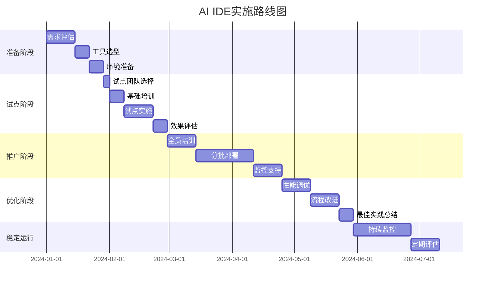
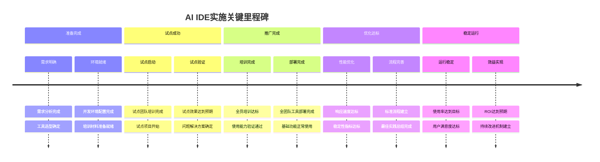
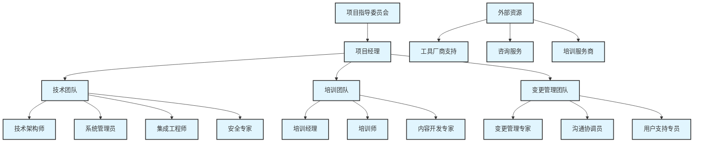

# 第5章 实施路线图


## 5.1 实施阶段划分和时间规划


### 5.1.1 实施阶段框架


AI IDE的成功实施需要分阶段、有计划地进行。我们将整个实施过程划分为五个主要阶段：


<div class="chart-container">



### 5.1.2 各阶段详细规划


#### 5.1.2.1 第一阶段：准备阶段 (4周)


**目标**: 完成前期调研、工具选型和环境准备

**主要任务**:

```yaml
准备阶段任务清单:
  第1-2周 - 需求评估:
    - [ ] 现状调研和分析
    - [ ] 团队技能评估
    - [ ] 业务需求梳理
    - [ ] 技术需求分析
    - [ ] 预算和资源评估
  
  第3周 - 工具选型:
    - [ ] 候选工具对比分析
    - [ ] POC测试和验证
    - [ ] 成本效益分析
    - [ ] 最终工具选择
    - [ ] 采购和合同签署
  
  第4周 - 环境准备:
    - [ ] 开发环境配置
    - [ ] 安全策略制定
    - [ ] 集成测试环境搭建
    - [ ] 培训材料准备
    - [ ] 项目团队组建

```

**关键交付物**:

- 需求分析报告
- 工具选型报告
- 实施计划书
- 环境配置文档
- 培训计划

#### 5.1.2.2 第二阶段：试点阶段 (4周)


**目标**: 小范围验证可行性，识别问题和风险

**试点团队选择标准**:

```python
def select_pilot_team(candidates):
    """
    试点团队选择算法
    """
    selection_criteria = {
        'technical_skill': 0.3,      # 技术能力
        'openness_to_change': 0.25,  # 变革接受度
        'influence_in_team': 0.2,    # 团队影响力
        'project_criticality': 0.15, # 项目关键性(选择非关键项目)
        'availability': 0.1          # 可用性
    }
    
    scored_candidates = []
    for candidate in candidates:
        score = sum(
            candidate[criterion] * weight 
            for criterion, weight in selection_criteria.items()
        )
        scored_candidates.append((candidate, score))
    
    # 选择评分最高的3-5人作为试点团队
    pilot_team = sorted(scored_candidates, key=lambda x: x[1], reverse=True)[:5]
    return [candidate for candidate, score in pilot_team]

```

**试点实施计划**:

```yaml
试点阶段详细计划:
  第1周 - 团队准备:
    - [ ] 试点团队成员确定
    - [ ] 试点项目选择
    - [ ] 基础培训实施
    - [ ] 工具环境配置
    - [ ] 基线数据收集
  
  第2-3周 - 试点实施:
    - [ ] 日常开发工作中使用AI IDE
    - [ ] 问题记录和反馈收集
    - [ ] 每日使用情况跟踪
    - [ ] 周度回顾会议
    - [ ] 必要的调整和优化
  
  第4周 - 效果评估:
    - [ ] 数据收集和分析
    - [ ] 试点团队反馈整理
    - [ ] 问题清单和解决方案
    - [ ] 试点报告编写
    - [ ] 推广计划调整

```

#### 5.1.2.3 第三阶段：推广阶段 (8周)


**目标**: 全团队推广使用，建立标准化流程

**分批推广策略**:


<div class="chart-container">

```mermaid
graph TB
    A[试点团队] --> B[第一批推广]
    B --> C[第二批推广]
    C --> D[第三批推广]
    D --> E[全面覆盖]
    F[技术团队] --> B
    G[产品团队] --> C
    H[测试团队] --> C
    I[运维团队] --> D
    J[管理团队] --> D
    K[培训支持] --> B
    K --> C
    K --> D
    L[技术支持] --> B
    L --> C
    L --> D
    L --> E
```**推广阶段
执行计划**:
```yaml
推广阶段详细计划:
  第1-2周 - 全员培训:
    - [ ] 分层次培训计划执行
    - [ ] 基础使用培训(所有人员)
    - [ ] 高级功能培训(技术人员)
    - [ ] 管理功能培训(团队负责人)
    - [ ] 培训效果评估和补充
  第3-6周 - 分批部署:
    - [ ] 第一批团队部署(技术核心团队)
    - [ ] 第二批团队部署(产品和测试团队)
    - [ ] 第三批团队部署(运维和管理团队)
    - [ ] 每批部署后的问题收集和解决
    - [ ] 使用情况监控和分析
  第7-8周 - 监控支持:
    - [ ] 全面使用情况监控
    - [ ] 问题快速响应机制
    - [ ] 用户反馈收集和处理
    - [ ] 使用效果初步评估
    - [ ] 流程和配置优化
%% Standard styling
classDef default fill:#e1f5fe,stroke:#333,stroke-width:2px
classDef highlight fill:#bbdefb,stroke:#333,stroke-width:3px
classDef process fill:#90caf9,stroke:#333,stroke-width:2px
classDef decision fill:#64b5f6,stroke:#333,stroke-width:2px
```

#### 5.1.2.4 第四阶段：优化阶段 (5周)


**目标**: 基于使用反馈优化配置和流程

```yaml
优化阶段任务:
  第1-2周 - 性能调优:
    - [ ] 工具配置优化
    - [ ] 集成接口优化
    - [ ] 响应速度优化
    - [ ] 资源使用优化
    - [ ] 安全配置加强
  
  第3-4周 - 流程改进:
    - [ ] 开发流程标准化
    - [ ] 代码审查流程优化
    - [ ] 团队协作流程改进
    - [ ] 知识管理流程建立
    - [ ] 问题处理流程完善
  
  第5周 - 最佳实践总结:
    - [ ] 使用最佳实践整理
    - [ ] 常见问题解决方案
    - [ ] 培训材料更新
    - [ ] 操作手册编写
    - [ ] 经验分享会组织

```

#### 5.1.2.5 第五阶段：稳定运行 (6周+)


**目标**: 建立长期运维和持续改进机制

```yaml
稳定运行阶段:
  持续监控 (4周):
    - [ ] 使用情况持续监控
    - [ ] 性能指标跟踪
    - [ ] 用户满意度调研
    - [ ] 成本效益持续评估
    - [ ] 安全合规检查
  
  定期评估 (2周):
    - [ ] 季度效果评估
    - [ ] 年度ROI分析
    - [ ] 工具版本升级评估
    - [ ] 团队能力评估
    - [ ] 改进计划制定

```

## 5.2 里程碑设置和检查标准


### 5.2.1 关键里程碑定义


<div class="chart-container">



### 5.2.2 里程碑检查标准


#### 5.2.2.1 准备阶段里程碑


**里程碑1: 需求分析完成**

```python
def check_requirement_analysis_milestone():
    """
    需求分析完成检查标准
    """
    checklist = {
        'stakeholder_interviews': {
            'description': '关键干系人访谈完成',
            'criteria': '至少访谈80%的关键干系人',
            'evidence': '访谈记录和需求清单'
        },
        'current_state_analysis': {
            'description': '现状分析完成',
            'criteria': '开发流程、工具使用、效率指标分析完整',
            'evidence': '现状分析报告'
        },
        'requirement_documentation': {
            'description': '需求文档完成',
            'criteria': '功能需求、非功能需求、约束条件明确',
            'evidence': '需求规格说明书'
        },
        'success_criteria_defined': {
            'description': '成功标准定义',
            'criteria': '量化的成功指标和验收标准',
            'evidence': '成功标准文档'
        }
    }
    
    return checklist

```

**里程碑2: 工具选型确定**

```python
def check_tool_selection_milestone():
    """
    工具选型确定检查标准
    """
    checklist = {
        'tool_evaluation_completed': {
            'description': '工具评估完成',
            'criteria': '至少评估3个候选工具，完成对比分析',
            'evidence': '工具对比分析报告'
        },
        'poc_testing_done': {
            'description': 'POC测试完成',
            'criteria': '核心功能验证通过，性能测试达标',
            'evidence': 'POC测试报告'
        },
        'cost_benefit_analysis': {
            'description': '成本效益分析完成',
            'criteria': 'ROI计算完成，投资回收期明确',
            'evidence': '成本效益分析报告'
        },
        'final_decision_made': {
            'description': '最终决策完成',
            'criteria': '工具选择决策通过，采购流程启动',
            'evidence': '决策文档和采购合同'
        }
    }
    
    return checklist

```

#### 5.2.2.2 试点阶段里程碑


**里程碑3: 试点效果验证**

```python
def check_pilot_success_milestone():
    """
    试点成功检查标准
    """
    success_criteria = {
        'adoption_rate': {
            'target': 0.9,  # 90%使用率
            'measurement': '试点团队成员实际使用工具的比例',
            'data_source': '使用日志和用户调研'
        },
        'productivity_improvement': {
            'target': 0.2,  # 20%效率提升
            'measurement': '编码速度、调试时间等关键指标改善',
            'data_source': '开发效率数据对比'
        },
        'user_satisfaction': {
            'target': 4.0,  # 满意度4.0/5.0
            'measurement': '用户满意度调研评分',
            'data_source': '满意度调研问卷'
        },
        'issue_resolution': {
            'target': 0.8,  # 80%问题解决率
            'measurement': '试点期间发现问题的解决比例',
            'data_source': '问题跟踪系统'
        }
    }
    
    return success_criteria

```

#### 5.2.2.3 推广阶段里程碑


**里程碑4: 全面部署完成**

```python
def check_rollout_completion_milestone():
    """
    推广完成检查标准
    """
    completion_criteria = {
        'training_completion': {
            'target': 0.95,  # 95%培训完成率
            'measurement': '完成培训并通过考核的人员比例',
            'verification': '培训记录和考核成绩'
        },
        'tool_deployment': {
            'target': 1.0,   # 100%部署完成
            'measurement': '工具安装配置完成的人员比例',
            'verification': '部署状态检查'
        },
        'basic_usage': {
            'target': 0.8,   # 80%基础使用率
            'measurement': '能够使用基础功能的人员比例',
            'verification': '使用能力评估'
        },
        'support_system': {
            'target': 1.0,   # 支持体系完整
            'measurement': '技术支持、文档、培训体系完整性',
            'verification': '支持体系检查清单'
        }
    }
    
    return completion_criteria

```

### 5.2.3 里程碑评估工具


```python
class MilestoneTracker:
    def __init__(self):
        self.milestones = {}
        self.current_phase = None
    
    def add_milestone(self, milestone_id, name, criteria, target_date):
        """
        添加里程碑
        """
        self.milestones[milestone_id] = {
            'name': name,
            'criteria': criteria,
            'target_date': target_date,
            'status': 'not_started',
            'completion_date': None,
            'completion_rate': 0.0,
            'issues': []
        }
    
    def update_milestone_progress(self, milestone_id, completed_criteria, issues=None):
        """
        更新里程碑进度
        """
        if milestone_id not in self.milestones:
            return False
        
        milestone = self.milestones[milestone_id]
        total_criteria = len(milestone['criteria'])
        completed_count = len(completed_criteria)
        
        milestone['completion_rate'] = completed_count / total_criteria
        
        if milestone['completion_rate'] >= 1.0:
            milestone['status'] = 'completed'
            milestone['completion_date'] = datetime.now()
        elif milestone['completion_rate'] > 0:
            milestone['status'] = 'in_progress'
        
        if issues:
            milestone['issues'].extend(issues)
        
        return True
    
    def get_milestone_status(self, milestone_id):
        """
        获取里程碑状态
        """
        if milestone_id not in self.milestones:
            return None
        
        milestone = self.milestones[milestone_id]
        return {
            'name': milestone['name'],
            'status': milestone['status'],
            'completion_rate': milestone['completion_rate'],
            'target_date': milestone['target_date'],
            'completion_date': milestone['completion_date'],
            'is_delayed': self._is_delayed(milestone),
            'issues_count': len(milestone['issues'])
        }
    
    def _is_delayed(self, milestone):
        """
        检查里程碑是否延期
        """
        if milestone['status'] == 'completed':
            return milestone['completion_date'] > milestone['target_date']
        else:
            return datetime.now() > milestone['target_date']
    
    def generate_progress_report(self):
        """
        生成进度报告
        """
        report = {
            'total_milestones': len(self.milestones),
            'completed_milestones': 0,
            'in_progress_milestones': 0,
            'delayed_milestones': 0,
            'overall_progress': 0.0,
            'milestone_details': []
        }
        
        total_progress = 0
        
        for milestone_id, milestone in self.milestones.items():
            status = self.get_milestone_status(milestone_id)
            
            if status['status'] == 'completed':
                report['completed_milestones'] += 1
            elif status['status'] == 'in_progress':
                report['in_progress_milestones'] += 1
            
            if status['is_delayed']:
                report['delayed_milestones'] += 1
            
            total_progress += milestone['completion_rate']
            report['milestone_details'].append(status)
        
        report['overall_progress'] = total_progress / len(self.milestones) if self.milestones else 0
        
        return report

```

## 5.3 资源配置计划和预算模板


### 5.3.1 人力资源配置


#### 5.3.1.1 项目团队结构


<div class="chart-container">



#### 5.3.1.2 人力资源需求计算


```python
def calculate_human_resources(team_size, project_duration_months, complexity_level):
    """
    计算人力资源需求
    """
    # 基础人力配置比例
    base_ratios = {
        'project_manager': 1,           # 项目经理1人
        'technical_architect': 1,       # 技术架构师1人
        'system_admin': max(1, team_size // 20),  # 系统管理员
        'trainer': max(1, team_size // 15),       # 培训师
        'change_manager': max(1, team_size // 25), # 变更管理专家
        'support_specialist': max(1, team_size // 10) # 支持专员
    }
    
    # 复杂度调整系数
    complexity_multipliers = {
        'simple': 0.8,
        'medium': 1.0,
        'complex': 1.3
    }
    
    multiplier = complexity_multipliers.get(complexity_level, 1.0)
    
    # 计算各角色工作量(人月)
    resource_requirements = {}
    
    for role, base_count in base_ratios.items():
        if role == 'project_manager':
            # 项目经理全程参与
            effort_months = project_duration_months * multiplier
        elif role in ['technical_architect', 'system_admin']:
            # 技术角色主要在前期和优化阶段
            effort_months = (project_duration_months * 0.7) * multiplier
        elif role == 'trainer':
            # 培训师主要在培训和推广阶段
            effort_months = (project_duration_months * 0.4) * multiplier
        else:
            # 其他角色按比例参与
            effort_months = (project_duration_months * 0.6) * multiplier
        
        resource_requirements[role] = {
            'count': base_count,
            'effort_months': effort_months,
            'cost_per_month': get_role_cost(role),
            'total_cost': effort_months * get_role_cost(role)
        }
    
    return resource_requirements

def get_role_cost(role):
    """
    获取角色月成本
    """
    role_costs = {
        'project_manager': 25000,
        'technical_architect': 30000,
        'system_admin': 20000,
        'trainer': 18000,
        'change_manager': 22000,
        'support_specialist': 15000
    }
    
    return role_costs.get(role, 20000)

```

### 5.3.2 技术资源配置


#### 5.3.2.1 基础设施需求


```python
def calculate_infrastructure_requirements(team_size, deployment_type, duration_months):
    """
    计算基础设施需求
    """
    requirements = {}
    
    if deployment_type == 'cloud':
        # 云端部署需求
        requirements = {
            'compute_instances': {
                'type': 'Standard_D4s_v3',
                'count': max(1, team_size // 10),
                'monthly_cost': 800,
                'total_cost': max(1, team_size // 10) * 800 * duration_months
            },
            'storage': {
                'type': 'Premium SSD',
                'size_gb': team_size * 50,  # 每人50GB
                'monthly_cost_per_gb': 2,
                'total_cost': team_size * 50 * 2 * duration_months
            },
            'network': {
                'bandwidth_mbps': team_size * 10,  # 每人10Mbps
                'monthly_cost': team_size * 50,
                'total_cost': team_size * 50 * duration_months
            },
            'backup': {
                'storage_gb': team_size * 20,  # 每人20GB备份
                'monthly_cost': team_size * 10,
                'total_cost': team_size * 10 * duration_months
            }
        }
    
    elif deployment_type == 'on_premise':
        # 本地部署需求
        requirements = {
            'servers': {
                'type': 'Dell PowerEdge R740',
                'count': max(1, team_size // 15),
                'unit_cost': 80000,
                'total_cost': max(1, team_size // 15) * 80000
            },
            'storage_array': {
                'type': 'Dell EMC Unity 400',
                'capacity_tb': max(2, team_size // 5),
                'unit_cost': 150000,
                'total_cost': 150000
            },
            'network_equipment': {
                'switches': 2,
                'firewalls': 1,
                'total_cost': 50000
            },
            'maintenance': {
                'annual_cost': 30000,
                'total_cost': 30000 * (duration_months / 12)
            }
        }
    
    return requirements

```

#### 5.3.2.2 软件许可需求


```python
def calculate_software_licenses(team_size, tool_selection, duration_months):
    """
    计算软件许可需求
    """
    # 工具许可费用
    tool_costs = {
        'github_copilot': {'individual': 10, 'business': 19},
        'cursor': {'pro': 20, 'team': 40},
        'claude_code': {'pro': 20, 'team': 50},
        'tabnine': {'pro': 12, 'team': 39},
        'windsurf': {'pro': 10, 'team': 25}
    }
    
    # 辅助工具许可
    auxiliary_tools = {
        'ide_licenses': team_size * 200,  # IDE许可
        'security_tools': team_size * 100,  # 安全工具
        'monitoring_tools': 5000,  # 监控工具
        'backup_software': 3000   # 备份软件
    }
    
    # 计算主要工具成本
    main_tool_cost = 0
    if tool_selection in tool_costs:
        if team_size <= 10:
            monthly_cost = tool_costs[tool_selection]['individual'] * team_size
        else:
            monthly_cost = tool_costs[tool_selection]['business'] * team_size
        
        main_tool_cost = monthly_cost * duration_months
    
    # 计算辅助工具成本
    auxiliary_cost = sum(auxiliary_tools.values())
    
    return {
        'main_tool_cost': main_tool_cost,
        'auxiliary_tools_cost': auxiliary_cost,
        'total_software_cost': main_tool_cost + auxiliary_cost,
        'monthly_average': (main_tool_cost + auxiliary_cost) / duration_months
    }

```

### 5.3.3 预算模板


#### 5.3.3.1 综合预算计算器


```python
class AIIDEBudgetCalculator:
    def __init__(self, project_config):
        self.config = project_config
        self.budget_breakdown = {}
    
    def calculate_total_budget(self):
        """
        计算总预算
        """
        # 1. 人力成本
        human_resources = calculate_human_resources(
            self.config['team_size'],
            self.config['duration_months'],
            self.config['complexity_level']
        )
        
        total_human_cost = sum(
            resource['total_cost'] 
            for resource in human_resources.values()
        )
        
        # 2. 基础设施成本
        infrastructure = calculate_infrastructure_requirements(
            self.config['team_size'],
            self.config['deployment_type'],
            self.config['duration_months']
        )
        
        total_infrastructure_cost = sum(
            item['total_cost'] 
            for item in infrastructure.values()
        )
        
        # 3. 软件许可成本
        software_licenses = calculate_software_licenses(
            self.config['team_size'],
            self.config['tool_selection'],
            self.config['duration_months']
        )
        
        # 4. 培训和咨询成本
        training_cost = self._calculate_training_cost()
        consulting_cost = self._calculate_consulting_cost()
        
        # 5. 风险缓冲
        subtotal = (total_human_cost + total_infrastructure_cost + 
                   software_licenses['total_software_cost'] + 
                   training_cost + consulting_cost)
        
        risk_buffer = subtotal * self.config.get('risk_buffer_rate', 0.15)
        
        # 总预算
        total_budget = subtotal + risk_buffer
        
        self.budget_breakdown = {
            'human_resources': total_human_cost,
            'infrastructure': total_infrastructure_cost,
            'software_licenses': software_licenses['total_software_cost'],
            'training': training_cost,
            'consulting': consulting_cost,
            'risk_buffer': risk_buffer,
            'total_budget': total_budget
        }
        
        return self.budget_breakdown
    
    def _calculate_training_cost(self):
        """
        计算培训成本
        """
        team_size = self.config['team_size']
        
        # 内部培训成本
        internal_training = {
            'trainer_cost': 20000 * 2,  # 2个月培训师成本
            'material_cost': team_size * 500,  # 每人500元材料费
            'venue_cost': 5000,  # 培训场地费用
            'equipment_cost': 10000  # 培训设备费用
        }
        
        # 外部培训成本
        external_training = {
            'vendor_training': team_size * 2000,  # 每人2000元厂商培训
            'certification': team_size * 1000  # 每人1000元认证费用
        }
        
        return sum(internal_training.values()) + sum(external_training.values())
    
    def _calculate_consulting_cost(self):
        """
        计算咨询成本
        """
        complexity_multipliers = {
            'simple': 0.5,
            'medium': 1.0,
            'complex': 1.8
        }
        
        base_consulting_cost = 100000  # 基础咨询费用
        multiplier = complexity_multipliers.get(self.config['complexity_level'], 1.0)
        
        return base_consulting_cost * multiplier
    
    def generate_budget_report(self):
        """
        生成预算报告
        """
        if not self.budget_breakdown:
            self.calculate_total_budget()
        
        report = {
            'project_overview': {
                'team_size': self.config['team_size'],
                'duration_months': self.config['duration_months'],
                'tool_selection': self.config['tool_selection'],
                'deployment_type': self.config['deployment_type']
            },
            'budget_summary': {
                'total_budget': self.budget_breakdown['total_budget'],
                'monthly_average': self.budget_breakdown['total_budget'] / self.config['duration_months'],
                'cost_per_person': self.budget_breakdown['total_budget'] / self.config['team_size']
            },
            'cost_breakdown': {
                category: {
                    'amount': cost,
                    'percentage': (cost / self.budget_breakdown['total_budget']) * 100
                }
                for category, cost in self.budget_breakdown.items()
                if category != 'total_budget'
            },
            'monthly_cash_flow': self._generate_cash_flow_projection()
        }
        
        return report
    
    def _generate_cash_flow_projection(self):
        """
        生成现金流预测
        """
        duration = self.config['duration_months']
        total_budget = self.budget_breakdown['total_budget']
        
        # 简化的现金流分布
        cash_flow = []
        
        for month in range(1, duration + 1):
            if month <= 2:  # 前两个月投入较大
                monthly_cost = total_budget * 0.15
            elif month <= duration - 2:  # 中间阶段平稳
                monthly_cost = total_budget * 0.08
            else:  # 最后阶段收尾
                monthly_cost = total_budget * 0.05
            
            cash_flow.append({
                'month': month,
                'monthly_cost': monthly_cost,
                'cumulative_cost': sum(cf['monthly_cost'] for cf in cash_flow) + monthly_cost
            })
        
        return cash_flow

# 第5章 使用示例

project_config = {
    'team_size': 15,
    'duration_months': 8,
    'complexity_level': 'medium',
    'deployment_type': 'cloud',
    'tool_selection': 'cursor',
    'risk_buffer_rate': 0.15
}

budget_calculator = AIIDEBudgetCalculator(project_config)
budget_report = budget_calculator.generate_budget_report()

print("=== AI IDE实施预算报告 ===")
print(f"总预算: ¥{budget_report['budget_summary']['total_budget']:,.0f}")
print(f"月均成本: ¥{budget_report['budget_summary']['monthly_average']:,.0f}")
print(f"人均成本: ¥{budget_report['budget_summary']['cost_per_person']:,.0f}")

```

## 5.4 风险应对策略和应急预案


### 5.4.1 风险识别和分类


#### 5.4.1.1 风险登记册


```python
class RiskRegister:
    def __init__(self):
        self.risks = {
            'technical_risks': {
                'tool_performance_issues': {
                    'description': 'AI IDE工具性能不达预期',
                    'probability': 'medium',
                    'impact': 'high',
                    'risk_level': 'high',
                    'triggers': ['响应时间超过1秒', '准确率低于70%', '频繁崩溃'],
                    'owner': 'technical_architect'
                },
                'integration_failures': {
                    'description': '与现有开发工具集成失败',
                    'probability': 'medium',
                    'impact': 'medium',
                    'risk_level': 'medium',
                    'triggers': ['API调用失败', '数据同步问题', '版本冲突'],
                    'owner': 'system_admin'
                },
                'security_vulnerabilities': {
                    'description': '安全漏洞或数据泄露',
                    'probability': 'low',
                    'impact': 'very_high',
                    'risk_level': 'high',
                    'triggers': ['安全扫描发现漏洞', '异常数据访问', '权限绕过'],
                    'owner': 'security_specialist'
                }
            },
            'organizational_risks': {
                'user_resistance': {
                    'description': '用户抗拒使用新工具',
                    'probability': 'high',
                    'impact': 'medium',
                    'risk_level': 'high',
                    'triggers': ['培训参与率低', '使用率低于50%', '负面反馈增多'],
                    'owner': 'change_manager'
                },
                'skill_gaps': {
                    'description': '团队技能不足',
                    'probability': 'medium',
                    'impact': 'medium',
                    'risk_level': 'medium',
                    'triggers': ['培训考核通过率低', '使用错误频发', '效率提升不明显'],
                    'owner': 'training_manager'
                },
                'management_support_loss': {
                    'description': '管理层支持不足',
                    'probability': 'low',
                    'impact': 'very_high',
                    'risk_level': 'medium',
                    'triggers': ['预算削减', '优先级下降', '资源重新分配'],
                    'owner': 'project_manager'
                }
            },
            'external_risks': {
                'vendor_issues': {
                    'description': '供应商服务问题',
                    'probability': 'medium',
                    'impact': 'high',
                    'risk_level': 'high',
                    'triggers': ['服务中断', '支持响应慢', '产品停止更新'],
                    'owner': 'project_manager'
                },
                'market_changes': {
                    'description': '市场环境变化',
                    'probability': 'low',
                    'impact': 'medium',
                    'risk_level': 'low',
                    'triggers': ['竞争产品出现', '技术标准变化', '法规政策调整'],
                    'owner': 'project_manager'
                }
            }
        }
    
    def get_high_priority_risks(self):
        """
        获取高优先级风险
        """
        high_priority_risks = []
        
        for category, risks in self.risks.items():
            for risk_id, risk_data in risks.items():
                if risk_data['risk_level'] == 'high':
                    high_priority_risks.append({
                        'id': risk_id,
                        'category': category,
                        'description': risk_data['description'],
                        'risk_level': risk_data['risk_level'],
                        'owner': risk_data['owner']
                    })
        
        return high_priority_risks

```

### 5.4.2 风险应对策略


#### 5.4.2.1 技术风险应对


```python
def create_technical_risk_mitigation_plan():
    """
    技术风险缓解计划
    """
    mitigation_strategies = {
        'tool_performance_issues': {
            'prevention': [
                '实施全面的POC测试',
                '建立性能基准测试',
                '制定性能监控机制',
                '准备备选工具方案'
            ],
            'detection': [
                '实时性能监控',
                '用户反馈收集',
                '定期性能评估',
                '自动化告警系统'
            ],
            'response': [
                '立即联系供应商技术支持',
                '启动性能优化流程',
                '必要时切换到备选方案',
                '向用户通报进展情况'
            ],
            'recovery': [
                '性能问题根因分析',
                '优化配置和设置',
                '用户培训和支持',
                '流程改进和文档更新'
            ]
        },
        'integration_failures': {
            'prevention': [
                '详细的集成测试计划',
                'API兼容性验证',
                '版本管理策略',
                '集成环境搭建'
            ],
            'detection': [
                '自动化集成测试',
                'API监控',
                '错误日志分析',
                '用户问题报告'
            ],
            'response': [
                '隔离问题组件',
                '启用备用集成方案',
                '紧急修复程序',
                '用户工作流调整'
            ],
            'recovery': [
                '集成问题修复',
                '全面回归测试',
                '文档和流程更新',
                '预防措施加强'
            ]
        }
    }
    
    return mitigation_strategies

```

#### 5.4.2.2 组织风险应对


```python
def create_organizational_risk_mitigation_plan():
    """
    组织风险缓解计划
    """
    mitigation_strategies = {
        'user_resistance': {
            'prevention': [
                '早期用户参与和沟通',
                '展示工具价值和收益',
                '选择影响力用户作为倡导者',
                '提供充分的培训和支持'
            ],
            'detection': [
                '定期用户满意度调研',
                '使用率监控',
                '反馈渠道建立',
                '非正式沟通观察'
            ],
            'response': [
                '一对一沟通和支持',
                '额外培训和辅导',
                '工作流程调整',
                '激励措施实施'
            ],
            'recovery': [
                '深入了解抗拒原因',
                '个性化解决方案',
                '成功案例分享',
                '持续关注和支持'
            ]
        },
        'skill_gaps': {
            'prevention': [
                '技能评估和差距分析',
                '分层次培训计划',
                '实践导向的学习',
                '导师制度建立'
            ],
            'detection': [
                '培训效果评估',
                '实际使用能力测试',
                '工作质量监控',
                '同事反馈收集'
            ],
            'response': [
                '补充培训计划',
                '一对一辅导',
                '实践项目安排',
                '外部专家支持'
            ],
            'recovery': [
                '技能提升验证',
                '持续学习计划',
                '知识分享机制',
                '能力发展路径'
            ]
        }
    }
    
    return mitigation_strategies

```

### 5.4.3 应急预案


#### 5.4.3.1 关键场景应急预案


```python
class EmergencyResponsePlan:
    def __init__(self):
        self.emergency_scenarios = {
            'complete_system_failure': {
                'description': 'AI IDE系统完全故障',
                'severity': 'critical',
                'response_time': '1小时',
                'escalation_path': ['system_admin', 'technical_architect', 'project_manager', 'cto']
            },
            'security_breach': {
                'description': '安全漏洞或数据泄露',
                'severity': 'critical',
                'response_time': '30分钟',
                'escalation_path': ['security_specialist', 'ciso', 'legal_team', 'ceo']
            },
            'mass_user_rejection': {
                'description': '大规模用户抗拒使用',
                'severity': 'high',
                'response_time': '4小时',
                'escalation_path': ['change_manager', 'hr_director', 'project_manager', 'cto']
            },
            'vendor_service_disruption': {
                'description': '供应商服务中断',
                'severity': 'high',
                'response_time': '2小时',
                'escalation_path': ['project_manager', 'procurement', 'legal_team', 'cto']
            }
        }
    
    def get_emergency_response_procedure(self, scenario):
        """
        获取应急响应程序
        """
        if scenario == 'complete_system_failure':
            return {
                'immediate_actions': [
                    '确认故障范围和影响',
                    '通知所有用户系统故障',
                    '启动备用开发环境',
                    '联系供应商技术支持'
                ],
                'short_term_actions': [
                    '实施临时解决方案',
                    '评估数据完整性',
                    '制定修复时间表',
                    '定期更新进展状态'
                ],
                'recovery_actions': [
                    '系统修复和测试',
                    '数据恢复验证',
                    '用户访问恢复',
                    '事后分析和改进'
                ],
                'communication_plan': {
                    'internal': '每小时更新内部团队',
                    'users': '每2小时更新用户状态',
                    'management': '每30分钟汇报管理层',
                    'vendor': '持续与供应商沟通'
                }
            }
        
        elif scenario == 'security_breach':
            return {
                'immediate_actions': [
                    '立即隔离受影响系统',
                    '保护现场证据',
                    '通知安全团队和法务',
                    '评估泄露范围和影响'
                ],
                'short_term_actions': [
                    '实施安全加固措施',
                    '通知相关监管机构',
                    '准备公开声明',
                    '启动法律程序'
                ],
                'recovery_actions': [
                    '系统安全修复',
                    '安全审计和测试',
                    '用户信任重建',
                    '安全流程改进'
                ],
                'communication_plan': {
                    'internal': '立即通知相关人员',
                    'users': '24小时内正式通知',
                    'regulators': '按法规要求时间',
                    'media': '统一对外发声'
                }
            }
        
        # 其他场景的应急预案...
        return None
    
    def create_rollback_plan(self):
        """
        创建回退计划
        """
        rollback_plan = {
            'triggers': [
                '用户满意度低于2.0/5.0',
                '系统可用性低于90%',
                '安全事件频发',
                '成本超预算50%以上',
                '关键业务受到严重影响'
            ],
            'rollback_phases': {
                'phase_1_immediate': {
                    'duration': '24小时',
                    'actions': [
                        '停止新用户接入',
                        '保护现有数据',
                        '通知相关干系人',
                        '启动应急支持'
                    ]
                },
                'phase_2_transition': {
                    'duration': '1周',
                    'actions': [
                        '逐步迁移回原系统',
                        '数据备份和验证',
                        '用户培训和支持',
                        '流程恢复'
                    ]
                },
                'phase_3_stabilization': {
                    'duration': '2周',
                    'actions': [
                        '系统稳定性验证',
                        '用户适应性支持',
                        '经验教训总结',
                        '改进计划制定'
                    ]
                }
            },
            'success_criteria': [
                '原系统功能完全恢复',
                '数据完整性100%',
                '用户工作效率恢复到原水平',
                '无遗留安全风险'
            ]
        }
        
        return rollback_plan

```

#### 5.4.3.2 业务连续性保障


```python
def create_business_continuity_plan():
    """
    创建业务连续性计划
    """
    continuity_plan = {
        'backup_systems': {
            'primary_backup': {
                'type': '传统IDE环境',
                'activation_time': '2小时',
                'capacity': '100%团队',
                'limitations': '无AI辅助功能'
            },
            'secondary_backup': {
                'type': '云端开发环境',
                'activation_time': '4小时',
                'capacity': '80%团队',
                'limitations': '网络依赖性强'
            }
        },
        'data_protection': {
            'backup_frequency': '每日增量，每周全量',
            'backup_locations': ['本地存储', '云端存储', '异地备份'],
            'recovery_time_objective': '4小时',
            'recovery_point_objective': '1小时'
        },
        'communication_protocols': {
            'notification_channels': ['邮件', '即时消息', '电话', '短信'],
            'escalation_matrix': {
                'level_1': '项目团队',
                'level_2': '部门管理层',
                'level_3': '公司高管',
                'level_4': '董事会'
            },
            'external_communications': {
                'customers': '客户服务团队负责',
                'partners': '业务发展团队负责',
                'media': '公关团队负责',
                'regulators': '法务团队负责'
            }
        },
        'resource_allocation': {
            'emergency_budget': '项目预算的20%',
            'emergency_personnel': '核心团队成员24/7待命',
            'external_support': '供应商紧急支持合同',
            'facilities': '备用办公场所和设备'
        }
    }
    
    return continuity_plan

```

---

*本章总结*: 实施路线图为AI IDE的成功部署提供了系统化的指导。通过分阶段实施、明确的里程碑检查、合理的资源配置和完善的风险管理，可以最大化实施成功的概率，确保投资获得预期回报。
