# 第7章 7. 设计管理（优化版）


## 7.1 架构设计


### 7.1.1 AI辅助架构设计操作步骤


#### 7.1.1.1 步骤1：架构需求分析

```

提示词模板：
"基于以下项目需求，请分析架构设计要点：
项目类型：[Web应用/移动应用/微服务/单体应用]
用户规模：[预期用户数量]
性能要求：[响应时间、并发量等]
可用性要求：[可用性指标]
安全要求：[安全等级和要求]
技术约束：[现有技术栈、团队技能等]

请提供：
1. 架构风格建议
2. 关键架构决策点
3. 技术栈推荐
4. 潜在架构风险"

```

#### 7.1.1.2 步骤2：架构模式推荐

```

提示词模板：
"为以下场景推荐合适的架构模式：
业务场景：[具体业务描述]
技术要求：[技术需求]
团队规模：[开发团队规模]
维护要求：[长期维护考虑]

请推荐：
5. 主要架构模式（如MVC、微服务、事件驱动等）
6. 设计原则应用
7. 架构分层策略
8. 组件交互方式"

```

#### 7.1.1.3 步骤3：架构图生成

```

提示词模板：
"生成系统架构图的Mermaid代码：
系统组件：[组件列表]
组件关系：[组件间关系]
数据流向：[数据流描述]
外部系统：[外部依赖系统]

请生成包含以下层次的架构图：
9. 表现层
10. 业务逻辑层
11. 数据访问层
12. 基础设施层"

```

### 7.1.2 实践案例：电商平台架构设计


**项目背景：** 设计一个支持高并发的B2C电商平台，需要处理商品展示、订单处理、支付结算等核心业务。

**AI辅助架构设计过程：**

**第一步：架构需求分析**

```

输入提示词：
"基于以下电商平台需求，请分析架构设计要点：
项目类型：B2C电商Web应用
用户规模：预期10万注册用户，峰值5000并发
性能要求：页面响应时间<2秒，订单处理<5秒
可用性要求：99.9%可用性，支持7x24小时运行
安全要求：支付数据加密，用户信息保护，防SQL注入
技术约束：团队熟悉Java/Spring，有Docker部署经验"

AI输出：
架构设计分析结果：

🏗️ 架构风格建议：
13. 主架构：微服务架构
   - 优势：可独立部署、扩展，技术栈灵活
   - 适用性：支持高并发，便于团队协作
   
14. 备选架构：模块化单体架构
   - 优势：部署简单，开发效率高
   - 适用性：团队规模较小时的选择

🎯 关键架构决策点：
15. 服务拆分策略：按业务域拆分（用户、商品、订单、支付）
16. 数据一致性：采用最终一致性，关键业务使用分布式事务
17. 缓存策略：Redis集群，多级缓存架构
18. 消息队列：RabbitMQ处理异步任务
19. 负载均衡：Nginx + Spring Cloud Gateway

💻 技术栈推荐：
- 后端：Spring Boot + Spring Cloud
- 数据库：MySQL主从 + Redis集群
- 消息队列：RabbitMQ
- 搜索引擎：Elasticsearch
- 容器化：Docker + Kubernetes
- 监控：Prometheus + Grafana

⚠️ 潜在架构风险：
20. 微服务复杂性：服务间通信、数据一致性挑战
21. 分布式事务：跨服务事务处理复杂
22. 服务治理：服务发现、配置管理、监控复杂度
23. 团队协作：需要DevOps能力支撑

🛡️ 风险缓解策略：
24. 采用Spring Cloud生态简化微服务开发
25. 使用Saga模式处理分布式事务
26. 建立完善的监控和日志体系
27. 逐步从单体向微服务演进

```

**第二步：详细架构设计**

```

输入提示词：
"为电商平台生成详细的微服务架构图，包括各个服务和基础设施组件"

AI输出：


<div class="chart-container">


```mermaid
graph TB
    %% 用户层
    Web[Web前端]
    Mobile[移动端]
    Admin[管理后台]
    
    %% API网关层
    Gateway[API Gateway<br/>Spring Cloud Gateway]
    
    %% 微服务层
    UserService[用户服务<br/>User Service]
    ProductService[商品服务<br/>Product Service]
    OrderService[订单服务<br/>Order Service]
    PaymentService[支付服务<br/>Payment Service]
    CartService[购物车服务<br/>Cart Service]
    NotificationService[通知服务<br/>Notification Service]
    
    %% 数据层
    UserDB[(用户数据库<br/>MySQL)]
    ProductDB[(商品数据库<br/>MySQL)]
    OrderDB[(订单数据库<br/>MySQL)]
    PaymentDB[(支付数据库<br/>MySQL)]
    
    %% 缓存层
    Redis[(Redis集群<br/>缓存/会话)]
    
    %% 搜索层
    ES[(Elasticsearch<br/>商品搜索)]
    
    %% 消息队列
    MQ[RabbitMQ<br/>消息队列]
    
    %% 基础设施
    Registry[服务注册中心<br/>Eureka]
    Config[配置中心<br/>Spring Cloud Config]
    Monitor[监控中心<br/>Prometheus]
    
    %% 外部服务
    PaymentGateway[第三方支付<br/>支付宝/微信]
    SMS[短信服务]
    Email[邮件服务]
    
    %% 连接关系
    Web --> Gateway
    Mobile --> Gateway
    Admin --> Gateway
    
    Gateway --> UserService
    Gateway --> ProductService
    Gateway --> OrderService
    Gateway --> PaymentService
    Gateway --> CartService
    
    UserService --> UserDB
    UserService --> Redis
    
    ProductService --> ProductDB
    ProductService --> ES
    ProductService --> Redis
    
    OrderService --> OrderDB
    OrderService --> MQ
    OrderService --> Redis
    
    PaymentService --> PaymentDB
    PaymentService --> PaymentGateway
    PaymentService --> MQ
    
    CartService --> Redis
    
    NotificationService --> SMS
    NotificationService --> Email
    NotificationService --> MQ
    
    UserService --> Registry
    ProductService --> Registry
    OrderService --> Registry
    PaymentService --> Registry
    CartService --> Registry
    NotificationService --> Registry
    
    Gateway --> Registry
    
    UserService --> Config
    ProductService --> Config
    OrderService --> Config
    PaymentService --> Config
    
    Monitor --> UserService
    Monitor --> ProductService
    Monitor --> OrderService
    Monitor --> PaymentService
    
    style Gateway fill:#e1f5fe
    style UserService fill:#f3e5f5
    style ProductService fill:#f3e5f5
    style OrderService fill:#f3e5f5
    style PaymentService fill:#f3e5f5
    style CartService fill:#f3e5f5
    style NotificationService fill:#f3e5f5

```

**第三步：架构决策记录**

```

架构决策记录 (ADR-001)

标题：采用微服务架构

状态：已接受

背景：
电商平台需要支持高并发访问，不同业务模块有不同的扩展需求，
团队规模适中，具备微服务开发和运维能力。

决策：
采用基于Spring Cloud的微服务架构，按业务域拆分服务。

理由：
28. 可独立扩展：商品浏览和订单处理有不同的并发特征
29. 技术灵活性：不同服务可选择最适合的技术栈
30. 团队协作：支持多团队并行开发
31. 故障隔离：单个服务故障不影响整体系统

后果：
正面影响：
- 提高系统可扩展性和可维护性
- 支持持续集成和部署
- 提高开发效率

负面影响：
- 增加系统复杂性
- 需要更多的运维投入
- 分布式系统的一致性挑战

缓解措施：
- 使用Spring Cloud简化微服务开发
- 建立完善的监控和日志体系
- 采用容器化部署简化运维

```

### 7.1.3 架构评估与优化


**AI辅助架构评估检查清单：**

| 评估维度 | 评估项目 | 评估标准 | 评估结果 |
| --------- | --------- | --------- | ---------- |
| **可扩展性** | 水平扩展能力 | 是否支持无状态扩展 | □优秀 □良好 □需改进 |
|  | 垂直扩展能力 | 是否支持资源动态调整 | □优秀 □良好 □需改进 |
| **可用性** | 故障隔离 | 单点故障是否影响整体 | □优秀 □良好 □需改进 |
|  | 容错机制 | 是否有熔断、重试机制 | □优秀 □良好 □需改进 |
| **性能** | 响应时间 | 是否满足性能要求 | □优秀 □良好 □需改进 |
|  | 吞吐量 | 是否支持预期并发量 | □优秀 □良好 □需改进 |
| **安全性** | 数据安全 | 敏感数据是否加密 | □优秀 □良好 □需改进 |
|  | 访问控制 | 是否有完善的权限控制 | □优秀 □良好 □需改进 |
| **可维护性** | 代码质量 | 是否遵循设计原则 | □优秀 □良好 □需改进 |
|  | 文档完整性 | 架构文档是否完整 | □优秀 □良好 □需改进 |

## 7.2 详细设计


### 7.2.1 AI辅助详细设计操作步骤


#### 7.2.1.1 步骤1：类图和接口设计

```

提示词模板：
"基于以下需求生成类图设计：
功能模块：[模块名称]
主要实体：[实体列表]
业务规则：[业务逻辑描述]
接口要求：[接口规范]

请生成：
32. 核心实体类设计
33. 服务接口定义
34. 数据访问对象设计
35. 类之间的关系图"

```

#### 7.2.1.2 步骤2：设计模式应用

```

提示词模板：
"为以下场景推荐合适的设计模式：
问题描述：[具体问题]
约束条件：[技术和业务约束]
质量要求：[可维护性、可扩展性等要求]

请推荐：
36. 适用的设计模式
37. 模式应用方式
38. 实现示例代码
39. 模式的优缺点分析"

```

#### 7.2.1.3 步骤3：数据库设计

```

提示词模板：
"设计数据库表结构：
业务实体：[实体列表]
实体关系：[实体间关系]
业务规则：[数据约束规则]
性能要求：[查询性能要求]

请提供：
40. 表结构设计（DDL）
41. 索引设计建议
42. 数据关系图（ERD）
43. 性能优化建议"

```

### 7.2.2 实践案例：订单管理系统详细设计


**业务背景：** 设计电商平台的订单管理系统，包括订单创建、状态跟踪、支付处理等功能。

**AI辅助详细设计过程：**

**第一步：核心类设计**

```

输入提示词：
"为订单管理系统生成核心类设计：
功能模块：订单管理
主要实体：订单、订单项、用户、商品、支付记录
业务规则：
- 订单包含多个订单项
- 订单有状态流转（待支付->已支付->已发货->已完成）
- 支持订单取消和退款
- 记录订单操作日志

请生成完整的类图设计和核心类代码"

AI输出：

```java
// 订单实体类
@Entity
@Table(name = "orders")
public class Order {
    @Id
    @GeneratedValue(strategy = GenerationType.IDENTITY)
    private Long id;
    
    @Column(name = "order_no", unique = true, nullable = false)
    private String orderNo;
    
    @Column(name = "user_id", nullable = false)
    private Long userId;
    
    @Enumerated(EnumType.STRING)
    @Column(name = "status", nullable = false)
    private OrderStatus status;
    
    @Column(name = "total_amount", precision = 10, scale = 2)
    private BigDecimal totalAmount;
    
    @Column(name = "created_time")
    private LocalDateTime createdTime;
    
    @Column(name = "updated_time")
    private LocalDateTime updatedTime;
    
    @OneToMany(mappedBy = "order", cascade = CascadeType.ALL, fetch = FetchType.LAZY)
    private List<OrderItem> orderItems;
    
    @OneToMany(mappedBy = "order", cascade = CascadeType.ALL, fetch = FetchType.LAZY)
    private List<OrderLog> orderLogs;
    
    // 构造函数、getter、setter省略
}

// 订单状态枚举
public enum OrderStatus {
    PENDING_PAYMENT("待支付"),
    PAID("已支付"),
    SHIPPED("已发货"),
    DELIVERED("已送达"),
    COMPLETED("已完成"),
    CANCELLED("已取消"),
    REFUNDED("已退款");
    
    private final String description;
    
    OrderStatus(String description) {
        this.description = description;
    }
    
    public String getDescription() {
        return description;
    }
}

// 订单项实体类
@Entity
@Table(name = "order_items")
public class OrderItem {
    @Id
    @GeneratedValue(strategy = GenerationType.IDENTITY)
    private Long id;
    
    @ManyToOne(fetch = FetchType.LAZY)
    @JoinColumn(name = "order_id")
    private Order order;
    
    @Column(name = "product_id", nullable = false)
    private Long productId;
    
    @Column(name = "product_name", nullable = false)
    private String productName;
    
    @Column(name = "unit_price", precision = 10, scale = 2)
    private BigDecimal unitPrice;
    
    @Column(name = "quantity", nullable = false)
    private Integer quantity;
    
    @Column(name = "subtotal", precision = 10, scale = 2)
    private BigDecimal subtotal;
    
    // 构造函数、getter、setter省略
}

// 订单服务接口
public interface OrderService {
    /**
     - 创建订单
     */

    Order createOrder(CreateOrderRequest request);
    
    /**
     - 更新订单状态
     */

    void updateOrderStatus(Long orderId, OrderStatus status);
    
    /**
     - 取消订单
     */

    void cancelOrder(Long orderId, String reason);
    
    /**
     - 查询订单详情
     */

    OrderDetailResponse getOrderDetail(Long orderId);
    
    /**
     - 分页查询用户订单
     */

    PageResult<OrderSummary> getUserOrders(Long userId, OrderQueryRequest request);
}

// 订单服务实现类（使用策略模式处理不同状态的业务逻辑）
@Service
@Transactional
public class OrderServiceImpl implements OrderService {
    
    @Autowired
    private OrderRepository orderRepository;
    
    @Autowired
    private OrderItemRepository orderItemRepository;
    
    @Autowired
    private OrderStatusHandler orderStatusHandler;
    
    @Override
    public Order createOrder(CreateOrderRequest request) {
        // 1. 验证商品库存
        validateProductStock(request.getItems());
        
        // 2. 计算订单金额
        BigDecimal totalAmount = calculateTotalAmount(request.getItems());
        
        // 3. 创建订单
        Order order = new Order();
        order.setOrderNo(generateOrderNo());
        order.setUserId(request.getUserId());
        order.setStatus(OrderStatus.PENDING_PAYMENT);
        order.setTotalAmount(totalAmount);
        order.setCreatedTime(LocalDateTime.now());
        
        // 4. 创建订单项
        List<OrderItem> orderItems = createOrderItems(order, request.getItems());
        order.setOrderItems(orderItems);
        
        // 5. 保存订单
        Order savedOrder = orderRepository.save(order);
        
        // 6. 记录操作日志
        logOrderOperation(savedOrder.getId(), "ORDER_CREATED", "订单创建成功");
        
        return savedOrder;
    }
    
    @Override
    public void updateOrderStatus(Long orderId, OrderStatus newStatus) {
        Order order = orderRepository.findById(orderId)
            .orElseThrow(() -> new OrderNotFoundException("订单不存在"));
        
        // 使用状态处理器处理状态转换
        orderStatusHandler.handleStatusChange(order, newStatus);
        
        order.setStatus(newStatus);
        order.setUpdatedTime(LocalDateTime.now());
        orderRepository.save(order);
        
        // 记录状态变更日志
        logOrderOperation(orderId, "STATUS_CHANGED", 
            String.format("订单状态从%s变更为%s", order.getStatus(), newStatus));
    }
    
    // 其他方法实现省略...
}

```

**第二步：设计模式应用**

```

输入提示词：
"为订单状态管理推荐合适的设计模式，需要处理复杂的状态转换逻辑"

AI输出：
推荐使用状态模式(State Pattern)来管理订单状态转换：

```java
// 订单状态处理接口
public interface OrderStatusHandler {
    void handleStatusChange(Order order, OrderStatus newStatus);
    boolean canTransitionTo(OrderStatus currentStatus, OrderStatus newStatus);
}

// 抽象状态处理器
public abstract class AbstractOrderStatusHandler implements OrderStatusHandler {
    
    @Override
    public void handleStatusChange(Order order, OrderStatus newStatus) {
        if (!canTransitionTo(order.getStatus(), newStatus)) {
            throw new IllegalStateTransitionException(
                String.format("订单状态不能从%s转换为%s", order.getStatus(), newStatus));
        }
        
        // 执行状态转换前的业务逻辑
        beforeStatusChange(order, newStatus);
        
        // 执行状态转换后的业务逻辑
        afterStatusChange(order, newStatus);
    }
    
    protected abstract void beforeStatusChange(Order order, OrderStatus newStatus);
    protected abstract void afterStatusChange(Order order, OrderStatus newStatus);
}

// 具体状态处理器 - 支付状态处理
@Component
public class PaymentStatusHandler extends AbstractOrderStatusHandler {
    
    @Autowired
    private InventoryService inventoryService;
    
    @Autowired
    private NotificationService notificationService;
    
    @Override
    public boolean canTransitionTo(OrderStatus currentStatus, OrderStatus newStatus) {
        if (currentStatus == OrderStatus.PENDING_PAYMENT) {
            return newStatus == OrderStatus.PAID || newStatus == OrderStatus.CANCELLED;
        }
        return false;
    }
    
    @Override
    protected void beforeStatusChange(Order order, OrderStatus newStatus) {
        if (newStatus == OrderStatus.PAID) {
            // 支付成功前验证库存
            validateInventory(order);
        }
    }
    
    @Override
    protected void afterStatusChange(Order order, OrderStatus newStatus) {
        if (newStatus == OrderStatus.PAID) {
            // 支付成功后扣减库存
            inventoryService.deductInventory(order.getOrderItems());
            // 发送支付成功通知
            notificationService.sendPaymentSuccessNotification(order);
        } else if (newStatus == OrderStatus.CANCELLED) {
            // 订单取消后释放库存
            inventoryService.releaseInventory(order.getOrderItems());
        }
    }
    
    private void validateInventory(Order order) {
        for (OrderItem item : order.getOrderItems()) {
            if (!inventoryService.hasEnoughStock(item.getProductId(), item.getQuantity())) {
                throw new InsufficientStockException("商品库存不足：" + item.getProductName());
            }
        }
    }
}

// 状态处理器工厂
@Component
public class OrderStatusHandlerFactory {
    
    private final Map<OrderStatus, OrderStatusHandler> handlers = new HashMap<>();
    
    @PostConstruct
    public void init() {
        handlers.put(OrderStatus.PENDING_PAYMENT, new PaymentStatusHandler());
        handlers.put(OrderStatus.PAID, new ShippingStatusHandler());
        handlers.put(OrderStatus.SHIPPED, new DeliveryStatusHandler());
        // 其他状态处理器...
    }
    
    public OrderStatusHandler getHandler(OrderStatus status) {
        return handlers.get(status);
    }
}

```

**设计模式优势分析：**
44. **单一职责**：每个状态处理器只负责特定状态的业务逻辑
45. **开闭原则**：新增状态时只需添加新的处理器，无需修改现有代码
46. **可维护性**：状态转换逻辑集中管理，便于维护和测试
47. **可扩展性**：支持复杂的状态转换规则和业务逻辑

**第三步：数据库设计**

```

输入提示词：
"为订单管理系统设计数据库表结构，考虑查询性能和数据一致性"

AI输出：

```sql
-- 订单主表
CREATE TABLE orders (
    id BIGINT PRIMARY KEY AUTO_INCREMENT,
    order_no VARCHAR(32) NOT NULL UNIQUE COMMENT '订单号',
    user_id BIGINT NOT NULL COMMENT '用户ID',
    status VARCHAR(20) NOT NULL COMMENT '订单状态',
    total_amount DECIMAL(10,2) NOT NULL COMMENT '订单总金额',
    payment_amount DECIMAL(10,2) DEFAULT 0 COMMENT '实际支付金额',
    discount_amount DECIMAL(10,2) DEFAULT 0 COMMENT '优惠金额',
    shipping_fee DECIMAL(10,2) DEFAULT 0 COMMENT '运费',
    receiver_name VARCHAR(50) COMMENT '收货人姓名',
    receiver_phone VARCHAR(20) COMMENT '收货人电话',
    receiver_address VARCHAR(200) COMMENT '收货地址',
    remark TEXT COMMENT '订单备注',
    created_time DATETIME NOT NULL DEFAULT CURRENT_TIMESTAMP,
    updated_time DATETIME NOT NULL DEFAULT CURRENT_TIMESTAMP ON UPDATE CURRENT_TIMESTAMP,
    INDEX idx_user_id (user_id),
    INDEX idx_status (status),
    INDEX idx_created_time (created_time),
    INDEX idx_order_no (order_no)
) ENGINE=InnoDB DEFAULT CHARSET=utf8mb4 COMMENT='订单表';

-- 订单项表
CREATE TABLE order_items (
    id BIGINT PRIMARY KEY AUTO_INCREMENT,
    order_id BIGINT NOT NULL COMMENT '订单ID',
    product_id BIGINT NOT NULL COMMENT '商品ID',
    product_name VARCHAR(100) NOT NULL COMMENT '商品名称',
    product_sku VARCHAR(50) COMMENT '商品SKU',
    unit_price DECIMAL(10,2) NOT NULL COMMENT '单价',
    quantity INT NOT NULL COMMENT '数量',
    subtotal DECIMAL(10,2) NOT NULL COMMENT '小计',
    created_time DATETIME NOT NULL DEFAULT CURRENT_TIMESTAMP,
    INDEX idx_order_id (order_id),
    INDEX idx_product_id (product_id),
    FOREIGN KEY (order_id) REFERENCES orders(id) ON DELETE CASCADE
) ENGINE=InnoDB DEFAULT CHARSET=utf8mb4 COMMENT='订单项表';

-- 订单日志表
CREATE TABLE order_logs (
    id BIGINT PRIMARY KEY AUTO_INCREMENT,
    order_id BIGINT NOT NULL COMMENT '订单ID',
    operation_type VARCHAR(50) NOT NULL COMMENT '操作类型',
    operation_desc TEXT COMMENT '操作描述',
    operator_id BIGINT COMMENT '操作人ID',
    operator_name VARCHAR(50) COMMENT '操作人姓名',
    created_time DATETIME NOT NULL DEFAULT CURRENT_TIMESTAMP,
    INDEX idx_order_id (order_id),
    INDEX idx_operation_type (operation_type),
    INDEX idx_created_time (created_time),
    FOREIGN KEY (order_id) REFERENCES orders(id) ON DELETE CASCADE
) ENGINE=InnoDB DEFAULT CHARSET=utf8mb4 COMMENT='订单日志表';

-- 支付记录表
CREATE TABLE payment_records (
    id BIGINT PRIMARY KEY AUTO_INCREMENT,
    order_id BIGINT NOT NULL COMMENT '订单ID',
    payment_no VARCHAR(32) NOT NULL UNIQUE COMMENT '支付流水号',
    payment_method VARCHAR(20) NOT NULL COMMENT '支付方式',
    payment_amount DECIMAL(10,2) NOT NULL COMMENT '支付金额',
    payment_status VARCHAR(20) NOT NULL COMMENT '支付状态',
    third_party_no VARCHAR(64) COMMENT '第三方支付流水号',
    payment_time DATETIME COMMENT '支付时间',
    created_time DATETIME NOT NULL DEFAULT CURRENT_TIMESTAMP,
    updated_time DATETIME NOT NULL DEFAULT CURRENT_TIMESTAMP ON UPDATE CURRENT_TIMESTAMP,
    INDEX idx_order_id (order_id),
    INDEX idx_payment_no (payment_no),
    INDEX idx_payment_status (payment_status),
    INDEX idx_payment_time (payment_time),
    FOREIGN KEY (order_id) REFERENCES orders(id)
) ENGINE=InnoDB DEFAULT CHARSET=utf8mb4 COMMENT='支付记录表';

```

**性能优化建议：**
48. **索引优化**：
   - 为常用查询字段创建索引（user_id, status, created_time）
   - 使用复合索引优化多条件查询
   
49. **分表策略**：
   - 按时间分表：orders_202401, orders_202402
   - 按用户ID哈希分表：提高并发写入性能
   
50. **缓存策略**：
   - 热点订单数据缓存到Redis
   - 用户订单列表缓存，设置合理的过期时间
   
51. **读写分离**：
   - 订单查询使用从库
   - 订单创建和状态更新使用主库

### 7.2.3 API设计规范


**RESTful API设计模板：**

```yaml
# 第7章 订单管理API设计规范

openapi: 3.0.0
info:
  title: 订单管理API
  version: 1.0.0
  description: 电商平台订单管理系统API

paths:
  /api/v1/orders:
    post:
      summary: 创建订单
      tags: [订单管理]
      requestBody:
        required: true
        content:
          application/json:
            schema:
              $ref: '#/components/schemas/CreateOrderRequest'
      responses:
        '201':
          description: 订单创建成功
          content:
            application/json:
              schema:
                $ref: '#/components/schemas/OrderResponse'
        '400':
          description: 请求参数错误
        '409':
          description: 库存不足
    
    get:
      summary: 查询订单列表
      tags: [订单管理]
      parameters:
        - name: userId

          in: query
          required: true
          schema:
            type: integer
            format: int64
        - name: status

          in: query
          schema:
            type: string
            enum: [PENDING_PAYMENT, PAID, SHIPPED, DELIVERED, COMPLETED, CANCELLED]
        - name: page

          in: query
          schema:
            type: integer
            default: 1
        - name: size

          in: query
          schema:
            type: integer
            default: 10
      responses:
        '200':
          description: 查询成功
          content:
            application/json:
              schema:
                $ref: '#/components/schemas/OrderListResponse'

  /api/v1/orders/{orderId}:
    get:
      summary: 查询订单详情
      tags: [订单管理]
      parameters:
        - name: orderId

          in: path
          required: true
          schema:
            type: integer
            format: int64
      responses:
        '200':
          description: 查询成功
          content:
            application/json:
              schema:
                $ref: '#/components/schemas/OrderDetailResponse'
        '404':
          description: 订单不存在
    
    patch:
      summary: 更新订单状态
      tags: [订单管理]
      parameters:
        - name: orderId

          in: path
          required: true
          schema:
            type: integer
            format: int64
      requestBody:
        required: true
        content:
          application/json:
            schema:
              $ref: '#/components/schemas/UpdateOrderStatusRequest'
      responses:
        '200':
          description: 更新成功
        '400':
          description: 状态转换不合法
        '404':
          description: 订单不存在

components:
  schemas:
    CreateOrderRequest:
      type: object
      required:
        - userId
        - items
        - receiverInfo

      properties:
        userId:
          type: integer
          format: int64
          description: 用户ID
        items:
          type: array
          items:
            $ref: '#/components/schemas/OrderItemRequest'
          description: 订单项列表
        receiverInfo:
          $ref: '#/components/schemas/ReceiverInfo'
        remark:
          type: string
          description: 订单备注
    
    OrderItemRequest:
      type: object
      required:
        - productId
        - quantity

      properties:
        productId:
          type: integer
          format: int64
          description: 商品ID
        quantity:
          type: integer
          minimum: 1
          description: 购买数量
    
    ReceiverInfo:
      type: object
      required:
        - name
        - phone
        - address

      properties:
        name:
          type: string
          maxLength: 50
          description: 收货人姓名
        phone:
          type: string
          pattern: '^1[3-9]\d{9}$'
          description: 收货人电话
        address:
          type: string
          maxLength: 200
          description: 收货地址

```

## 7.3 设计评审


### 7.3.1 设计评审模板


**设计评审检查清单：**

| 评审类别 | 检查项目 | 检查标准 | 评审结果 | 备注 |
| --------- | --------- | --------- | ---------- | ------ |
| **架构设计** | 架构风格适用性 | 是否适合业务场景和技术约束 | □通过 □不通过 |  |
|  | 组件职责清晰 | 各组件职责是否单一明确 | □通过 □不通过 |  |
|  | 接口设计合理 | 组件间接口是否简洁清晰 | □通过 □不通过 |  |
|  | 可扩展性 | 是否支持未来功能扩展 | □通过 □不通过 |  |
| **详细设计** | 类设计合理性 | 类的职责是否单一，耦合度是否合理 | □通过 □不通过 |  |
|  | 设计模式应用 | 设计模式使用是否恰当 | □通过 □不通过 |  |
|  | 数据模型设计 | 数据模型是否满足业务需求 | □通过 □不通过 |  |
|  | API设计规范 | API设计是否符合RESTful规范 | □通过 □不通过 |  |
| **质量属性** | 性能设计 | 是否考虑性能优化点 | □通过 □不通过 |  |
|  | 安全设计 | 是否有完善的安全措施 | □通过 □不通过 |  |
|  | 可维护性 | 代码结构是否便于维护 | □通过 □不通过 |  |
|  | 可测试性 | 设计是否便于单元测试 | □通过 □不通过 |  |
| **文档质量** | 设计文档完整性 | 设计文档是否完整准确 | □通过 □不通过 |  |
|  | 图表清晰性 | 设计图表是否清晰易懂 | □通过 □不通过 |  |

**设计评审报告模板：**

```markdown
# 第7章 设计评审报告


## 7.4 基本信息

- 项目名称：[项目名称]
- 评审日期：[评审日期]
- 评审版本：[设计文档版本]
- 评审人员：[评审人员列表]

## 7.5 评审概要

- 评审范围：[评审的设计内容范围]
- 评审方式：[会议评审/文档评审/在线评审]
- 评审时长：[评审用时]

## 7.6 评审结果

### 7.6.1 总体评价

□ 通过 - 设计质量良好，可以进入开发阶段
□ 条件通过 - 修复指定问题后可进入开发阶段  
□ 不通过 - 需要重新设计

### 7.6.2 详细评审结果

#### 7.6.2.1 优点

52. [设计的优点1]
53. [设计的优点2]

...

#### 7.6.2.2 问题清单

| 问题编号 | 问题类型 | 问题描述 | 严重程度 | 责任人 | 预期完成时间 |
| --------- | --------- | --------- | ---------- | -------- | ------------- |
| D001 | 架构设计 | [问题描述] | 高/中/低 | [责任人] | [日期] |
| D002 | 接口设计 | [问题描述] | 高/中/低 | [责任人] | [日期] |

#### 7.6.2.3 改进建议

54. [改进建议1]
55. [改进建议2]

...

## 7.7 后续行动

- [ ] 修复高优先级问题
- [ ] 更新设计文档
- [ ] 重新评审（如需要）
- [ ] 进入开发阶段

## 7.8 评审签字

- 架构师：[签名] [日期]
- 技术负责人：[签名] [日期]
- 项目经理：[签名] [日期]

```

### 7.3.2 设计工具集成指南


**推荐设计工具及集成方式：**

| 工具类型 | 推荐工具 | 主要功能 | 集成方式 |
| --------- | --------- | --------- | ---------- |
| **架构设计** | Draw.io | 系统架构图、组件图 | 在线工具，支持多人协作 |
|  | Lucidchart | 复杂架构图、流程图 | 集成到Confluence |
| **UML建模** | PlantUML | 类图、时序图、用例图 | 代码化UML，版本控制 |
|  | StarUML | 可视化UML建模 | 导出图片到文档 |
| **API设计** | Swagger Editor | API文档设计 | 集成到开发环境 |
|  | Postman | API测试和文档 | 团队共享API集合 |
| **数据库设计** | MySQL Workbench | ER图设计 | 导出DDL脚本 |
|  | dbdiagram.io | 在线ER图设计 | 支持代码生成 |
| **原型设计** | Figma | 界面原型设计 | 开发者模式查看规范 |
|  | Axure RP | 交互原型设计 | 导出HTML原型 |

**工具集成最佳实践：**

56. **版本控制集成**

```bash
# 第7章 将设计文件纳入版本控制

docs/
├── architecture/
│   ├── system-architecture.drawio
│   ├── component-diagram.puml
│   └── deployment-diagram.png
├── api/
│   ├── order-api.yaml
│   └── user-api.yaml
└── database/
    ├── schema.sql
    └── er-diagram.png

```

57. **CI/CD集成**

```yaml
# 第7章 .github/workflows/docs.yml

name: Generate Documentation
on:
  push:
    paths:
      - 'docs/**'

jobs:
  generate-docs:
    runs-on: ubuntu-latest
    steps:
      - uses: actions/checkout@v2
      - name: Generate PlantUML diagrams

        uses: cloudbees/plantuml-github-action@master
        with:
          args: -v -tpng docs/**/*.puml
      - name: Generate API docs

        run: |
          swagger-codegen generate -i docs/api/order-api.yaml -l html2 -o docs/api/html/

```

58. **团队协作配置**

```json
// .vscode/settings.json
{
  "plantuml.server": "https://www.plantuml.com/plantuml",
  "plantuml.render": "PlantUMLServer",
  "swagger-viewer.defaultHost": "localhost:8080",
  "drawio-integration.theme": "Kennedy"
}

```

通过这些工具和集成方式，团队可以建立高效的设计协作流程，确保设计质量和一致性。