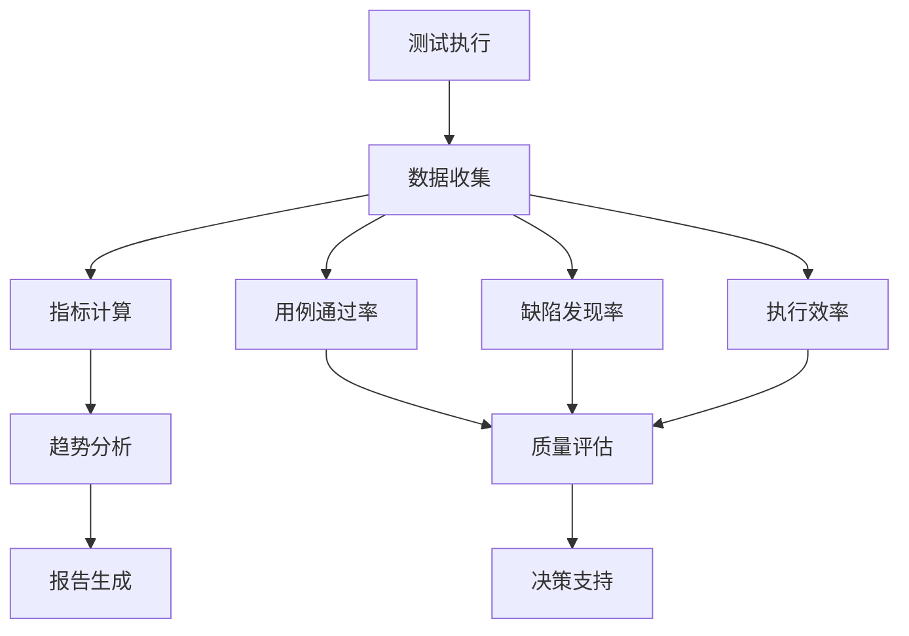

# 第9章 测试管理增强

## 9.1 测试计划制定

### 9.1.1 AI辅助测试计划制定操作步骤

**步骤1：测试需求分析**

```text
提示词模板：
```text
"基于以下项目信息，制定测试计划：
项目名称：[项目名称]
功能模块：[功能模块列表]
用户故事：[用户故事列表]
技术架构：[技术架构描述]
质量要求：[质量标准和指标]
时间约束：[测试时间安排]
资源约束：[人员和环境限制]

请生成：
1. 测试范围和策略
2. 测试类型和方法
3. 测试环境需求
4. 测试进度安排
5. 风险评估和应对措施"
```

**步骤2：测试用例设计**

```text
提示词模板：
```text
"为以下功能设计测试用例：
功能描述：[功能详细描述]
验收标准：[验收标准列表]
业务规则：[业务规则说明]
输入输出：[输入输出规范]
异常场景：[异常情况描述]

请生成：
1. 正常流程测试用例
2. 边界值测试用例
3. 异常流程测试用例
4. 性能测试用例
5. 安全测试用例"
```

**步骤3：测试数据准备**

```text
提示词模板：
```text
"为测试用例准备测试数据：
测试场景：[测试场景描述]
数据模型：[数据模型定义]
业务规则：[数据约束规则]
测试覆盖：[需要覆盖的测试点]

请生成：
1. 有效数据集
2. 边界数据集
3. 无效数据集
4. 性能测试数据集
5. 数据准备脚本"
```

### 9.1.2 实践案例：电商订单系统测试计划

**项目背景：** 为电商平台的订单管理系统制定全面的测试计划。

**AI辅助测试计划制定过程：**

**第一步：测试需求分析**

```text
输入提示词：
"基于以下电商订单系统信息，制定测试计划：
项目名称：电商订单管理系统
功能模块：订单创建、订单查询、订单修改、订单取消、支付处理、库存管理
用户故事：
- 作为买家，我希望能够创建订单并完成支付
- 作为买家，我希望能够查询和管理我的订单
- 作为商家，我希望能够处理订单和管理库存

技术架构：Spring Boot + MySQL + Redis + RabbitMQ
质量要求：响应时间<2秒，可用性99.9%，支持1000并发用户
时间约束：4周测试周期
资源约束：3名测试工程师，2套测试环境"
```

**AI输出：**

## 9.2 测试概述

### 9.2.1 测试目标

- 验证订单管理系统功能的正确性和完整性
- 确保系统性能满足业务要求
- 验证系统的可靠性和稳定性
- 确保数据安全和用户隐私保护

### 9.2.2 测试范围

**包含范围：**
- 订单生命周期管理（创建、查询、修改、取消）
- 支付流程集成测试
- 库存管理功能
- 用户权限和数据安全
- 系统性能和并发处理
- API接口功能和安全性

**排除范围：**
- 第三方支付平台内部逻辑
- 物流系统集成（仅测试接口调用）
- 移动端UI测试（本期仅测试API）

## 9.3 测试策略

### 9.3.1 测试层次

<div class="chart-container">

```mermaid
pyramid
    title 测试金字塔
    "E2E测试 (10%)" : 5
    "集成测试 (20%)" : 15  
    "单元测试 (70%)" : 35
```

</div>

### 9.3.2 测试类型

| 测试类型 | 覆盖范围           | 执行方式    | 责任人         |
| -------- | ------------------ | ----------- | -------------- |
| 单元测试 | 所有业务逻辑方法   | 自动化      | 开发工程师     |
| 集成测试 | 模块间接口         | 自动化      | 测试工程师     |
| 系统测试 | 完整业务流程       | 手动+自动化 | 测试工程师     |
| 性能测试 | 关键业务场景       | 自动化      | 性能测试工程师 |
| 安全测试 | 认证授权、数据保护 | 手动+工具   | 安全测试工程师 |

## 9.4 测试环境

### 9.4.1 环境配置

| 环境名称   | 用途     | 配置       | 数据         |
| ---------- | -------- | ---------- | ------------ |
| 开发环境   | 开发自测 | 单机部署   | 开发测试数据 |
| 测试环境   | 功能测试 | 集群部署   | 标准测试数据 |
| 预生产环境 | 性能测试 | 生产级配置 | 生产级数据量 |

### 9.4.2 测试数据策略

- **基础数据：** 用户、商品、商家等主数据
- **业务数据：** 订单、支付、库存等业务数据
- **性能数据：** 大量模拟数据用于性能测试
- **异常数据：** 边界值和异常情况数据

## 9.5 测试进度安排

| 阶段  | 活动         | 工期 | 交付物       |
| ----- | ------------ | ---- | ------------ |
| 第1周 | 测试用例设计 | 5天  | 测试用例文档 |
| 第2周 | 测试环境搭建 | 3天  | 测试环境     |
| -     | 测试数据准备 | 2天  | 测试数据集   |
| 第3周 | 功能测试执行 | 5天  | 测试报告     |
| 第4周 | 性能测试执行 | 3天  | 性能测试报告 |
| -     | 缺陷修复验证 | 2天  | 缺陷报告     |

## 9.6 风险评估

| 风险项           | 影响程度 | 发生概率 | 应对措施                   |
| ---------------- | -------- | -------- | -------------------------- |
| 测试环境不稳定   | 高       | 中       | 准备备用环境，建立环境监控 |
| 第三方服务不可用 | 中       | 低       | 使用Mock服务，准备降级方案 |
| 测试数据不充分   | 中       | 中       | 提前准备，建立数据生成工具 |
| 人员技能不足     | 低       | 低       | 提供培训，安排技术支持     |

## 9.7 成功标准

- 功能测试用例通过率 ≥ 95%
- 性能测试指标达标率 100%
- 严重缺陷数量 = 0
- 一般缺陷数量 ≤ 5
- 测试覆盖率 ≥ 80%

**第二步：详细测试用例设计**

```text
输入提示词：
"为订单创建功能设计测试用例：
功能描述：用户可以选择商品，填写收货信息，创建订单
验收标准：
1. 用户选择商品后可以进入订单确认页面
2. 用户填写收货信息后可以提交订单
3. 系统验证库存充足后创建订单
4. 订单创建成功后返回订单号

业务规则：
- 商品库存必须充足
- 收货信息必须完整
- 订单金额必须正确计算
- 支持优惠券和积分抵扣"
```

**AI输出：**

## 9.8 订单创建功能测试用例

### 9.8.1 TC001: 正常订单创建流程

**测试目标：** 验证用户能够成功创建订单

**前置条件：** 
- 用户已登录
- 商品库存充足
- 用户有有效收货地址

**测试步骤：**
1. 用户选择商品并添加到购物车
2. 点击"去结算"按钮
3. 选择收货地址
4. 选择支付方式
5. 点击"提交订单"按钮

**预期结果：**
- 系统显示订单确认页面
- 订单金额计算正确
- 成功创建订单并返回订单号
- 库存相应减少
- 用户收到订单创建通知

**测试数据：**
```json
{
  "products": [
    {
      "productId": 67890,
      "quantity": 2,
      "price": 99.99
    }
  ],
  "shippingAddress": {
    "name": "张三",
    "phone": "13800138000",
    "address": "北京市朝阳区xxx街道xxx号"
  },
  "paymentMethod": "ALIPAY"
}
```

### 9.8.2 TC002: 库存不足场景

**测试目标：** 验证库存不足时的处理逻辑

**前置条件：** 
- 用户已登录
- 商品库存不足

**测试步骤：**
1. 用户选择库存不足的商品
2. 设置购买数量超过库存
3. 点击"提交订单"按钮

**预期结果：**
- 系统提示"库存不足"错误信息
- 订单创建失败
- 库存数量不变
- 建议用户修改购买数量

### 9.8.3 TC003: 边界值测试 - 最大订单金额

**测试目标：** 验证系统对大额订单的处理

**前置条件：** 
- 用户已登录
- 用户账户余额充足

**测试步骤：**
1. 创建金额为系统最大限额的订单
2. 提交订单

**预期结果：**
- 系统正常处理大额订单
- 订单状态正确
- 金额计算准确

**测试数据：**
- 订单金额：99,999.99元（系统最大限额）

### 9.8.4 TC004: 异常测试 - 无效收货地址

**测试目标：** 验证无效收货地址的处理

**前置条件：** 
- 用户已登录

**测试步骤：**
1. 选择商品进入订单确认页面
2. 输入无效的收货地址信息
3. 提交订单

**预期结果：**
- 系统验证收货地址格式
- 提示地址信息错误
- 订单创建失败

**测试数据：**
```json
{
  "shippingAddress": {
    "name": "",
    "phone": "invalid_phone",
    "address": ""
  }
}
```

### 9.8.5 TC005: 性能测试 - 并发订单创建

**测试目标：** 验证系统并发处理订单的能力

**测试条件：** 
- 1000个并发用户
- 每个用户创建1个订单

**测试步骤：**
1. 启动1000个并发线程
2. 每个线程模拟用户创建订单
3. 记录响应时间和成功率

**预期结果：**
- 平均响应时间 < 2秒
- 成功率 > 99%
- 系统无崩溃或异常
- 数据一致性正确

## 9.9 自动化测试实现

### 9.9.1 API自动化测试

**提示词模板：**
```text

```text
"为以下API接口生成自动化测试脚本：
接口信息：
- 接口名称：[接口名称]
- 请求方法：[GET/POST/PUT/DELETE]
- 请求路径：[API路径]
- 请求参数：[参数列表]
- 响应格式：[响应结构]
- 业务逻辑：[业务逻辑描述]

测试框架：[TestNG/JUnit/pytest]
编程语言：[Java/Python/JavaScript]

请生成：
1. 测试类框架
2. 测试数据准备方法
3. 正常流程测试方法
4. 异常流程测试方法
5. 断言验证逻辑"
```

### 9.9.2 UI自动化测试

**提示词模板：**
```text

```text
"为以下Web页面生成UI自动化测试脚本：
页面信息：
- 页面名称：[页面名称]
- 页面URL：[页面地址]
- 主要元素：[元素列表]
- 用户操作：[操作流程]
- 验证点：[验证内容]

测试框架：Selenium WebDriver
编程语言：[Java/Python]

请生成：
1. 页面对象模型(POM)
2. 测试用例类
3. 元素定位方法
4. 用户操作方法
5. 结果验证方法"
```

### 9.9.3 API测试实践案例

**输入提示词：**

```text
"为用户登录API生成自动化测试脚本：
接口信息：
- 接口名称：用户登录
- 请求方法：POST
- 请求路径：/api/v1/auth/login
- 请求参数：username(string), password(string)
- 响应格式：{code: int, message: string, data: {token: string, user: object}}
- 业务逻辑：验证用户名密码，成功返回JWT token

测试框架：TestNG
编程语言：Java

请生成完整的测试脚本"
```

**AI输出：**
```text
import org.testng.annotations.*;
import io.restassured.RestAssured;
import io.restassured.response.Response;
import com.fasterxml.jackson.databind.ObjectMapper;
import java.util.HashMap;
import java.util.Map;

public class UserLoginApiTest {
    
    private static final String BASE_URL = "http://localhost:8080";
    private static final String LOGIN_ENDPOINT = "/api/v1/auth/login";
    private ObjectMapper objectMapper;
    
    @BeforeClass
    public void setUp() {
        RestAssured.baseURI = BASE_URL;
        objectMapper = new ObjectMapper();
    }
    
    @Test(description = "测试用户登录成功场景")
    public void testLoginSuccess() {
        // 准备测试数据
        Map<String, String> loginRequest = new HashMap<>();
        loginRequest.put("username", "testuser");
        loginRequest.put("password", "password123");
        
        // 发送登录请求
        Response response = RestAssured
            .given()
                .contentType("application/json")
                .body(loginRequest)
            .when()
                .post(LOGIN_ENDPOINT)
            .then()
                .extract().response();
        
        // 验证响应状态码
        Assert.assertEquals(response.getStatusCode(), 200, "登录请求应该返回200状态码");
        
        // 验证响应体结构
        Assert.assertTrue(response.jsonPath().get("code") != null, "响应应该包含code字段");
        Assert.assertEquals(response.jsonPath().getInt("code"), 200, "业务状态码应该为200");
        Assert.assertEquals(response.jsonPath().getString("message"), "success", "消息应该为success");
        
        // 验证返回的用户数据
        Assert.assertTrue(response.jsonPath().get("data") != null, "响应应该包含data字段");
        Assert.assertTrue(response.jsonPath().get("data.token") != null, "应该返回JWT token");
        Assert.assertTrue(response.jsonPath().get("data.user") != null, "应该返回用户信息");
        
        // 验证token格式
        String token = response.jsonPath().getString("data.token");
        Assert.assertTrue(token.startsWith("eyJ"), "JWT token应该以eyJ开头");
        Assert.assertTrue(token.split("\\.").length == 3, "JWT token应该包含3个部分");
        
        // 验证用户信息
        Assert.assertEquals(response.jsonPath().getString("data.user.username"), "testuser", "用户名应该匹配");
        Assert.assertTrue(response.jsonPath().get("data.user.id") != null, "应该返回用户ID");
    }
    
    @Test(description = "测试用户名或密码错误场景")
    public void testLoginWithInvalidCredentials() {
        Map<String, String> loginRequest = new HashMap<>();
        loginRequest.put("username", "testuser");
        loginRequest.put("password", "wrongpassword");
        
        Response response = RestAssured
            .given()
                .contentType("application/json")
                .body(loginRequest)
            .when()
                .post(LOGIN_ENDPOINT)
            .then()
                .extract().response();
        
        // 验证响应状态码
        Assert.assertEquals(response.getStatusCode(), 401, "错误凭据应该返回401状态码");
        
        // 验证错误响应
        Assert.assertEquals(response.jsonPath().getInt("code"), 401, "业务状态码应该为401");
        Assert.assertEquals(response.jsonPath().getString("message"), "用户名或密码错误", "应该返回错误消息");
        Assert.assertTrue(response.jsonPath().get("data") == null, "错误情况下不应该返回data");
    }
    
    @Test(description = "测试缺少必填参数场景", dataProvider = "invalidLoginData")
    public void testLoginWithMissingParameters(Map<String, String> loginData, String expectedMessage) {
        Response response = RestAssured
            .given()
                .contentType("application/json")
                .body(loginData)
            .when()
                .post(LOGIN_ENDPOINT)
            .then()
                .extract().response();
        
        Assert.assertEquals(response.getStatusCode(), 400, "缺少参数应该返回400状态码");
        Assert.assertEquals(response.jsonPath().getInt("code"), 400, "业务状态码应该为400");
        Assert.assertTrue(response.jsonPath().getString("message").contains(expectedMessage), 
            "错误消息应该包含: " + expectedMessage);
    }
    
    @DataProvider(name = "invalidLoginData")
    public Object[][] getInvalidLoginData() {
        return new Object[][] {
            {createLoginRequest(null, "password123"), "用户名不能为空"},
            {createLoginRequest("", "password123"), "用户名不能为空"},
            {createLoginRequest("testuser", null), "密码不能为空"},
            {createLoginRequest("testuser", ""), "密码不能为空"},
            {new HashMap<>(), "用户名不能为空"}
        };
    }
    
    @Test(description = "测试SQL注入攻击防护")
    public void testSqlInjectionProtection() {
        Map<String, String> loginRequest = new HashMap<>();
        loginRequest.put("username", "admin' OR '1'='1");
        loginRequest.put("password", "password");
        
        Response response = RestAssured
            .given()
                .contentType("application/json")
                .body(loginRequest)
            .when()
                .post(LOGIN_ENDPOINT)
            .then()
                .extract().response();
        
        // 应该返回认证失败，而不是成功登录
        Assert.assertEquals(response.getStatusCode(), 401, "SQL注入攻击应该被阻止");
        Assert.assertEquals(response.jsonPath().getInt("code"), 401, "业务状态码应该为401");
    }
    
    @Test(description = "测试登录接口性能")
    public void testLoginPerformance() {
        Map<String, String> loginRequest = new HashMap<>();
        loginRequest.put("username", "testuser");
        loginRequest.put("password", "password123");
        
        long startTime = System.currentTimeMillis();
        
        Response response = RestAssured
            .given()
                .contentType("application/json")
                .body(loginRequest)
            .when()
                .post(LOGIN_ENDPOINT)
            .then()
                .extract().response();
        
        long endTime = System.currentTimeMillis();
        long responseTime = endTime - startTime;
        
        Assert.assertEquals(response.getStatusCode(), 200, "登录应该成功");
        Assert.assertTrue(responseTime < 2000, "登录响应时间应该小于2秒，实际: " + responseTime + "ms");
    }
    
    @Test(description = "测试并发登录")
    public void testConcurrentLogin() throws InterruptedException {
        int threadCount = 10;
        Thread[] threads = new Thread[threadCount];
        boolean[] results = new boolean[threadCount];
        
        for (int i = 0; i < threadCount; i++) {
            final int index = i;
            threads[i] = new Thread(() -> {
                try {
                    Map<String, String> loginRequest = new HashMap<>();
                    loginRequest.put("username", "testuser" + index);
                    loginRequest.put("password", "password123");
                    
                    Response response = RestAssured
                        .given()
                            .contentType("application/json")
                            .body(loginRequest)
                        .when()
                            .post(LOGIN_ENDPOINT)
                        .then()
                            .extract().response();
                    
                    results[index] = (response.getStatusCode() == 200);
                } catch (Exception e) {
                    results[index] = false;
                }
            });
        }
        
        // 启动所有线程
        for (Thread thread : threads) {
            thread.start();
        }
        
        // 等待所有线程完成
        for (Thread thread : threads) {
            thread.join();
        }
        
        // 验证结果
        int successCount = 0;
        for (boolean result : results) {
            if (result) successCount++;
        }
        
        Assert.assertTrue(successCount >= threadCount * 0.9, 
            "并发登录成功率应该大于90%，实际: " + (successCount * 100.0 / threadCount) + "%");
    }
    
    private Map<String, String> createLoginRequest(String username, String password) {
        Map<String, String> request = new HashMap<>();
        if (username != null) request.put("username", username);
        if (password != null) request.put("password", password);
        return request;
    }
}
```

### 9.9.4 UI测试实践案例

**输入提示词：**

```text
"为用户登录页面生成UI自动化测试脚本：
页面信息：
- 页面名称：用户登录页面
- 页面URL：http://localhost:3000/login
- 主要元素：用户名输入框(#username)、密码输入框(#password)、登录按钮(#loginBtn)、错误提示(.error-message)
- 用户操作：输入用户名密码，点击登录按钮
- 验证点：登录成功跳转到首页，登录失败显示错误信息

测试框架：Selenium WebDriver
编程语言：Java"
```

**AI输出：**

```text

package com.example.test.ui;

import org.openqa.selenium.WebDriver;
import org.openqa.selenium.WebElement;
import org.openqa.selenium.support.FindBy;
import org.openqa.selenium.support.PageFactory;
import org.openqa.selenium.support.ui.WebDriverWait;
import org.openqa.selenium.support.ui.ExpectedConditions;
import java.time.Duration;

// 页面对象模型 - 登录页面
public class LoginPage {
    private WebDriver driver;
    private WebDriverWait wait;
    
    @FindBy(id = "username")
package com.example.test.ui;

import org.openqa.selenium.WebDriver;
import org.openqa.selenium.WebElement;
import org.openqa.selenium.support.FindBy;
import org.openqa.selenium.support.PageFactory;
import org.openqa.selenium.support.ui.WebDriverWait;
import org.openqa.selenium.support.ui.ExpectedConditions;
import java.time.Duration;

// 页面对象模型 - 登录页面
public class LoginPage {
    private WebDriver driver;
    private WebDriverWait wait;
    
    @FindBy(id = "username")
    private WebElement usernameInput;
    
    @FindBy(id = "password")
    private WebElement passwordInput;
    
    @FindBy(id = "loginBtn")
    private WebElement loginButton;
    
    @FindBy(className = "error-message")
    private WebElement errorMessage;
    
    @FindBy(className = "loading")
    private WebElement loadingIndicator;
    
    public LoginPage(WebDriver driver) {
        this.driver = driver;
        this.wait = new WebDriverWait(driver, Duration.ofSeconds(10));
        PageFactory.initElements(driver, this);
    }
    
    public void navigateToLoginPage() {
        driver.get("http://localhost:3000/login");
        wait.until(ExpectedConditions.visibilityOf(usernameInput));
    }
    
    public void enterUsername(String username) {
        wait.until(ExpectedConditions.elementToBeClickable(usernameInput));
        usernameInput.clear();
        usernameInput.sendKeys(username);
    }
    
    public void enterPassword(String password) {
        wait.until(ExpectedConditions.elementToBeClickable(passwordInput));
        passwordInput.clear();
        passwordInput.sendKeys(password);
    }
    
    public void clickLoginButton() {
        wait.until(ExpectedConditions.elementToBeClickable(loginButton));
        loginButton.click();
    }
    
    public void login(String username, String password) {
        enterUsername(username);
        enterPassword(password);
        clickLoginButton();
    }
    
    public boolean isErrorMessageDisplayed() {
        try {
            wait.until(ExpectedConditions.visibilityOf(errorMessage));
            return errorMessage.isDisplayed();
        } catch (Exception e) {
            return false;
        }
    }
    
    public String getErrorMessage() {
        if (isErrorMessageDisplayed()) {
            return errorMessage.getText();
        }
        return "";
    }
    
    public boolean isLoadingIndicatorVisible() {
        try {
            return loadingIndicator.isDisplayed();
        } catch (Exception e) {
            return false;
        }
    }
    
    public void waitForLoginToComplete() {
        // 等待加载指示器消失
        wait.until(ExpectedConditions.invisibilityOf(loadingIndicator));
    }
    
    public String getCurrentUrl() {
        return driver.getCurrentUrl();
    }
    
    public String getPageTitle() {
        return driver.getTitle();
    }
}

// 首页页面对象
public class HomePage {
    private WebDriver driver;
    private WebDriverWait wait;
    
    @FindBy(className = "welcome-message")
    private WebElement welcomeMessage;
    
    @FindBy(id = "userMenu")
    private WebElement userMenu;
    
    @FindBy(id = "logoutBtn")
    private WebElement logoutButton;
    
    public HomePage(WebDriver driver) {
        this.driver = driver;
        this.wait = new WebDriverWait(driver, Duration.ofSeconds(10));
        PageFactory.initElements(driver, this);
    }
    
    public boolean isWelcomeMessageDisplayed() {
        try {
            wait.until(ExpectedConditions.visibilityOf(welcomeMessage));
            return welcomeMessage.isDisplayed();
        } catch (Exception e) {
            return false;
        }
    }
    
    public String getWelcomeMessage() {
        if (isWelcomeMessageDisplayed()) {
            return welcomeMessage.getText();
        }
        return "";
    }
    
    public boolean isUserMenuDisplayed() {
        try {
            wait.until(ExpectedConditions.visibilityOf(userMenu));
            return userMenu.isDisplayed();
        } catch (Exception e) {
            return false;
        }
    }
}

// 测试用例类
package com.example.test.ui;

import org.openqa.selenium.WebDriver;
import org.openqa.selenium.chrome.ChromeDriver;
import org.openqa.selenium.chrome.ChromeOptions;
import org.testng.Assert;
import org.testng.annotations.AfterMethod;
import org.testng.annotations.BeforeMethod;
import org.testng.annotations.DataProvider;
import org.testng.annotations.Test;
import java.time.Duration;

public class LoginUITest {
    private WebDriver driver;
    private LoginPage loginPage;
    private HomePage homePage;
    
    @BeforeMethod
    public void setUp() {
        // 配置Chrome选项
        ChromeOptions options = new ChromeOptions();
        options.addArguments("--headless"); // 无头模式，适合CI/CD
        options.addArguments("--no-sandbox");
        options.addArguments("--disable-dev-shm-usage");
        options.addArguments("--window-size=1920,1080");
        
        driver = new ChromeDriver(options);
        driver.manage().timeouts().implicitlyWait(Duration.ofSeconds(10));
        driver.manage().window().maximize();
        
        loginPage = new LoginPage(driver);
        homePage = new HomePage(driver);
    }
    
    @AfterMethod
    public void tearDown() {
        if (driver != null) {
            driver.quit();
        }
    }
    
    @Test(description = "测试用户登录成功场景")
    public void testLoginSuccess() {
        // 导航到登录页面
        loginPage.navigateToLoginPage();
        
        // 执行登录操作
        loginPage.login("testuser", "password123");
        
        // 等待登录完成
        loginPage.waitForLoginToComplete();
        
        // 验证跳转到首页
        Assert.assertTrue(loginPage.getCurrentUrl().contains("/dashboard"), 
            "登录成功后应该跳转到首页");
        
        // 验证首页元素
        Assert.assertTrue(homePage.isWelcomeMessageDisplayed(), 
            "首页应该显示欢迎信息");
        Assert.assertTrue(homePage.isUserMenuDisplayed(), 
            "首页应该显示用户菜单");
        
        // 验证欢迎信息内容
        String welcomeText = homePage.getWelcomeMessage();
        Assert.assertTrue(welcomeText.contains("testuser"), 
            "欢迎信息应该包含用户名");
    }
    
    @Test(description = "测试用户登录失败场景", dataProvider = "invalidCredentials")
    public void testLoginFailure(String username, String password, String expectedError) {
        loginPage.navigateToLoginPage();
        loginPage.login(username, password);
        
        // 验证错误信息显示
        Assert.assertTrue(loginPage.isErrorMessageDisplayed(), 
            "登录失败应该显示错误信息");
        
        String actualError = loginPage.getErrorMessage();
        Assert.assertTrue(actualError.contains(expectedError), 
            "错误信息应该包含: " + expectedError + "，实际: " + actualError);
        
        // 验证仍在登录页面
        Assert.assertTrue(loginPage.getCurrentUrl().contains("/login"), 
            "登录失败应该仍在登录页面");
    }
    
    @DataProvider(name = "invalidCredentials")
    public Object[][] getInvalidCredentials() {
        return new Object[][] {
            {"wronguser", "password123", "用户名或密码错误"},
            {"testuser", "wrongpassword", "用户名或密码错误"},
            {"", "password123", "用户名不能为空"},
            {"testuser", "", "密码不能为空"}
        };
    }
    
    @Test(description = "测试登录页面UI元素")
    public void testLoginPageElements() {
        loginPage.navigateToLoginPage();
        
        // 验证页面标题
        Assert.assertEquals(loginPage.getPageTitle(), "用户登录", 
            "登录页面标题应该正确");
        
        // 验证输入框可见性和可操作性
        loginPage.enterUsername("test");
        loginPage.enterPassword("test");
        
        // 验证登录按钮可点击
        Assert.assertTrue(driver.findElement(By.id("loginBtn")).isEnabled(), 
            "登录按钮应该可点击");
    }
    
    @Test(description = "测试登录响应时间")
    public void testLoginResponseTime() {
        loginPage.navigateToLoginPage();
        
        long startTime = System.currentTimeMillis();
        loginPage.login("testuser", "password123");
        loginPage.waitForLoginToComplete();
        long endTime = System.currentTimeMillis();
        
        long responseTime = endTime - startTime;
        Assert.assertTrue(responseTime < 5000, 
            "登录响应时间应该小于5秒，实际: " + responseTime + "ms");
    }
    
    @Test(description = "测试登录页面在不同浏览器尺寸下的响应式设计")
    public void testResponsiveDesign() {
        // 测试移动端尺寸
        driver.manage().window().setSize(new Dimension(375, 667));
        loginPage.navigateToLoginPage();
        
        // 验证元素在小屏幕下仍然可见和可操作
        Assert.assertTrue(driver.findElement(By.id("username")).isDisplayed(), 
            "用户名输入框在移动端应该可见");
        Assert.assertTrue(driver.findElement(By.id("password")).isDisplayed(), 
            "密码输入框在移动端应该可见");
        Assert.assertTrue(driver.findElement(By.id("loginBtn")).isDisplayed(), 
            "登录按钮在移动端应该可见");
        
        // 测试桌面端尺寸
        driver.manage().window().setSize(new Dimension(1920, 1080));
        
        // 验证元素在大屏幕下的布局
        loginPage.login("testuser", "password123");
        loginPage.waitForLoginToComplete();
        
        Assert.assertTrue(loginPage.getCurrentUrl().contains("/dashboard"), 
            "在桌面端登录应该成功");
    }
}
```

## 9.10 测试环境配置

### 9.10.1 Maven项目配置

```xml
<!-- pom.xml - Maven配置 -->
<project>
    <properties>
        <maven.compiler.source>11</maven.compiler.source>
        <maven.compiler.target>11</maven.compiler.target>
        <testng.version>7.4.0</testng.version>
        <selenium.version>4.11.0</selenium.version>
        <rest-assured.version>5.3.0</rest-assured.version>
        <allure.version>2.20.1</allure.version>
    </properties>
    
    <dependencies>
        <!-- TestNG -->
        <dependency>
            <groupId>org.testng</groupId>
            <artifactId>testng</artifactId>
            <version>${testng.version}</version>
            <scope>test</scope>
        </dependency>
        
        <!-- Selenium WebDriver -->
        <dependency>
            <groupId>org.seleniumhq.selenium</groupId>
            <artifactId>selenium-java</artifactId>
            <version>${selenium.version}</version>
        </dependency>
        
        <!-- REST Assured -->
        <dependency>
            <groupId>io.rest-assured</groupId>
            <artifactId>rest-assured</artifactId>
            <version>${rest-assured.version}</version>
            <scope>test</scope>
        </dependency>
        
        <!-- Allure报告 -->
        <dependency>
            <groupId>io.qameta.allure</groupId>
            <artifactId>allure-testng</artifactId>
            <version>${allure.version}</version>
            <scope>test</scope>
        </dependency>
        
        <!-- 数据库测试支持 -->
        <dependency>
            <groupId>com.h2database</groupId>
            <artifactId>h2</artifactId>
            <version>2.1.214</version>
            <scope>test</scope>
        </dependency>
        
        <!-- JSON处理 -->
        <dependency>
            <groupId>com.fasterxml.jackson.core</groupId>
            <artifactId>jackson-databind</artifactId>
            <version>2.15.2</version>
        </dependency>
    </dependencies>
    
    <build>
        <plugins>
            <!-- Surefire插件 - 运行测试 -->
            <plugin>
                <groupId>org.apache.maven.plugins</groupId>
                <artifactId>maven-surefire-plugin</artifactId>
                <version>3.0.0</version>
                <configuration>
                    <suiteXmlFiles>
                        <suiteXmlFile>src/test/resources/testng.xml</suiteXmlFile>
                    </suiteXmlFiles>
                    <argLine>
                        -javaagent:"${settings.localRepository}/org/aspectj/aspectjweaver/1.9.19/aspectjweaver-1.9.19.jar"
                    </argLine>
                </configuration>
                <dependencies>
                    <dependency>
                        <groupId>org.aspectj</groupId>
                        <artifactId>aspectjweaver</artifactId>
                        <version>1.9.19</version>
                    </dependency>
                </dependencies>
            </plugin>
            
            <!-- Allure报告插件 -->
            <plugin>
                <groupId>io.qameta.allure</groupId>
                <artifactId>allure-maven</artifactId>
                <version>2.12.0</version>
                <configuration>
                    <reportVersion>${allure.version}</reportVersion>
                </configuration>
            </plugin>
        </plugins>
    </build>
</project>
```

### 9.10.2 TestNG配置文件

```xml
<!-- testng.xml -->
<!DOCTYPE suite SYSTEM "http://testng.org/testng-1.0.dtd">
<suite name="AI-IDE测试套件" verbose="1">
    <test name="API测试">
        <classes>
            <class name="com.example.test.api.UserLoginApiTest"/>
            <class name="com.example.test.api.OrderApiTest"/>
        </classes>
    </test>
    
    <test name="UI测试">
        <classes>
            <class name="com.example.test.ui.LoginUITest"/>
        </classes>
    </test>
</suite>
```t"/>
            <class name="com.example.test.api.ProductApiTest"/>
        </classes>
    </test>
    
    <!-- UI测试 -->
<!-- src/test/resources/testng.xml -->
<!DOCTYPE suite SYSTEM "http://testng.org/testng-1.0.dtd">
<suite name="AutomationTestSuite" parallel="methods" thread-count="5">
    
    <!-- API测试 -->
    <test name="API Tests" preserve-order="true">
        <parameter name="baseUrl" value="http://localhost:8080"/>
        <parameter name="timeout" value="30"/>
        <classes>
            <class name="com.example.test.api.UserLoginApiTest"/>
            <class name="com.example.test.api.OrderApiTest"/>
            <class name="com.example.test.api.ProductApiTest"/>
        </classes>
    </test>
    
    <!-- UI测试 -->
    <test name="UI Tests" preserve-order="true">
        <parameter name="browser" value="chrome"/>
        <parameter name="headless" value="true"/>
        <parameter name="baseUrl" value="http://localhost:3000"/>
        <classes>
            <class name="com.example.test.ui.LoginUITest"/>
            <class name="com.example.test.ui.OrderUITest"/>
        </classes>
    </test>
    
    <!-- 数据库测试 -->
    <test name="Database Tests">
        <parameter name="dbUrl" value="jdbc:h2:mem:testdb"/>
        <classes>
            <class name="com.example.test.db.UserRepositoryTest"/>
            <class name="com.example.test.db.OrderRepositoryTest"/>
        </classes>
    </test>
    
    <!-- 性能测试 -->
    <test name="Performance Tests">
        <parameter name="loadUsers" value="100"/>
        <parameter name="rampUpTime" value="60"/>
        <classes>
            <class name="com.example.test.performance.LoginPerformanceTest"/>
        </classes>
    </test>
    
</suite>
    
    private TestConfig() {
        loadProperties();
    }
    
    public static TestConfig getInstance() {
// 测试配置管理类
package com.example.test.config;

import java.io.IOException;
import java.io.InputStream;
import java.util.Properties;

public class TestConfig {
    private static TestConfig instance;
    private Properties properties;
    
    private TestConfig() {
        loadProperties();
    }
    
    public static TestConfig getInstance() {
        if (instance == null) {
            synchronized (TestConfig.class) {
                if (instance == null) {
                    instance = new TestConfig();
                }
            }
        }
        return instance;
    }
    
    private void loadProperties() {
        properties = new Properties();
        try (InputStream input = getClass().getClassLoader()
                .getResourceAsStream("test.properties")) {
            if (input != null) {
                properties.load(input);
            }
        } catch (IOException e) {
            throw new RuntimeException("Failed to load test properties", e);
        }
        
        // 从环境变量覆盖配置
        String env = System.getProperty("test.env", "local");
        try (InputStream envInput = getClass().getClassLoader()
                .getResourceAsStream("test-" + env + ".properties")) {
            if (envInput != null) {
                Properties envProperties = new Properties();
                envProperties.load(envInput);
                properties.putAll(envProperties);
            }
        } catch (IOException e) {
            // 环境特定配置文件不存在时忽略
        }
    }
    
    public String getProperty(String key) {
        return System.getProperty(key, properties.getProperty(key));
    }
    
    public String getProperty(String key, String defaultValue) {
        return System.getProperty(key, properties.getProperty(key, defaultValue));
    }
    
    public int getIntProperty(String key, int defaultValue) {
        String value = getProperty(key);
        return value != null ? Integer.parseInt(value) : defaultValue;
    }
    
    public boolean getBooleanProperty(String key, boolean defaultValue) {
        String value = getProperty(key);
        return value != null ? Boolean.parseBoolean(value) : defaultValue;
    }
    
    // 常用配置的便捷方法
    public String getBaseUrl() {
        return getProperty("base.url", "http://localhost:8080");
    }
    
    public String getWebBaseUrl() {
        return getProperty("web.base.url", "http://localhost:3000");
    }
    
    public String getBrowser() {
        return getProperty("browser", "chrome");
    }
    
    public boolean isHeadless() {
        return getBooleanProperty("headless", true);
    }
    
    public int getTimeout() {
        return getIntProperty("timeout", 30);
    }
    
    public String getDatabaseUrl() {
        return getProperty("db.url", "jdbc:h2:mem:testdb");
    }
    
    public String getDatabaseUsername() {
        return getProperty("db.username", "sa");
    }
    
    public String getDatabasePassword() {
        return getProperty("db.password", "");
    }
}
browser=chrome
headless=true
window.width=1920
window.height=1080

## 第9章 数据库配置

## 第9章 src/test/resources/test.properties

## 第9章 基础配置

base.url=http://localhost:8080
web.base.url=http://localhost:3000
timeout=30

## 第9章 浏览器配置

browser=chrome
headless=true
window.width=1920
window.height=1080

## 第9章 数据库配置 2

db.url=jdbc:h2:mem:testdb
db.username=sa
db.password=
db.driver=org.h2.Driver

## 第9章 测试数据配置

test.data.path=src/test/resources/testdata
test.reports.path=target/test-reports

## 第9章 并发配置

thread.count=5
retry.count=2

## 第9章 日志配置

log.level=INFO
log.file=target/test.log

```properties

## 第9章 src/test/resources/test-staging.properties
## 第9章 src/test/resources/test-staging.properties

## 第9章 预生产环境配置

## 第9章 src/test/resources/test-dev.properties

## 第9章 开发环境配置

base.url=http://dev-api.example.com
web.base.url=http://dev.example.com
db.url=jdbc:mysql://dev-db.example.com:3306/testdb
db.username=testuser
db.password=testpass

## 9.3 测试执行与缺陷跟踪

## 第9章 src/test/resources/test-staging.properties

## 9.3 测试执行与缺陷跟踪 2

## 第9章 src/test/resources/test-staging.properties 2

## 第9章 预生产环境配置

base.url=http://staging-api.example.com
web.base.url=http://staging.example.com
db.url=jdbc:mysql://staging-db.example.com:3306/testdb
db.username=testuser
db.password=testpass
headless=true
thread.count=10
测试用例：[测试用例描述]
执行环境：[环境信息]
重现步骤：[操作步骤]


请提供：
1. 缺陷类型分类（功能/性能/安全/兼容性等）
2. 严重程度评估（严重/一般/轻微）
3. 可能的根因分析
4. 修复优先级建议
5. 相关模块影响评估"

错误信息：[错误日志]
测试用例：[测试用例描述]
执行环境：[环境信息]
重现步骤：[操作步骤]


请提供：
1. 缺陷类型分类（功能/性能/安全/兼容性等）
2. 严重程度评估（严重/一般/轻微）
3. 可能的根因分析
4. 修复优先级建议
5. 相关模块影响评估"
6. 问题的直接原因
7. 问题的根本原因
8. 为什么问题没有被提前发现
9. 如何防止类似问题再次发生
10. 修复建议和验证方案"

```text
提示词模板：
```text
"基于以下缺陷信息进行根因分析：
缺陷描述：[缺陷详细描述]
提示词模板：
```text
"
```基于以下缺陷信息进行根因分析：
缺陷描述：[缺陷详细描述]
错误堆栈：[错误堆栈信息]
系统日志：[相关系统日志]
提示词模板：
```text
"基于以下缺陷信息进行根因分析：
缺陷描述：[缺陷详细描述]
错误堆栈：[错误堆栈信息]
系统日志：[相关系统日志]
代码变更：[最近的代码变更]
环境信息：[运行环境详情]

请分析：
51. 问题的直接原因
52. 问题的根本原因
53. 为什么问题没有被提前发现
54. 如何防止类似问题再次发生
55. 修复建议和验证方案"
```
58. 数据安全影响

59. 系统稳定性影响
60. 业务流程影响"

"评估以下缺陷的影响范围：
缺陷详情：[缺陷信息]
涉及模块：[相关模块]
用户场景：[影响的用户场景]
数据影响：[数据完整性影响]

请评估：
1. 功能影响范围
2. 用户体验影响
3. 数据安全影响
4. 系统稳定性影响
5. 业务流程影响"
发现环境：生产环境

错误日志：
2024-01-15 14:30:25 ERROR [payment-service] PaymentCallbackHandler - 
Failed to update order status: Connection timeout
java.sql.SQLException: Connection is not available, request timed out after 30000ms.
    at com.zaxxer.hikari.pool.HikariPool.createTimeoutException(HikariPool.java:695)
    at com.zaxxer.hikari.pool.HikariPool.getConnection(HikariPool.java:197)
    at com.example.service.OrderService.updateOrderStatus(OrderService.java:156)
**第二步：AI辅助分析**

缺陷标题：支付成功后订单状态未更新
缺陷描述：用户完成支付后，第三方支付平台返回成功状态，但订单状态仍显示"待支付"
**第二步：AI辅助分析**

缺陷标题：支付成功后订单状态未更新
缺陷描述：用户完成支付后，第三方支付平台返回成功状态，但订单状态仍显示"待支付"
重现概率：约5%的支付订单
影响用户：所有进行在线支付的用户
发现环境：生产环境

错误日志：
2024-01-15 14:30:25 ERROR [payment-service] PaymentCallbackHandler - 
Failed to update order status: Connection timeout
java.sql.SQLException: Connection is not available, request timed out after 30000ms.
    at com.zaxxer.hikari.pool.HikariPool.createTimeoutException(HikariPool.java:695)
    at com.zaxxer.hikari.pool.HikariPool.getConnection(HikariPool.java:197)
    at com.example.service.OrderService.updateOrderStatus(OrderService.java:156)

请进行全面分析"

AI输出：
测试用例：用户支付订单流程测试

执行环境：生产环境，高并发场景
重现步骤：
1. 用户选择商品创建订单
2. 选择第三方支付方式
3. 完成支付操作
4. 第三方支付平台回调通知支付成功
5. 系统处理回调时数据库连接超时
6. 订单状态未能更新为"已支付"

请进行全面分析"

AI输出：

## 9.27.2 2.2 根本原因分析


<div class="chart-container">

```mermaid
fishbone
    title 支付状态更新失败根因分析
    
fishbone
    title 支付状态更新失败根因分析
    
    "数据库连接问题" : {
        "连接池配置不当": ["最大连接数过小", "连接超时时间过短"],
        "连接泄露": ["未正确关闭连接", "长时间占用连接"],
        "数据库性能": ["慢查询", "锁等待"]
fishbone
    title 支付状态更新失败根因分析
    
    "数据库连接问题" : {
        "连接池配置不当": ["最大连接数过小", "连接超时时间过短"],
        "连接泄露": ["未正确关闭连接", "长时间占用连接"],
        "数据库性能": ["慢查询", "锁等待"]
    }
    
    "系统设计问题" : {
        "缺乏重试机制": ["单次失败即放弃", "无指数退避策略"],
        "缺乏监控告警": ["无连接池监控", "无失败率监控"],
        "事务设计不当": ["事务时间过长", "事务隔离级别不当"]
    }
    
    "并发处理问题" : {
        "高并发冲击": ["支付高峰期", "秒杀活动"],
        "资源竞争": ["数据库锁竞争", "连接池竞争"]
    }
    
    "测试覆盖不足" : {
        "性能测试不足": ["未模拟高并发", "未测试连接池极限"],
fishbone
    title 支付状态更新失败根因分析
    
    "数据库连接问题" : {
        "连接池配置不当": ["最大连接数过小", "连接超时时间过短"],
        "连接泄露": ["未正确关闭连接", "长时间占用连接"],
        "数据库性能": ["慢查询", "锁等待"]
    }
    
    "系统设计问题" : {
        "缺乏重试机制": ["单次失败即放弃", "无指数退避策略"],
        "缺乏监控告警": ["无连接池监控", "无失败率监控"],
        "事务设计不当": ["事务时间过长", "事务隔离级别不当"]
    }
    
    "并发处理问题" : {
        "高并发冲击": ["支付高峰期", "秒杀活动"],
        "资源竞争": ["数据库锁竞争", "连接池竞争"]
    }
    
    "测试覆盖不足" : {
        "性能测试不足": ["未模拟高并发", "未测试连接池极限"],
        "异常场景测试": ["未测试数据库故障", "未测试网络异常"]
    }
### 9.28.1 业务影响

- **用户体验：** 用户支付成功但订单显示未支付，造成困惑
- **客服压力：** 增加客服咨询量，处理订单状态问题
- **资金风险：** 可能出现重复支付或资金对账问题
- **信任度：** 影响用户对平台支付系统的信任

### 9.28.2 技术影响

- **数据一致性：** 支付记录与订单状态不一致
- **系统稳定性：** 数据库连接池耗尽影响其他功能
- **运维成本：** 需要人工干预处理异常订单

### 9.28.3 影响范围评估

| 影响维度   | 影响程度 | 具体表现                   |
| ---------- | -------- | -------------------------- |
| 用户数量   | 中等     | 约5%的支付用户受影响       |
| 功能模块   | 高       | 支付、订单、库存、财务模块 |
| 数据完整性 | 高       | 支付与订单状态不一致       |
| 系统性能   | 中等     | 数据库连接池压力增大       |
| 业务流程   | 高       | 影响整个交易闭环           |

## 9.29 修复建议


### 9.29.1 短期修复（紧急）

70. **增加数据库连接池配置**
         idle-timeout: 300000  # 5分钟空闲超时
         max-lifetime: 1800000  # 30分钟最大生命周期

1. **添加重试机制**

   ```text
   @Retryable(value = {SQLException.class}, 
              maxAttempts = 3, 
71. **添加重试机制**
   @Retryable(value = {SQLException.class}, 
              maxAttempts = 3, 
71. **添加重试机制**
   }
1. **添加异步处理**

   ```text
   @Async
   public void handlePaymentCallback(PaymentCallback callback) {

   @Async
   public void handlePaymentCallback(PaymentCallback callback) {

       try {
           updateOrderStatus(callback.getOrderId(), OrderStatus.PAID);
       } catch (Exception e) {
72. **添加异步处理**
       }
   }
### 9.29.2 中期优化（1-2周）


1. **实现消息队列机制**
   - 支付回调通过MQ异步处理
   - 实现消息重试和死信队列
   - 保证最终一致性


1. **添加监控告警**
   - 数据库连接池使用率监控

### 9.29.2 中期优化（1-2周） 2

1. **实现消息队列机制**
   - 支付回调通过MQ异步处理
   - 实现消息重试和死信队列

   - 保证最终一致性

1. **添加监控告警**
   - 数据库连接池使用率监控
   - 支付回调处理成功率监控

   - 订单状态一致性检查

1. **优化数据库查询**
   - 分析慢查询并优化
   - 添加必要的索引
   - 优化事务范围

### 9.29.3 长期改进（1个月）

1. **架构优化**
   - 考虑读写分离
   - 实现分布式事务管理

   - 引入事件驱动架构

1. **测试体系完善**
   - 增加高并发测试用例
   - 实现混沌工程测试
   - 完善性能测试覆盖

## 9.30 验证方案


### 9.30.1 修复验证

1. **功能验证**
   - 正常支付流程测试
   - 异常场景恢复测试

   - 数据一致性验证

1. **性能验证**
   - 高并发支付压力测试
   - 数据库连接池压力测试

   - 系统稳定性测试

1. **监控验证**
   - 验证监控指标正常采集
   - 验证告警机制有效性
   - 验证日志记录完整性

### 9.30.2 回归测试

- 支付相关功能全面回归
- 订单管理功能回归
- 系统集成测试

## 9.31 预防措施


### 9.31.1 开发阶段

- 代码审查重点关注资源管理
- 单元测试覆盖异常场景
- 集成测试包含并发场景

### 9.31.2 测试阶段

- 性能测试必须包含数据库压力测试
- 混沌工程测试数据库故障场景
- 端到端测试验证数据一致性

### 9.31.3 运维阶段

- 完善监控告警体系
- 建立故障应急响应机制
- 定期进行系统健康检查

## 9.32 经验教训

1. **性能测试的重要性**：必须在接近生产环境的条件下进行性能测试
2. **监控体系的必要性**：完善的监控可以提前发现问题
3. **异常处理的重要性**：必须考虑各种异常场景的处理

4. **数据一致性设计**：分布式系统必须考虑最终一致性


## 9.33 基本信息

- **缺陷ID：** BUG-2024-001
- **报告人：** [测试工程师姓名]
- **报告日期：** [日期]
- **发现版本：** [软件版本]
- **测试环境：** [环境信息]

## 第9章 缺陷报告


## 9.33 基本信息 2

- **缺陷ID：** BUG-2024-001
- **报告人：** [测试工程师姓名]
- **报告日期：** [日期]
- **发现版本：** [软件版本]
- **测试环境：** [环境信息]

## 9.34 缺陷概要

- **缺陷标题：** [简洁描述缺陷]
- **缺陷类型：** □功能缺陷 □性能缺陷 □界面缺陷 □兼容性缺陷 □安全缺陷

### 9.3.3 缺陷跟踪管理模板


**缺陷报告模板：**

### 9.35.1 问题现象

[详细描述观察到的问题现象]

### 9.35.2 预期结果

[描述正确的预期行为]

### 9.35.3 实际结果

[描述实际观察到的错误行为]

## 9.36 重现信息

### 9.36.1 重现步骤

1. [步骤1]
2. [步骤2]
3. [步骤3]

...

### 9.36.2 重现条件

- **操作系统：** [OS版本]
- **浏览器：** [浏览器版本]
- **测试数据：** [使用的测试数据]
- **前置条件：** [必要的前置条件]

### 9.36.3 重现概率

□100% □经常(>50%) □偶尔(10-50%) □很少(<10%)

## 9.37 附加信息

### 9.37.1 错误日志

### 9.37.3 相关缺陷

- 相关缺陷ID：[如果有相关缺陷]
- 重复缺陷ID：[如果是重复缺陷]

## 9.38 影响评估

### 9.37.2 截图/录屏

[附加截图或录屏文件]

### 9.37.3 相关缺陷 2

- 相关缺陷ID：[如果有相关缺陷]
- 重复缺陷ID：[如果是重复缺陷]

## 9.38 影响评估 2

### 9.38.1 用户影响

[描述对最终用户的影响]

### 9.38.2 业务影响

[描述对业务流程的影响]
[粘贴相关错误日志]

[描述对系统技术层面的影响]

## 9.39 建议

### 9.39.1 修复建议

[如果有修复建议]

### 9.39.2 规避方案

[如果有临时规避方案]

## 9.40 跟踪信息

- **分配给：** [开发人员]
- **当前状态：** □新建 □已分配 □修复中 □已修复 □已验证 □已关闭
- **计划修复版本：** [版本号]
- **实际修复版本：** [版本号]

## 9.41 验证信息

- **验证人：** [验证人员]
- **验证日期：** [验证日期]
- **验证结果：** □通过 □失败
- **验证说明：** [验证过程说明]

## 9.42 关闭信息

- **关闭人：** [关闭人员]
- **关闭日期：** [关闭日期]
- **关闭原因：** □已修复 □重复缺陷 □设计如此 □无法重现 □不予修复
- **关闭说明：** [关闭原因说明]
    新建 --> 已分配 : 分配给开发人员
    新建 --> 已关闭 : 重复/无效缺陷
    
    已分配 --> 修复中 : 开发人员开始修复
    已分配 --> 已关闭 : 拒绝修复
    
    修复中 --> 已修复 : 修复完成
    修复中 --> 已分配 : 需要更多信息
    
    已修复 --> 已验证 : 验证通过
    已修复 --> 重新打开 : 验证失败
    
    重新打开 --> 已分配 : 重新分配
    
    已验证 --> 已关闭 : 确认修复
    已关闭 --> [*]
**缺陷状态流转图：**


<div class="chart-container">

```text

通过这些优化的测试管理实践，团队可以建立完善的测试体系，确保软件质量和用户体验。

通过这些优化的测试管理实践，团队可以建立完善的测试体系，确保软件质量和用户体验。

## 9.11 性能测试管理

### 9.11.1 AI辅助性能测试设计

**提示词模板：**
```text

```text
"为以下系统设计性能测试方案：
系统信息：
- 系统名称：[系统名称]
- 关键业务场景：[业务场景列表]
- 性能要求：[响应时间、吞吐量、并发用户数]
- 技术架构：[架构描述]
- 测试环境：[环境配置]

请生成：
1. 性能测试策略
2. 测试场景设计
3. 负载模型设计
4. 监控指标定义
5. 性能基线和目标"
```

### 9.11.2 性能测试脚本生成

**JMeter脚本生成示例：**

```text
输入提示词：
"为订单创建API生成JMeter性能测试脚本：
- API地址：POST /api/v1/orders
- 测试场景：1000并发用户，持续10分钟
- 性能目标：平均响应时间<2秒，成功率>99%
- 测试数据：需要动态生成订单数据"
```

**AI输出的JMeter配置：**

```xml
<?xml version="1.0" encoding="UTF-8"?>
<jmeterTestPlan version="1.2">
  <hashTree>
    <TestPlan guiclass="TestPlanGui" testclass="TestPlan" testname="订单创建性能测试">
      <elementProp name="TestPlan.arguments" elementType="Arguments" guiclass="ArgumentsPanel">
        <collectionProp name="Arguments.arguments"/>
      </elementProp>
      <stringProp name="TestPlan.user_define_classpath"></stringProp>
      <boolProp name="TestPlan.functional_mode">false</boolProp>
      <boolProp name="TestPlan.serialize_threadgroups">false</boolProp>
    </TestPlan>
    <hashTree>
      <ThreadGroup guiclass="ThreadGroupGui" testclass="ThreadGroup" testname="订单创建用户组">
        <stringProp name="ThreadGroup.on_sample_error">continue</stringProp>
        <elementProp name="ThreadGroup.main_controller" elementType="LoopController">
          <boolProp name="LoopController.continue_forever">false</boolProp>
          <intProp name="LoopController.loops">-1</intProp>
        </elementProp>
        <stringProp name="ThreadGroup.num_threads">1000</stringProp>
        <stringProp name="ThreadGroup.ramp_time">300</stringProp>
        <longProp name="ThreadGroup.start_time">1</longProp>
        <longProp name="ThreadGroup.end_time">1</longProp>
        <boolProp name="ThreadGroup.scheduler">true</boolProp>
        <stringProp name="ThreadGroup.duration">600</stringProp>
        <stringProp name="ThreadGroup.delay"></stringProp>
      </ThreadGroup>
    </hashTree>
  </hashTree>
</jmeterTestPlan>
```

## 9.12 测试报告与分析

### 9.12.1 AI辅助测试报告生成

**提示词模板：**
```text

```text
"基于以下测试结果生成测试报告：
测试概况：
- 测试项目：[项目名称]
- 测试周期：[开始日期] - [结束日期]
- 测试范围：[测试范围描述]

测试数据：
- 计划用例数：[数量]
- 执行用例数：[数量]
- 通过用例数：[数量]
- 失败用例数：[数量]
- 发现缺陷数：[数量]
- 缺陷分布：[严重程度分布]

请生成：
1. 测试执行摘要
2. 质量评估结论
3. 风险分析
4. 改进建议"
```

### 9.12.2 测试数据分析

**测试指标监控：**

<div class="chart-container">



</div>

### 9.12.3 持续改进

**测试过程优化：**

1. **自动化率提升**
   - 识别重复性测试任务
   - 优先自动化高价值用例
   - 建立自动化测试流水线

2. **测试效率优化**
   - 并行测试执行
   - 测试数据管理优化
   - 测试环境标准化

3. **质量度量改进**
   - 建立质量基线
   - 实施质量门禁
   - 持续监控和调优

## 9.13 最佳实践总结

### 9.13.1 测试计划制定最佳实践

1. **需求分析充分性**
   - 深入理解业务需求
   - 识别关键质量属性
   - 明确验收标准

2. **测试策略合理性**
   - 基于风险制定策略
   - 平衡手动和自动化
   - 考虑资源和时间约束

3. **测试覆盖完整性**
   - 功能覆盖全面
   - 非功能需求覆盖
   - 异常场景覆盖

### 9.13.2 自动化测试最佳实践

1. **框架选择**
   - 技术栈匹配
   - 团队技能考虑
   - 长期维护性

2. **脚本设计**
   - 模块化设计
   - 数据驱动
   - 可维护性优先

3. **执行管理**
   - 持续集成集成
   - 并行执行优化
   - 失败分析自动化

### 9.13.3 性能测试最佳实践

1. **测试设计**
   - 真实场景模拟
   - 渐进式负载增加
   - 多维度监控

2. **环境管理**
   - 生产环境一致性
   - 独立测试环境
   - 监控工具完备

3. **结果分析**
   - 多指标综合分析
   - 瓶颈定位准确
   - 优化建议具体

## 9.14 工具与技术栈

### 9.14.1 推荐工具组合

| 测试类型 | 推荐工具              | 适用场景 |
| -------- | --------------------- | -------- |
| 单元测试 | JUnit, TestNG         | Java项目 |
| API测试  | REST Assured, Postman | 接口测试 |
| UI测试   | Selenium, Cypress     | Web应用  |
| 性能测试 | JMeter, LoadRunner    | 负载测试 |
| 移动测试 | Appium, Espresso      | 移动应用 |

### 9.14.2 CI/CD集成

**Jenkins Pipeline示例：**

```groovy
pipeline {
    agent any
    stages {
        stage('单元测试') {
            steps {
                sh 'mvn test'
            }
        }
        stage('集成测试') {
            steps {
                sh 'mvn verify -P integration-test'
            }
        }
        stage('UI测试') {
            steps {
                sh 'mvn test -P ui-test'
            }
        }
        stage('性能测试') {
            when {
                branch 'release/*'
            }
            steps {
                sh 'jmeter -n -t performance-test.jmx'
            }
        }
    }
    post {
        always {
            publishHTML([
                allowMissing: false,
                alwaysLinkToLastBuild: true,
                keepAll: true,
                reportDir: 'target/site/allure-maven-plugin',
                reportFiles: 'index.html',
                reportName: '测试报告'
            ])
        }
    }
}
```

## 9.15 总结

本章详细介绍了AI辅助测试管理的完整流程，包括：

1. **测试计划制定** - 利用AI快速生成全面的测试计划
2. **测试用例设计** - 通过AI提示词生成高质量测试用例
3. **自动化测试实现** - AI辅助生成API和UI自动化测试脚本
4. **性能测试管理** - AI协助设计和实施性能测试方案
5. **测试报告分析** - 利用AI进行测试数据分析和报告生成

通过合理运用AI工具，测试团队可以显著提升测试效率和质量，实现更加智能化的测试管理。关键是要掌握正确的提示词技巧，结合具体的业务场景，持续优化测试过程。