# 第12章 团队培训与能力建设


## 12.1 培训体系设计与课程规划


### 12.1.1 分层次培训计划


AI IDE的成功实施需要建立完整的培训体系，针对不同角色和技能水平的团队成员提供差异化的培训方案。

#### 12.1.1.1 培训对象分层


**初级开发者层**
- 目标群体：刚接触AI IDE的开发人员、实习生、初级工程师
- 培训重点：基础操作、常用功能、安全规范
- 培训时长：40小时（1周集中培训 + 3周实践指导）

**中级开发者层**
- 目标群体：有一定开发经验的工程师、团队骨干
- 培训重点：高级功能、最佳实践、团队协作
- 培训时长：32小时（5天集中培训 + 2周项目实践）

**高级开发者层**
- 目标群体：技术专家、架构师、团队负责人
- 培训重点：架构设计、性能优化、团队管理
- 培训时长：24小时（3天集中培训 + 持续学习）

**管理层**
- 目标群体：项目经理、技术总监、决策者
- 培训重点：ROI评估、风险管控、战略规划
- 培训时长：16小时（2天集中培训）

#### 12.1.1.2 课程大纲设计


**基础课程模块（适用于所有层级）**


<div class="chart-container">
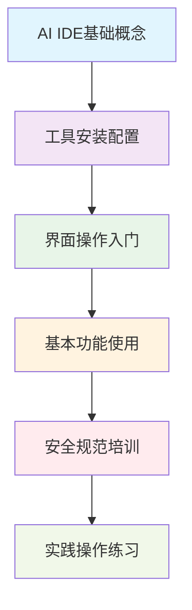

**模块1：AI IDE基础概念（4小时）**
- AI IDE发展历程与技术原理
- 主流工具对比与选型指导
- 应用场景与价值分析
- 行业最佳实践案例

**模块2：工具安装配置（4小时）**
- 环境准备与系统要求
- 工具下载与安装步骤
- 基础配置与个性化设置
- 插件管理与扩展安装

**模块3：界面操作入门（6小时）**
- 主界面布局与功能区域
- 菜单栏与工具栏使用
- 快捷键与操作技巧
- 个性化界面配置

**模块4：基本功能使用（8小时）**
- 代码生成与智能补全
- 错误检测与修复建议
- 代码重构与优化
- 文档生成与注释

**模块5：安全规范培训（4小时）**
- 数据安全与隐私保护
- 代码安全最佳实践
- 合规要求与审计准备
- 安全事件应急处理

**模块6：实践操作练习（14小时）**
- 项目创建与管理
- 实际开发场景演练
- 问题排查与解决
- 经验分享与讨论

**进阶课程模块（中高级开发者）**

**模块7：高级功能应用（8小时）**
- 复杂代码生成技巧
- 自定义提示词优化
- 多语言项目管理
- 性能监控与优化

**模块8：团队协作实践（6小时）**
- 版本控制集成
- 代码审查流程
- 团队规范制定
- 知识分享机制

**模块9：架构设计支持（6小时）**
- AI辅助架构设计
- 设计模式应用
- 技术选型决策
- 架构评审流程

**管理层专项课程**

**模块10：投资决策支持（4小时）**
- ROI计算与评估
- 成本效益分析
- 风险评估与管控
- 预算规划与控制

**模块11：团队管理策略（4小时）**
- 变革管理方法
- 团队激励机制
- 绩效评估体系
- 文化建设指导

### 12.1.2 技能评估标准与考核方法


#### 12.1.2.1 技能评估框架


**技能维度定义**

| 技能维度 | 评估内容 | 权重 | 评分标准 |
| --------- | --------- | ------ | --------- |
| 基础操作 | 工具使用熟练度、界面操作效率 | 20% | 1-5分制 |
| 功能应用 | 核心功能掌握程度、应用场景理解 | 30% | 1-5分制 |
| 问题解决 | 故障排查能力、解决方案设计 | 25% | 1-5分制 |
| 团队协作 | 协作工具使用、沟通效率 | 15% | 1-5分制 |
| 持续学习 | 学习能力、知识更新频率 | 10% | 1-5分制 |

**技能等级划分**


<div class="chart-container">
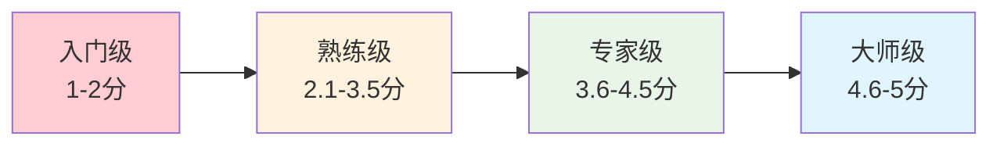

**入门级（1-2分）**
- 能够完成基本的工具安装和配置
- 掌握基础的代码生成功能
- 了解基本的安全规范
- 需要指导完成复杂任务

**熟练级（2.1-3.5分）**
- 熟练使用主要功能模块
- 能够独立解决常见问题
- 具备基本的团队协作能力
- 能够指导入门级用户

**专家级（3.6-4.5分）**
- 精通高级功能和优化技巧
- 能够设计和实施最佳实践
- 具备培训和指导能力
- 能够参与工具选型决策

**大师级（4.6-5分）**
- 深度理解AI IDE技术原理
- 能够创新应用方法和流程
- 具备战略规划和决策能力
- 能够引领团队技术发展

#### 12.1.2.2 考核方法设计


**理论考核（30%）**

*选择题（40题，每题1分）*
- AI IDE基础概念：10题
- 工具功能特性：15题
- 安全规范要求：10题
- 最佳实践案例：5题

*简答题（6题，每题5分）*
- 工具选型决策过程
- 安全风险识别与应对
- 团队协作流程设计
- 性能优化策略
- 问题排查方法
- 持续改进建议

**实践考核（50%）**

*项目实战（50分）*
- 项目背景：模拟真实开发场景
- 考核时间：4小时
- 评估标准：
  - 需求理解准确性（10分）
  - 工具使用熟练度（15分）
  - 代码质量与规范（15分）
  - 问题解决能力（10分）

*操作演示（20分）*
- 工具配置演示（5分）
- 功能使用演示（10分）
- 故障排查演示（5分）

**综合评价（20%）**

*同事评价（10分）*
- 团队协作表现
- 知识分享贡献
- 学习态度评价

*自我评估（10分）*
- 学习收获总结
- 能力提升计划
- 持续学习承诺

### 12.1.3 培训材料与实践练习


#### 12.1.3.1 培训材料体系


**教学课件**

*基础概念课件*
- PPT格式，包含动画演示
- 涵盖AI IDE发展历程、技术原理、应用价值
- 配套讲师手册和学员手册

*操作指南课件*
- 视频教程 + 图文说明
- 分步骤详细操作演示
- 常见问题FAQ集合

*案例分析课件*
- 真实项目案例分析
- 成功经验与失败教训
- 最佳实践总结

**实践练习手册**

*入门练习（10个练习）*
1. 工具安装与环境配置
2. 基础界面操作熟悉
3. 简单代码生成练习
4. 错误检测与修复
5. 基础重构操作
6. 文档生成练习
7. 版本控制集成
8. 基础协作功能
9. 安全设置配置
10. 综合操作练习

*进阶练习（8个练习）*
11. 复杂代码生成项目
12. 自定义提示词优化
13. 多语言项目管理
14. 性能监控与分析
15. 高级重构技巧
16. 团队协作流程
17. 架构设计支持
18. 综合项目实战

*专家练习（5个练习）*
19. 企业级项目实施
20. 工具定制与扩展
21. 团队培训设计
22. 最佳实践制定
23. 创新应用探索

**学习资源库**

*视频教程库*
- 基础操作视频：20个，总时长8小时
- 进阶功能视频：15个，总时长6小时
- 案例分析视频：10个，总时长4小时
- 专家分享视频：5个，总时长2小时

*文档资源库*
- 官方文档翻译版本
- 社区最佳实践文档
- 常见问题解答文档
- 工具对比分析文档

*代码示例库*
- 按语言分类的代码示例
- 按功能分类的使用案例
- 按场景分类的解决方案
- 按难度分类的练习题目

### 12.1.4 学习路径与进阶指导


#### 12.1.4.1 个性化学习路径


**角色导向学习路径**


<div class="chart-container">
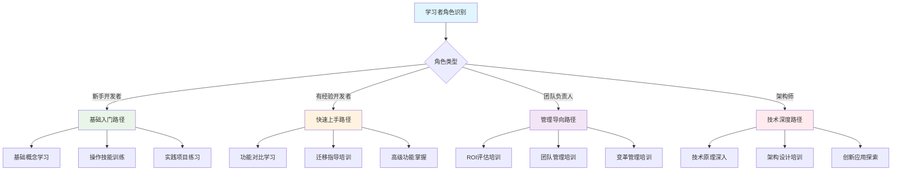

**技能导向学习路径**

*代码生成专精路径*
- 第1周：基础代码生成技巧
- 第2周：复杂逻辑生成方法
- 第3周：多语言代码生成
- 第4周：代码质量优化
- 第5-6周：项目实战练习

*团队协作专精路径*
- 第1周：版本控制集成
- 第2周：代码审查流程
- 第3周：团队规范制定
- 第4周：知识分享机制
- 第5-6周：协作项目实践

*架构设计专精路径*
- 第1周：AI辅助架构分析
- 第2周：设计模式应用
- 第3周：技术选型支持
- 第4周：架构评审流程
- 第5-6周：架构设计实战

#### 12.1.4.2 进阶指导体系


**能力发展阶梯**

| 阶段 | 能力要求 | 学习目标 | 评估标准 | 晋升条件 |
| ------ | --------- | --------- | --------- | --------- |
| L1-入门 | 基础操作 | 掌握基本功能 | 理论80分+实践70分 | 完成入门项目 |
| L2-熟练 | 独立应用 | 解决实际问题 | 理论85分+实践80分 | 指导新人3个月 |
| L3-专家 | 优化创新 | 制定最佳实践 | 理论90分+实践85分 | 主导团队培训 |
| L4-大师 | 战略规划 | 引领技术发展 | 综合评估90分+ | 行业影响力认可 |

**持续学习机制**

*定期技能评估*
- 季度技能测评
- 年度综合评估
- 项目实战评价
- 同事互评反馈

*学习激励机制*
- 学习积分制度
- 技能认证奖励
- 晋升通道关联
- 学习成果分享

*知识更新机制*
- 月度技术分享会
- 季度最佳实践总结
- 年度技术趋势研讨
- 外部培训参与

**个人发展规划**

*技能发展计划模板*

```

个人技能发展计划

基本信息：
- 姓名：[姓名]
- 当前技能等级：[L1/L2/L3/L4]
- 目标技能等级：[L1/L2/L3/L4]
- 计划完成时间：[时间]

现状分析：
- 当前技能强项：[列举3-5项]
- 技能薄弱环节：[列举3-5项]
- 学习偏好：[视频/文档/实践]
- 可投入时间：[每周小时数]

发展目标：
- 短期目标（3个月）：[具体目标]
- 中期目标（6个月）：[具体目标]
- 长期目标（1年）：[具体目标]

学习计划：
- 理论学习：[课程安排]
- 实践练习：[项目安排]
- 交流分享：[活动安排]
- 评估考核：[时间安排]

资源需求：
- 培训资源：[所需资源]
- 实践环境：[环境要求]
- 导师支持：[指导需求]
- 时间安排：[学习时间]

成功指标：
- 技能评估分数：[目标分数]
- 项目实战表现：[评价标准]
- 团队贡献度：[贡献指标]
- 持续学习能力：[学习指标]

```

#### 12.1.4.3 培训材料开发指南


**课程内容开发标准**

*内容质量要求*
- 准确性：技术信息准确无误，与最新版本保持同步
- 实用性：内容贴近实际工作场景，具有直接应用价值
- 系统性：知识点逻辑清晰，循序渐进，形成完整体系
- 互动性：包含练习、讨论、案例分析等互动环节

*多媒体资源制作*
- 视频教程：高清录制，包含屏幕操作演示和语音讲解
- 交互式课件：支持在线学习，包含测试题和即时反馈
- 实践环境：提供沙盒环境，支持安全的实践操作
- 移动学习：适配移动设备，支持碎片化学习

**实践练习设计原则**

*渐进式难度设计*


<div class="chart-container">
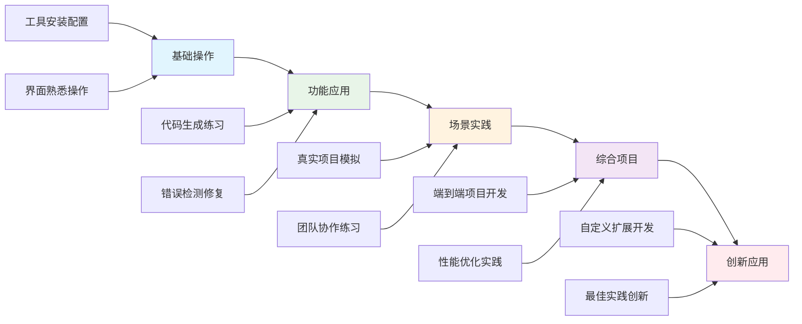

*实践项目库建设*

**初级实践项目（10个）**
24. **个人博客系统开发**
   - 项目背景：开发一个简单的个人博客系统
   - 技能要求：基础代码生成、界面设计、数据库操作
   - 预期时间：8小时
   - 评估标准：功能完整性、代码质量、用户体验

25. **待办事项管理应用**
   - 项目背景：创建一个任务管理应用
   - 技能要求：CRUD操作、状态管理、用户界面设计
   - 预期时间：6小时
   - 评估标准：功能实现、数据持久化、界面友好性

26. **简单电商商品展示页**
   - 项目背景：开发商品展示和搜索功能
   - 技能要求：数据展示、搜索过滤、响应式设计
   - 预期时间：10小时
   - 评估标准：数据展示准确性、搜索功能有效性、页面适配性

**中级实践项目（8个）**
27. **团队协作项目管理系统**
   - 项目背景：开发支持多用户的项目管理平台
   - 技能要求：用户认证、权限管理、实时通信、数据可视化
   - 预期时间：20小时
   - 评估标准：系统架构合理性、功能完整性、性能表现

28. **API服务开发与集成**
   - 项目背景：开发RESTful API并集成第三方服务
   - 技能要求：API设计、数据库设计、第三方集成、错误处理
   - 预期时间：16小时
   - 评估标准：API设计规范性、集成稳定性、错误处理完善性

**高级实践项目（5个）**
29. **微服务架构电商平台**
   - 项目背景：设计和实现微服务架构的电商系统
   - 技能要求：微服务设计、容器化部署、服务治理、监控告警
   - 预期时间：40小时
   - 评估标准：架构设计合理性、服务拆分恰当性、系统可扩展性

#### 12.1.4.4 学习效果评估体系


**多维度评估模型**

*知识掌握度评估（40%）*
- 理论知识测试：选择题、判断题、简答题
- 概念理解评估：案例分析、概念解释、原理阐述
- 最新技术跟踪：技术趋势分析、新功能学习能力

*技能应用度评估（35%）*
- 操作熟练度：标准化操作测试、效率指标测量
- 问题解决能力：故障排查、解决方案设计
- 创新应用能力：功能扩展、流程优化、工具定制

*团队协作度评估（15%）*
- 沟通协作能力：团队项目表现、知识分享贡献
- 指导培养能力：新人指导效果、培训参与度
- 文化适应度：价值观践行、团队融入程度

*持续学习度评估（10%）*
- 学习主动性：自主学习记录、学习计划执行
- 知识更新频率：新技术学习、技能提升速度
- 分享贡献度：知识分享、经验总结、社区参与

**评估工具与方法**

*在线评估平台*
- 自适应测试系统：根据答题情况调整题目难度
- 实时反馈机制：即时显示答题结果和改进建议
- 学习轨迹跟踪：记录学习过程和进度变化
- 个性化推荐：基于评估结果推荐学习内容

*项目评估框架*

```

项目评估表

项目基本信息：
- 项目名称：[项目名称]
- 参与人员：[团队成员]
- 项目周期：[开始时间-结束时间]
- 项目复杂度：[简单/中等/复杂]

技术实现评估：
- 需求理解准确性：[1-5分]
- 技术方案合理性：[1-5分]
- 代码质量水平：[1-5分]
- 功能完整性：[1-5分]
- 性能表现：[1-5分]

协作表现评估：
- 沟通效率：[1-5分]
- 任务执行力：[1-5分]
- 团队配合度：[1-5分]
- 问题解决能力：[1-5分]

创新亮点：
- 技术创新点：[描述]
- 流程改进点：[描述]
- 用户体验优化：[描述]

改进建议：
- 技术能力提升：[建议]
- 协作能力改进：[建议]
- 学习方向指导：[建议]

综合评分：[总分]
评估人：[评估人姓名]
评估时间：[评估日期]

```

*导师制度*
- 新人导师配对
- 定期指导会议
- 学习进度跟踪
- 经验分享交流

*学习社区建设*
- 内部技术论坛
- 学习小组组织
- 经验分享平台
- 问题互助机制

## 12.2 能力建设方案


### 12.2.1 团队协作模式设计


#### 12.2.1.1 协作模式框架


**分布式协作模式**

现代AI IDE支持的分布式团队协作需要建立标准化的工作流程和沟通机制。


<div class="chart-container">
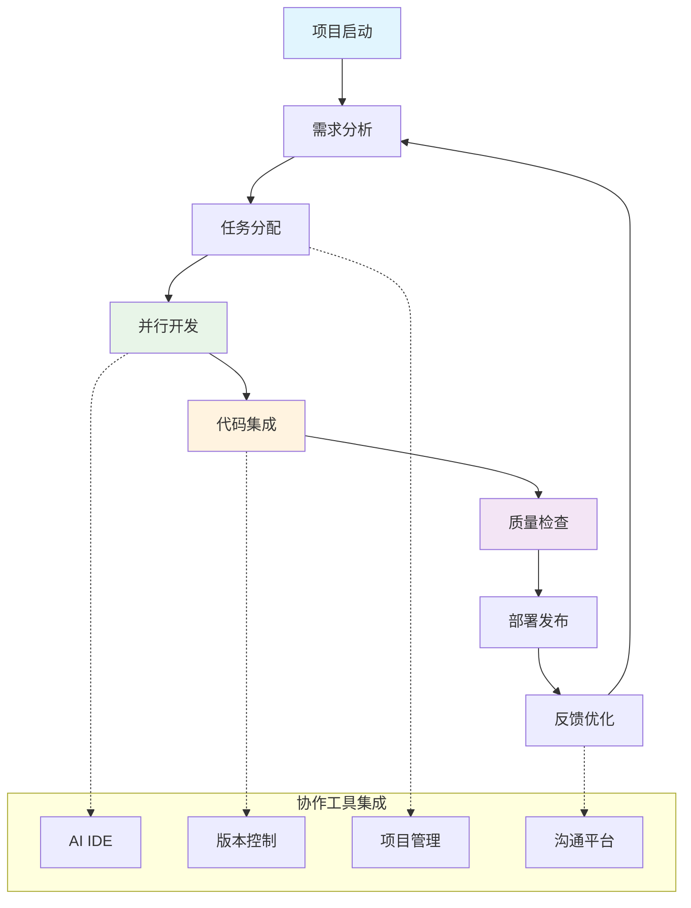

**角色职责定义**

*技术负责人*
- 技术架构决策
- 代码质量把控
- 团队技术指导
- 工具选型决策

*项目经理*
- 项目进度管理
- 资源协调分配
- 风险识别控制
- 沟通协调组织

*高级开发者*
- 核心功能开发
- 代码审查执行
- 技术难题解决
- 新人指导培养

*中级开发者*
- 功能模块开发
- 单元测试编写
- 文档维护更新
- 知识分享参与

*初级开发者*
- 简单功能实现
- 测试用例执行
- 文档学习整理
- 技能提升学习

#### 12.2.1.2 工作流程标准化


**代码开发流程**

*需求分析阶段*
30. 需求文档AI辅助分析
31. 用户故事自动生成
32. 验收标准智能提取
33. 技术方案AI建议

*设计开发阶段*
34. 架构设计AI辅助
35. 代码框架自动生成
36. 接口定义智能补全
37. 设计模式推荐应用

*编码实现阶段*
38. 代码智能生成
39. 实时错误检测
40. 代码质量监控
41. 自动化测试生成

*测试验证阶段*
42. 测试用例AI生成
43. 自动化测试执行
44. 缺陷智能分析
45. 修复建议提供

*部署发布阶段*
46. 部署脚本生成
47. 配置文件管理
48. 发布流程自动化
49. 监控告警设置

**协作沟通机制**

*日常沟通*
- 每日站会：15分钟，同步进度和问题
- 技术讨论：随时，解决技术难题
- 代码审查：异步，保证代码质量
- 知识分享：周会，分享学习心得

*项目沟通*
- 项目启动会：明确目标和分工
- 里程碑评审：检查进度和质量
- 风险评估会：识别和应对风险
- 项目复盘会：总结经验和改进

*跨团队沟通*
- 技术委员会：技术标准制定
- 架构评审会：架构方案评审
- 最佳实践分享：经验交流推广
- 工具培训会：新工具推广培训

#### 12.2.1.3 团队协作工具集成


**AI IDE协作功能配置**

*实时协作设置*

```json
{
  "collaboration": {
    "realTimeEditing": {
      "enabled": true,
      "maxConcurrentUsers": 10,
      "conflictResolution": "automatic",
      "changeTracking": true
    },
    "codeReview": {
      "autoAssignment": true,
      "reviewerCount": 2,
      "approvalRequired": true,
      "aiSuggestions": true
    },
    "communication": {
      "inlineComments": true,
      "voiceChat": true,
      "screenSharing": true,
      "notificationSettings": "smart"
    }
  }
}

```

*版本控制集成*
- Git工作流标准化
- 分支策略统一管理
- 提交信息规范化
- 自动化合并检查

*项目管理集成*
- 任务自动同步
- 进度实时更新
- 工时统计分析
- 里程碑跟踪管理

**协作效率优化**

*智能任务分配*


<div class="chart-container">
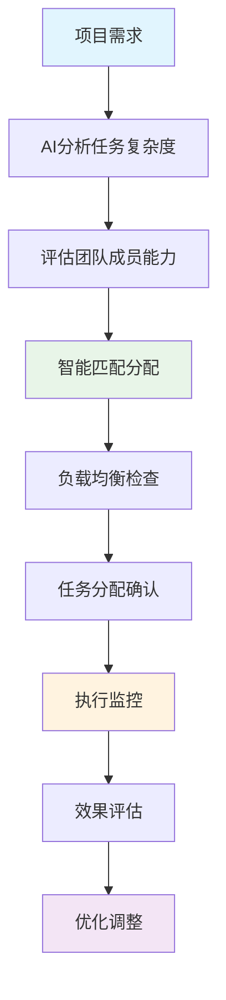

*协作质量监控*
- 代码质量实时监控
- 协作效率指标跟踪
- 沟通效果评估分析
- 团队满意度调研

*冲突解决机制*
- 技术分歧仲裁流程
- 代码冲突自动解决
- 进度冲突协调机制
- 资源竞争调度策略

### 12.2.2 知识管理与经验分享机制


#### 12.2.2.1 知识管理体系


**知识分类框架**


<div class="chart-container">
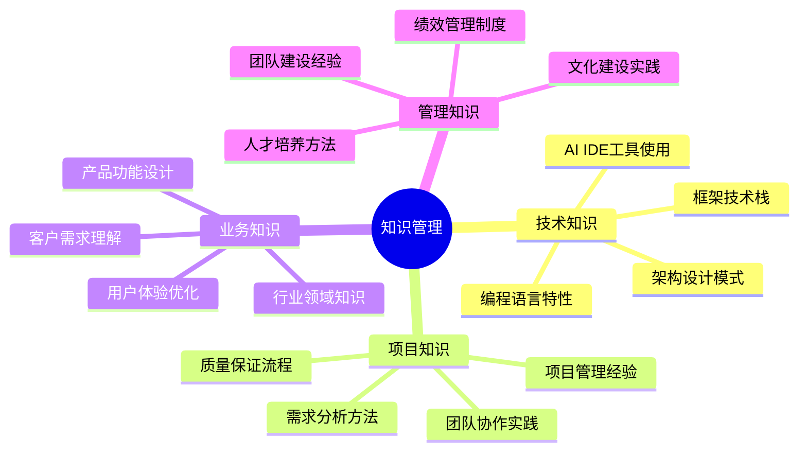

**知识库建设**

*技术文档库*
- AI IDE使用指南
- 最佳实践文档
- 常见问题解答
- 工具对比分析

*项目案例库*
- 成功项目案例
- 失败经验教训
- 解决方案模板
- 实施方法总结

*培训资料库*
- 培训课程资料
- 视频教程集合
- 练习题目库
- 考核评估工具

*创新实践库*
- 创新应用案例
- 实验性功能测试
- 前沿技术研究
- 改进建议收集

#### 12.2.2.2 经验分享机制


**分享平台建设**

*内部技术博客*
- 个人技术博客
- 团队项目总结
- 技术趋势分析
- 工具使用心得

*知识分享会*
- 月度技术分享
- 项目经验交流
- 外部培训分享
- 创新实践展示

*在线协作平台*
- 实时问答系统
- 经验分享论坛
- 文档协作编辑
- 视频会议培训

**激励机制设计**

*分享积分制*
- 文档贡献积分
- 培训分享积分
- 问题解答积分
- 创新实践积分

*认可奖励机制*
- 月度分享之星
- 年度知识贡献奖
- 技术创新奖励
- 团队协作表彰

*职业发展关联*
- 晋升评估考虑
- 专业能力认证
- 内部讲师资格
- 外部分享机会

#### 12.2.2.3 知识管理系统建设


**智能知识检索系统**

*AI驱动的知识发现*
- 自然语言查询支持
- 语义相似度匹配
- 上下文相关推荐
- 个性化内容推送

*知识图谱构建*


<div class="chart-container">
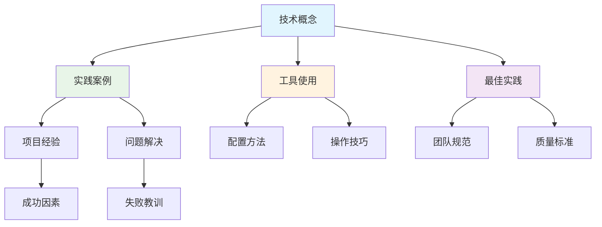

**知识质量保证体系**

*内容审核机制*
- 专家评审流程
- 同行评议制度
- 版本控制管理
- 质量评分系统

*知识更新维护*
- 定期内容审查
- 过时信息清理
- 新技术及时补充
- 用户反馈处理

*知识价值评估*
- 使用频率统计
- 用户评价收集
- 实际效果跟踪
- 改进建议整理

#### 12.2.2.4 经验分享激励体系


**多元化激励机制**

*积分奖励系统*

```

知识贡献积分规则

内容创作：
- 原创技术文章：10-50分（根据质量和影响力）
- 项目案例分享：20-80分（根据复杂度和价值）
- 最佳实践总结：15-40分（根据实用性）
- 工具使用指南：10-30分（根据详细程度）

互动参与：
- 问题解答：5-20分（根据问题难度）
- 评论讨论：2-10分（根据质量）
- 内容评价：1-5分（根据参与度）
- 知识推荐：3-15分（根据推荐价值）

培训贡献：
- 内部培训讲师：50-200分（根据培训效果）
- 培训材料制作：30-100分（根据材料质量）
- 新人指导：20-60分（根据指导效果）
- 技能评估：10-40分（根据评估质量）

```

*成就认证体系*
- 知识贡献专家认证
- 技术分享达人认证
- 团队协作标兵认证
- 创新实践先锋认证

*发展机会提供*
- 内部技术大会演讲机会
- 外部会议分享推荐
- 技术博客平台推广
- 行业专家网络引荐

### 12.2.3 人才培养与职业发展规划


#### 12.2.3.1 人才培养体系


**培养目标分层**

*技术专家培养*
- 深度技术能力
- 创新思维能力
- 问题解决能力
- 技术领导能力

*项目管理人才*
- 项目管理能力
- 团队协调能力
- 风险控制能力
- 沟通表达能力

*复合型人才*
- 技术与业务结合
- 管理与执行并重
- 创新与实践统一
- 个人与团队协调

**培养路径设计**


<div class="chart-container">
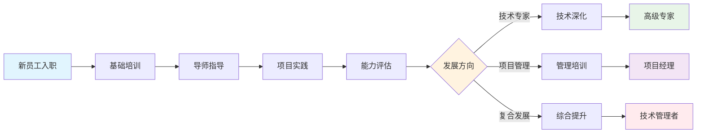

**个人发展计划**

*技能发展矩阵*

| 发展阶段 | 技术能力 | 管理能力 | 业务能力 | 创新能力 |
| --------- | --------- | --------- | --------- | --------- |
| 初级（0-2年） | 基础技术掌握 | 自我管理 | 业务理解 | 学习创新 |
| 中级（2-5年） | 专业技术精通 | 小团队管理 | 业务分析 | 改进创新 |
| 高级（5-8年） | 技术架构设计 | 项目团队管理 | 业务规划 | 方法创新 |
| 专家（8年+） | 技术战略规划 | 组织管理 | 业务战略 | 颠覆创新 |

*职业发展通道*

**技术专家通道**
- T1：初级工程师
- T2：中级工程师  
- T3：高级工程师
- T4：技术专家
- T5：首席技术专家

**管理发展通道**
- M1：团队组长
- M2：项目经理
- M3：部门经理
- M4：技术总监
- M5：首席技术官

**复合发展通道**
- P1：技术主管
- P2：产品技术经理
- P3：技术产品总监
- P4：事业部总经理
- P5：公司合伙人

#### 12.2.3.2 职业发展支持


**内部培训体系**

*新员工培训*
- 公司文化培训
- AI IDE基础培训
- 项目流程培训
- 团队协作培训

*在职培训*
- 技能提升培训
- 管理能力培训
- 业务知识培训
- 创新思维培训

*领导力培训*
- 团队建设培训
- 沟通技巧培训
- 决策能力培训
- 战略思维培训

**外部学习机会**

*会议参与*
- 技术大会参与
- 行业峰会出席
- 学术会议交流
- 国际会议参加

*培训进修*
- 专业认证培训
- 高校进修课程
- 在线学习平台
- 企业大学课程

*交流合作*
- 同行企业交流
- 开源社区参与
- 技术社群活动
- 专家咨询服务

#### 12.2.3.3 个性化发展规划


**能力评估与发展路径匹配**

*多维度能力评估模型*


<div class="chart-container">
```mermaid
radar
    title 个人能力雷达图
    "技术深度" : 0.8
    "技术广度" : 0.6
    "项目管理" : 0.4
    "团队协作" : 0.7
    "沟通表达" : 0.5
    "创新思维" : 0.6
    "学习能力" : 0.8
    "领导力" : 0.3

```

*发展路径智能推荐*
- 基于能力评估结果的路径推荐
- 结合个人兴趣和职业目标
- 考虑组织需求和发展机会
- 提供多种发展选择方案

**导师制度深化**

*导师匹配机制*
- 技能互补性匹配
- 性格特质适配分析
- 发展目标一致性评估
- 时间投入能力考量

*导师培训体系*
- 指导技巧培训
- 沟通方法训练
- 评估反馈技能
- 职业规划指导

*导师激励机制*
- 导师贡献认可
- 指导效果奖励
- 职业发展加分
- 专业声誉提升

#### 12.2.3.4 职业发展支持工具


**个人发展档案系统**

*数字化档案管理*

```json
{
  "personalProfile": {
    "basicInfo": {
      "name": "员工姓名",
      "position": "当前职位",
      "department": "所属部门",
      "joinDate": "入职时间"
    },
    "skillAssessment": {
      "technicalSkills": [
        {
          "skill": "AI IDE使用",
          "level": 4,
          "lastAssessed": "2024-01-15",
          "targetLevel": 5
        }
      ],
      "softSkills": [
        {
          "skill": "团队协作",
          "level": 3,
          "lastAssessed": "2024-01-15",
          "targetLevel": 4
        }
      ]
    },
    "developmentPlan": {
      "shortTermGoals": ["提升AI IDE高级功能使用"],
      "longTermGoals": ["成为技术专家"],
      "learningPath": ["高级功能培训", "项目实践", "技术分享"]
    },
    "achievements": [
      {
        "title": "优秀新人奖",
        "date": "2023-12-01",
        "description": "快速掌握AI IDE基础功能"
      }
    ]
  }
}

```

*发展轨迹跟踪*
- 技能提升历程记录
- 项目参与经历追踪
- 培训学习成果统计
- 职业里程碑标记

**职业规划工具**

*职业发展路径规划器*
- 交互式职业路径图
- 技能差距分析工具
- 学习计划生成器
- 进度跟踪仪表板

*职业机会匹配系统*
- 内部职位推荐
- 项目机会匹配
- 培训机会推送
- 发展机会提醒

#### 12.2.3.5 绩效管理与发展结合


**发展导向的绩效评估**

*评估维度设计*
- 业务结果贡献（40%）
- 能力发展进步（30%）
- 团队协作表现（20%）
- 创新实践成果（10%）

*发展性反馈机制*
- 定期发展对话
- 360度反馈收集
- 发展建议提供
- 改进计划制定

**发展激励体系**

*多元化激励方式*
- 技能提升奖励
- 学习成果认可
- 发展机会优先
- 职业晋升支持

*长期激励机制*
- 股权激励计划
- 职业发展基金
- 学习津贴支持
- 外部培训资助

### 12.2.4 团队文化建设指导


#### 12.2.4.1 文化价值体系


**核心价值观**

*技术卓越*
- 追求技术完美
- 持续学习改进
- 创新思维实践
- 质量第一原则

*团队协作*
- 开放沟通交流
- 互助支持合作
- 知识分享传承
- 集体智慧发挥

*客户导向*
- 用户需求优先
- 价值创造导向
- 服务质量保证
- 持续改进优化

*诚信负责*
- 诚实守信原则
- 责任担当精神
- 承诺履行保证
- 结果导向执行

#### 12.2.4.2 文化建设实践


**团队建设活动**

*技术文化活动*
- 技术分享会
- 代码审查会
- 创新项目展示
- 技术竞赛活动

*团队协作活动*
- 团队建设拓展
- 项目庆祝活动
- 团队聚餐交流
- 生日祝福活动

*学习成长活动*
- 读书分享会
- 学习小组活动
- 导师制度实施
- 职业规划指导

**文化传承机制**

*新人融入*
- 文化宣讲培训
- 导师带教制度
- 团队介绍活动
- 文化体验项目

*日常实践*
- 价值观践行
- 行为规范遵守
- 文化故事分享
- 榜样示范引领

*持续强化*
- 文化评估反馈
- 改进措施实施
- 文化创新实践
- 传统传承发展

**激励认可体系**

*精神激励*
- 公开表彰认可
- 荣誉称号授予
- 成就展示平台
- 价值观践行奖

*物质激励*
- 绩效奖金发放
- 股权激励计划
- 培训机会提供
- 职业发展支持

*发展激励*
- 晋升机会提供
- 挑战项目分配
- 学习资源支持
- 平台展示机会

#### 12.2.4.3 文化建设深化策略


**文化价值观具体化**

*技术卓越文化实践*


<div class="chart-container">
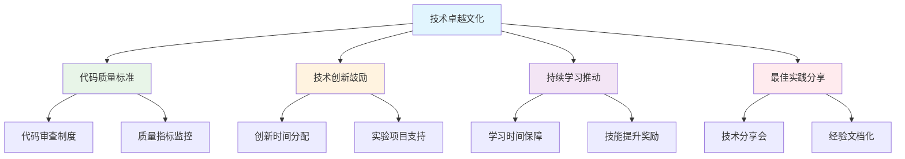

*团队协作文化实践*
- 开放透明的沟通机制
- 跨部门协作项目推进
- 知识共享平台建设
- 团队决策参与机制

*客户导向文化实践*
- 用户反馈收集机制
- 客户需求优先级管理
- 用户体验持续改进
- 客户成功案例分享

**远程团队文化建设**

*虚拟团队凝聚力建设*
- 在线团建活动设计
- 虚拟咖啡时间安排
- 远程协作工具优化
- 时区差异协调机制

*远程工作文化规范*
- 在线会议礼仪标准
- 异步沟通协作规范
- 工作时间灵活安排
- 成果导向评估机制

*数字化文化体验*
- 虚拟办公环境营造
- 在线文化活动组织
- 数字化认可表彰
- 远程学习社区建设

#### 12.2.4.4 文化效果评估与改进


**文化健康度评估**

*文化评估指标体系*
| 评估维度 | 关键指标 | 测量方法 | 目标值 |
| --------- | --------- | --------- | -------- |
| 员工满意度 | 工作满意度评分 | 季度调研 | ≥4.0/5.0 |
| 团队凝聚力 | 团队协作效率 | 项目评估 | ≥85% |
| 学习氛围 | 主动学习参与率 | 培训统计 | ≥80% |
| 创新活力 | 创新提案数量 | 月度统计 | ≥5个/月 |
| 价值观认同 | 价值观践行度 | 360度评估 | ≥4.2/5.0 |

*文化评估工具*
- 员工满意度调研问卷
- 团队文化健康度诊断
- 价值观践行行为观察
- 文化故事收集分析

**持续改进机制**

*文化改进循环*


<div class="chart-container">
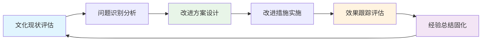

*文化创新实践*
- 文化创新实验项目
- 最佳文化实践征集
- 文化建设创意大赛
- 跨团队文化交流

#### 12.2.4.5 文化建设成功案例


**技术团队文化转型案例**

*案例背景*
某软件开发团队在引入AI IDE后，通过系统性的文化建设，成功实现了从传统开发文化向AI驱动开发文化的转型。

*实施过程*
50. **文化现状诊断**：通过调研发现团队存在技术保守、协作不足等问题
51. **价值观重塑**：确立"技术创新、开放协作、持续学习"的新价值观
52. **实践机制建立**：建立技术分享会、创新时间、协作项目等实践机制
53. **激励体系调整**：将文化践行纳入绩效评估和晋升考虑

*取得成效*
- 团队技术创新能力提升40%
- 跨部门协作效率提升35%
- 员工满意度从3.2提升到4.5
- 人才流失率降低60%

**知识分享文化建设案例**

*实施策略*
- 建立"每周技术分享"制度
- 设立"知识贡献奖"激励机制
- 创建内部技术博客平台
- 组织"最佳实践"评选活动

*文化成果*
- 技术文档数量增长300%
- 知识复用率提升50%
- 新人上手时间缩短40%
- 团队整体技能水平显著提升

#### 12.2.4.6 文化建设工具与资源


**文化建设工具包**

*文化评估工具*
- 团队文化健康度诊断表
- 员工满意度调研问卷
- 价值观践行评估表
- 文化建设效果跟踪表

*文化活动模板*
- 技术分享会组织模板
- 团队建设活动方案
- 新人文化融入计划
- 文化故事收集模板

*文化传播素材*
- 价值观宣传海报
- 文化故事视频素材
- 最佳实践案例集
- 文化建设指导手册

**外部资源整合**

*专业咨询服务*
- 组织文化咨询专家
- 团队建设培训师
- 文化变革管理顾问
- 员工满意度调研机构

*学习交流平台*
- 企业文化建设论坛
- 团队管理经验分享会
- 行业最佳实践研讨会
- 文化建设案例库

通过建立完善的团队培训与能力建设体系，组织能够确保AI IDE技术的成功实施和持续发展，同时培养出具备相应技能和素质的专业团队，为企业的数字化转型提供强有力的人才保障。这一体系不仅关注技术能力的提升，更注重团队文化的塑造和个人职业发展的支持，形成了一个全方位、多层次的人才发展生态系统。