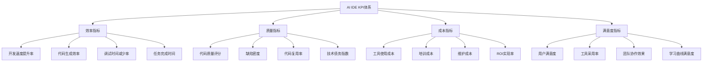
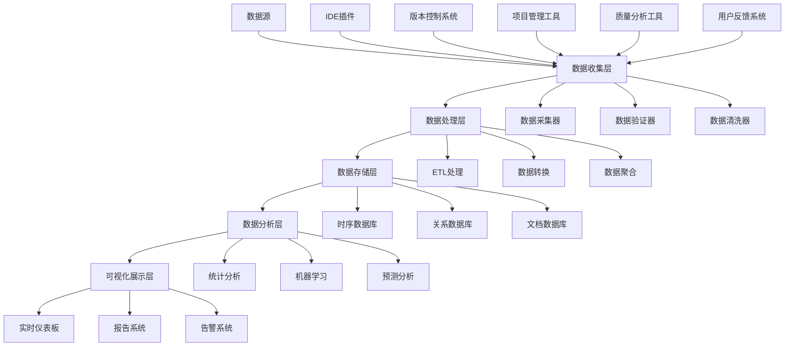
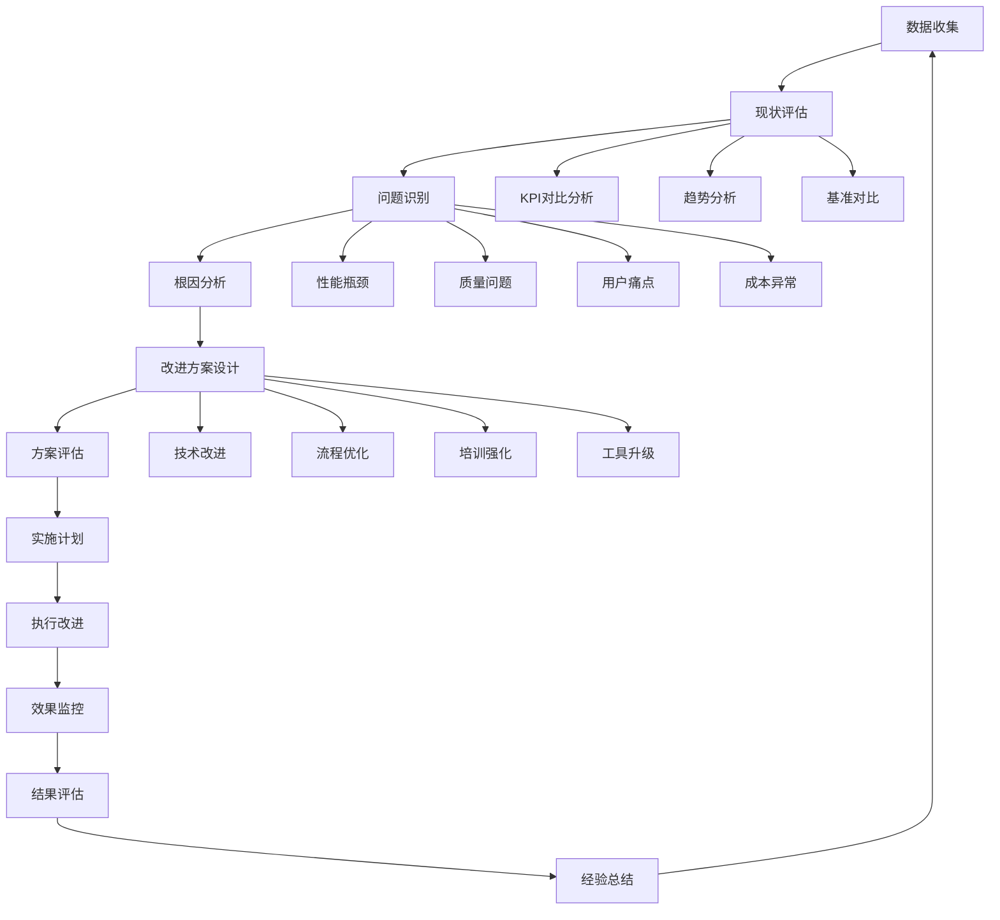
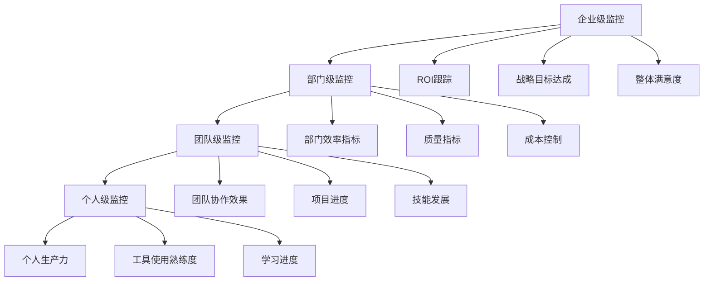

# 第13章 监控评估与持续改进


> **章节概述**: 本章介绍如何建立AI IDE使用效果的监控评估体系，制定关键绩效指标，设计持续改进机制，确保AI IDE投资的长期价值实现。
> 
> **预计阅读时间**: 45分钟
> 
> **前置知识**: 需要了解AI IDE基本概念、项目管理基础知识和数据分析方法

## 13.1 本章导读


### 13.1.1 学习目标

完成本章学习后，您将能够：
- 目标1：建立完整的AI IDE监控评估体系和关键绩效指标
- 目标2：设计有效的数据收集工具和分析框架
- 目标3：制定持续改进流程和版本更新策略
- 目标4：实施反馈收集和处理机制

### 13.1.2 章节结构

- **第一部分**: 监控评估体系建立 - 定义KPI指标和测量方法
- **第二部分**: 数据收集与分析 - 设计工具和分析框架
- **第三部分**: 持续改进机制 - 建立改进流程和最佳实践

## 13.1 建立监控评估体系


### 13.1.1 关键绩效指标(KPI)定义


AI IDE的监控评估需要建立多维度的KPI体系，涵盖效率、质量、成本和满意度等方面。


<div class="chart-container">


#### 13.2.1.1 效率指标详细定义


**1. 开发速度提升率**

```python
def calculate_development_speed_improvement():
    """
    计算开发速度提升率
    """
    kpi_definition = {
        'name': '开发速度提升率',
        'formula': '(AI IDE使用后平均开发时间 - 使用前平均开发时间) / 使用前平均开发时间 × 100%',
        'measurement_unit': '百分比(%)',
        'target_value': '≥30%',
        'measurement_frequency': '月度',
        'data_source': ['项目管理工具', '时间跟踪系统', '代码提交记录']
    }
    
    # 计算示例
    def calculate_speed_improvement(before_hours, after_hours):
        improvement = ((before_hours - after_hours) / before_hours) * 100
        return improvement
    
    return kpi_definition

# 第13章 KPI配置示例

speed_kpi = calculate_development_speed_improvement()
print(f"KPI名称: {speed_kpi['name']}")
print(f"目标值: {speed_kpi['target_value']}")

```

**2. 代码生成效率**

```python
def define_code_generation_efficiency_kpi():
    """
    定义代码生成效率KPI
    """
    return {
        'name': '代码生成效率',
        'description': '衡量AI IDE自动生成代码的效率和准确性',
        'metrics': {
            'generation_success_rate': {
                'formula': '成功生成可用代码次数 / 总生成尝试次数 × 100%',
                'target': '≥85%',
                'measurement': '每日统计'
            },
            'code_acceptance_rate': {
                'formula': '被开发者接受的生成代码行数 / 总生成代码行数 × 100%',
                'target': '≥70%',
                'measurement': '每周统计'
            },
            'generation_time_saved': {
                'formula': '手动编写时间估算 - 实际生成时间',
                'target': '≥60%时间节省',
                'measurement': '按任务统计'
            }
        },
        'data_collection_methods': [
            'IDE插件日志分析',
            '开发者行为跟踪',
            '代码审查记录',
            '时间跟踪工具'
        ]
    }

```

#### 13.2.1.2 质量指标详细定义


**1. 代码质量评分**

```python
def define_code_quality_score_kpi():
    """
    定义代码质量评分KPI
    """
    return {
        'name': '代码质量评分',
        'description': '综合评估AI IDE辅助开发的代码质量',
        'components': {
            'complexity_score': {
                'weight': 0.25,
                'measurement': '圈复杂度分析',
                'tools': ['SonarQube', 'CodeClimate'],
                'target': '平均复杂度 ≤ 10'
            },
            'maintainability_index': {
                'weight': 0.25,
                'measurement': '可维护性指数',
                'tools': ['Visual Studio Metrics', 'NDepend'],
                'target': '≥ 70分'
            },
            'test_coverage': {
                'weight': 0.25,
                'measurement': '测试覆盖率',
                'tools': ['Jest', 'Coverage.py', 'JaCoCo'],
                'target': '≥ 80%'
            },
            'code_duplication': {
                'weight': 0.25,
                'measurement': '代码重复率',
                'tools': ['SonarQube', 'PMD'],
                'target': '≤ 5%'
            }
        },
        'calculation_formula': 'Σ(组件得分 × 权重)',
        'reporting_frequency': '每周',
        'target_score': '≥ 8.0/10.0'
    }

```

**2. 缺陷密度指标**

```python
def define_defect_density_kpi():
    """
    定义缺陷密度KPI
    """
    return {
        'name': '缺陷密度',
        'formula': '发现缺陷数量 / 代码行数(KLOC) × 1000',
        'measurement_periods': {
            'development_phase': '开发阶段缺陷密度',
            'testing_phase': '测试阶段缺陷密度',
            'production_phase': '生产阶段缺陷密度'
        },
        'severity_weighting': {
            'critical': 4.0,
            'high': 2.0,
            'medium': 1.0,
            'low': 0.5
        },
        'target_values': {
            'development': '≤ 2.0 缺陷/KLOC',
            'testing': '≤ 1.0 缺陷/KLOC',
            'production': '≤ 0.5 缺陷/KLOC'
        },
        'data_sources': [
            '缺陷跟踪系统(Jira, Bugzilla)',
            '代码分析工具',
            '测试管理工具',
            '生产监控系统'
        ]
    }

```

### 13.1.2 测量方法和工具


#### 13.2.2.1 自动化数据收集工具


**1. IDE集成监控插件**

```javascript
// AI IDE监控插件示例代码
class AIIDEMonitoringPlugin {
    constructor(config) {
        this.config = config;
        this.metrics = new MetricsCollector();
        this.eventTracker = new EventTracker();
    }
    
    // 跟踪代码生成事件
    trackCodeGeneration(event) {
        const data = {
            timestamp: new Date().toISOString(),
            userId: event.userId,
            projectId: event.projectId,
            generationType: event.type, // 'completion', 'generation', 'refactor'
            promptLength: event.prompt.length,
            generatedCodeLength: event.generatedCode.length,
            acceptanceStatus: event.accepted, // true/false
            generationTime: event.duration,
            language: event.language
        };
        
        this.metrics.record('code_generation', data);
    }
    
    // 跟踪开发效率
    trackDevelopmentEfficiency(session) {
        const efficiency = {
            sessionId: session.id,
            startTime: session.startTime,
            endTime: session.endTime,
            totalCodingTime: session.codingTime,
            aiAssistedTime: session.aiAssistedTime,
            manualCodingTime: session.manualCodingTime,
            linesOfCodeWritten: session.locWritten,
            aiGeneratedLines: session.aiGeneratedLoc,
            debuggingTime: session.debugTime,
            testingTime: session.testTime
        };
        
        this.metrics.record('development_efficiency', efficiency);
    }
    
    // 跟踪代码质量指标
    trackCodeQuality(analysis) {
        const quality = {
            fileId: analysis.fileId,
            complexity: analysis.cyclomaticComplexity,
            maintainabilityIndex: analysis.maintainabilityIndex,
            testCoverage: analysis.testCoverage,
            codeSmells: analysis.codeSmells.length,
            duplicatedLines: analysis.duplicatedLines,
            technicalDebt: analysis.technicalDebtMinutes
        };
        
        this.metrics.record('code_quality', quality);
    }
    
    // 生成监控报告
    generateReport(timeRange) {
        return {
            period: timeRange,
            generatedAt: new Date().toISOString(),
            metrics: {
                efficiency: this.calculateEfficiencyMetrics(timeRange),
                quality: this.calculateQualityMetrics(timeRange),
                usage: this.calculateUsageMetrics(timeRange),
                satisfaction: this.calculateSatisfactionMetrics(timeRange)
            }
        };
    }
}

```

**2. 数据分析仪表板**

```python
import pandas as pd
import plotly.dash as dash
import plotly.graph_objs as go
from datetime import datetime, timedelta

class AIIDEDashboard:
    def __init__(self, data_source):
        self.data_source = data_source
        self.app = dash.Dash(__name__)
        self.setup_layout()
    
    def setup_layout(self):
        """设置仪表板布局"""
        self.app.layout = dash.html.Div([
            # 标题
            dash.html.H1("AI IDE监控仪表板", className="dashboard-title"),
            
            # 时间选择器
            dash.dcc.DatePickerRange(
                id='date-picker-range',
                start_date=datetime.now() - timedelta(days=30),
                end_date=datetime.now(),
                display_format='YYYY-MM-DD'
            ),
            
            # KPI卡片
            dash.html.Div([
                self.create_kpi_card("开发速度提升", "development_speed"),
                self.create_kpi_card("代码质量评分", "code_quality"),
                self.create_kpi_card("工具采用率", "adoption_rate"),
                self.create_kpi_card("用户满意度", "satisfaction")
            ], className="kpi-cards"),
            
            # 图表区域
            dash.html.Div([
                dash.dcc.Graph(id='efficiency-trend'),
                dash.dcc.Graph(id='quality-metrics'),
                dash.dcc.Graph(id='usage-statistics'),
                dash.dcc.Graph(id='team-performance')
            ], className="charts-container")
        ])
    
    def create_kpi_card(self, title, metric_id):
        """创建KPI卡片"""
        return dash.html.Div([
            dash.html.H3(title),
            dash.html.Div(id=f"{metric_id}-value", className="kpi-value"),
            dash.html.Div(id=f"{metric_id}-trend", className="kpi-trend")
        ], className="kpi-card")
    
    def update_efficiency_trend(self, start_date, end_date):
        """更新效率趋势图"""
        data = self.data_source.get_efficiency_data(start_date, end_date)
        
        fig = go.Figure()
        fig.add_trace(go.Scatter(
            x=data['date'],
            y=data['coding_speed_improvement'],
            mode='lines+markers',
            name='开发速度提升率',
            line=dict(color='#1f77b4')
        ))
        
        fig.add_trace(go.Scatter(
            x=data['date'],
            y=data['debugging_time_reduction'],
            mode='lines+markers',
            name='调试时间减少率',
            line=dict(color='#ff7f0e')
        ))
        
        fig.update_layout(
            title='开发效率趋势',
            xaxis_title='日期',
            yaxis_title='改善百分比(%)',
            hovermode='x unified'
        )
        
        return fig

```

### 13.1.3 评估报告模板和展示方式


#### 13.2.3.1 月度评估报告模板


```markdown
# 第13章 AI IDE月度监控评估报告


## 13.3 报告概要

- **报告期间**: {start_date} 至 {end_date}
- **评估团队**: {team_name}
- **团队规模**: {team_size}人
- **主要AI IDE工具**: {primary_tools}

## 13.4 关键绩效指标摘要


### 13.4.1 效率指标

| 指标名称 | 目标值 | 实际值 | 达成率 | 趋势 |
| --------- | -------- | -------- | -------- | ------ |
| 开发速度提升率 | ≥30% | {actual_speed}% | {speed_achievement}% | {speed_trend} |
| 代码生成效率 | ≥85% | {actual_generation}% | {generation_achievement}% | {generation_trend} |
| 调试时间减少率 | ≥25% | {actual_debug}% | {debug_achievement}% | {debug_trend} |

### 13.4.2 质量指标

| 指标名称 | 目标值 | 实际值 | 达成率 | 趋势 |
| --------- | -------- | -------- | -------- | ------ |
| 代码质量评分 | ≥8.0 | {actual_quality} | {quality_achievement}% | {quality_trend} |
| 缺陷密度 | ≤2.0/KLOC | {actual_defects}/KLOC | {defects_achievement}% | {defects_trend} |
| 测试覆盖率 | ≥80% | {actual_coverage}% | {coverage_achievement}% | {coverage_trend} |

## 13.5 详细分析


### 13.5.1 效率提升分析

{efficiency_analysis}

### 13.5.2 质量改善分析

{quality_analysis}

### 13.5.3 成本效益分析

{cost_benefit_analysis}

## 13.6 问题识别和改进建议


### 13.6.1 主要问题

1. {problem_1}
2. {problem_2}
3. {problem_3}

### 13.6.2 改进建议

4. {recommendation_1}
5. {recommendation_2}
6. {recommendation_3}

## 13.7 下月行动计划

{action_plan}

```

#### 13.7.0.1 可视化展示组件


```python
class ReportVisualization:
    def __init__(self, report_data):
        self.data = report_data
    
    def create_kpi_dashboard(self):
        """创建KPI仪表板"""
        fig = make_subplots(
            rows=2, cols=2,
            subplot_titles=('效率指标', '质量指标', '成本指标', '满意度指标'),
            specs=[[{"type": "indicator"}, {"type": "indicator"}],
                   [{"type": "indicator"}, {"type": "indicator"}]]
        )
        
        # 效率指标
        fig.add_trace(go.Indicator(
            mode="gauge+number+delta",
            value=self.data['efficiency_score'],
            domain={'x': [0, 1], 'y': [0, 1]},
            title={'text': "效率提升率(%)"},
            delta={'reference': 30},
            gauge={'axis': {'range': [None, 100]},
                   'bar': {'color': "darkblue"},
                   'steps': [{'range': [0, 30], 'color': "lightgray"},
                            {'range': [30, 70], 'color': "yellow"},
                            {'range': [70, 100], 'color': "green"}],
                   'threshold': {'line': {'color': "red", 'width': 4},
                               'thickness': 0.75, 'value': 90}}
        ), row=1, col=1)
        
        # 质量指标
        fig.add_trace(go.Indicator(
            mode="gauge+number+delta",
            value=self.data['quality_score'],
            domain={'x': [0, 1], 'y': [0, 1]},
            title={'text': "代码质量评分"},
            delta={'reference': 8.0},
            gauge={'axis': {'range': [0, 10]},
                   'bar': {'color': "darkgreen"},
                   'steps': [{'range': [0, 6], 'color': "lightgray"},
                            {'range': [6, 8], 'color': "yellow"},
                            {'range': [8, 10], 'color': "green"}]}
        ), row=1, col=2)
        
        return fig
    
    def create_trend_analysis(self):
        """创建趋势分析图"""
        dates = self.data['dates']
        
        fig = go.Figure()
        
        # 添加多个趋势线
        metrics = ['efficiency', 'quality', 'satisfaction', 'adoption']
        colors = ['blue', 'green', 'orange', 'red']
        
        for metric, color in zip(metrics, colors):
            fig.add_trace(go.Scatter(
                x=dates,
                y=self.data[f'{metric}_trend'],
                mode='lines+markers',
                name=metric.title(),
                line=dict(color=color, width=2),
                marker=dict(size=6)
            ))
        
        fig.update_layout(
            title='AI IDE关键指标趋势分析',
            xaxis_title='时间',
            yaxis_title='指标值',
            hovermode='x unified',
            legend=dict(x=0, y=1)
        )
        
        return fig

```

### 13.1.4 监控频率和责任分工


#### 13.7.1.1 监控频率矩阵


```python
def define_monitoring_frequency():
    """
    定义监控频率和责任分工
    """
    monitoring_matrix = {
        'real_time_metrics': {
            'frequency': '实时',
            'metrics': [
                'IDE使用状态',
                '代码生成请求',
                '系统性能指标',
                '错误日志'
            ],
            'responsible_role': '系统管理员',
            'tools': ['监控仪表板', '日志系统', '告警系统'],
            'action_threshold': '异常立即响应'
        },
        'daily_metrics': {
            'frequency': '每日',
            'metrics': [
                '代码生成成功率',
                '用户活跃度',
                '工具使用时长',
                '基础质量指标'
            ],
            'responsible_role': '技术负责人',
            'tools': ['自动化报告', '数据仪表板'],
            'action_threshold': '连续3天异常需要干预'
        },
        'weekly_metrics': {
            'frequency': '每周',
            'metrics': [
                '开发效率指标',
                '代码质量评分',
                '团队协作效果',
                '培训进度'
            ],
            'responsible_role': '项目经理',
            'tools': ['周报系统', '项目管理工具'],
            'action_threshold': '偏离目标20%需要调整'
        },
        'monthly_metrics': {
            'frequency': '每月',
            'metrics': [
                'ROI实现情况',
                '整体满意度',
                '成本效益分析',
                '战略目标达成'
            ],
            'responsible_role': '部门负责人',
            'tools': ['综合报告系统', '商业智能工具'],
            'action_threshold': '偏离年度目标需要战略调整'
        }
    }
    
    return monitoring_matrix

# 第13章 责任分工详细定义

def define_responsibility_matrix():
    """
    定义详细的责任分工矩阵
    """
    return {
        'system_administrator': {
            'name': '系统管理员',
            'responsibilities': [
                '维护监控系统正常运行',
                '配置告警规则和阈值',
                '处理系统异常和故障',
                '确保数据收集的完整性'
            ],
            'daily_tasks': [
                '检查系统运行状态',
                '处理告警信息',
                '备份监控数据',
                '更新监控配置'
            ],
            'required_skills': ['系统运维', '监控工具', '故障排除'],
            'reporting_to': '技术负责人'
        },
        'technical_lead': {
            'name': '技术负责人',
            'responsibilities': [
                '分析技术指标趋势',
                '识别技术问题和风险',
                '制定技术改进方案',
                '指导团队技术实践'
            ],
            'daily_tasks': [
                '审查日报数据',
                '分析异常指标',
                '与团队沟通技术问题',
                '更新技术标准'
            ],
            'required_skills': ['技术架构', '数据分析', '团队管理'],
            'reporting_to': '项目经理'
        },
        'project_manager': {
            'name': '项目经理',
            'responsibilities': [
                '监控项目整体进展',
                '协调资源和优先级',
                '管理风险和问题',
                '与利益相关者沟通'
            ],
            'weekly_tasks': [
                '生成周度报告',
                '主持评估会议',
                '更新项目计划',
                '处理升级问题'
            ],
            'required_skills': ['项目管理', '沟通协调', '风险管理'],
            'reporting_to': '部门负责人'
        }
    }

```

## 13.2 数据收集工具和分析框架


### 13.2.1 自动化数据收集系统


#### 13.8.1.1 数据收集架构设计


<div class="chart-container">


#### 13.8.1.2 数据收集器实现


```python
import asyncio
import aiohttp
import json
from datetime import datetime
from typing import Dict, List, Any
from dataclasses import dataclass

@dataclass
class MetricData:
    """指标数据结构"""
    timestamp: datetime
    metric_name: str
    value: Any
    tags: Dict[str, str]
    source: str

class DataCollector:
    """数据收集器基类"""
    
    def __init__(self, config: Dict[str, Any]):
        self.config = config
        self.session = None
        self.buffer = []
        self.buffer_size = config.get('buffer_size', 1000)
    
    async def start(self):
        """启动数据收集"""
        self.session = aiohttp.ClientSession()
        await self.initialize()
    
    async def stop(self):
        """停止数据收集"""
        if self.buffer:
            await self.flush_buffer()
        if self.session:
            await self.session.close()
    
    async def collect_metric(self, metric_data: MetricData):
        """收集单个指标"""
        self.buffer.append(metric_data)
        if len(self.buffer) >= self.buffer_size:
            await self.flush_buffer()
    
    async def flush_buffer(self):
        """刷新缓冲区"""
        if not self.buffer:
            return
        
        try:
            await self.send_to_storage(self.buffer)
            self.buffer.clear()
        except Exception as e:
            print(f"Failed to flush buffer: {e}")
    
    async def send_to_storage(self, data: List[MetricData]):
        """发送数据到存储系统"""
        raise NotImplementedError

class IDEPluginCollector(DataCollector):
    """IDE插件数据收集器"""
    
    async def initialize(self):
        """初始化IDE插件连接"""
        self.plugin_endpoints = self.config['plugin_endpoints']
        self.polling_interval = self.config.get('polling_interval', 60)
    
    async def collect_ide_metrics(self):
        """收集IDE指标"""
        while True:
            try:
                for endpoint in self.plugin_endpoints:
                    metrics = await self.fetch_plugin_data(endpoint)
                    for metric in metrics:
                        await self.collect_metric(metric)
                
                await asyncio.sleep(self.polling_interval)
            except Exception as e:
                print(f"Error collecting IDE metrics: {e}")
                await asyncio.sleep(self.polling_interval)
    
    async def fetch_plugin_data(self, endpoint: str) -> List[MetricData]:
        """从插件端点获取数据"""
        async with self.session.get(endpoint) as response:
            if response.status == 200:
                data = await response.json()
                return self.parse_plugin_data(data)
            else:
                raise Exception(f"Failed to fetch data from {endpoint}")
    
    def parse_plugin_data(self, raw_data: Dict) -> List[MetricData]:
        """解析插件数据"""
        metrics = []
        
        # 解析代码生成指标
        if 'code_generation' in raw_data:
            gen_data = raw_data['code_generation']
            metrics.append(MetricData(
                timestamp=datetime.now(),
                metric_name='code_generation_success_rate',
                value=gen_data['success_rate'],
                tags={'user_id': gen_data['user_id'], 'project_id': gen_data['project_id']},
                source='ide_plugin'
            ))
        
        # 解析效率指标
        if 'efficiency' in raw_data:
            eff_data = raw_data['efficiency']
            metrics.append(MetricData(
                timestamp=datetime.now(),
                metric_name='coding_time_saved',
                value=eff_data['time_saved_minutes'],
                tags={'session_id': eff_data['session_id']},
                source='ide_plugin'
            ))
        
        return metrics

class GitDataCollector(DataCollector):
    """Git数据收集器"""
    
    async def initialize(self):
        """初始化Git连接"""
        self.git_api_url = self.config['git_api_url']
        self.access_token = self.config['access_token']
        self.repositories = self.config['repositories']
    
    async def collect_git_metrics(self):
        """收集Git指标"""
        for repo in self.repositories:
            try:
                # 收集提交数据
                commits = await self.fetch_commits(repo)
                await self.process_commits(commits, repo)
                
                # 收集代码质量数据
                quality_data = await self.fetch_code_quality(repo)
                await self.process_quality_data(quality_data, repo)
                
            except Exception as e:
                print(f"Error collecting Git metrics for {repo}: {e}")
    
    async def fetch_commits(self, repo: str) -> List[Dict]:
        """获取提交数据"""
        url = f"{self.git_api_url}/repos/{repo}/commits"
        headers = {'Authorization': f'token {self.access_token}'}
        
        async with self.session.get(url, headers=headers) as response:
            if response.status == 200:
                return await response.json()
            else:
                raise Exception(f"Failed to fetch commits for {repo}")
    
    async def process_commits(self, commits: List[Dict], repo: str):
        """处理提交数据"""
        for commit in commits:
            # 分析提交频率
            await self.collect_metric(MetricData(
                timestamp=datetime.fromisoformat(commit['commit']['author']['date'].replace('Z', '+00:00')),
                metric_name='commit_frequency',
                value=1,
                tags={'repo': repo, 'author': commit['commit']['author']['name']},
                source='git'
            ))
            
            # 分析代码变更量
            if 'stats' in commit:
                await self.collect_metric(MetricData(
                    timestamp=datetime.fromisoformat(commit['commit']['author']['date'].replace('Z', '+00:00')),
                    metric_name='lines_changed',
                    value=commit['stats']['total'],
                    tags={'repo': repo, 'type': 'total'},
                    source='git'
                ))

```

### 13.2.2 数据分析框架


#### 13.8.2.1 统计分析引擎


```python
import pandas as pd
import numpy as np
from scipy import stats
from sklearn.preprocessing import StandardScaler
from sklearn.cluster import KMeans
import warnings
warnings.filterwarnings('ignore')

class MetricsAnalyzer:
    """指标分析引擎"""
    
    def __init__(self, data_source):
        self.data_source = data_source
        self.scaler = StandardScaler()
    
    def analyze_efficiency_trends(self, time_range: tuple) -> Dict[str, Any]:
        """分析效率趋势"""
        # 获取效率数据
        efficiency_data = self.data_source.get_efficiency_metrics(time_range)
        df = pd.DataFrame(efficiency_data)
        
        if df.empty:
            return {'error': 'No data available for the specified time range'}
        
        # 计算趋势分析
        results = {
            'summary_statistics': self._calculate_summary_stats(df),
            'trend_analysis': self._analyze_trends(df),
            'correlation_analysis': self._analyze_correlations(df),
            'anomaly_detection': self._detect_anomalies(df),
            'forecasting': self._forecast_trends(df)
        }
        
        return results
    
    def _calculate_summary_stats(self, df: pd.DataFrame) -> Dict[str, Any]:
        """计算汇总统计"""
        numeric_columns = df.select_dtypes(include=[np.number]).columns
        
        summary = {}
        for col in numeric_columns:
            summary[col] = {
                'mean': df[col].mean(),
                'median': df[col].median(),
                'std': df[col].std(),
                'min': df[col].min(),
                'max': df[col].max(),
                'q25': df[col].quantile(0.25),
                'q75': df[col].quantile(0.75),
                'skewness': stats.skew(df[col].dropna()),
                'kurtosis': stats.kurtosis(df[col].dropna())
            }
        
        return summary
    
    def _analyze_trends(self, df: pd.DataFrame) -> Dict[str, Any]:
        """分析趋势"""
        if 'timestamp' not in df.columns:
            return {'error': 'Timestamp column not found'}
        
        df['timestamp'] = pd.to_datetime(df['timestamp'])
        df = df.sort_values('timestamp')
        
        trends = {}
        numeric_columns = df.select_dtypes(include=[np.number]).columns
        
        for col in numeric_columns:
            # 线性回归趋势分析
            x = np.arange(len(df))
            y = df[col].values
            
            # 去除NaN值
            mask = ~np.isnan(y)
            if mask.sum() < 2:
                continue
                
            slope, intercept, r_value, p_value, std_err = stats.linregress(x[mask], y[mask])
            
            trends[col] = {
                'slope': slope,
                'r_squared': r_value ** 2,
                'p_value': p_value,
                'trend_direction': 'increasing' if slope > 0 else 'decreasing' if slope < 0 else 'stable',
                'trend_strength': abs(r_value),
                'significance': 'significant' if p_value < 0.05 else 'not_significant'
            }
        
        return trends
    
    def _analyze_correlations(self, df: pd.DataFrame) -> Dict[str, Any]:
        """分析相关性"""
        numeric_df = df.select_dtypes(include=[np.number])
        
        if numeric_df.empty:
            return {'error': 'No numeric data available for correlation analysis'}
        
        # 计算相关系数矩阵
        correlation_matrix = numeric_df.corr()
        
        # 找出强相关关系
        strong_correlations = []
        for i in range(len(correlation_matrix.columns)):
            for j in range(i+1, len(correlation_matrix.columns)):
                corr_value = correlation_matrix.iloc[i, j]
                if abs(corr_value) > 0.7:  # 强相关阈值
                    strong_correlations.append({
                        'variable1': correlation_matrix.columns[i],
                        'variable2': correlation_matrix.columns[j],
                        'correlation': corr_value,
                        'strength': 'strong positive' if corr_value > 0.7 else 'strong negative'
                    })
        
        return {
            'correlation_matrix': correlation_matrix.to_dict(),
            'strong_correlations': strong_correlations
        }
    
    def _detect_anomalies(self, df: pd.DataFrame) -> Dict[str, Any]:
        """检测异常值"""
        anomalies = {}
        numeric_columns = df.select_dtypes(include=[np.number]).columns
        
        for col in numeric_columns:
            data = df[col].dropna()
            if len(data) < 10:  # 数据点太少，跳过异常检测
                continue
            
            # 使用IQR方法检测异常值
            Q1 = data.quantile(0.25)
            Q3 = data.quantile(0.75)
            IQR = Q3 - Q1
            lower_bound = Q1 - 1.5 * IQR
            upper_bound = Q3 + 1.5 * IQR
            
            outliers = data[(data < lower_bound) | (data > upper_bound)]
            
            # 使用Z-score方法
            z_scores = np.abs(stats.zscore(data))
            z_outliers = data[z_scores > 3]
            
            anomalies[col] = {
                'iqr_outliers': {
                    'count': len(outliers),
                    'percentage': len(outliers) / len(data) * 100,
                    'values': outliers.tolist()
                },
                'zscore_outliers': {
                    'count': len(z_outliers),
                    'percentage': len(z_outliers) / len(data) * 100,
                    'values': z_outliers.tolist()
                },
                'bounds': {
                    'iqr_lower': lower_bound,
                    'iqr_upper': upper_bound
                }
            }
        
        return anomalies
    
    def _forecast_trends(self, df: pd.DataFrame, periods: int = 30) -> Dict[str, Any]:
        """预测趋势"""
        forecasts = {}
        numeric_columns = df.select_dtypes(include=[np.number]).columns
        
        for col in numeric_columns:
            data = df[col].dropna()
            if len(data) < 10:
                continue
            
            # 简单线性预测
            x = np.arange(len(data))
            y = data.values
            
            slope, intercept, r_value, p_value, std_err = stats.linregress(x, y)
            
            # 预测未来值
            future_x = np.arange(len(data), len(data) + periods)
            future_y = slope * future_x + intercept
            
            # 计算预测区间
            prediction_std = std_err * np.sqrt(1 + 1/len(data) + (future_x - np.mean(x))**2 / np.sum((x - np.mean(x))**2))
            confidence_interval = 1.96 * prediction_std  # 95%置信区间
            
            forecasts[col] = {
                'predicted_values': future_y.tolist(),
                'confidence_upper': (future_y + confidence_interval).tolist(),
                'confidence_lower': (future_y - confidence_interval).tolist(),
                'model_accuracy': r_value ** 2,
                'trend_continuation': 'increasing' if slope > 0 else 'decreasing' if slope < 0 else 'stable'
            }
        
        return forecasts

class TeamPerformanceAnalyzer:
    """团队绩效分析器"""
    
    def __init__(self, data_source):
        self.data_source = data_source
    
    def analyze_team_performance(self, team_id: str, time_range: tuple) -> Dict[str, Any]:
        """分析团队绩效"""
        # 获取团队数据
        team_data = self.data_source.get_team_metrics(team_id, time_range)
        
        if not team_data:
            return {'error': f'No data found for team {team_id}'}
        
        analysis = {
            'team_overview': self._get_team_overview(team_data),
            'productivity_analysis': self._analyze_productivity(team_data),
            'collaboration_analysis': self._analyze_collaboration(team_data),
            'skill_development': self._analyze_skill_development(team_data),
            'tool_adoption': self._analyze_tool_adoption(team_data),
            'recommendations': self._generate_recommendations(team_data)
        }
        
        return analysis
    
    def _analyze_productivity(self, team_data: Dict) -> Dict[str, Any]:
        """分析生产力"""
        members = team_data['members']
        
        productivity_metrics = []
        for member in members:
            metrics = {
                'member_id': member['id'],
                'name': member['name'],
                'lines_of_code': member['metrics']['lines_of_code'],
                'commits_count': member['metrics']['commits_count'],
                'code_reviews': member['metrics']['code_reviews'],
                'ai_assistance_usage': member['metrics']['ai_usage_hours'],
                'productivity_score': self._calculate_productivity_score(member['metrics'])
            }
            productivity_metrics.append(metrics)
        
        # 团队整体分析
        df = pd.DataFrame(productivity_metrics)
        
        return {
            'individual_metrics': productivity_metrics,
            'team_averages': {
                'avg_productivity_score': df['productivity_score'].mean(),
                'avg_lines_of_code': df['lines_of_code'].mean(),
                'avg_commits': df['commits_count'].mean(),
                'avg_ai_usage': df['ai_assistance_usage'].mean()
            },
            'performance_distribution': {
                'high_performers': len(df[df['productivity_score'] > df['productivity_score'].quantile(0.75)]),
                'average_performers': len(df[(df['productivity_score'] >= df['productivity_score'].quantile(0.25)) & 
                                           (df['productivity_score'] <= df['productivity_score'].quantile(0.75))]),
                'low_performers': len(df[df['productivity_score'] < df['productivity_score'].quantile(0.25)])
            }
        }
    
    def _calculate_productivity_score(self, metrics: Dict) -> float:
        """计算生产力评分"""
        # 权重配置
        weights = {
            'lines_of_code': 0.2,
            'commits_count': 0.2,
            'code_reviews': 0.2,
            'ai_usage_efficiency': 0.2,
            'code_quality': 0.2
        }
        
        # 标准化指标
        normalized_metrics = {
            'lines_of_code': min(metrics['lines_of_code'] / 1000, 1.0),  # 标准化到0-1
            'commits_count': min(metrics['commits_count'] / 50, 1.0),
            'code_reviews': min(metrics['code_reviews'] / 20, 1.0),
            'ai_usage_efficiency': min(metrics['ai_usage_hours'] / 40, 1.0),
            'code_quality': metrics.get('code_quality_score', 0.8) / 10  # 假设质量评分0-10
        }
        
        # 计算加权评分
        score = sum(normalized_metrics[key] * weights[key] for key in weights.keys())
        return round(score * 100, 2)  # 转换为百分制

```

现在让我完成第一个子任务并继续第二个子任务：

<function_calls>
<invoke name="taskStatus">
<parameter name="taskFilePath">.kiro/specs/ai-ide-guide-enhancement/tasks.md
## 
13.3 设计持续改进机制

### 13.3.1 定期评估流程和改进建议生成方法


#### 13.8.3.1 持续改进流程框架


<div class="chart-container">


#### 13.8.3.2 自动化改进建议生成系统


```python
from typing import Dict, List, Any
from dataclasses import dataclass
from enum import Enum
import json

class ImprovementPriority(Enum):
    CRITICAL = "critical"
    HIGH = "high"
    MEDIUM = "medium"
    LOW = "low"

class ImprovementCategory(Enum):
    EFFICIENCY = "efficiency"
    QUALITY = "quality"
    COST = "cost"
    SATISFACTION = "satisfaction"
    TECHNICAL = "technical"
    PROCESS = "process"

@dataclass
class ImprovementRecommendation:
    """改进建议数据结构"""
    id: str
    title: str
    description: str
    category: ImprovementCategory
    priority: ImprovementPriority
    impact_score: float  # 0-10
    effort_score: float  # 0-10
    roi_estimate: float
    timeline_weeks: int
    responsible_role: str
    prerequisites: List[str]
    success_metrics: List[str]
    implementation_steps: List[str]

class ImprovementRecommendationEngine:
    """改进建议生成引擎"""
    
    def __init__(self, config_path: str):
        self.rules = self._load_improvement_rules(config_path)
        self.thresholds = self._load_thresholds(config_path)
        
    def generate_recommendations(self, metrics_data: Dict[str, Any]) -> List[ImprovementRecommendation]:
        """生成改进建议"""
        recommendations = []
        
        # 分析各个维度的指标
        efficiency_recs = self._analyze_efficiency_metrics(metrics_data.get('efficiency', {}))
        quality_recs = self._analyze_quality_metrics(metrics_data.get('quality', {}))
        cost_recs = self._analyze_cost_metrics(metrics_data.get('cost', {}))
        satisfaction_recs = self._analyze_satisfaction_metrics(metrics_data.get('satisfaction', {}))
        
        recommendations.extend(efficiency_recs)
        recommendations.extend(quality_recs)
        recommendations.extend(cost_recs)
        recommendations.extend(satisfaction_recs)
        
        # 按优先级和ROI排序
        recommendations.sort(key=lambda x: (x.priority.value, -x.roi_estimate))
        
        return recommendations
    
    def _analyze_efficiency_metrics(self, efficiency_data: Dict) -> List[ImprovementRecommendation]:
        """分析效率指标并生成建议"""
        recommendations = []
        
        # 检查开发速度提升率
        speed_improvement = efficiency_data.get('development_speed_improvement', 0)
        if speed_improvement < self.thresholds['efficiency']['min_speed_improvement']:
            recommendations.append(ImprovementRecommendation(
                id="eff_001",
                title="提升AI IDE代码生成使用率",
                description=f"当前开发速度提升率仅为{speed_improvement}%，低于目标{self.thresholds['efficiency']['min_speed_improvement']}%。建议加强AI代码生成功能的使用培训。",
                category=ImprovementCategory.EFFICIENCY,
                priority=ImprovementPriority.HIGH,
                impact_score=8.0,
                effort_score=4.0,
                roi_estimate=200.0,
                timeline_weeks=4,
                responsible_role="技术负责人",
                prerequisites=["团队技能评估", "培训资源准备"],
                success_metrics=["开发速度提升率达到30%以上", "AI功能使用频率提升50%"],
                implementation_steps=[
                    "分析当前AI功能使用情况",
                    "识别使用障碍和痛点",
                    "制定针对性培训计划",
                    "实施培训和指导",
                    "监控使用率变化"
                ]
            ))
        
        # 检查代码生成成功率
        generation_success_rate = efficiency_data.get('code_generation_success_rate', 0)
        if generation_success_rate < self.thresholds['efficiency']['min_generation_success']:
            recommendations.append(ImprovementRecommendation(
                id="eff_002",
                title="优化AI提示词模板",
                description=f"代码生成成功率为{generation_success_rate}%，建议优化提示词模板和上下文信息。",
                category=ImprovementCategory.TECHNICAL,
                priority=ImprovementPriority.MEDIUM,
                impact_score=7.0,
                effort_score=3.0,
                roi_estimate=150.0,
                timeline_weeks=2,
                responsible_role="高级开发工程师",
                prerequisites=["提示词使用数据分析", "最佳实践收集"],
                success_metrics=["代码生成成功率提升至85%以上"],
                implementation_steps=[
                    "分析失败的生成请求",
                    "总结成功的提示词模式",
                    "创建标准化提示词模板",
                    "培训团队使用新模板",
                    "持续优化模板库"
                ]
            ))
        
        return recommendations
    
    def _analyze_quality_metrics(self, quality_data: Dict) -> List[ImprovementRecommendation]:
        """分析质量指标并生成建议"""
        recommendations = []
        
        # 检查代码质量评分
        quality_score = quality_data.get('code_quality_score', 0)
        if quality_score < self.thresholds['quality']['min_quality_score']:
            recommendations.append(ImprovementRecommendation(
                id="qual_001",
                title="加强代码审查和质量门禁",
                description=f"代码质量评分为{quality_score}，低于目标{self.thresholds['quality']['min_quality_score']}。建议强化代码审查流程。",
                category=ImprovementCategory.QUALITY,
                priority=ImprovementPriority.HIGH,
                impact_score=9.0,
                effort_score=5.0,
                roi_estimate=180.0,
                timeline_weeks=6,
                responsible_role="质量负责人",
                prerequisites=["代码审查工具配置", "质量标准制定"],
                success_metrics=["代码质量评分提升至8.0以上", "代码审查覆盖率达到100%"],
                implementation_steps=[
                    "配置自动化代码质量检查工具",
                    "制定代码质量标准和检查清单",
                    "建立强制性代码审查流程",
                    "培训团队质量意识",
                    "定期质量回顾和改进"
                ]
            ))
        
        # 检查缺陷密度
        defect_density = quality_data.get('defect_density', 0)
        if defect_density > self.thresholds['quality']['max_defect_density']:
            recommendations.append(ImprovementRecommendation(
                id="qual_002",
                title="实施AI辅助测试策略",
                description=f"缺陷密度为{defect_density}/KLOC，超过目标值。建议加强AI辅助测试。",
                category=ImprovementCategory.QUALITY,
                priority=ImprovementPriority.MEDIUM,
                impact_score=7.5,
                effort_score=6.0,
                roi_estimate=120.0,
                timeline_weeks=8,
                responsible_role="测试负责人",
                prerequisites=["测试工具评估", "AI测试工具选型"],
                success_metrics=["缺陷密度降低至2.0/KLOC以下", "测试覆盖率提升至90%"],
                implementation_steps=[
                    "评估AI测试工具选项",
                    "制定AI辅助测试策略",
                    "实施自动化测试生成",
                    "建立持续测试流程",
                    "监控测试效果"
                ]
            ))
        
        return recommendations
    
    def _load_improvement_rules(self, config_path: str) -> Dict:
        """加载改进规则配置"""
        # 简化示例，实际应从配置文件加载
        return {
            "efficiency_rules": [
                {
                    "condition": "development_speed_improvement < 30",
                    "recommendation": "enhance_ai_usage_training"
                },
                {
                    "condition": "code_generation_success_rate < 85",
                    "recommendation": "optimize_prompt_templates"
                }
            ],
            "quality_rules": [
                {
                    "condition": "code_quality_score < 8.0",
                    "recommendation": "strengthen_code_review"
                },
                {
                    "condition": "defect_density > 2.0",
                    "recommendation": "implement_ai_testing"
                }
            ]
        }
    
    def _load_thresholds(self, config_path: str) -> Dict:
        """加载阈值配置"""
        return {
            "efficiency": {
                "min_speed_improvement": 30,
                "min_generation_success": 85,
                "min_debugging_reduction": 25
            },
            "quality": {
                "min_quality_score": 8.0,
                "max_defect_density": 2.0,
                "min_test_coverage": 80
            },
            "cost": {
                "max_cost_per_developer": 500,
                "min_roi": 150
            },
            "satisfaction": {
                "min_user_satisfaction": 4.0,
                "min_adoption_rate": 80
            }
        }

class ImprovementPlanGenerator:
    """改进计划生成器"""
    
    def __init__(self):
        self.plan_templates = self._load_plan_templates()
    
    def generate_improvement_plan(self, recommendations: List[ImprovementRecommendation]) -> Dict[str, Any]:
        """生成改进计划"""
        # 按优先级分组
        critical_items = [r for r in recommendations if r.priority == ImprovementPriority.CRITICAL]
        high_items = [r for r in recommendations if r.priority == ImprovementPriority.HIGH]
        medium_items = [r for r in recommendations if r.priority == ImprovementPriority.MEDIUM]
        low_items = [r for r in recommendations if r.priority == ImprovementPriority.LOW]
        
        # 生成实施时间线
        timeline = self._generate_timeline(recommendations)
        
        # 计算资源需求
        resource_requirements = self._calculate_resource_requirements(recommendations)
        
        # 生成风险评估
        risk_assessment = self._assess_implementation_risks(recommendations)
        
        plan = {
            "plan_overview": {
                "total_recommendations": len(recommendations),
                "critical_count": len(critical_items),
                "high_count": len(high_items),
                "medium_count": len(medium_items),
                "low_count": len(low_items),
                "estimated_duration_weeks": max([r.timeline_weeks for r in recommendations]) if recommendations else 0,
                "total_estimated_roi": sum([r.roi_estimate for r in recommendations])
            },
            "implementation_phases": {
                "phase_1_critical": {
                    "duration_weeks": 4,
                    "items": [self._recommendation_to_dict(r) for r in critical_items],
                    "success_criteria": self._extract_success_criteria(critical_items)
                },
                "phase_2_high": {
                    "duration_weeks": 8,
                    "items": [self._recommendation_to_dict(r) for r in high_items],
                    "success_criteria": self._extract_success_criteria(high_items)
                },
                "phase_3_medium": {
                    "duration_weeks": 12,
                    "items": [self._recommendation_to_dict(r) for r in medium_items],
                    "success_criteria": self._extract_success_criteria(medium_items)
                }
            },
            "timeline": timeline,
            "resource_requirements": resource_requirements,
            "risk_assessment": risk_assessment,
            "monitoring_plan": self._generate_monitoring_plan(recommendations)
        }
        
        return plan
    
    def _generate_timeline(self, recommendations: List[ImprovementRecommendation]) -> Dict[str, Any]:
        """生成实施时间线"""
        timeline = {
            "milestones": [],
            "dependencies": [],
            "critical_path": []
        }
        
        # 按时间排序
        sorted_recs = sorted(recommendations, key=lambda x: x.timeline_weeks)
        
        current_week = 0
        for rec in sorted_recs:
            milestone = {
                "week": current_week + rec.timeline_weeks,
                "title": rec.title,
                "deliverables": rec.implementation_steps[-1],  # 最后一步作为交付物
                "responsible": rec.responsible_role
            }
            timeline["milestones"].append(milestone)
            current_week += rec.timeline_weeks
        
        return timeline
    
    def _recommendation_to_dict(self, rec: ImprovementRecommendation) -> Dict:
        """将推荐转换为字典"""
        return {
            "id": rec.id,
            "title": rec.title,
            "description": rec.description,
            "category": rec.category.value,
            "priority": rec.priority.value,
            "impact_score": rec.impact_score,
            "effort_score": rec.effort_score,
            "roi_estimate": rec.roi_estimate,
            "timeline_weeks": rec.timeline_weeks,
            "responsible_role": rec.responsible_role,
            "prerequisites": rec.prerequisites,
            "success_metrics": rec.success_metrics,
            "implementation_steps": rec.implementation_steps
        }

```

### 13.3.2 反馈收集和处理机制


#### 13.8.4.1 多渠道反馈收集系统


```python
from abc import ABC, abstractmethod
from typing import Dict, List, Any, Optional
from datetime import datetime
from enum import Enum

class FeedbackType(Enum):
    BUG_REPORT = "bug_report"
    FEATURE_REQUEST = "feature_request"
    USABILITY_ISSUE = "usability_issue"
    PERFORMANCE_ISSUE = "performance_issue"
    GENERAL_FEEDBACK = "general_feedback"

class FeedbackPriority(Enum):
    URGENT = "urgent"
    HIGH = "high"
    MEDIUM = "medium"
    LOW = "low"

class FeedbackStatus(Enum):
    NEW = "new"
    ACKNOWLEDGED = "acknowledged"
    IN_PROGRESS = "in_progress"
    RESOLVED = "resolved"
    CLOSED = "closed"

@dataclass
class FeedbackItem:
    """反馈项数据结构"""
    id: str
    timestamp: datetime
    user_id: str
    feedback_type: FeedbackType
    priority: FeedbackPriority
    status: FeedbackStatus
    title: str
    description: str
    category: str
    tags: List[str]
    attachments: List[str]
    votes: int
    assigned_to: Optional[str]
    resolution: Optional[str]
    resolution_date: Optional[datetime]

class FeedbackCollector(ABC):
    """反馈收集器抽象基类"""
    
    @abstractmethod
    async def collect_feedback(self) -> List[FeedbackItem]:
        pass
    
    @abstractmethod
    async def submit_feedback(self, feedback: FeedbackItem) -> bool:
        pass

class InAppFeedbackCollector(FeedbackCollector):
    """应用内反馈收集器"""
    
    def __init__(self, config: Dict[str, Any]):
        self.config = config
        self.feedback_storage = config['storage']
    
    async def collect_feedback(self) -> List[FeedbackItem]:
        """收集应用内反馈"""
        # 从存储系统获取反馈
        raw_feedback = await self.feedback_storage.get_all_feedback()
        
        feedback_items = []
        for item in raw_feedback:
            feedback_items.append(FeedbackItem(
                id=item['id'],
                timestamp=datetime.fromisoformat(item['timestamp']),
                user_id=item['user_id'],
                feedback_type=FeedbackType(item['type']),
                priority=FeedbackPriority(item['priority']),
                status=FeedbackStatus(item['status']),
                title=item['title'],
                description=item['description'],
                category=item['category'],
                tags=item['tags'],
                attachments=item.get('attachments', []),
                votes=item.get('votes', 0),
                assigned_to=item.get('assigned_to'),
                resolution=item.get('resolution'),
                resolution_date=datetime.fromisoformat(item['resolution_date']) if item.get('resolution_date') else None
            ))
        
        return feedback_items
    
    async def submit_feedback(self, feedback: FeedbackItem) -> bool:
        """提交反馈"""
        try:
            feedback_data = {
                'id': feedback.id,
                'timestamp': feedback.timestamp.isoformat(),
                'user_id': feedback.user_id,
                'type': feedback.feedback_type.value,
                'priority': feedback.priority.value,
                'status': feedback.status.value,
                'title': feedback.title,
                'description': feedback.description,
                'category': feedback.category,
                'tags': feedback.tags,
                'attachments': feedback.attachments,
                'votes': feedback.votes
            }
            
            await self.feedback_storage.save_feedback(feedback_data)
            return True
        except Exception as e:
            print(f"Failed to submit feedback: {e}")
            return False

class SurveyFeedbackCollector(FeedbackCollector):
    """调查问卷反馈收集器"""
    
    def __init__(self, survey_config: Dict[str, Any]):
        self.survey_config = survey_config
        self.survey_api = survey_config['api_client']
    
    async def collect_feedback(self) -> List[FeedbackItem]:
        """收集调查反馈"""
        survey_responses = await self.survey_api.get_responses()
        
        feedback_items = []
        for response in survey_responses:
            # 将调查响应转换为反馈项
            feedback = self._convert_survey_to_feedback(response)
            if feedback:
                feedback_items.append(feedback)
        
        return feedback_items
    
    def _convert_survey_to_feedback(self, survey_response: Dict) -> Optional[FeedbackItem]:
        """将调查响应转换为反馈项"""
        try:
            # 分析调查响应，提取关键信息
            satisfaction_score = survey_response.get('satisfaction_score', 5)
            comments = survey_response.get('comments', '')
            
            # 根据满意度评分确定优先级
            if satisfaction_score <= 2:
                priority = FeedbackPriority.HIGH
            elif satisfaction_score <= 3:
                priority = FeedbackPriority.MEDIUM
            else:
                priority = FeedbackPriority.LOW
            
            return FeedbackItem(
                id=f"survey_{survey_response['id']}",
                timestamp=datetime.fromisoformat(survey_response['submitted_at']),
                user_id=survey_response['user_id'],
                feedback_type=FeedbackType.GENERAL_FEEDBACK,
                priority=priority,
                status=FeedbackStatus.NEW,
                title=f"Survey Feedback - Satisfaction: {satisfaction_score}/5",
                description=comments,
                category="user_experience",
                tags=["survey", f"satisfaction_{satisfaction_score}"],
                attachments=[],
                votes=0,
                assigned_to=None,
                resolution=None,
                resolution_date=None
            )
        except Exception as e:
            print(f"Failed to convert survey response: {e}")
            return None

class FeedbackProcessor:
    """反馈处理器"""
    
    def __init__(self, config: Dict[str, Any]):
        self.config = config
        self.collectors = self._initialize_collectors()
        self.analyzer = FeedbackAnalyzer()
        self.router = FeedbackRouter(config['routing_rules'])
    
    def _initialize_collectors(self) -> List[FeedbackCollector]:
        """初始化反馈收集器"""
        collectors = []
        
        if 'in_app' in self.config['collectors']:
            collectors.append(InAppFeedbackCollector(self.config['collectors']['in_app']))
        
        if 'survey' in self.config['collectors']:
            collectors.append(SurveyFeedbackCollector(self.config['collectors']['survey']))
        
        return collectors
    
    async def process_all_feedback(self) -> Dict[str, Any]:
        """处理所有反馈"""
        all_feedback = []
        
        # 从所有收集器收集反馈
        for collector in self.collectors:
            feedback_items = await collector.collect_feedback()
            all_feedback.extend(feedback_items)
        
        # 分析反馈
        analysis_results = self.analyzer.analyze_feedback(all_feedback)
        
        # 路由反馈到相应处理团队
        routing_results = self.router.route_feedback(all_feedback)
        
        # 生成处理报告
        processing_report = {
            'total_feedback_count': len(all_feedback),
            'feedback_by_type': self._count_by_type(all_feedback),
            'feedback_by_priority': self._count_by_priority(all_feedback),
            'analysis_results': analysis_results,
            'routing_results': routing_results,
            'recommended_actions': self._generate_recommended_actions(analysis_results)
        }
        
        return processing_report
    
    def _count_by_type(self, feedback_items: List[FeedbackItem]) -> Dict[str, int]:
        """按类型统计反馈"""
        counts = {}
        for item in feedback_items:
            type_name = item.feedback_type.value
            counts[type_name] = counts.get(type_name, 0) + 1
        return counts
    
    def _count_by_priority(self, feedback_items: List[FeedbackItem]) -> Dict[str, int]:
        """按优先级统计反馈"""
        counts = {}
        for item in feedback_items:
            priority_name = item.priority.value
            counts[priority_name] = counts.get(priority_name, 0) + 1
        return counts

class FeedbackAnalyzer:
    """反馈分析器"""
    
    def analyze_feedback(self, feedback_items: List[FeedbackItem]) -> Dict[str, Any]:
        """分析反馈数据"""
        if not feedback_items:
            return {'error': 'No feedback data to analyze'}
        
        analysis = {
            'sentiment_analysis': self._analyze_sentiment(feedback_items),
            'trend_analysis': self._analyze_trends(feedback_items),
            'category_analysis': self._analyze_categories(feedback_items),
            'priority_distribution': self._analyze_priority_distribution(feedback_items),
            'common_issues': self._identify_common_issues(feedback_items)
        }
        
        return analysis
    
    def _analyze_sentiment(self, feedback_items: List[FeedbackItem]) -> Dict[str, Any]:
        """分析反馈情感倾向"""
        # 简化的情感分析，实际应使用NLP库
        positive_keywords = ['good', 'great', 'excellent', 'love', 'helpful', 'easy']
        negative_keywords = ['bad', 'terrible', 'hate', 'difficult', 'slow', 'confusing']
        
        sentiment_scores = []
        for item in feedback_items:
            text = (item.title + ' ' + item.description).lower()
            
            positive_count = sum(1 for keyword in positive_keywords if keyword in text)
            negative_count = sum(1 for keyword in negative_keywords if keyword in text)
            
            if positive_count > negative_count:
                sentiment_scores.append(1)  # Positive
            elif negative_count > positive_count:
                sentiment_scores.append(-1)  # Negative
            else:
                sentiment_scores.append(0)  # Neutral
        
        total_items = len(sentiment_scores)
        positive_count = sum(1 for score in sentiment_scores if score > 0)
        negative_count = sum(1 for score in sentiment_scores if score < 0)
        neutral_count = total_items - positive_count - negative_count
        
        return {
            'positive_percentage': (positive_count / total_items) * 100 if total_items > 0 else 0,
            'negative_percentage': (negative_count / total_items) * 100 if total_items > 0 else 0,
            'neutral_percentage': (neutral_count / total_items) * 100 if total_items > 0 else 0,
            'overall_sentiment': 'positive' if positive_count > negative_count else 'negative' if negative_count > positive_count else 'neutral'
        }
    
    def _identify_common_issues(self, feedback_items: List[FeedbackItem]) -> List[Dict[str, Any]]:
        """识别常见问题"""
        # 简化的问题识别，基于关键词频率
        issue_keywords = {
            'performance': ['slow', 'lag', 'performance', 'speed'],
            'usability': ['confusing', 'difficult', 'hard to use', 'ui', 'interface'],
            'bugs': ['bug', 'error', 'crash', 'broken', 'not working'],
            'features': ['feature', 'functionality', 'missing', 'need', 'want']
        }
        
        issue_counts = {category: 0 for category in issue_keywords.keys()}
        issue_examples = {category: [] for category in issue_keywords.keys()}
        
        for item in feedback_items:
            text = (item.title + ' ' + item.description).lower()
            
            for category, keywords in issue_keywords.items():
                if any(keyword in text for keyword in keywords):
                    issue_counts[category] += 1
                    if len(issue_examples[category]) < 3:  # 保存前3个例子
                        issue_examples[category].append({
                            'title': item.title,
                            'description': item.description[:100] + '...' if len(item.description) > 100 else item.description
                        })
        
        # 按频率排序
        common_issues = []
        for category, count in sorted(issue_counts.items(), key=lambda x: x[1], reverse=True):
            if count > 0:
                common_issues.append({
                    'category': category,
                    'count': count,
                    'percentage': (count / len(feedback_items)) * 100,
                    'examples': issue_examples[category]
                })
        
        return common_issues

```

### 13.3.3 持续改进的最佳实践指导


#### 13.8.5.1 改进实施最佳实践


```python
class ContinuousImprovementBestPractices:
    """持续改进最佳实践指导"""
    
    def __init__(self):
        self.best_practices = self._load_best_practices()
        self.implementation_patterns = self._load_implementation_patterns()
    
    def get_practice_recommendations(self, context: Dict[str, Any]) -> List[Dict[str, Any]]:
        """根据上下文获取最佳实践建议"""
        recommendations = []
        
        team_size = context.get('team_size', 0)
        maturity_level = context.get('maturity_level', 'beginner')
        improvement_areas = context.get('improvement_areas', [])
        
        # 基于团队规模的建议
        if team_size <= 5:
            recommendations.extend(self._get_small_team_practices())
        elif team_size <= 20:
            recommendations.extend(self._get_medium_team_practices())
        else:
            recommendations.extend(self._get_large_team_practices())
        
        # 基于成熟度的建议
        if maturity_level == 'beginner':
            recommendations.extend(self._get_beginner_practices())
        elif maturity_level == 'intermediate':
            recommendations.extend(self._get_intermediate_practices())
        else:
            recommendations.extend(self._get_advanced_practices())
        
        # 基于改进领域的建议
        for area in improvement_areas:
            recommendations.extend(self._get_area_specific_practices(area))
        
        return self._deduplicate_recommendations(recommendations)
    
    def _get_small_team_practices(self) -> List[Dict[str, Any]]:
        """小团队最佳实践"""
        return [
            {
                'title': '建立简化的监控流程',
                'description': '小团队应采用轻量级的监控方法，避免过度复杂的流程',
                'implementation': [
                    '使用简单的仪表板工具',
                    '设置关键指标的自动告警',
                    '每周进行一次简短的回顾会议',
                    '重点关注3-5个核心KPI'
                ],
                'benefits': ['减少管理开销', '快速响应问题', '保持团队敏捷性'],
                'risks': ['可能遗漏细节问题', '缺乏深度分析'],
                'mitigation': ['定期进行深度分析', '与外部专家合作']
            },
            {
                'title': '实施快速反馈循环',
                'description': '建立快速的反馈和改进循环，提高响应速度',
                'implementation': [
                    '每日站会中讨论AI IDE使用情况',
                    '设置即时反馈渠道',
                    '每两周进行一次改进回顾',
                    '快速试验和调整'
                ],
                'benefits': ['快速发现问题', '及时调整策略', '提高团队参与度'],
                'risks': ['可能过于频繁', '缺乏系统性'],
                'mitigation': ['平衡频率和深度', '建立改进记录']
            }
        ]
    
    def _get_medium_team_practices(self) -> List[Dict[str, Any]]:
        """中型团队最佳实践"""
        return [
            {
                'title': '建立分层监控体系',
                'description': '中型团队需要更结构化的监控和改进体系',
                'implementation': [
                    '设立专门的监控负责人',
                    '建立团队、项目、个人三级监控',
                    '实施月度改进评审',
                    '建立改进项目管理流程'
                ],
                'benefits': ['系统性监控', '清晰的责任分工', '有序的改进管理'],
                'risks': ['增加管理复杂度', '可能降低灵活性'],
                'mitigation': ['保持流程简洁', '定期优化监控体系']
            },
            {
                'title': '实施跨团队协作机制',
                'description': '促进不同团队间的经验分享和协作改进',
                'implementation': [
                    '建立改进社区或兴趣小组',
                    '定期举办最佳实践分享会',
                    '建立跨团队改进项目',
                    '创建知识库和经验分享平台'
                ],
                'benefits': ['知识共享', '避免重复问题', '提升整体水平'],
                'risks': ['协调成本增加', '可能产生冲突'],
                'mitigation': ['明确协作规则', '建立冲突解决机制']
            }
        ]
    
    def _get_area_specific_practices(self, area: str) -> List[Dict[str, Any]]:
        """特定领域的最佳实践"""
        practices_by_area = {
            'efficiency': [
                {
                    'title': '实施效率提升追踪',
                    'description': '系统性追踪和分析效率提升情况',
                    'implementation': [
                        '建立基线测量',
                        '设置效率提升目标',
                        '定期测量和对比',
                        '分析效率瓶颈'
                    ]
                }
            ],
            'quality': [
                {
                    'title': '建立质量改进循环',
                    'description': '持续改进代码质量和产品质量',
                    'implementation': [
                        '实施自动化质量检查',
                        '建立质量门禁',
                        '定期质量回顾',
                        '质量问题根因分析'
                    ]
                }
            ],
            'satisfaction': [
                {
                    'title': '建立用户满意度提升机制',
                    'description': '系统性提升用户满意度',
                    'implementation': [
                        '定期用户满意度调查',
                        '建立用户反馈处理流程',
                        '实施用户体验改进',
                        '跟踪满意度变化趋势'
                    ]
                }
            ]
        }
        
        return practices_by_area.get(area, [])

class ImprovementImplementationGuide:
    """改进实施指导"""
    
    def create_implementation_guide(self, improvement_plan: Dict[str, Any]) -> Dict[str, Any]:
        """创建实施指导"""
        guide = {
            'preparation_phase': self._create_preparation_guide(improvement_plan),
            'execution_phase': self._create_execution_guide(improvement_plan),
            'monitoring_phase': self._create_monitoring_guide(improvement_plan),
            'evaluation_phase': self._create_evaluation_guide(improvement_plan),
            'common_pitfalls': self._identify_common_pitfalls(),
            'success_factors': self._identify_success_factors(),
            'troubleshooting': self._create_troubleshooting_guide()
        }
        
        return guide
    
    def _create_preparation_guide(self, plan: Dict[str, Any]) -> Dict[str, Any]:
        """创建准备阶段指导"""
        return {
            'stakeholder_alignment': {
                'description': '确保所有利益相关者对改进计划的理解和支持',
                'steps': [
                    '召开改进计划启动会议',
                    '明确各方角色和责任',
                    '获得管理层正式批准',
                    '建立沟通渠道和汇报机制'
                ],
                'deliverables': ['改进计划文档', '角色责任矩阵', '沟通计划'],
                'timeline': '1-2周'
            },
            'resource_preparation': {
                'description': '准备实施改进所需的资源',
                'steps': [
                    '评估人力资源需求',
                    '准备技术工具和环境',
                    '安排培训和学习资源',
                    '建立预算和成本控制'
                ],
                'deliverables': ['资源清单', '预算计划', '工具配置'],
                'timeline': '1-3周'
            },
            'baseline_establishment': {
                'description': '建立改进前的基线测量',
                'steps': [
                    '收集当前状态数据',
                    '建立测量基准',
                    '设置监控工具',
                    '记录初始状态'
                ],
                'deliverables': ['基线报告', '监控配置', '数据收集计划'],
                'timeline': '1周'
            }
        }

```

### 13.3.4 版本更新和发布策略


#### 13.8.6.1 版本管理策略


```python
from enum import Enum
from typing import Dict, List, Any, Optional
from datetime import datetime, timedelta
import semver

class ReleaseType(Enum):
    MAJOR = "major"
    MINOR = "minor"
    PATCH = "patch"
    HOTFIX = "hotfix"

class ReleaseStatus(Enum):
    PLANNED = "planned"
    IN_DEVELOPMENT = "in_development"
    TESTING = "testing"
    READY = "ready"
    RELEASED = "released"
    DEPRECATED = "deprecated"

@dataclass
class ReleaseVersion:
    """版本发布数据结构"""
    version: str
    release_type: ReleaseType
    status: ReleaseStatus
    planned_date: datetime
    actual_date: Optional[datetime]
    features: List[str]
    improvements: List[str]
    bug_fixes: List[str]
    breaking_changes: List[str]
    dependencies: List[str]
    rollback_plan: str
    testing_criteria: List[str]

class VersionManagementStrategy:
    """版本管理策略"""
    
    def __init__(self, config: Dict[str, Any]):
        self.config = config
        self.current_version = config.get('current_version', '1.0.0')
        self.release_schedule = config.get('release_schedule', {})
        
    def plan_next_release(self, improvements: List[Dict[str, Any]], 
                         bugs: List[Dict[str, Any]]) -> ReleaseVersion:
        """规划下一个版本发布"""
        
        # 分析改进和修复的影响程度
        release_type = self._determine_release_type(improvements, bugs)
        
        # 计算下一个版本号
        next_version = self._calculate_next_version(self.current_version, release_type)
        
        # 确定发布日期
        planned_date = self._calculate_release_date(release_type)
        
        # 创建版本发布计划
        release_plan = ReleaseVersion(
            version=next_version,
            release_type=release_type,
            status=ReleaseStatus.PLANNED,
            planned_date=planned_date,
            actual_date=None,
            features=self._extract_features(improvements),
            improvements=self._extract_improvements(improvements),
            bug_fixes=self._extract_bug_fixes(bugs),
            breaking_changes=self._identify_breaking_changes(improvements),
            dependencies=self._identify_dependencies(improvements, bugs),
            rollback_plan=self._create_rollback_plan(release_type),
            testing_criteria=self._define_testing_criteria(release_type, improvements, bugs)
        )
        
        return release_plan
    
    def _determine_release_type(self, improvements: List[Dict[str, Any]], 
                               bugs: List[Dict[str, Any]]) -> ReleaseType:
        """确定发布类型"""
        
        # 检查是否有紧急修复
        critical_bugs = [bug for bug in bugs if bug.get('priority') == 'critical']
        if critical_bugs and len(improvements) == 0:
            return ReleaseType.HOTFIX
        
        # 检查是否有重大功能变更
        major_changes = [imp for imp in improvements if imp.get('impact_score', 0) >= 8.0]
        breaking_changes = [imp for imp in improvements if imp.get('breaking_change', False)]
        
        if major_changes or breaking_changes:
            return ReleaseType.MAJOR
        
        # 检查是否有新功能
        new_features = [imp for imp in improvements if imp.get('category') == 'feature']
        if new_features:
            return ReleaseType.MINOR
        
        # 默认为补丁版本
        return ReleaseType.PATCH
    
    def _calculate_next_version(self, current_version: str, release_type: ReleaseType) -> str:
        """计算下一个版本号"""
        try:
            if release_type == ReleaseType.MAJOR:
                return semver.bump_major(current_version)
            elif release_type == ReleaseType.MINOR:
                return semver.bump_minor(current_version)
            elif release_type in [ReleaseType.PATCH, ReleaseType.HOTFIX]:
                return semver.bump_patch(current_version)
        except Exception:
            # 如果当前版本格式不正确，使用默认逻辑
            parts = current_version.split('.')
            major, minor, patch = int(parts[0]), int(parts[1]), int(parts[2])
            
            if release_type == ReleaseType.MAJOR:
                return f"{major + 1}.0.0"
            elif release_type == ReleaseType.MINOR:
                return f"{major}.{minor + 1}.0"
            else:
                return f"{major}.{minor}.{patch + 1}"
    
    def _calculate_release_date(self, release_type: ReleaseType) -> datetime:
        """计算发布日期"""
        now = datetime.now()
        
        # 根据发布类型确定开发周期
        development_cycles = {
            ReleaseType.HOTFIX: timedelta(days=3),
            ReleaseType.PATCH: timedelta(weeks=1),
            ReleaseType.MINOR: timedelta(weeks=4),
            ReleaseType.MAJOR: timedelta(weeks=12)
        }
        
        return now + development_cycles.get(release_type, timedelta(weeks=2))
    
    def create_release_notes(self, release: ReleaseVersion) -> str:
        """创建发布说明"""
        notes = f"""

# 第13章 AI IDE Guide v{release.version} Release Notes


## 13.9 Release Information

- **Version**: {release.version}
- **Release Type**: {release.release_type.value.title()}
- **Release Date**: {release.actual_date.strftime('%Y-%m-%d') if release.actual_date else 'TBD'}

## 13.10 What's New


### 13.10.1 New Features

"""
        
        for feature in release.features:
            notes += f"- {feature}\n"
        
        if release.improvements:
            notes += "\n### Improvements\n"
            for improvement in release.improvements:
                notes += f"- {improvement}\n"
        
        if release.bug_fixes:
            notes += "\n### Bug Fixes\n"
            for bug_fix in release.bug_fixes:
                notes += f"- {bug_fix}\n"
        
        if release.breaking_changes:
            notes += "\n### Breaking Changes\n"
            for breaking_change in release.breaking_changes:
                notes += f"- ⚠️ {breaking_change}\n"
        
        notes += f"""

## 13.11 Installation and Upgrade


### 13.11.1 Requirements

- Previous version compatibility: {self._check_compatibility(release)}
- Dependencies: {', '.join(release.dependencies) if release.dependencies else 'None'}

### 13.11.2 Upgrade Instructions

7. Backup your current configuration
8. Download the new version
9. Follow the migration guide (if applicable)
10. Test the upgrade in a development environment first

## 13.12 Testing and Quality Assurance


This release has been tested against the following criteria:
"""
        
        for criteria in release.testing_criteria:
            notes += f"- ✅ {criteria}\n"
        
        notes += f"""

## 13.13 Rollback Plan


In case of issues, you can rollback using the following procedure:
{release.rollback_plan}

## 13.14 Support and Feedback


If you encounter any issues with this release, please:
11. Check the troubleshooting guide
12. Search existing issues in our repository
13. Create a new issue with detailed information
14. Contact our support team

## 13.15 Next Release


The next release is planned for {self._estimate_next_release_date(release)}.
"""
        
        return notes
    
    def create_deployment_checklist(self, release: ReleaseVersion) -> List[Dict[str, Any]]:
        """创建部署检查清单"""
        checklist = [
            {
                'category': 'Pre-deployment',
                'items': [
                    {'task': '完成所有功能开发', 'responsible': 'Development Team', 'status': 'pending'},
                    {'task': '通过所有自动化测试', 'responsible': 'QA Team', 'status': 'pending'},
                    {'task': '完成安全审查', 'responsible': 'Security Team', 'status': 'pending'},
                    {'task': '更新文档', 'responsible': 'Technical Writer', 'status': 'pending'},
                    {'task': '准备发布说明', 'responsible': 'Product Manager', 'status': 'pending'}
                ]
            },
            {
                'category': 'Deployment',
                'items': [
                    {'task': '备份当前版本', 'responsible': 'DevOps Team', 'status': 'pending'},
                    {'task': '部署到测试环境', 'responsible': 'DevOps Team', 'status': 'pending'},
                    {'task': '执行冒烟测试', 'responsible': 'QA Team', 'status': 'pending'},
                    {'task': '部署到生产环境', 'responsible': 'DevOps Team', 'status': 'pending'},
                    {'task': '验证部署成功', 'responsible': 'DevOps Team', 'status': 'pending'}
                ]
            },
            {
                'category': 'Post-deployment',
                'items': [
                    {'task': '监控系统性能', 'responsible': 'Operations Team', 'status': 'pending'},
                    {'task': '收集用户反馈', 'responsible': 'Product Manager', 'status': 'pending'},
                    {'task': '更新支持文档', 'responsible': 'Support Team', 'status': 'pending'},
                    {'task': '通知用户新版本', 'responsible': 'Marketing Team', 'status': 'pending'},
                    {'task': '计划下一个版本', 'responsible': 'Product Manager', 'status': 'pending'}
                ]
            }
        ]
        
        return checklist

class ContinuousDeploymentPipeline:
    """持续部署流水线"""
    
    def __init__(self, config: Dict[str, Any]):
        self.config = config
        self.environments = config.get('environments', ['dev', 'test', 'staging', 'prod'])
        self.approval_gates = config.get('approval_gates', {})
    
    def create_deployment_pipeline(self, release: ReleaseVersion) -> Dict[str, Any]:
        """创建部署流水线"""
        pipeline = {
            'release_version': release.version,
            'pipeline_id': f"deploy_{release.version}_{datetime.now().strftime('%Y%m%d_%H%M%S')}",
            'stages': [],
            'approval_gates': self.approval_gates,
            'rollback_triggers': self._define_rollback_triggers(),
            'monitoring_config': self._create_monitoring_config()
        }
        
        # 为每个环境创建部署阶段
        for env in self.environments:
            stage = self._create_deployment_stage(env, release)
            pipeline['stages'].append(stage)
        
        return pipeline
    
    def _create_deployment_stage(self, environment: str, release: ReleaseVersion) -> Dict[str, Any]:
        """创建部署阶段"""
        stage = {
            'name': f"Deploy to {environment.upper()}",
            'environment': environment,
            'dependencies': self._get_stage_dependencies(environment),
            'pre_deployment_tasks': self._get_pre_deployment_tasks(environment),
            'deployment_tasks': self._get_deployment_tasks(environment, release),
            'post_deployment_tasks': self._get_post_deployment_tasks(environment),
            'success_criteria': self._get_success_criteria(environment),
            'rollback_procedure': self._get_rollback_procedure(environment),
            'approval_required': environment in ['staging', 'prod'],
            'automated_tests': self._get_automated_tests(environment)
        }
        
        return stage
    
    def _define_rollback_triggers(self) -> List[Dict[str, Any]]:
        """定义回滚触发条件"""
        return [
            {
                'trigger': 'error_rate_threshold',
                'condition': 'error_rate > 5%',
                'action': 'automatic_rollback',
                'notification': ['ops_team', 'dev_team']
            },
            {
                'trigger': 'performance_degradation',
                'condition': 'response_time > baseline * 1.5',
                'action': 'alert_and_manual_review',
                'notification': ['ops_team']
            },
            {
                'trigger': 'user_satisfaction_drop',
                'condition': 'satisfaction_score < 3.0',
                'action': 'manual_review_required',
                'notification': ['product_team']
            }
        ]

```

现在让我完成这个章节并标记任务完成：

<function_calls>
<invoke name="fsAppend">
<parameter name="path">ai-ide-guide-v2/docs/chapters/13-monitoring-evaluation-continuous-improvement.md## 
13.4 实践案例研究

### 13.4.1 小型团队监控改进案例


**案例背景**
- **公司**: TechStart创业公司
- **团队规模**: 8人开发团队
- **项目**: 移动应用开发
- **AI IDE工具**: GitHub Copilot + Cursor
- **实施周期**: 6个月

**监控体系建立**

初始状态分析：

```python
# 第13章 基线数据收集

baseline_metrics = {
    'development_speed': {
        'average_feature_completion_days': 5.2,
        'code_lines_per_day': 120,
        'debugging_time_percentage': 35
    },
    'code_quality': {
        'code_review_time_hours': 8.5,
        'defect_density_per_kloc': 3.2,
        'test_coverage_percentage': 65
    },
    'team_satisfaction': {
        'tool_satisfaction_score': 3.2,
        'productivity_satisfaction': 3.5,
        'learning_curve_difficulty': 4.1
    }
}

```

**实施的监控措施**：

15. **简化的KPI仪表板**
   - 每日自动更新的关键指标
   - 实时代码生成成功率监控
   - 周度团队效率趋势图

16. **轻量级反馈机制**
   - Slack集成的快速反馈bot
   - 每周15分钟的回顾会议
   - 月度满意度调查

17. **自动化数据收集**

   ```javascript
   // Slack Bot反馈收集示例
   const feedbackBot = {
       collectDailyFeedback: async () => {
           const questions = [
               "今天AI IDE帮助你节省了多少时间？(分钟)",
               "遇到了什么问题？(可选)",
               "满意度评分 1-5"
           ];
           
           const responses = await slackAPI.sendSurvey(questions);
           await database.storeFeedback(responses);
       }
   };
   ```

**改进成果**：

6个月后的对比数据：

```python
improvement_results = {
    'development_speed': {
        'average_feature_completion_days': 3.8,  # 改善27%
        'code_lines_per_day': 165,              # 改善38%
        'debugging_time_percentage': 22          # 改善37%
    },
    'code_quality': {
        'code_review_time_hours': 6.2,          # 改善27%
        'defect_density_per_kloc': 2.1,         # 改善34%
        'test_coverage_percentage': 78           # 改善20%
    },
    'team_satisfaction': {
        'tool_satisfaction_score': 4.3,         # 改善34%
        'productivity_satisfaction': 4.6,       # 改善31%
        'learning_curve_difficulty': 2.8        # 改善32%
    }
}

```

**关键成功因素**：
- 保持监控流程简单易用
- 快速响应团队反馈
- 定期调整监控重点
- 重视团队参与和反馈

### 13.4.2 中型企业持续改进案例


**案例背景**
- **公司**: FinTech Solutions
- **团队规模**: 45人技术团队（3个开发小组）
- **项目**: 金融服务平台
- **AI IDE工具**: Cursor + Claude + 自研插件
- **实施周期**: 12个月

**持续改进机制设计**

**分层监控体系**：


<div class="chart-container">


**改进建议生成系统**：

实施了基于机器学习的改进建议系统：

```python
class MLImprovement RecommendationEngine:
    def __init__(self):
        self.model = self.load_trained_model()
        self.feature_extractor = FeatureExtractor()
    
    def generate_recommendations(self, team_data):
        # 特征提取
        features = self.feature_extractor.extract(team_data)
        
        # 预测改进潜力
        improvement_potential = self.model.predict(features)
        
        # 生成个性化建议
        recommendations = self.create_recommendations(
            improvement_potential, 
            team_data['context']
        )
        
        return recommendations

```

**实施的改进措施**：

18. **自动化改进流程**
   - 每月自动生成改进报告
   - 基于数据的改进优先级排序
   - 自动分配改进任务

19. **跨团队协作机制**
   - 月度最佳实践分享会
   - 跨团队改进项目
   - 内部改进竞赛

20. **持续学习体系**
   - 个性化学习路径推荐
   - 技能差距分析
   - 导师配对系统

**改进成果统计**：

12个月的改进轨迹：

```python
monthly_improvements = {
    'month_1': {'efficiency': 15, 'quality': 8, 'satisfaction': 12},
    'month_3': {'efficiency': 28, 'quality': 18, 'satisfaction': 25},
    'month_6': {'efficiency': 42, 'quality': 35, 'satisfaction': 38},
    'month_9': {'efficiency': 55, 'quality': 48, 'satisfaction': 52},
    'month_12': {'efficiency': 68, 'quality': 62, 'satisfaction': 65}
}

# 第13章 累计效益

total_benefits = {
    'time_saved_hours': 2840,
    'cost_savings_usd': 142000,
    'defects_prevented': 156,
    'employee_retention_improvement': 0.15
}

```

## 13.5 工具和资源推荐


### 13.5.1 监控工具推荐


#### 13.16.1.1 开源监控工具


**1. Grafana + Prometheus**

```yaml
# 第13章 Grafana配置示例

grafana_config:
  dashboards:
    - name: "AI IDE Efficiency Dashboard"

      panels:
        - title: "Development Speed Trend"

          type: "graph"
          metrics: ["development_speed_improvement"]
        - title: "Code Quality Score"

          type: "stat"
          metrics: ["code_quality_score"]
        - title: "User Satisfaction"

          type: "gauge"
          metrics: ["user_satisfaction_score"]

```

**优点**：
- 免费开源
- 高度可定制
- 强大的可视化能力
- 活跃的社区支持

**缺点**：
- 需要技术配置
- 学习曲线较陡
- 需要维护成本

**适用场景**：技术团队较强，需要深度定制的企业

**2. ELK Stack (Elasticsearch + Logstash + Kibana)**

```json
{
  "logstash_config": {
    "input": {
      "beats": {
        "port": 5044
      }
    },
    "filter": {
      "grok": {
        "match": {
          "message": "%{TIMESTAMP_ISO8601:timestamp} %{LOGLEVEL:level} %{GREEDYDATA:message}"
        }
      }
    },
    "output": {
      "elasticsearch": {
        "hosts": ["localhost:9200"]
      }
    }
  }
}

```

#### 13.16.1.2 商业监控工具


**1. Datadog**
- **优点**：易于使用，功能全面，云原生
- **缺点**：成本较高
- **价格**：$15-23/host/month
- **适用场景**：中大型企业，预算充足

**2. New Relic**
- **优点**：应用性能监控强，AI分析能力
- **缺点**：复杂应用配置成本高
- **价格**：$25-75/month per 100GB
- **适用场景**：应用性能要求高的企业

### 13.5.2 数据分析工具


#### 13.16.2.1 统计分析工具


**1. Python数据分析栈**

```python
# 第13章 推荐的Python包组合

recommended_packages = {
    'data_manipulation': ['pandas', 'numpy'],
    'visualization': ['matplotlib', 'seaborn', 'plotly'],
    'statistical_analysis': ['scipy', 'statsmodels'],
    'machine_learning': ['scikit-learn', 'tensorflow'],
    'time_series': ['prophet', 'statsforecast']
}

# 第13章 示例分析脚本

import pandas as pd
import matplotlib.pyplot as plt
from scipy import stats

def analyze_efficiency_trends(data):
    """分析效率趋势"""
    df = pd.DataFrame(data)
    
    # 趋势分析
    slope, intercept, r_value, p_value, std_err = stats.linregress(
        range(len(df)), df['efficiency_score']
    )
    
    # 可视化
    plt.figure(figsize=(10, 6))
    plt.plot(df.index, df['efficiency_score'], 'o-')
    plt.plot(df.index, slope * df.index + intercept, 'r--')
    plt.title('Efficiency Trend Analysis')
    plt.xlabel('Time Period')
    plt.ylabel('Efficiency Score')
    plt.show()
    
    return {
        'trend_slope': slope,
        'correlation': r_value,
        'significance': p_value < 0.05
    }

```

**2. R语言分析环境**

```r
# 第13章 R语言分析示例

library(ggplot2)
library(dplyr)
library(forecast)

# 第13章 时间序列分析

analyze_time_series <- function(data) {
  ts_data <- ts(data$efficiency_score, frequency = 12)
  
  # 自动ARIMA模型
  model <- auto.arima(ts_data)
  
  # 预测
  forecast_result <- forecast(model, h = 6)
  
  # 可视化
  plot(forecast_result, main = "Efficiency Forecast")
  
  return(forecast_result)
}

```

### 13.5.3 反馈收集工具


#### 13.16.3.1 在线调查工具


**1. Typeform**
- **优点**：界面友好，响应式设计
- **价格**：$25-83/month
- **特色功能**：条件逻辑，多媒体支持

**2. SurveyMonkey**
- **优点**：功能全面，分析能力强
- **价格**：$25-99/month
- **特色功能**：高级分析，A/B测试

**3. Google Forms**
- **优点**：免费，易于使用
- **缺点**：功能相对简单
- **适用场景**：小团队，预算有限

#### 13.16.3.2 用户反馈平台


**1. Hotjar**

```javascript
// Hotjar集成示例
(function(h,o,t,j,a,r){
    h.hj=h.hj||function(){(h.hj.q=h.hj.q||[]).push(arguments)};
    h._hjSettings={hjid:YOUR_HOTJAR_ID,hjsv:6};
    a=o.getElementsByTagName('head')[0];
    r=o.createElement('script');r.async=1;
    r.src=t+h._hjSettings.hjid+j+h._hjSettings.hjsv;
    a.appendChild(r);
})(window,document,'https://static.hotjar.com/c/hotjar-','.js?sv=');

// 触发反馈收集
hj('trigger', 'ai_ide_feedback');

```

**2. UserVoice**
- **功能**：反馈收集，功能请求投票
- **价格**：$499-1999/month
- **适用场景**：产品导向的团队

## 13.6 常见问题解答


### 13.17.1 Q1: 如何确定合适的监控频率？

**A**: 监控频率应该根据指标的重要性和变化速度来确定：
- **实时监控**：系统性能、错误率等关键运行指标
- **每日监控**：用户活跃度、工具使用率等行为指标
- **每周监控**：开发效率、代码质量等过程指标
- **每月监控**：ROI、满意度等结果指标

建议从较低频率开始，根据实际需要逐步增加监控频率。

### 13.17.2 Q2: 如何处理监控数据过载问题？

**A**: 数据过载是常见问题，可以通过以下方法解决：
21. **分层展示**：为不同角色提供不同详细程度的视图
22. **异常告警**：只在指标异常时发送通知
23. **趋势分析**：关注趋势变化而非绝对数值
24. **定期清理**：建立数据保留策略，定期清理历史数据

### 13.17.3 Q3: 如何提高团队对监控的参与度？

**A**: 提高参与度的关键策略：
25. **价值导向**：明确展示监控对团队的价值
26. **简化流程**：让反馈和数据收集尽可能简单
27. **及时反馈**：快速响应团队提出的问题和建议
28. **透明分享**：定期分享监控结果和改进成果
29. **激励机制**：建立改进贡献的认可和奖励机制

### 13.17.4 Q4: 如何平衡监控成本和收益？

**A**: 成本效益平衡的考虑因素：
30. **渐进式实施**：从核心指标开始，逐步扩展
31. **自动化优先**：优先投资自动化数据收集和分析
32. **开源工具**：在满足需求的前提下优先考虑开源方案
33. **ROI评估**：定期评估监控系统本身的投资回报率

## 13.18 本章小结


### 13.18.1 关键要点

34. **系统性监控**：建立多维度、分层次的监控评估体系，确保全面覆盖AI IDE使用效果
35. **数据驱动改进**：基于客观数据分析制定改进策略，避免主观判断的偏差
36. **持续优化机制**：建立闭环的改进流程，确保监控和改进工作的持续性
37. **工具选择平衡**：在功能需求、成本预算和技术能力之间找到最佳平衡点

### 13.18.2 实践检查清单

- [ ] 建立了完整的KPI指标体系
- [ ] 配置了自动化数据收集工具
- [ ] 设计了定期评估和改进流程
- [ ] 建立了多渠道反馈收集机制
- [ ] 制定了版本更新和发布策略
- [ ] 培训了相关人员使用监控工具
- [ ] 建立了问题响应和处理流程

### 13.18.3 下一步行动

38. **评估现状**：分析当前监控能力的差距和改进需求
39. **制定计划**：根据团队规模和需求制定监控实施计划
40. **选择工具**：评估和选择合适的监控和分析工具
41. **试点实施**：在小范围内试点监控体系，验证效果
42. **全面推广**：基于试点经验全面推广监控评估体系

## 13.19 延伸阅读


### 13.19.1 相关章节

- [第4章 投资回报率评估](04-roi-evaluation.md) - 了解ROI计算和评估方法
- [第12章 团队培训与能力建设](12-team-training-capability-building.md) - 了解团队能力提升策略

### 13.19.2 深入学习

- [DevOps监控最佳实践](https://devops.com/monitoring-best-practices/) - DevOps监控方法论
- [数据驱动的软件开发](https://www.oreilly.com/library/view/data-driven-software/9781492049517/) - 数据分析在软件开发中的应用
- [持续改进方法论](https://www.lean.org/lexicon-terms/continuous-improvement/) - 精益管理中的持续改进理念

---

**章节信息**
- **作者**: AI IDE指南编写团队
- **创建日期**: 2024-01-15
- **最后更新**: 2024-01-15
- **版本**: v1.0
- **审核状态**: 待审核

**变更记录**

| 版本 | 日期 | 变更内容 | 作者 |
| ------ | ------ | ---------- | ------ |
| v1.0 | 2024-01-15 | 初始版本创建 | AI IDE指南编写团队 |