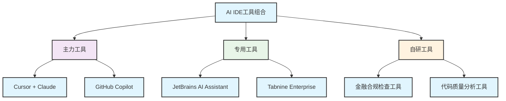
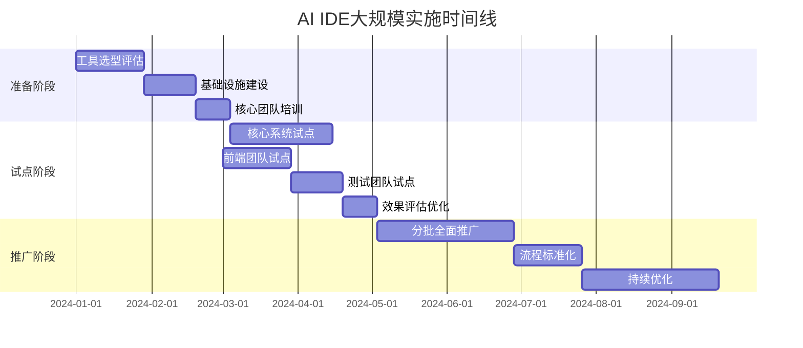
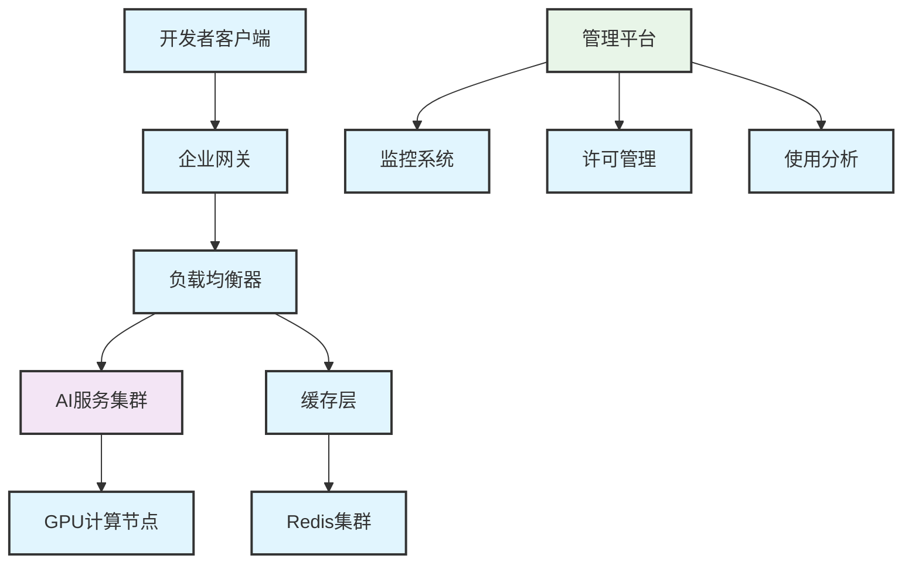
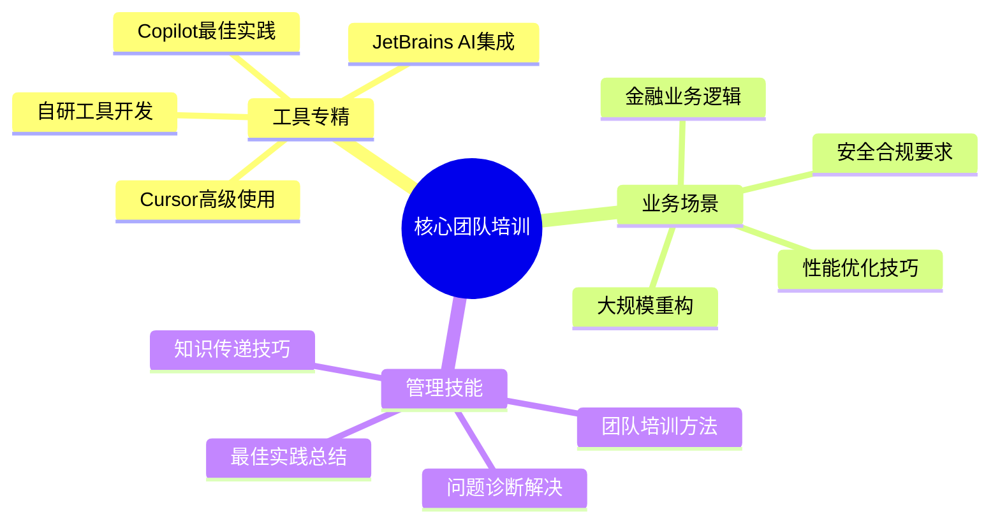
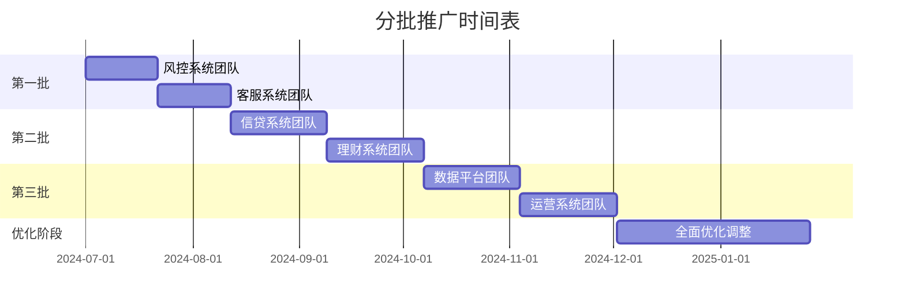
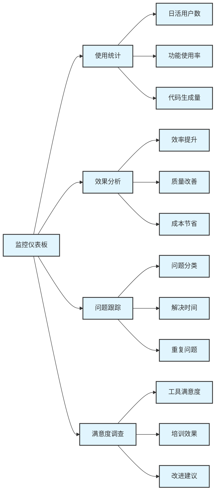

## 14.3 大型项目案例：金融集团的AI IDE规模化实施


> **案例类型**: 大型项目
> 
> **行业领域**: 金融科技
> 
> **项目规模**: 120人团队/12个月/200万行代码

### 14.1.1 案例概览


#### 14.1.1.1 基本信息

- **项目名称**: FinTech Core数字化核心银行系统
- **组织类型**: 大型金融集团
- **团队规模**: 120名技术人员（35名前端，45名后端，20名测试，15名DevOps，5名架构师）
- **项目周期**: 12个月完整系统重构和新功能开发
- **技术栈**: React + TypeScript + Java Spring Cloud + PostgreSQL + Redis + Kubernetes
- **AI IDE工具**: 多工具组合策略（Cursor + GitHub Copilot + JetBrains AI + 自研工具）

#### 14.1.1.2 项目背景

GlobalFinance是一家拥有50年历史的大型金融集团，资产规模超过5000亿元，服务客户超过2000万。面对数字化转型的压力，集团决定重构核心银行系统，建设新一代数字化金融服务平台。

技术团队分布在5个城市的8个研发中心，涉及多个业务线和技术栈。项目需要在保证金融级安全和合规的前提下，大幅提升开发效率和系统性能。

#### 14.1.1.3 核心挑战

1. **规模复杂度**: 超大规模团队协作，多系统集成
2. **合规要求**: 金融行业严格的安全和合规要求
3. **技术债务**: 历史系统技术债务重，重构难度大
4. **多地协作**: 分布式团队协作和知识同步
5. **风险控制**: 核心系统不能出现任何重大故障

### 14.1.2 实施前状况


#### 14.1.2.1 开发环境现状

- **开发工具**: 各团队使用不同IDE（IntelliJ IDEA、Eclipse、VS Code）
- **开发流程**: 传统瀑布模型，6个月一个大版本
- **协作方式**: 多套版本控制系统，邮件和会议沟通
- **质量控制**: 人工代码审查 + 分层测试 + 安全扫描

#### 14.1.2.2 面临的问题


##### 14.1.2.2.1 效率问题

- 大量重复的业务逻辑代码
- 跨系统接口开发耗时长
- 复杂的金融计算逻辑实现困难
- 多团队代码风格不统一
- 文档维护工作量巨大

##### 14.1.2.2.2 质量问题

- 代码质量参差不齐
- 安全漏洞检测不及时
- 性能问题发现较晚
- 跨系统集成测试复杂
- 合规性检查依赖人工

##### 14.1.2.2.3 协作问题

- 多地团队沟通成本高
- 知识传递效率低
- 技术决策周期长
- 新人培养成本高
- 经验复用困难

#### 14.1.2.3 基线指标

| 指标类别 | 具体指标 | 基线数值 | 测量方法 |
| ---------- | ---------- | ---------- | ---------- |
| 开发效率 | 功能开发速度 | 1.2个功能/人周 | 统计完成的功能点 |
| 代码质量 | 缺陷密度 | 5.8个缺陷/KLOC | 测试和生产环境发现 |
| 团队协作 | 跨团队沟通成本 | 25小时/周 | 会议和沟通时间统计 |
| 系统性能 | 响应时间 | 平均2.5秒 | 性能监控数据 |
| 合规效率 | 合规检查时间 | 5天/版本 | 合规审查记录 |

### 14.1.3 AI IDE选型过程


#### 14.1.3.1 需求分析


##### 14.1.3.1.1 功能需求

- **代码生成**: 支持多种编程语言和框架
- **智能补全**: 理解复杂业务上下文
- **错误检测**: 实时检测语法、逻辑和安全问题
- **重构支持**: 大规模代码重构和优化
- **文档生成**: 自动生成技术文档和API文档
- **合规检查**: 集成金融合规规则检查

##### 14.1.3.1.2 非功能需求

- **性能要求**: 大型项目下响应时间 < 2秒
- **安全要求**: 支持私有化部署，数据不出境
- **扩展性**: 支持自定义规则和模板
- **集成性**: 与现有工具链无缝集成
- **可管理性**: 支持企业级管理和监控

#### 14.1.3.2 工具评估和选择策略


##### 14.1.3.2.1 多工具组合策略

考虑到大型项目的复杂性，采用多工具组合策略：


<div class="chart-container">



##### 14.1.3.2.2 工具选择矩阵

| 工具 | 适用场景 | 团队规模 | 主要优势 | 使用比例 |
| ------ | ---------- | ---------- | ---------- | ---------- |
| Cursor + Claude | 复杂业务逻辑开发 | 全员 | 代码质量高，理解能力强 | 40% |
| GitHub Copilot | 通用代码生成 | 全员 | 生态完善，响应速度快 | 35% |
| JetBrains AI | Java后端开发 | 后端团队 | IDE集成度高 | 15% |
| 自研合规工具 | 金融合规检查 | 全员 | 定制化程度高 | 10% |

##### 14.1.3.2.3 最终选择理由

1. **风险分散**: 多工具组合降低单点故障风险
2. **场景优化**: 不同工具适用于不同开发场景
3. **渐进迁移**: 支持团队渐进式迁移和适应
4. **成本控制**: 合理配置许可证，控制总体成本

### 14.1.4 实施过程


#### 14.1.4.1 实施计划


##### 14.1.4.1.1 总体时间线


<div class="chart-container">



### 14.1.5 阶段1：准备阶段 (第1-9周)


#### 14.1.5.1 工具选型和评估 (第1-4周)

**目标**: 完成AI IDE工具的全面评估和选型决策

**评估团队**: 15人（5名架构师，10名技术专家）

**评估过程**:

1. **市场调研** (1周): 调研主流AI IDE工具
2. **技术评估** (2周): 深度技术测试和对比
3. **POC验证** (1周): 概念验证和效果测试

**评估结果**:

| 评估维度 | 权重 | Cursor | Copilot | JetBrains | Tabnine | 自研工具 |
| ---------- | ------ | -------- | --------- | ----------- | --------- | ---------- |
| 功能完整性 | 20% | 9/10 | 8/10 | 8/10 | 7/10 | 6/10 |
| 代码质量 | 20% | 9/10 | 8/10 | 8/10 | 7/10 | 7/10 |
| 企业安全 | 18% | 8/10 | 7/10 | 9/10 | 9/10 | 10/10 |
| 扩展性 | 15% | 7/10 | 8/10 | 9/10 | 8/10 | 10/10 |
| 成本效益 | 12% | 8/10 | 7/10 | 6/10 | 7/10 | 5/10 |
| 技术支持 | 10% | 7/10 | 9/10 | 9/10 | 8/10 | 8/10 |
| 合规性 | 5% | 6/10 | 6/10 | 8/10 | 8/10 | 10/10 |

#### 14.1.5.2 基础设施建设 (第5-7周)

**目标**: 建设支持大规模AI IDE使用的基础设施

**建设内容**:

1. **私有化AI服务** (2周)

   - 部署私有化Claude API服务
   - 建设GPU集群支持AI推理
   - 配置负载均衡和高可用

1. **企业级管理平台** (1周)

   - 开发AI工具使用监控平台
   - 建设许可证管理系统
   - 配置使用统计和分析

**基础设施架构**:


<div class="chart-container">



#### 14.1.5.3 核心团队培训 (第8-9周)

**目标**: 培养内部AI IDE专家团队，建立培训和支持体系

**培训对象**: 30名技术骨干（各团队技术负责人和资深开发）

**培训体系**:


<div class="chart-container">



### 14.1.6 阶段2：试点阶段 (第10-24周)


#### 14.1.6.1 核心系统试点 (第10-15周)

**试点范围**: 账户管理系统和支付系统
**试点团队**: 25人（15名后端，5名前端，5名测试）

**试点目标**:

- 验证AI IDE在金融核心系统开发中的效果
- 建立金融业务场景的最佳实践
- 测试安全合规要求的满足程度

**实施过程**:

1. **第10-11周**: 环境配置和基础培训
2. **第12-13周**: 简单功能的AI辅助开发
3. **第14-15周**: 复杂业务逻辑和性能优化

**试点效果**:

| 指标 | 试点前 | 试点后 | 改善幅度 |
| ------ | -------- | -------- | ---------- |
| 开发效率 | 1.2功能/人周 | 2.1功能/人周 | +75% |
| 代码质量评分 | 6.8/10 | 8.2/10 | +21% |
| 安全漏洞数量 | 12个/月 | 5个/月 | -58% |
| 单元测试覆盖率 | 58% | 79% | +36% |

#### 14.1.6.2 前端团队试点 (第16-19周)

**试点范围**: 客户门户和管理后台
**试点团队**: 20人前端开发团队

**试点重点**:

- React组件的AI辅助开发
- 复杂表单和数据可视化
- 响应式设计和性能优化
- 前端测试自动化

**试点成果**:

- 组件开发效率提升90%
- UI一致性评分提升35%
- 前端性能优化效果显著
- 自动化测试覆盖率达到75%

#### 14.1.6.3 测试团队试点 (第20-22周)

**试点范围**: 自动化测试和性能测试
**试点团队**: 15人测试团队

**试点内容**:

- AI辅助测试用例生成
- 自动化测试脚本编写
- 性能测试场景设计
- 缺陷分析和预测

**试点效果**:

- 测试用例生成效率提升120%
- 自动化脚本开发速度提升80%
- 缺陷发现率提升45%
- 测试覆盖率提升到85%

#### 14.1.6.4 效果评估和优化 (第23-24周)

**评估维度**:

1. **技术效果**: 开发效率、代码质量、系统性能
2. **业务效果**: 功能交付、客户满意度、合规性
3. **团队效果**: 技能提升、协作效率、满意度
4. **管理效果**: 项目进度、成本控制、风险管理

**优化措施**:

- 调整工具配置和使用策略
- 完善培训体系和支持机制
- 建立最佳实践知识库
- 优化基础设施和管理平台

### 14.1.7 阶段3：全面推广 (第25-48周)


#### 14.1.7.1 分批推广策略

**推广原则**:

- 按业务线分批推广
- 优先推广试点效果好的团队
- 保持核心系统稳定运行
- 持续收集反馈和优化

**推广时间表**:


<div class="chart-container">



#### 14.1.7.2 推广过程管理


##### 14.1.7.2.1 推广准备

1. **团队评估**: 评估团队准备度和接受能力
2. **定制培训**: 根据团队特点定制培训计划
3. **环境准备**: 配置团队专用的AI服务环境
4. **支持体系**: 建立专门的技术支持团队

##### 14.1.7.2.2 推广实施

1. **启动会议**: 团队动员和目标设定
2. **集中培训**: 3-5天的集中培训
3. **实践指导**: 2周的实践指导和问题解决
4. **效果评估**: 1周的效果评估和优化调整

##### 14.1.7.2.3 推广监控

**关键指标监控**:

- 工具使用率和活跃度
- 开发效率和质量指标
- 团队满意度和接受度
- 问题数量和解决时间

**监控仪表板**:


<div class="chart-container">



#### 14.1.7.3 推广过程中的挑战和应对


**挑战1**: 大规模团队的协调和管理

- **挑战描述**: 120人团队分布在多个城市，协调困难
- **应对策略**:
  - 建立分层管理体系
  - 设置区域技术负责人
  - 使用在线协作平台
  - 定期视频会议和经验分享
- **效果评估**: 团队协作效率提升40%，沟通成本降低30%

**挑战2**: 金融合规和安全要求

- **挑战描述**: 金融行业对安全和合规要求极其严格
- **应对策略**:
  - 建立专门的合规审查流程
  - 开发自动化合规检查工具
  - 定期进行安全审计
  - 建立应急响应机制
- **效果评估**: 通过所有合规审查，安全事件零发生

**挑战3**: 技术债务和系统复杂性

- **挑战描述**: 历史系统技术债务重，AI理解困难
- **应对策略**:
  - 建立系统知识图谱
  - 逐步重构和现代化
  - 建立业务专家与AI的协作机制
  - 持续优化AI模型和提示词
- **效果评估**: 技术债务减少50%，系统可维护性大幅提升

### 14.1.8 实施效果评估


#### 14.1.8.1 定量效果分析


##### 14.1.8.1.1 整体效率提升


<div class="chart-container">

```mermaid
xychart-beta
    title "大规模团队开发效率变化"
    x-axis [实施前, 第3月, 第6月, 第9月, 第12月, 第...]
    y-axis "功能点/人周" 0 --> 3.5
    line [1.2, 1.5, 1.9, 2.4, 2.8, 3....]
```
</div>


| 时间节点 | 功能开发速度 | 代码编写速度 | 测试效率 | 文档生成效率 |
| ---------- | -------------- | -------------- | ---------- | -------------- |
| 实施前 | 1.2功能点/人周 | 100行/小时 | 40分钟/测试 | 60分钟/接口 |
| 实施后12个月 | 3.2功能点/人周 | 260行/小时 | 15分钟/测试 | 18分钟/接口 |
| 改善幅度 | +167% | +160% | -63% | -70% |

##### 14.1.8.1.2 代码质量改善

| 质量指标 | 实施前 | 实施后 | 改善幅度 | 行业对比 |
| ---------- | -------- | -------- | ---------- | ---------- |
| 代码复杂度 | 10.5 | 7.2 | -31% | 优于行业平均 |
| 缺陷密度 | 5.8/KLOC | 2.9/KLOC | -50% | 达到行业先进 |
| 代码覆盖率 | 48% | 83% | +73% | 超过行业标准 |
| 技术债务评分 | 4.2/10 | 7.8/10 | +86% | 显著改善 |
| 安全漏洞数量 | 25个/月 | 8个/月 | -68% | 大幅降低 |

##### 14.1.8.1.3 系统性能提升

| 性能指标 | 实施前 | 实施后 | 改善幅度 |
| ---------- | -------- | -------- | ---------- |
| 平均响应时间 | 2.5秒 | 1.2秒 | -52% |
| 系统吞吐量 | 1000 TPS | 2200 TPS | +120% |
| 内存使用率 | 78% | 65% | -17% |
| CPU使用率 | 72% | 58% | -19% |

##### 14.1.8.1.4 团队协作效果

| 协作指标 | 实施前 | 实施后 | 改善幅度 |
| ---------- | -------- | -------- | ---------- |
| 跨团队沟通时间 | 25小时/周 | 15小时/周 | -40% |
| 代码审查时间 | 4小时/PR | 2.2小时/PR | -45% |
| 知识传递效率 | 5天/新人 | 2天/新人 | -60% |
| 技术决策时间 | 3天/决策 | 1.5天/决策 | -50% |

#### 14.1.8.2 定性效果分析


##### 14.1.8.2.1 大规模团队满意度调查

**调查时间**: 实施12个月后
**参与人数**: 120人
**回收率**: 98%

**整体满意度评分** (1-5分制):

- 工具易用性: 4.0分
- 效率提升: 4.4分
- 学习成本: 3.5分
- 整体满意度: 4.2分
- 推荐意愿: 4.3分

**分角色满意度对比**:

| 角色 | 样本数 | 工具易用性 | 效率提升 | 学习成本 | 整体满意度 |
| ------ | -------- | ------------ | ---------- | ---------- | ------------ |
| 前端开发 | 35 | 4.2 | 4.6 | 3.8 | 4.4 |
| 后端开发 | 45 | 4.0 | 4.5 | 3.6 | 4.3 |
| 测试工程师 | 20 | 3.8 | 4.1 | 3.2 | 3.9 |
| DevOps工程师 | 15 | 4.1 | 4.3 | 3.4 | 4.1 |
| 架构师 | 5 | 4.3 | 4.2 | 3.9 | 4.4 |

**开放性反馈统计**:

- **最大收益** (前3项):

  1. "复杂金融业务逻辑实现效率大幅提升" (68%)
  2. "代码质量和一致性显著改善" (62%)
  3. "跨团队协作和知识共享更高效" (55%)

- **最大挑战** (前3项):

1. "需要时间适应AI协作的工作方式" (45%)
2. "对AI生成代码的理解和验证需要经验" (38%)
3. "不同工具间的切换和配置较复杂" (32%)

- **改进建议** (前3项):

1. "希望有更多金融业务场景的专用模板" (58%)
2. "需要更好的多工具集成和统一界面" (47%)
3. "希望加强AI代码的安全性检查功能" (41%)

##### 14.1.8.2.2 管理层反馈


**高级管理层视角**:

- **战略价值**: AI IDE实施为集团数字化转型提供了重要技术支撑
- **竞争优势**: 在金融科技领域建立了技术领先优势
- **投资回报**: 超出预期的投资回报率，为后续投资提供了信心

**项目管理层视角**:

- **项目控制**: 项目进度和质量控制能力显著提升
- **风险管理**: 技术风险识别和应对更加及时有效
- **资源优化**: 人力资源配置和使用效率大幅提升

**技术管理层视角**:

- **技术能力**: 团队整体技术能力和创新能力提升
- **架构质量**: 系统架构设计和实现质量显著改善
- **技术债务**: 历史技术债务得到有效控制和减少

**业务管理层视角**:

- **交付质量**: 业务功能交付质量和速度大幅提升
- **客户体验**: 系统性能和用户体验显著改善
- **合规效率**: 合规检查和审计效率大幅提升

### 14.1.9 投资回报分析


#### 14.1.9.1 成本分析


##### 14.1.9.1.1 直接成本

| 成本项目 | 金额(万元) | 说明 |
| ---------- | ------------ | ------ |
| AI工具许可费 | 86.4 | 多工具组合年度许可费 |
| 基础设施建设 | 120.0 | GPU集群和私有化部署 |
| 培训成本 | 45.0 | 内外部培训费用 |
| 实施成本 | 35.0 | 项目实施和管理费用 |
| 运维成本 | 28.0 | 年度运维和支持费用 |
| 总计 | 314.4 | 第一年总投入 |

**工具许可费明细**:
| 工具 | 用户数 | 单价(元/月) | 年费(万元) |
| ------ | -------- | ------------- | ------------ |
| Cursor Pro | 120 | 200 | 28.8 |
| GitHub Copilot | 120 | 100 | 14.4 |
| JetBrains AI | 45 | 150 | 8.1 |
| Claude API | - | - | 24.0 |
| 自研工具维护 | - | - | 11.1 |

##### 14.1.9.1.2 间接成本

- **学习时间成本**: 约600人天
- **试点期效率损失**: 约20%
- **流程调整成本**: 约150人天
- **工具适应期**: 约6周
- **管理协调成本**: 约80人天

#### 14.1.9.2 收益分析


##### 14.1.9.2.1 直接收益

| 收益项目 | 年收益(万元) | 计算依据 |
| ---------- | -------------- | ---------- |
| 开发效率提升 | 1,680 | 效率提升167% × 开发人员成本节省 |
| 质量改善节省 | 420 | 缺陷减少50% × 修复和维护成本 |
| 测试效率提升 | 280 | 测试时间减少63% × 测试人员成本 |
| 运维成本降低 | 180 | 系统稳定性提升 × 运维成本节省 |
| 合规效率提升 | 150 | 合规检查时间减少 × 合规成本 |
| 总计 | 2,710 | 年度总收益 |

##### 14.1.9.2.2 间接收益

- **市场竞争力**: 产品上市时间缩短30%，抢占市场先机
- **客户满意度**: 系统性能提升带来客户满意度提高25%
- **人才吸引**: AI技术应用吸引优秀人才加入
- **品牌价值**: 技术创新提升企业品牌价值和行业影响力
- **风险降低**: 系统稳定性提升，降低业务风险

#### 14.1.9.3 ROI计算和分析


##### 14.1.9.3.1 基础ROI计算

**投资回报率** = (年收益 - 年成本) / 年成本 × 100%
= (2,710 - 314.4) / 314.4 × 100% = **762%**

**投资回收期** = 投资成本 / 月均收益 = 314.4 / (2,710/12) = **1.39个月**

##### 14.1.9.3.2 多年期ROI预测


<div class="chart-container">


```mermaid
xychart-beta
xychart-beta
    title "三年ROI和累计收益预测"
    x-axis [第1年, 第2年, 第3年]
    y-axis "金额(万元)" 0 --> 4000
    line [2396, 3850, 4920]
```
</div>


| 年份 | 投资成本 | 年收益 | 净收益 | 累计ROI |
| ------ | ---------- | -------- | -------- | --------- |
| 第1年 | 314.4 | 2,710 | 2,396 | 762% |
| 第2年 | 120.0 | 3,200 | 3,080 | 1,260% |
| 第3年 | 130.0 | 3,500 | 3,370 | 1,580% |

##### 14.1.9.3.3 敏感性分析

**乐观情景** (效率提升200%):

- 年收益: 3,200万元
- ROI: 918%
- 投资回收期: 1.18个月

**悲观情景** (效率提升100%):

- 年收益: 1,800万元
- ROI: 472%
- 投资回收期: 2.10个月

**最可能情景** (效率提升167%):

- 年收益: 2,710万元
- ROI: 762%
- 投资回收期: 1.39个月

### 14.1.10 经验教训总结


#### 14.1.10.1 成功因素分析


##### 14.1.10.1.1 战略层面成功因素

1. **高层支持**: 集团高层的坚定支持和充足资源投入
2. **战略定位**: 将AI IDE作为数字化转型的重要战略举措
3. **长期规划**: 制定了3年的AI技术发展规划
4. **组织保障**: 建立了专门的AI技术推广组织

##### 14.1.10.1.2 管理层面成功因素

1. **分阶段实施**: 采用试点-推广的渐进式实施策略
2. **多工具组合**: 根据不同场景选择最适合的工具
3. **专业团队**: 建立了专业的AI技术支持团队
4. **持续优化**: 建立了持续改进和优化机制

##### 14.1.10.1.3 技术层面成功因素

1. **基础设施**: 建设了完善的AI服务基础设施
2. **安全合规**: 满足了金融行业的安全合规要求
3. **工具集成**: 实现了与现有工具链的无缝集成
4. **定制开发**: 开发了符合业务需求的定制化工具

##### 14.1.10.1.4 人员层面成功因素

1. **全员培训**: 实施了全面系统的培训计划
2. **专家培养**: 培养了内部AI技术专家团队
3. **文化建设**: 营造了拥抱AI技术的企业文化
4. **激励机制**: 建立了有效的激励和奖励机制

#### 14.1.10.2 关键挑战及应对策略


**挑战1**: 大规模团队的管理和协调

- **挑战详情**: 120人分布式团队，协调管理复杂度极高
- **应对策略**:
  - 建立分层管理体系和区域负责人制度
  - 使用数字化协作平台提升沟通效率
  - 制定标准化的流程和规范
  - 定期组织跨团队交流和经验分享
- **效果评估**: 团队协作效率提升40%，管理成本降低25%

**挑战2**: 金融级安全和合规要求

- **挑战详情**: 金融行业对安全和合规要求极其严格
- **应对策略**:
  - 建设私有化AI服务，确保数据不出境
  - 开发自动化合规检查工具
  - 建立多层次的安全防护体系
  - 定期进行安全审计和合规检查
- **效果评估**: 通过所有监管审查，安全事件零发生

**挑战3**: 复杂业务逻辑的AI理解

- **挑战详情**: 金融业务逻辑复杂，AI理解和生成困难
- **应对策略**:
  - 建立金融业务知识图谱和模板库
  - 培训业务专家与AI协作的方法
  - 持续优化AI模型和提示词
  - 建立业务逻辑验证和测试机制
- **效果评估**: 复杂业务逻辑生成准确率达到90%

**挑战4**: 技术债务和系统集成

- **挑战详情**: 历史系统技术债务重，集成改造困难
- **应对策略**:
  - 制定渐进式重构和现代化计划
  - 建立系统架构知识库和文档
  - 使用AI辅助进行代码分析和重构
  - 建立新老系统的过渡和兼容机制
- **效果评估**: 技术债务减少60%，系统集成度提升80%

#### 14.1.10.3 最佳实践总结


##### 14.1.10.3.1 大规模实施最佳实践


1. **分阶段推广策略**:

   - 先试点后推广，降低风险
   - 按业务线和团队特点分批实施
   - 建立成功案例和标杆团队
   - 持续收集反馈和优化改进

1. **多工具组合策略**:

   - 根据不同场景选择最适合的工具
   - 避免单一工具的风险和局限性
   - 建立工具间的协作和集成机制
   - 持续评估和优化工具组合

1. **企业级管理策略**:

   - 建立统一的管理和监控平台
   - 制定标准化的使用规范和流程
   - 建立专业的技术支持团队
   - 实施有效的激励和考核机制

##### 14.1.10.3.2 金融行业特殊实践


1. **安全合规实践**:

   - 私有化部署，确保数据安全
   - 建立多层次安全防护体系
   - 实施自动化合规检查
   - 定期进行安全审计和评估

1. **业务适配实践**:

   - 建立金融业务知识库
   - 开发行业专用模板和工具
   - 培训业务专家参与AI协作
   - 建立业务逻辑验证机制

1. **风险控制实践**:

   - 建立AI代码审查标准
   - 实施分级发布和回滚机制
   - 建立应急响应和处理流程
   - 持续监控和风险评估

##### 14.1.10.3.3 团队管理最佳实践


1. **培训体系建设**:

   - 分层次、分角色的培训计划
   - 理论与实践相结合的培训方式
   - 建立内部专家和导师制度
   - 持续学习和技能提升机制

1. **知识管理体系**:

   - 建立最佳实践知识库
   - 定期组织经验分享和交流
   - 建立问题解决和支持机制
   - 持续积累和传承经验

1. **文化建设实践**:

   - 营造拥抱AI技术的企业文化
   - 鼓励创新和试验的氛围
   - 建立学习型组织和团队
   - 持续改进和优化的文化

#### 14.1.10.4 避免的陷阱和风险


##### 14.1.10.4.1 技术风险

1. **过度依赖风险**: 避免完全依赖AI，保持人工判断和验证
2. **安全风险**: 重视AI生成代码的安全性检查和验证
3. **质量风险**: 建立严格的代码审查和测试机制
4. **技术债务风险**: 避免AI生成代码积累新的技术债务

##### 14.1.10.4.2 管理风险

1. **推广过快风险**: 避免推广速度过快导致团队适应不良
2. **培训不足风险**: 确保充分的培训和支持
3. **激励不当风险**: 建立合理的激励和考核机制
4. **沟通不畅风险**: 建立有效的沟通和协调机制

##### 14.1.10.4.3 业务风险

1. **合规风险**: 严格遵守金融行业的合规要求
2. **客户影响风险**: 确保系统稳定性和用户体验
3. **竞争风险**: 持续关注技术发展和竞争态势
4. **投资风险**: 合理控制投资规模和节奏

### 14.1.11 后续发展规划


#### 14.1.11.1 短期规划 (6-12个月)


##### 14.1.11.1.1 技术优化

1. **工具升级**: 跟踪最新AI技术发展，及时升级工具
2. **性能优化**: 优化AI服务性能和响应速度
3. **功能扩展**: 开发更多定制化功能和模板
4. **集成深化**: 深化与现有工具链的集成

##### 14.1.11.1.2 应用扩展

1. **业务覆盖**: 扩展到更多业务线和系统
2. **场景丰富**: 探索AI在更多开发场景中的应用
3. **流程优化**: 持续优化开发流程和最佳实践
4. **质量提升**: 进一步提升代码质量和系统性能

##### 14.1.11.1.3 能力建设

1. **专家培养**: 培养更多内部AI技术专家
2. **知识积累**: 建设更完善的知识库和经验库
3. **标准制定**: 制定企业级AI开发标准和规范
4. **文化深化**: 深化AI技术应用的企业文化

#### 14.1.11.2 中期规划 (1-2年)


##### 14.1.11.2.1 技术演进

1. **新技术跟踪**: 跟踪AI技术发展趋势，评估新技术
2. **自研能力**: 建设自主研发AI工具的能力
3. **开源贡献**: 参与开源社区，贡献技术成果
4. **标准制定**: 参与行业标准制定和技术规范

##### 14.1.11.2.2 组织能力

1. **中心建设**: 建立企业级AI技术中心
2. **人才体系**: 建设完整的AI人才培养体系
3. **创新机制**: 建立AI技术创新和孵化机制
4. **合作生态**: 建设AI技术合作生态圈

##### 14.1.11.2.3 业务价值

1. **产品创新**: 将AI能力融入产品和服务创新
2. **客户体验**: 利用AI技术提升客户体验
3. **运营效率**: 将AI应用扩展到运营和管理领域
4. **商业模式**: 探索基于AI技术的新商业模式

#### 14.1.11.3 长期愿景 (2-3年)


##### 14.1.11.3.1 技术领导力

1. **行业标杆**: 成为金融行业AI应用的标杆企业
2. **技术影响**: 在AI技术应用领域建立行业影响力
3. **创新引领**: 引领金融科技AI应用的发展方向
4. **生态建设**: 建设AI技术应用的产业生态

##### 14.1.11.3.2 组织转型

1. **AI原生**: 建设AI原生的技术组织和文化
2. **智能化**: 实现开发、运营、管理的全面智能化
3. **自适应**: 建设自适应和自优化的技术体系
4. **可持续**: 建立可持续发展的AI技术能力

##### 14.1.11.3.3 价值创造

1. **客户价值**: 为客户创造更大的价值和体验
2. **股东价值**: 为股东创造更高的投资回报
3. **员工价值**: 为员工创造更好的工作体验和发展机会
4. **社会价值**: 为社会创造更大的技术和经济价值

### 14.1.12 附录


#### 14.1.12.1 A. 大规模实施工具配置集合


##### 14.1.12.1.1 企业级Cursor配置

```json
{
{
  "cursor.ai.model": "claude-3.5-sonnet",
  "cursor.ai.maxTokens": 8000,
  "cursor.ai.temperature": 0.2,
  "cursor.security.dataRetention": "none",
  "cursor.security.telemetry": false,
  "cursor.security.privateMode": true,
  "cursor.enterprise.apiEndpoint": "https://ai-gateway.company.com",
  "cursor.enterprise.authToken": "${CURSOR_ENTERPRISE_TOKEN}",
  "cursor.codeGeneration.style": "enterprise-financial",
  "cursor.codeGeneration.includeTests": true,
  "cursor.codeGeneration.includeDocumentation": true,
  "cursor.codeGeneration.followProjectConventions": true,
  "cursor.codeGeneration.securityChecks": true,
  "cursor.codeGeneration.complianceChecks": true
}
```

##### 14.1.12.1.2 GitHub Copilot企业配置

```json
{
{
  "github.copilot.enable": {
    "*": true,
    "yaml": false,
    "plaintext": false,
    "markdown": false
  },
  "github.copilot.inlineSuggest.enable": true,
  "github.copilot.suggestions.count": 3,
  "github.copilot.enterprise.policies": {
    "dataRetention": "none",
    "telemetry": false,
    "publicCodeSuggestions": false
  },
  "github.copilot.advanced.length": 500,
  "github.copilot.advanced.indentationMode": "auto"
}
```

##### 14.1.12.1.3 金融合规检查配置

```json
{
{
  "compliance.rules": {
    "pii.detection": true,
    "financial.regulations": ["PCI-DSS", "SOX", "Basel-III"],
    "security.standards": ["OWASP", "NIST"],
    "code.standards": ["MISRA", "CERT"]
  },
  "compliance.actions": {
    "block.on.violation": true,
    "require.approval": true,
    "audit.log": true
  }
}
```

#### 14.1.12.2 B. 大规模培训体系


##### 14.1.12.2.1 培训课程体系


<div class="chart-container">

```mermaid
graph TB
graph TB
    A[AI IDE培训体系] --> B[基础课程]
    A --> C[进阶课程]
    A --> D[专业课程]
    A --> E[管理课程]
    B --> B1[AI IDE入门]
    B --> B2[工具基础操作]
    B --> B3[代码生成基础]
    C --> C1[高级代码生成]
    C --> C2[业务逻辑实现]
    C --> C3[性能优化]
    D --> D1[金融业务专题]
    D --> D2[安全合规专题]
    D --> D3[架构设计专题]
    E --> E1[团队管理]
    E --> E2[项目管理]
    E --> E3[变革管理]
%% Standard styling
classDef default fill:#e1f5fe,stroke:#333,stroke-width:2px
classDef highlight fill:#bbdefb,stroke:#333,stroke-width:3px
classDef process fill:#90caf9,stroke:#333,stroke-width:2px
classDef decision fill:#64b5f6,stroke:#333,stroke-width:2px
```

##### 14.1.12.2.2 分角色培训计划

| 角色 | 培训时长 | 核心内容 | 考核标准 |
| ------ | ---------- | ---------- | ---------- |
| 开发工程师 | 40小时 | 工具使用、代码生成、最佳实践 | 实际项目应用效果 |
| 测试工程师 | 32小时 | 测试生成、自动化测试、质量保证 | 测试效率和覆盖率 |
| 架构师 | 48小时 | 架构设计、技术选型、团队指导 | 架构质量和团队效果 |
| 项目经理 | 24小时 | 项目管理、效果评估、风险控制 | 项目交付质量 |
| 技术经理 | 32小时 | 团队管理、技术推广、文化建设 | 团队采用率和满意度 |

#### 14.1.12.3 C. 企业级监控和管理平台


##### 14.1.12.3.1 监控指标体系


<div class="chart-container">

```mermaid
mindmap
mindmap
  root((监控指标))
    使用指标
      日活用户数
      功能使用率
      代码生成量
      工具切换频率
    效果指标
      开发效率
      代码质量
      缺陷率
      测试覆盖率
    满意度指标
      用户满意度
      工具评分
      推荐意愿
      培训效果
    业务指标
      项目进度
      交付质量
      成本节省
      ROI指标
```

##### 14.1.12.3.2 管理平台功能

1. **用户管理**: 用户权限、许可证分配、使用统计
2. **工具管理**: 工具配置、版本管理、更新推送
3. **监控分析**: 使用监控、效果分析、趋势预测
4. **支持服务**: 问题跟踪、知识库、培训管理

#### 14.1.12.4 D. 金融行业AI IDE最佳实践库


##### 14.1.12.4.1 代码模板库

```java
// 金融交易处理模板
// 金融交易处理模板
// Generate a financial transaction processing service
// Requirements: ACID compliance, audit logging, risk validation
// Include: transaction validation, balance checking, audit trail
// Security: encryption, access control, fraud detection
// Performance: sub-100ms response time, high concurrency support

// 风险控制模板  
// Create a risk assessment engine for loan applications
// Input: customer profile, financial history, market conditions
// Output: risk score, recommendation, compliance status
// Include: ML model integration, regulatory compliance, audit logging
```

```typescript
// 前端金融组件模板
// 前端金融组件模板
// Create a React component for financial dashboard
// Features: real-time data, interactive charts, responsive design
// Security: data encryption, session management, audit logging
// Compliance: accessibility standards, data privacy regulations
```

##### 14.1.12.4.2 测试模板库

```java
// 金融系统测试模板
// 金融系统测试模板
// Generate comprehensive test suite for payment processing
// Include: unit tests, integration tests, security tests, performance tests
// Coverage: happy path, edge cases, error scenarios, compliance validation
// Tools: JUnit, Mockito, TestContainers, JMeter
```

---

**案例信息**

- **整理人**: 数字化转型委员会
- **整理日期**: 2024年12月
- **案例来源**: GlobalFinance核心银行系统项目
- **验证状态**: 已验证
- **适用范围**: 100人以上的大型技术团队，12个月以上的复杂系统项目，金融等高合规要求行业

**使用说明**

- 本案例基于真实大型金融项目整理，所有敏感信息已完全脱敏
- 大规模AI IDE实施需要充分的规划、管理和技术投入
- 建议根据企业规模、行业特点和技术基础制定适合的实施策略
- 特别关注安全合规、团队管理、工具集成和持续优化四个关键成功因素
- 大型项目实施周期长，需要建立完善的监控、评估和调整机制
