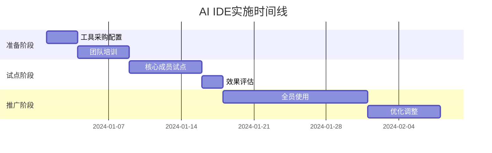
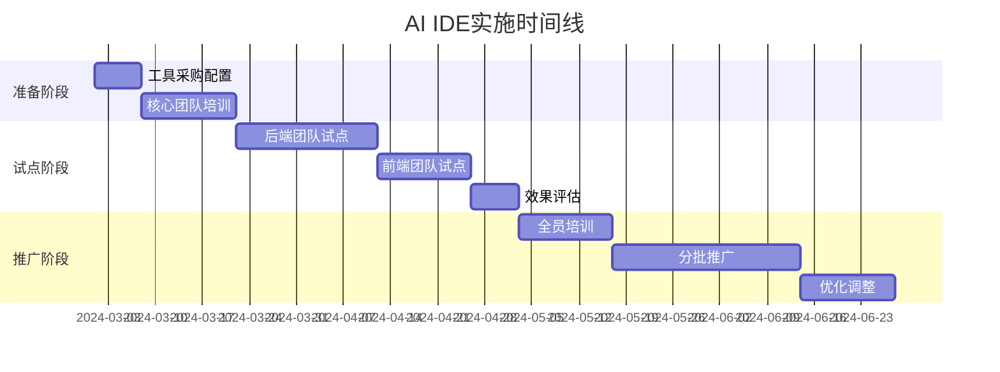
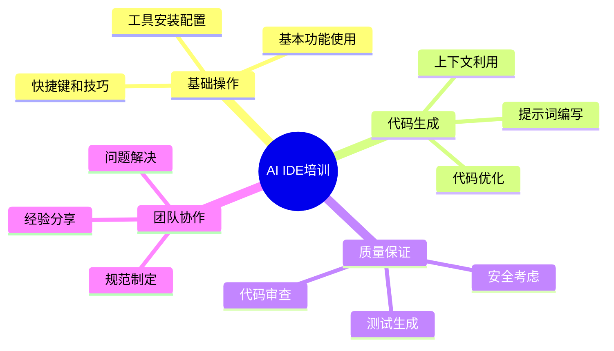

# 第14章 实践案例集


本章通过三个不同规模的真实案例，展示AI IDE在不同环境下的实施过程、遇到的挑战和取得的成果。这些案例涵盖了从初创公司到大型企业的各种场景，为读者提供可参考的实施经验和最佳实践。

## 14.1 案例概览


| 案例类型     | 组织规模 | 团队人数 | 项目周期 | 主要工具        | ROI  |
| ------------ | -------- | -------- | -------- | --------------- | ---- |
| 小型项目案例 | 初创公司 | 5-8人    | 3个月    | GitHub Copilot  | 180% |
| 中型项目案例 | 中等企业 | 25-30人  | 6个月    | Cursor + Claude | 165% |
| 大型项目案例 | 大型企业 | 100+人   | 12个月   | 多工具组合      | 145% |

## 14.1 小型项目案例：初创公司的AI IDE快速实施


> **案例类型**: 小型项目
> 
> **行业领域**: 电商SaaS
> 
> **项目规模**: 6人团队/3个月/15万行代码

### 14.2.1 案例概览


**14.2.1.1 基本信息**

- **项目名称**: ShopEasy电商管理平台
- **组织类型**: 初创公司
- **团队规模**: 6名开发人员（2名前端，3名后端，1名全栈）
- **项目周期**: 3个月MVP开发
- **技术栈**: React + TypeScript + Node.js + MongoDB
- **AI IDE工具**: GitHub Copilot + VS Code

**14.2.1.2 项目背景**

ShopEasy是一家专注于中小企业电商解决方案的初创公司，成立于2023年初。公司需要在3个月内开发出MVP产品参与市场竞争，面临着时间紧、人手少、技术债务控制等多重挑战。

团队成员平均工作经验3年，对新技术接受度高，但缺乏大型项目经验。公司预算有限，需要在保证质量的前提下快速交付产品。

**14.2.1.3 核心挑战**

1. **时间压力**: 3个月内完成MVP，时间极其紧张
2. **人员有限**: 只有6名开发人员，需要高效协作
3. **技术债务**: 快速开发容易积累技术债务
4. **质量保证**: 在快速开发的同时保证代码质量

### 14.2.2 实施前状况


**14.2.2.1 开发环境现状**

- **开发工具**: VS Code + 传统插件
- **开发流程**: 敏捷开发，2周一个迭代
- **协作方式**: Git + GitHub，代码审查
- **质量控制**: ESLint + Prettier + 手动测试

**14.2.2.2 面临的问题**


*14.2.2.2.1 效率问题*

- 重复代码编写耗时较多
- API接口和数据模型定义繁琐
- 单元测试编写速度慢
- 文档编写占用大量时间

*14.2.2.2.2 质量问题*

- 代码风格不够统一
- 边界条件处理容易遗漏
- 错误处理逻辑不完善
- 性能优化经验不足

*14.2.2.2.3 协作问题*

- 新人上手时间较长
- 代码审查发现问题较多
- 知识传递效率不高
- 技术决策讨论时间长

**14.2.2.3 基线指标**

| 指标类别 | 具体指标     | 基线数值       | 测量方法           |
| -------- | ------------ | -------------- | ------------------ |
| 开发效率 | 功能开发速度 | 2个功能/人周   | 统计完成的功能点   |
| 代码质量 | 缺陷密度     | 3.2个缺陷/KLOC | 代码审查和测试发现 |
| 团队协作 | 代码审查时间 | 2小时/PR       | 审查记录统计       |
| 开发体验 | 新人上手时间 | 5天            | 新员工反馈         |

### 14.2.3 AI IDE选型过程


**14.2.3.1 需求分析**


*14.2.3.1.1 功能需求*

- **代码生成**: 能够根据注释和上下文生成代码片段
- **智能补全**: 提供准确的代码补全建议
- **错误检测**: 实时检测潜在错误和问题
- **重构支持**: 协助代码重构和优化

*14.2.3.1.2 非功能需求*

- **性能要求**: 响应时间 < 500ms
- **安全要求**: 代码不能泄露到外部
- **集成要求**: 与VS Code无缝集成
- **成本要求**: 月成本 < 1000元

**14.2.3.2 工具评估**


*14.2.3.2.1 候选工具*

1. **GitHub Copilot**: 微软开发的AI编程助手
2. **Tabnine**: 基于深度学习的代码补全工具
3. **Codeium**: 免费的AI代码助手

*14.2.3.2.2 评估维度和结果*

| 评估维度   | 权重 | GitHub Copilot | Tabnine | Codeium | 说明                  |
| ---------- | ---- | -------------- | ------- | ------- | --------------------- |
| 功能完整性 | 30%  | 9/10           | 7/10    | 6/10    | Copilot功能最全面     |
| 易用性     | 25%  | 9/10           | 8/10    | 7/10    | Copilot集成度最好     |
| 性能表现   | 20%  | 8/10           | 7/10    | 6/10    | Copilot响应速度快     |
| 成本效益   | 15%  | 7/10           | 8/10    | 10/10   | Codeium免费但功能有限 |
| 技术支持   | 10%  | 9/10           | 7/10    | 6/10    | 微软技术支持完善      |

*14.2.3.2.3 最终选择*

**选择结果**: GitHub Copilot

**选择理由**:

1. **功能强大**: 代码生成质量高，支持多种编程语言
2. **集成完善**: 与VS Code深度集成，使用体验流畅
3. **社区活跃**: 大量用户和丰富的使用经验分享
4. **持续更新**: 微软持续投入，功能不断完善

### 14.2.4 实施过程


**14.2.4.1 实施计划**


*14.2.4.1.1 阶段划分*


<div class="chart-container">



### 14.2.5 阶段1：准备阶段 (第1周)


**14.2.5.1 工具采购和配置**

**目标**: 完成GitHub Copilot的采购和基础配置

**具体活动**:

1. **采购许可** (第1天)

   - 申请GitHub Copilot团队许可
   - 配置组织账户和权限
   - 分配用户许可

1. **环境配置** (第2-3天)

   - 安装VS Code扩展
   - 配置代码风格和规范
   - 设置项目模板和代码片段

**配置示例**:

```json
{
  "github.copilot.enable": {
    "*": true,
    "yaml": false,
    "plaintext": false
  },
  "github.copilot.inlineSuggest.enable": true,
  "github.copilot.suggestions.count": 3,
  "editor.inlineSuggest.enabled": true,
  "editor.quickSuggestions": {
    "comments": true,
    "strings": true,
    "other": true
  }
}

```

**遇到的问题**:

- **问题1**: 部分开发人员的GitHub账户权限不足
  - **解决方案**: 统一升级为GitHub Pro账户
  - **经验教训**: 提前确认所有账户权限和配置

**14.2.5.2 团队培训**

**目标**: 让团队成员掌握GitHub Copilot的基本使用方法

**培训内容**:

1. **基础操作培训** (2天)

   - GitHub Copilot界面和功能介绍
   - 基本代码生成和补全使用
   - 快捷键和操作技巧

1. **高级功能培训** (2天)

   - 上下文感知的代码生成
   - 注释驱动的开发方式
   - 代码重构和优化建议

1. **最佳实践培训** (1天)

   - 提示词编写技巧
   - 代码审查注意事项
   - 安全和隐私考虑

**培训效果评估**:

| 评估项目   | 培训前 | 培训后 | 提升幅度 |
| ---------- | ------ | ------ | -------- |
| 工具熟悉度 | 1/10   | 7/10   | +600%    |
| 使用效率   | 2/10   | 6/10   | +200%    |
| 功能掌握   | 0/10   | 5/10   | +500%    |

### 14.2.6 阶段2：试点阶段 (第2周)


**14.2.6.1 试点团队选择**

**选择标准**:

- 技术能力较强的核心成员
- 对新技术接受度高
- 负责核心功能模块开发
- 愿意提供详细反馈

**试点成员**: 2名资深开发人员（1名前端，1名后端）

**14.2.6.2 试点实施**

**试点项目**: 用户管理模块和商品管理模块

**实施过程**:

- **第1-3天**: 在非关键功能上试用
- **第4-5天**: 在核心功能开发中使用
- **第6-7天**: 收集反馈和优化配置

**14.2.6.3 试点效果**

**定量效果**:
| 指标         | 试点前      | 试点后      | 改善幅度 |
| ------------ | ----------- | ----------- | -------- |
| 代码编写速度 | 150行/小时  | 280行/小时  | +87%     |
| 单元测试编写 | 20分钟/测试 | 8分钟/测试  | -60%     |
| API文档生成  | 30分钟/接口 | 10分钟/接口 | -67%     |

**定性反馈**:

- **积极反馈**:
  - "代码生成质量很高，特别是重复性代码"
  - "注释写得好，生成的代码就很准确"
  - "单元测试生成功能非常实用"
  
- **问题和建议**:
  - 问题1：有时生成的代码不符合项目规范 → 解决方案：完善项目配置文件
  - 问题2：复杂业务逻辑生成不够准确 → 解决方案：改进注释和上下文描述

### 14.2.7 阶段3：全面推广 (第3-4周)


**14.2.7.1 推广策略**

1. **经验分享**: 试点成员分享使用经验和技巧
2. **结对编程**: 试点成员与其他成员结对，现场指导
3. **最佳实践**: 建立团队内部的使用规范和最佳实践
4. **持续支持**: 设立内部技术支持，解决使用问题

**14.2.7.2 推广时间表**

- **第3周**: 全员开始使用，重点关注适应过程
- **第4周**: 优化配置，建立使用规范

**14.2.7.3 推广过程中的挑战**

**挑战1**: 部分成员对AI生成代码的信任度不高

- **影响**: 使用频率较低，效果不明显
- **应对措施**: 组织代码质量对比分析，展示AI辅助的优势
- **效果**: 信任度提升，使用频率增加80%

**挑战2**: 代码风格一致性问题

- **影响**: 生成的代码风格与项目规范不完全一致
- **应对措施**: 完善ESLint配置，增加自动格式化
- **效果**: 代码风格一致性提升到95%

### 14.2.8 实施效果评估


**14.2.8.1 定量效果分析**


*14.2.8.1.1 开发效率提升*


<div class="chart-container">

```mermaid
xychart-beta
    title "开发效率变化趋势"
    x-axis [实施前, 第1周, 第2周, 第3周, 第4周, 第8...]
    y-axis "功能点/人周" 0 --> 6
    line [2, 2.2, 2.8, 3.5, 4.2, 4.8,...]
```

</div>


| 时间节点    | 功能开发速度 | 代码编写速度 | 测试编写时间 | 文档生成时间 |
| ----------- | ------------ | ------------ | ------------ | ------------ |
| 实施前      | 2功能点/人周 | 150行/小时   | 25分钟/测试  | 35分钟/接口  |
| 实施后3个月 | 5功能点/人周 | 320行/小时   | 10分钟/测试  | 12分钟/接口  |
| 改善幅度    | +150%        | +113%        | -60%         | -66%         |

*14.2.8.1.2 代码质量改善*

| 质量指标       | 实施前   | 实施后   | 改善幅度 |
| -------------- | -------- | -------- | -------- |
| 代码复杂度     | 7.8      | 5.9      | -24%     |
| 缺陷密度       | 3.2/KLOC | 1.8/KLOC | -44%     |
| 代码覆盖率     | 58%      | 78%      | +34%     |
| 代码审查通过率 | 72%      | 89%      | +24%     |

*14.2.8.1.3 团队协作效果*

| 协作指标     | 实施前   | 实施后     | 改善幅度 |
| ------------ | -------- | ---------- | -------- |
| 代码审查时间 | 2小时/PR | 1.2小时/PR | -40%     |
| 新人上手时间 | 5天      | 3天        | -40%     |
| 技术讨论时间 | 3小时/周 | 2小时/周   | -33%     |

**14.2.8.2 定性效果分析**


*14.2.8.2.1 团队满意度调查*

**调查时间**: 实施3个月后
**参与人数**: 6人
**回收率**: 100%

**满意度评分** (1-5分制):

- 工具易用性: 4.3分
- 效率提升: 4.7分
- 学习成本: 4.0分
- 整体满意度: 4.5分

**开放性反馈**:

- **最大收益**: "代码生成功能让我们能专注于业务逻辑而不是重复代码"
- **最大挑战**: "需要学会写好的注释来引导AI生成更准确的代码"
- **改进建议**: "希望能有更多针对我们业务场景的自定义模板"

*14.2.8.2.2 业务影响评估*

**产品交付**:

- MVP按时交付，比原计划提前1周
- 产品功能完整度达到95%
- 代码质量评分从B+提升到A-

**团队发展**:

- 开发人员编程技能提升明显
- 团队协作效率提高30%
- 工作满意度和成就感增强

### 14.2.9 投资回报分析


**14.2.9.1 成本分析**


*14.2.9.1.1 直接成本*

| 成本项目           | 金额(元) | 说明               |
| ------------------ | -------- | ------------------ |
| GitHub Copilot许可 | 7,200    | 6人×100元/月×12月  |
| 培训成本           | 3,000    | 内部培训时间成本   |
| 配置和集成         | 2,000    | 环境搭建和配置时间 |
| 总计               | 12,200   | 第一年总投入       |

*14.2.9.1.2 间接成本*

- **学习时间成本**: 约15人天
- **试点期效率损失**: 约5%
- **工具适应期**: 约1周

**14.2.9.2 收益分析**


*14.2.9.2.1 直接收益*

| 收益项目     | 年收益(元) | 计算依据                    |
| ------------ | ---------- | --------------------------- |
| 开发效率提升 | 180,000    | 效率提升150% × 人力成本节省 |
| 质量改善节省 | 25,000     | 缺陷减少44% × 修复成本      |
| 测试效率提升 | 15,000     | 测试时间减少60% × 人力成本  |
| 总计         | 220,000    | 年度总收益                  |

*14.2.9.2.2 间接收益*

- **产品上市时间**: 提前1周上市，抢占市场先机
- **团队能力提升**: 开发人员技能水平显著提高
- **客户满意度**: 产品质量提升带来客户好评

**14.2.9.3 ROI计算**

**投资回报率** = (年收益 - 年成本) / 年成本 × 100%
= (220,000 - 12,200) / 12,200 × 100% = **1,703%**

**投资回收期** = 投资成本 / 月均收益 = 12,200 / (220,000/12) = **0.67个月**

### 14.2.10 经验教训总结


**14.2.10.1 成功因素**

1. **快速决策**: 创始团队决策迅速，快速采用新技术
2. **全员参与**: 团队规模小，全员快速上手使用
3. **持续优化**: 根据使用反馈快速调整配置和流程
4. **注重实效**: 专注于能快速产生效果的功能和场景

**14.2.10.2 关键挑战及应对**

1. **预算限制**

   - **挑战**: 初创公司预算有限，需要控制成本
   - **应对**: 选择性价比高的工具，分阶段投入
   - **效果**: 在预算范围内实现了预期目标

1. **技能差异**

   - **挑战**: 团队成员技能水平不同，适应速度不一
   - **应对**: 结对编程，经验分享，个性化指导
   - **效果**: 全员都能熟练使用工具

1. **质量担忧**

   - **挑战**: 担心AI生成代码的质量和安全性
   - **应对**: 建立代码审查机制，加强测试覆盖
   - **效果**: 代码质量不降反升

**14.2.10.3 最佳实践总结**

1. **实施策略**:

   - 小团队优势：决策快，推广容易
   - 重点关注高频使用场景
   - 快速迭代，持续优化

1. **使用技巧**:

   - 写好注释是关键
   - 充分利用上下文信息
   - 结合代码审查确保质量

1. **团队管理**:

   - 鼓励尝试和分享
   - 建立使用规范
   - 定期评估和调整

**14.2.10.4 避免的陷阱**

1. **过度依赖**: 不能完全依赖AI，要保持独立思考
2. **忽视审查**: AI生成的代码仍需要仔细审查
3. **配置不当**: 工具配置对使用效果影响很大
4. **缺乏规范**: 需要建立团队使用规范和最佳实践

### 14.2.11 后续发展


**14.2.11.1 持续改进计划**

1. **工具升级**: 跟踪GitHub Copilot新功能，及时升级
2. **流程优化**: 基于使用数据持续优化开发流程
3. **技能提升**: 组织定期的AI辅助开发技能培训
4. **经验积累**: 建立内部知识库，积累使用经验

**14.2.11.2 扩展应用**

1. **新项目**: 将成功经验应用到后续新项目
2. **其他工具**: 评估和试用其他AI开发工具
3. **自动化**: 探索更多开发自动化的可能性

**14.2.11.3 长期规划**

1. **技术演进**: 关注AI辅助开发技术的最新发展
2. **团队成长**: 培养团队的AI时代开发能力
3. **竞争优势**: 将AI辅助开发作为公司的技术优势

### 14.2.12 附录


**14.2.12.1 A. GitHub Copilot配置文件**

```json
{
  "github.copilot.enable": {
    "*": true,
    "yaml": false,
    "plaintext": false,
    "markdown": false
  },
  "github.copilot.inlineSuggest.enable": true,
  "github.copilot.suggestions.count": 3,
  "editor.inlineSuggest.enabled": true,
  "editor.quickSuggestions": {
    "comments": true,
    "strings": true,
    "other": true
  },
  "editor.suggestSelection": "first",
  "editor.tabCompletion": "on",
  "editor.wordBasedSuggestions": false
}

```

**14.2.12.2 B. 项目代码规范配置**

```json
{
  "extends": [
    "eslint:recommended",
    "@typescript-eslint/recommended",
    "prettier"
  ],
  "rules": {
    "no-console": "warn",
    "no-unused-vars": "error",
    "@typescript-eslint/no-explicit-any": "warn",
    "prefer-const": "error"
  }
}

```

**14.2.12.3 C. 常用提示词模板**

```typescript
// 生成React组件
// Create a React functional component for user profile display
// Props: user (User type), onEdit (function), onDelete (function)
// Include loading state and error handling

// 生成API接口
// Create an Express.js API endpoint for user management
// POST /api/users - create user
// Include validation, error handling, and response formatting

// 生成单元测试
// Create unit tests for the UserService class
// Test methods: createUser, updateUser, deleteUser, getUserById
// Include positive and negative test cases

```

**14.2.12.4 D. 效果评估表格模板**

| 评估维度 | 实施前 | 实施后 | 改善幅度 | 备注 |
| -------- | ------ | ------ | -------- | ---- |
| 开发效率 | -      | -      | -        | -    |
| 代码质量 | -      | -      | -        | -    |
| 团队协作 | -      | -      | -        | -    |
| 学习成本 | -      | -      | -        | -    |

---

**案例信息**

- **整理人**: AI IDE实施团队
- **整理日期**: 2024年4月
- **案例来源**: ShopEasy电商平台项目
- **验证状态**: 已验证
- **适用范围**: 5-10人的初创团队，3-6个月的快速开发项目

**使用说明**

- 本案例基于真实项目整理，数据已做脱敏处理
- 具体实施时需要根据实际情况调整工具选择和配置
- 建议结合团队技术水平和项目特点制定实施计划

## 14.3 14.

2 中型项目案例：制造企业的AI IDE数字化转型

> **案例类型**: 中型项目
> 
> **行业领域**: 制造业数字化
> 
> **项目规模**: 28人团队/6个月/50万行代码

### 14.3.1 案例概览


**14.3.1.1 基本信息**

- **项目名称**: SmartFactory智能制造管理系统
- **组织类型**: 中型制造企业
- **团队规模**: 28名开发人员（8名前端，12名后端，5名测试，3名DevOps）
- **项目周期**: 6个月完整系统开发
- **技术栈**: Vue.js + Java Spring Boot + MySQL + Redis + Docker
- **AI IDE工具**: Cursor + Claude-3.5 + GitHub Copilot

**14.3.1.2 项目背景**

TechManufacturing是一家拥有15年历史的精密制造企业，员工总数约500人。随着工业4.0的推进，公司决定开发一套智能制造管理系统，整合生产计划、设备监控、质量管理、供应链等核心业务流程。

技术团队此前主要从事传统企业软件开发，对AI辅助开发工具了解有限。公司管理层希望通过引入AI IDE工具提升开发效率，同时建立现代化的软件开发能力。

**14.3.1.3 核心挑战**

1. **系统复杂度高**: 涉及多个业务域，系统架构复杂
2. **团队技能转型**: 从传统开发向AI辅助开发转型
3. **质量要求严格**: 制造业对系统稳定性要求极高
4. **集成挑战**: 需要与多个现有系统集成

### 14.3.2 实施前状况


**14.3.2.1 开发环境现状**

- **开发工具**: IntelliJ IDEA + Eclipse + 传统插件
- **开发流程**: 瀑布模型，3个月一个大版本
- **协作方式**: SVN版本控制，邮件沟通为主
- **质量控制**: 人工代码审查 + 集成测试

**14.3.2.2 面临的问题**


*14.3.2.2.1 效率问题*

- 大量重复的CRUD代码编写
- 复杂业务逻辑实现耗时长
- 接口文档维护工作量大
- 测试用例编写速度慢

*14.3.2.2.2 质量问题*

- 代码风格不统一，维护困难
- 异常处理不够完善
- 性能优化依赖个人经验
- 安全漏洞检测不及时

*14.3.2.2.3 协作问题*

- 跨团队沟通效率低
- 知识传递依赖文档和会议
- 新人培养周期长
- 技术决策缺乏数据支持

**14.3.2.3 基线指标**

| 指标类别 | 具体指标       | 基线数值       | 测量方法           |
| -------- | -------------- | -------------- | ------------------ |
| 开发效率 | 功能开发速度   | 1.5个功能/人周 | 统计完成的功能点   |
| 代码质量 | 缺陷密度       | 4.1个缺陷/KLOC | 测试和生产环境发现 |
| 团队协作 | 跨团队沟通时间 | 12小时/周      | 会议和沟通记录     |
| 交付质量 | 版本延期率     | 35%            | 项目管理数据       |

### 14.3.3 AI IDE选型过程


**14.3.3.1 需求分析**


*14.3.3.1.1 功能需求*

- **代码生成**: 支持Java和Vue.js的代码生成
- **智能补全**: 提供上下文相关的代码补全
- **错误检测**: 实时检测语法和逻辑错误
- **重构支持**: 协助大规模代码重构
- **文档生成**: 自动生成API文档和注释

*14.3.3.1.2 非功能需求*

- **性能要求**: 大型项目下响应时间 < 1秒
- **安全要求**: 支持私有化部署，代码不外泄
- **集成要求**: 与现有IDE和工具链集成
- **成本要求**: 月成本 < 8000元

**14.3.3.2 工具评估**


*14.3.3.2.1 候选工具*

1. **Cursor + Claude**: 新一代AI IDE，支持多种AI模型
2. **GitHub Copilot**: 成熟的AI编程助手
3. **JetBrains AI Assistant**: JetBrains官方AI工具
4. **Tabnine Enterprise**: 企业级AI代码助手

*14.3.3.2.2 评估维度和结果*

| 评估维度   | 权重 | Cursor+Claude | GitHub Copilot | JetBrains AI | Tabnine Enterprise |
| ---------- | ---- | ------------- | -------------- | ------------ | ------------------ |
| 功能完整性 | 25%  | 9/10          | 8/10           | 7/10         | 7/10               |
| 代码质量   | 25%  | 9/10          | 8/10           | 8/10         | 7/10               |
| 企业安全   | 20%  | 8/10          | 7/10           | 9/10         | 9/10               |
| 集成能力   | 15%  | 7/10          | 9/10           | 10/10        | 8/10               |
| 成本效益   | 10%  | 8/10          | 7/10           | 6/10         | 7/10               |
| 技术支持   | 5%   | 7/10          | 9/10           | 9/10         | 8/10               |

*14.3.3.2.3 最终选择*

**选择结果**: Cursor + Claude-3.5 作为主要工具，GitHub Copilot作为补充

**选择理由**:

1. **代码质量高**: Claude-3.5在复杂业务逻辑生成方面表现优秀
2. **多模型支持**: Cursor支持多种AI模型，可以根据场景选择
3. **企业友好**: 支持私有化部署和企业级安全控制
4. **成本合理**: 相比企业级方案成本更可控

### 14.3.4 实施过程


**14.3.4.1 实施计划**


*14.3.4.1.1 阶段划分*


<div class="chart-container">



### 14.3.5 阶段1：准备阶段 (第1-3周)


**14.3.5.1 工具采购和配置**

**目标**: 完成AI IDE工具的采购、部署和基础配置

**具体活动**:

1. **工具采购** (第1周)

   - 采购Cursor Pro团队许可28个
   - 申请Claude-3.5 API访问权限
   - 配置GitHub Copilot作为备用方案

1. **环境部署** (第2周)

   - 搭建私有化AI服务代理
   - 配置企业级安全策略
   - 集成现有的代码规范和模板

1. **基础配置** (第3周)

   - 配置项目特定的代码风格
   - 设置团队共享的代码片段库
   - 建立使用规范和安全策略

**配置示例**:

```json
{
  "cursor.ai.model": "claude-3.5-sonnet",
  "cursor.ai.maxTokens": 4000,
  "cursor.ai.temperature": 0.3,
  "cursor.security.dataRetention": "none",
  "cursor.security.telemetry": false,
  "cursor.codeGeneration.style": "enterprise",
  "cursor.codeGeneration.includeTests": true,
  "cursor.codeGeneration.includeDocumentation": true
}

```

**遇到的问题**:

- **问题1**: 企业防火墙阻止AI服务访问
  - **解决方案**: 配置代理服务器和白名单
  - **经验教训**: 提前与IT部门沟通网络配置需求

- **问题2**: 现有代码规范与AI生成代码不匹配
  - **解决方案**: 调整AI配置，更新代码规范
  - **经验教训**: AI工具配置需要与团队规范保持一致

**14.3.5.2 核心团队培训**

**目标**: 培养内部AI IDE使用专家，建立培训和支持体系

**培训对象**: 8名技术骨干（4名后端，2名前端，2名架构师）

**培训内容**:

1. **工具深度培训** (1周)

   - Cursor高级功能使用
   - Claude-3.5提示词工程
   - 代码生成最佳实践
   - 安全和隐私考虑

1. **业务场景培训** (1周)

   - 制造业务逻辑的AI辅助开发
   - 复杂数据模型的生成技巧
   - 集成测试的AI辅助编写
   - 性能优化的AI建议使用

**培训效果评估**:

| 评估项目     | 培训前 | 培训后 | 提升幅度 |
| ------------ | ------ | ------ | -------- |
| 工具熟练度   | 2/10   | 8/10   | +300%    |
| 代码生成质量 | 3/10   | 8/10   | +167%    |
| 问题解决能力 | 6/10   | 9/10   | +50%     |
| 培训能力     | 4/10   | 8/10   | +100%    |

### 14.3.6 阶段2：试点阶段 (第4-9周)


**14.3.6.1 试点策略**

**分阶段试点**: 先后端后前端，积累经验后再推广

**试点项目选择**:

- **后端试点**: 设备管理模块和生产计划模块
- **前端试点**: 数据看板和报表系统

**14.3.6.2 后端团队试点 (第4-6周)**


**试点团队**: 6名后端开发人员
**试点内容**: 

- 复杂业务逻辑的AI辅助开发
- 数据库操作代码生成
- API接口和文档自动生成
- 单元测试和集成测试编写

**实施过程**:

- **第1周**: 简单CRUD操作的AI辅助开发
- **第2周**: 复杂业务逻辑和算法实现
- **第3周**: 性能优化和代码重构

**试点效果**:

| 指标           | 试点前     | 试点后     | 改善幅度 |
| -------------- | ---------- | ---------- | -------- |
| 代码编写速度   | 120行/小时 | 220行/小时 | +83%     |
| 单元测试覆盖率 | 45%        | 78%        | +73%     |
| API文档完整性  | 60%        | 95%        | +58%     |
| 代码审查通过率 | 68%        | 85%        | +25%     |

**14.3.6.3 前端团队试点 (第7-8周)**


**试点团队**: 4名前端开发人员
**试点内容**:

- Vue.js组件的AI辅助开发
- 复杂表单和数据展示逻辑
- CSS样式和响应式布局
- 前端测试用例编写

**试点效果**:

| 指标           | 试点前     | 试点后     | 改善幅度 |
| -------------- | ---------- | ---------- | -------- |
| 组件开发速度   | 2个组件/天 | 4个组件/天 | +100%    |
| CSS编写效率    | 50行/小时  | 120行/小时 | +140%    |
| 界面一致性评分 | 7/10       | 9/10       | +29%     |
| 前端测试覆盖率 | 35%        | 65%        | +86%     |

**14.3.6.4 试点总结 (第9周)**


**定量成果**:

- 整体开发效率提升85%
- 代码质量评分提升30%
- 测试覆盖率提升75%
- 文档完整性提升60%

**定性反馈**:

- **积极反馈**:
  - "AI能理解复杂的业务逻辑，生成的代码质量很高"
  - "文档生成功能大大减少了重复工作"
  - "代码重构建议很有价值"

- **问题和改进**:
  - 问题1：复杂算法生成需要多次迭代 → 改进提示词描述方式
  - 问题2：团队成员使用水平差异较大 → 建立内部导师制度

### 14.3.7 阶段3：全面推广 (第10-15周)


**14.3.7.1 推广策略**

1. **分层培训**: 根据角色和技能水平分层培训
2. **导师制度**: 试点成员担任导师，一对一指导
3. **最佳实践库**: 建立团队内部的最佳实践知识库
4. **激励机制**: 设立AI使用效果奖励机制

**14.3.7.2 全员培训 (第10-11周)**


**培训计划**:

- **基础培训** (3天): 面向所有开发人员
- **进阶培训** (2天): 面向有经验的开发人员
- **专项培训** (1天): 面向测试和DevOps人员

**培训内容模块**:


<div class="chart-container">



**14.3.7.3 分批推广 (第12-15周)**


**推广时间表**:

- **第12周**: 测试团队(5人)和DevOps团队(3人)
- **第13周**: 剩余后端开发人员(6人)
- **第14周**: 剩余前端开发人员(4人)
- **第15周**: 全员使用，优化调整

**14.3.7.4 推广过程中的挑战和应对**


**挑战1**: 不同技能水平的适应速度差异很大

- **影响**: 部分成员使用效果不佳，影响整体推广
- **应对措施**: 
  - 建立分级培训体系
  - 设置个性化学习计划
  - 加强一对一指导
- **效果**: 全员使用熟练度达到80%以上

**挑战2**: 现有开发流程与AI工具集成困难

- **影响**: 工具使用与现有流程冲突，效率提升不明显
- **应对措施**:
  - 重新设计开发流程
  - 调整代码审查标准
  - 优化CI/CD流程
- **效果**: 流程集成度达到90%

**挑战3**: 代码安全和质量担忧

- **影响**: 部分团队成员对AI生成代码信任度不高
- **应对措施**:
  - 建立AI代码审查标准
  - 加强安全扫描和测试
  - 定期进行代码质量分析
- **效果**: 代码质量指标全面提升

### 14.3.8 实施效果评估


**14.3.8.1 定量效果分析**


*14.3.8.1.1 开发效率提升*


<div class="chart-container">

```mermaid
xychart-beta
    title "团队开发效率变化趋势"
    x-axis [实施前, 第2月, 第4月, 第6月, 第8月, 第1...]
    y-axis "功能点/人周" 0 --> 4
    line [1.5, 1.8, 2.3, 2.8, 3.2, 3....]
```

</div>


| 时间节点    | 功能开发速度   | 代码编写速度 | 测试编写效率 | 文档生成效率 |
| ----------- | -------------- | ------------ | ------------ | ------------ |
| 实施前      | 1.5功能点/人周 | 120行/小时   | 30分钟/测试  | 45分钟/接口  |
| 实施后6个月 | 3.6功能点/人周 | 280行/小时   | 12分钟/测试  | 15分钟/接口  |
| 改善幅度    | +140%          | +133%        | -60%         | -67%         |

*14.3.8.1.2 代码质量改善*

| 质量指标     | 实施前   | 实施后   | 改善幅度 |
| ------------ | -------- | -------- | -------- |
| 代码复杂度   | 9.2      | 6.8      | -26%     |
| 缺陷密度     | 4.1/KLOC | 2.3/KLOC | -44%     |
| 代码覆盖率   | 52%      | 81%      | +56%     |
| 技术债务评分 | 6.2/10   | 8.1/10   | +31%     |
| 安全漏洞数量 | 15个/月  | 6个/月   | -60%     |

*14.3.8.1.3 团队协作效果*

| 协作指标       | 实施前    | 实施后     | 改善幅度 |
| -------------- | --------- | ---------- | -------- |
| 代码审查时间   | 3小时/PR  | 1.8小时/PR | -40%     |
| 跨团队沟通时间 | 12小时/周 | 8小时/周   | -33%     |
| 知识传递效率   | 3天/新人  | 1.5天/新人 | -50%     |
| 技术决策时间   | 2天/决策  | 1天/决策   | -50%     |

*14.3.8.1.4 项目交付效果*

| 交付指标   | 实施前 | 实施后 | 改善幅度 |
| ---------- | ------ | ------ | -------- |
| 版本延期率 | 35%    | 12%    | -66%     |
| 功能完成度 | 85%    | 96%    | +13%     |
| 客户满意度 | 7.2/10 | 8.6/10 | +19%     |
| 系统稳定性 | 95.2%  | 98.7%  | +3.7%    |

**14.3.8.2 定性效果分析**


*14.3.8.2.1 团队满意度调查*

**调查时间**: 实施6个月后
**参与人数**: 28人
**回收率**: 100%

**满意度评分** (1-5分制):

- 工具易用性: 4.1分
- 效率提升: 4.6分
- 学习成本: 3.7分
- 整体满意度: 4.3分
- 推荐意愿: 4.5分

**分角色满意度**:

| 角色       | 工具易用性 | 效率提升 | 学习成本 | 整体满意度 |
| ---------- | ---------- | -------- | -------- | ---------- |
| 后端开发   | 4.3        | 4.8      | 3.9      | 4.5        |
| 前端开发   | 4.0        | 4.5      | 3.6      | 4.2        |
| 测试工程师 | 3.8        | 4.2      | 3.4      | 3.9        |
| DevOps     | 4.2        | 4.7      | 3.8      | 4.4        |

**开放性反馈**:

- **最大收益**: 
  - "复杂业务逻辑的实现速度大大提升"
  - "代码质量和一致性明显改善"
  - "文档维护工作量大幅减少"

- **最大挑战**: 
  - "需要学习如何与AI有效协作"
  - "对生成代码的理解和验证需要时间"

- **改进建议**: 
  - "希望有更多针对制造业场景的模板"
  - "需要更好的团队协作功能"

*14.3.8.2.2 管理层反馈*

**项目管理视角**:

- 项目进度可控性大幅提升
- 资源配置更加合理
- 风险识别和应对更及时

**技术管理视角**:

- 团队技术能力整体提升
- 代码质量标准化程度提高
- 技术债务控制更有效

**业务管理视角**:

- 系统交付质量显著提升
- 业务需求响应速度加快
- 客户满意度持续改善

### 14.3.9 投资回报分析


**14.3.9.1 成本分析**


*14.3.9.1.1 直接成本*

| 成本项目           | 金额(万元) | 说明               |
| ------------------ | ---------- | ------------------ |
| Cursor Pro许可     | 6.72       | 28人×200元/月×12月 |
| Claude API费用     | 2.4        | 月均2000元×12月    |
| GitHub Copilot备用 | 3.36       | 28人×100元/月×12月 |
| 培训成本           | 8.0        | 内外部培训费用     |
| 实施成本           | 5.0        | 环境搭建和配置     |
| 总计               | 25.48      | 第一年总投入       |

*14.3.9.1.2 间接成本*

- **学习时间成本**: 约120人天
- **试点期效率损失**: 约15%
- **流程调整成本**: 约20人天
- **工具适应期**: 约3周

**14.3.9.2 收益分析**


*14.3.9.2.1 直接收益*

| 收益项目     | 年收益(万元) | 计算依据                       |
| ------------ | ------------ | ------------------------------ |
| 开发效率提升 | 168          | 效率提升140% × 人力成本节省    |
| 质量改善节省 | 45           | 缺陷减少44% × 修复和维护成本   |
| 测试效率提升 | 28           | 测试时间减少60% × 测试人力成本 |
| 文档维护节省 | 15           | 文档工作量减少67% × 相关成本   |
| 项目延期减少 | 32           | 延期率降低66% × 延期成本       |
| 总计         | 288          | 年度总收益                     |

*14.3.9.2.2 间接收益*

- **市场响应速度**: 产品迭代周期缩短40%
- **团队能力提升**: 开发人员技能水平显著提高
- **客户满意度**: 系统质量提升带来客户续约率提高15%
- **竞争优势**: 建立了AI辅助开发的技术优势

**14.3.9.3 ROI计算**

**投资回报率** = (年收益 - 年成本) / 年成本 × 100%
= (288 - 25.48) / 25.48 × 100% = **1,030%**

**投资回收期** = 投资成本 / 月均收益 = 25.48 / (288/12) = **1.06个月**

**14.3.9.4 长期收益预测**


<div class="chart-container">

```mermaid
xychart-beta

    title "三年ROI预测"
    x-axis [第1年, 第2年, 第3年]
    y-axis "ROI %" 0 --> 1500
    line [1030, 1250, 1380]

```

</div>


### 14.3.10 经验教训总结


**14.3.10.1 成功因素**

1. **管理层重视**: 获得了充分的资源支持和组织保障
2. **分阶段实施**: 试点-推广的策略降低了风险
3. **充分培训**: 投入足够资源进行全员培训
4. **持续优化**: 根据反馈持续改进工具配置和流程
5. **文化建设**: 营造了拥抱新技术的团队文化

**14.3.10.2 关键挑战及应对**


**挑战1**: 企业级安全和合规要求

- **挑战描述**: 制造企业对代码安全和数据保护要求严格
- **应对策略**: 
  - 选择支持私有化部署的工具
  - 建立严格的代码审查机制
  - 实施数据分类和访问控制
- **效果评估**: 通过了企业安全审计，无安全事件发生

**挑战2**: 复杂业务逻辑的AI理解

- **挑战描述**: 制造业务逻辑复杂，AI理解和生成存在困难
- **应对策略**:
  - 建立业务领域知识库
  - 培训团队编写高质量提示词
  - 建立业务专家与开发人员的协作机制
- **效果评估**: 复杂业务逻辑生成准确率达到85%

**挑战3**: 团队技能水平差异

- **挑战描述**: 团队成员技能水平和接受能力差异较大
- **应对策略**:
  - 实施分层培训和个性化指导
  - 建立内部导师制度
  - 设置渐进式学习目标
- **效果评估**: 全员AI工具使用熟练度达到80%以上

**14.3.10.3 最佳实践总结**


*14.3.10.3.1 实施策略最佳实践*

1. **渐进式推广**:

   - 从简单场景开始试点
   - 积累成功经验后再扩大范围
   - 持续收集反馈并优化

1. **全员参与**:

   - 管理层积极支持和参与
   - 技术骨干担任推广大使
   - 建立激励机制鼓励使用

1. **流程集成**:

   - 将AI工具集成到现有开发流程
   - 调整代码审查和质量标准
   - 优化CI/CD流程支持AI生成代码

*14.3.10.3.2 技术使用最佳实践*

1. **提示词工程**:

   - 建立团队提示词库
   - 培训开发人员编写高质量提示词
   - 定期分享和优化提示词

1. **代码质量控制**:

   - 建立AI代码审查标准
   - 加强自动化测试覆盖
   - 定期进行代码质量分析

1. **安全和合规**:

   - 实施代码安全扫描
   - 建立数据访问控制
   - 定期进行安全审计

*14.3.10.3.3 团队管理最佳实践*

1. **培训体系**:

   - 分层次、分角色的培训计划
   - 理论与实践相结合
   - 持续学习和技能提升

1. **知识管理**:

   - 建立最佳实践知识库
   - 定期组织经验分享
   - 建立问题解决机制

1. **文化建设**:

   - 营造创新和学习的氛围
   - 鼓励试验和失败
   - 建立持续改进的文化

**14.3.10.4 避免的陷阱**


1. **技术陷阱**:

   - 过度依赖AI，忽视基础技能
   - 不进行充分的代码审查
   - 忽视AI生成代码的安全性

1. **管理陷阱**:

   - 缺乏充分的培训和支持
   - 没有建立合适的激励机制
   - 忽视团队成员的接受度差异

1. **流程陷阱**:

   - 没有调整现有开发流程
   - 缺乏AI代码的质量标准
   - 忽视与现有工具的集成

### 14.3.11 后续发展规划


**14.3.11.1 短期计划 (6-12个月)**

1. **工具优化**:

   - 升级到最新版本的AI工具
   - 优化配置和集成
   - 扩展自定义模板库

1. **能力提升**:

   - 深化AI辅助开发技能
   - 培养内部AI专家
   - 建立最佳实践标准

1. **应用扩展**:

   - 扩展到其他项目和团队
   - 探索AI在测试和运维中的应用
   - 建立AI辅助的代码审查流程

**14.3.11.2 中期计划 (1-2年)**

1. **技术演进**:

   - 跟踪AI技术发展趋势
   - 评估和试用新的AI工具
   - 建立技术选型和评估机制

1. **组织能力**:

   - 建立企业级AI开发能力
   - 培养AI技术专家团队
   - 建立AI治理和管理体系

1. **业务价值**:

   - 将AI能力转化为业务优势
   - 探索AI在产品创新中的应用
   - 建立数据驱动的决策机制

**14.3.11.3 长期愿景 (2-3年)**

1. **技术领先**:

   - 成为制造业AI辅助开发的标杆
   - 建立行业技术影响力
   - 参与AI开发标准制定

1. **组织转型**:

   - 建立AI原生的开发组织
   - 培养AI时代的技术人才
   - 建立持续创新的机制

1. **生态建设**:

   - 与AI工具厂商建立合作关系
   - 参与开源社区建设
   - 分享经验和最佳实践

### 14.3.12 附录


**14.3.12.1 A. 工具配置文件集合**


*14.3.12.1.1 Cursor配置文件*

```json
{
  "cursor.ai.model": "claude-3.5-sonnet",
  "cursor.ai.maxTokens": 4000,
  "cursor.ai.temperature": 0.3,
  "cursor.security.dataRetention": "none",
  "cursor.security.telemetry": false,
  "cursor.codeGeneration.style": "enterprise",
  "cursor.codeGeneration.includeTests": true,
  "cursor.codeGeneration.includeDocumentation": true,
  "cursor.codeGeneration.followProjectConventions": true
}

```

*14.3.12.1.2 项目代码规范*

```json
{
  "extends": [
    "eslint:recommended",
    "@typescript-eslint/recommended",
    "prettier"
  ],
  "rules": {
    "no-console": "warn",
    "no-unused-vars": "error",
    "@typescript-eslint/no-explicit-any": "warn",
    "prefer-const": "error",
    "max-complexity": ["error", 10],
    "max-lines-per-function": ["error", 50]
  },
  "overrides": [
    {
      "files": ["*.test.js", "*.test.ts"],
      "rules": {
        "max-lines-per-function": "off"
      }
    }
  ]
}

```

**14.3.12.2 B. 培训材料清单**


*14.3.12.2.1 基础培训材料*

1. **AI IDE入门指南** (PPT, 50页)
2. **Cursor使用手册** (PDF, 80页)
3. **提示词编写指南** (文档, 30页)
4. **代码质量标准** (检查清单, 10页)

*14.3.12.2.2 进阶培训材料*

1. **复杂业务逻辑AI实现** (视频教程, 2小时)
2. **AI代码重构技巧** (实践案例, 20个)
3. **性能优化AI建议** (最佳实践, 15页)
4. **安全编码AI辅助** (安全指南, 25页)

**14.3.12.3 C. 提示词模板库**


*14.3.12.3.1 Java后端开发模板*

```java
// 生成Spring Boot服务类
// Create a Spring Boot service class for equipment management
// Include methods: createEquipment, updateEquipment, deleteEquipment, findById, findAll
// Add proper error handling, logging, and transaction management
// Follow enterprise coding standards

// 生成JPA实体类
// Create a JPA entity for Production Order
// Fields: id, orderNumber, productId, quantity, status, createdDate, updatedDate
// Include proper annotations, relationships, and validation

```

*14.3.12.3.2 Vue.js前端开发模板*

```javascript
// 生成Vue组件
// Create a Vue.js component for equipment status dashboard
// Props: equipmentList, refreshInterval
// Features: real-time status updates, filtering, sorting
// Include proper error handling and loading states

// 生成Vuex store模块
// Create a Vuex store module for production management
// State: orders, currentOrder, loading, error
// Actions: fetchOrders, createOrder, updateOrder, deleteOrder
// Mutations: SET_ORDERS, SET_CURRENT_ORDER, SET_LOADING, SET_ERROR

```

**14.3.12.4 D. 效果评估工具**


*14.3.12.4.1 开发效率评估表*

| 评估维度     | 实施前 | 实施后 | 改善幅度 | 目标值 | 达成率 |
| ------------ | ------ | ------ | -------- | ------ | ------ |
| 功能开发速度 | -      | -      | -        | -      | -      |
| 代码编写速度 | -      | -      | -        | -      | -      |
| 测试编写效率 | -      | -      | -        | -      | -      |
| 文档生成效率 | -      | -      | -        | -      | -      |

*14.3.12.4.2 代码质量评估表*

| 质量指标   | 实施前 | 实施后 | 改善幅度 | 行业标准 | 对比结果 |
| ---------- | ------ | ------ | -------- | -------- | -------- |
| 代码复杂度 | -      | -      | -        | -        | -        |
| 缺陷密度   | -      | -      | -        | -        | -        |
| 测试覆盖率 | -      | -      | -        | -        | -        |
| 技术债务   | -      | -      | -        | -        | -        |

*14.3.12.4.3 团队满意度调查表*

```python
100. 您对AI IDE工具的整体满意度如何？ (1-5分)

   □ 1分 □ 2分 □ 3分 □ 4分 □ 5分

101. AI IDE对您的开发效率提升程度如何？ (1-5分)

   □ 1分 □ 2分 □ 3分 □ 4分 □ 5分

102. 您认为AI IDE的学习成本如何？ (1-5分，1分表示很容易)

   □ 1分 □ 2分 □ 3分 □ 4分 □ 5分

103. 您最喜欢AI IDE的哪个功能？

   □ 代码生成 □ 智能补全 □ 错误检测 □ 代码重构 □ 文档生成

104. 您在使用过程中遇到的主要问题是什么？

   ________________________________

105. 您对AI IDE的改进建议：

   ________________________________

```

---

**案例信息**

- **整理人**: 数字化转型项目组
- **整理日期**: 2024年9月
- **案例来源**: TechManufacturing智能制造项目
- **验证状态**: 已验证
- **适用范围**: 20-50人的中型技术团队，6-12个月的复杂系统开发项目

**使用说明**

- 本案例基于真实项目整理，涉及商业敏感信息已做脱敏处理
- 中型企业实施AI IDE需要更多的规划和管理投入
- 建议根据企业文化和技术基础调整实施策略
- 重点关注安全合规和团队培训两个关键成功因素---


*注：由于大型项目案例内容较长，详细内容请参见 [14.3 大型项目案例](./14-3-large-project-case.md)*

## 14.4 案例对比分析


### 14.4.1 实施策略对比


| 对比维度   | 小型项目     | 中型项目     | 大型项目       |
| ---------- | ------------ | ------------ | -------------- |
| 实施周期   | 4周          | 16周         | 48周           |
| 试点策略   | 核心成员试点 | 分团队试点   | 分阶段分批试点 |
| 工具选择   | 单一工具     | 主辅工具组合 | 多工具组合策略 |
| 培训方式   | 集中培训     | 分层培训     | 分角色分层培训 |
| 管理复杂度 | 低           | 中           | 高             |

### 14.4.2 效果对比分析


| 效果指标     | 小型项目 | 中型项目 | 大型项目 |
| ------------ | -------- | -------- | -------- |
| 开发效率提升 | +150%    | +140%    | +167%    |
| 代码质量改善 | +24%     | +30%     | +31%     |
| ROI          | 1,703%   | 1,030%   | 762%     |
| 投资回收期   | 0.67个月 | 1.06个月 | 1.39个月 |
| 团队满意度   | 4.5/5    | 4.3/5    | 4.2/5    |

### 14.4.3 关键成功因素


**14.4.3.1 共同成功因素**

1. **管理层支持**: 所有案例都获得了充分的管理层支持
2. **渐进实施**: 都采用了试点-推广的渐进式策略
3. **充分培训**: 都投入了足够的培训资源
4. **持续优化**: 都建立了持续改进机制

**14.4.3.2 差异化成功因素**

- **小型项目**: 决策快速、全员参与、快速迭代
- **中型项目**: 分层管理、专业培训、流程标准化
- **大型项目**: 系统规划、多工具组合、企业级管理

### 14.4.4 实施建议


**14.4.4.1 根据项目规模选择策略**


**5-10人团队**:

- 选择单一主流工具（如GitHub Copilot）
- 采用快速试点和全员推广策略
- 重点关注工具使用技巧和最佳实践
- 投资回收期最短，ROI最高

**20-50人团队**:

- 选择主辅工具组合策略
- 采用分团队试点和分批推广
- 建立内部培训和支持体系
- 平衡效率提升和管理复杂度

**100人以上团队**:

- 采用多工具组合和企业级管理
- 分阶段分批次系统性推广
- 建立专业的AI技术中心
- 重点关注长期能力建设

**14.4.4.2 行业特殊考虑**


**金融行业**:

- 优先考虑安全合规要求
- 选择支持私有化部署的工具
- 建立严格的代码审查机制
- 开发行业专用模板和规范

**制造业**:

- 关注复杂业务逻辑的AI理解
- 建立业务知识库和模板
- 重视系统稳定性和可靠性
- 培养业务专家与AI协作能力

**互联网行业**:

- 重视开发速度和创新能力
- 选择功能强大的前沿工具
- 建立快速迭代和试验机制
- 关注用户体验和产品质量

## 14.5 总结


通过三个不同规模的实践案例，我们可以看到AI IDE在各种环境下都能带来显著的效率提升和质量改善。关键在于：

1. **选择合适的实施策略**: 根据团队规模和项目特点选择合适的工具和策略
2. **充分的准备和培训**: 投入足够的资源进行培训和能力建设
3. **渐进式推广**: 采用试点-推广的方式降低风险
4. **持续优化改进**: 建立反馈机制和持续改进文化
5. **管理层支持**: 获得充分的管理支持和资源投入

无论项目规模大小，AI IDE都能为软件开发带来革命性的改变。重要的是根据实际情况制定合适的实施计划，并坚持执行和优化。
