# 第15章 管理最佳实践


## 15.1 概述


本章总结了AI IDE实施过程中的项目管理和团队管理经验，提供了经过实践验证的管理流程、决策支持工具、组织变革指导和管理效果评估方法。这些最佳实践来源于不同规模企业的成功案例，旨在帮助管理者有效推进AI IDE的采用和优化。

## 15.1 项目管理最佳实践


### 15.1.1 项目启动和规划


**15.2.1.1 项目启动框架**


AI IDE项目的成功启动需要遵循结构化的框架：


<div class="chart-container">

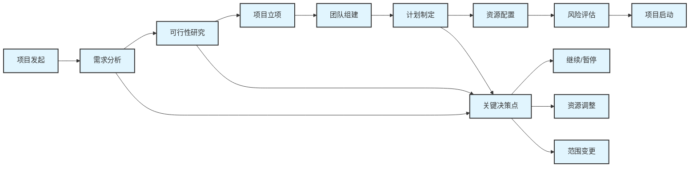

**15.2.1.2 项目章程模板**


**项目基本信息**

- 项目名称：AI IDE实施项目
- 项目经理：[指定项目经理]
- 项目发起人：[高级管理层代表]
- 预计周期：[X个月]
- 预算范围：[预算区间]

**项目目标**

- 主要目标：提升开发效率X%，改善代码质量Y%
- 次要目标：增强团队协作，加速技术创新
- 成功标准：[具体的可衡量指标]

**项目范围**

- 包含范围：[明确包含的团队、系统、功能]
- 排除范围：[明确不包含的内容]
- 边界条件：[项目边界和约束条件]

**15.2.1.3 利益相关者分析**


```python
stakeholder_analysis = {
    "高级管理层": {
        "关注点": ["投资回报", "战略价值", "风险控制"],
        "影响力": "高",
        "参与度": "中",
        "沟通策略": "定期汇报，重点突出业务价值"
    },
    "技术负责人": {
        "关注点": ["技术可行性", "实施复杂度", "团队影响"],
        "影响力": "高",
        "参与度": "高",
        "沟通策略": "深度参与，技术讨论和决策"
    },
    "开发团队": {
        "关注点": ["工具易用性", "学习成本", "工作效率"],
        "影响力": "中",
        "参与度": "高",
        "沟通策略": "充分培训，收集反馈，解决问题"
    },
    "IT部门": {
        "关注点": ["系统集成", "安全合规", "运维支持"],
        "影响力": "中",
        "参与度": "中",
        "沟通策略": "技术协调，确保支持配合"
    }
}

```

### 15.1.2 项目执行管理


**15.2.2.1 敏捷项目管理方法**


采用敏捷方法管理AI IDE实施项目：

**Sprint规划**

- Sprint周期：2-4周
- 每个Sprint包含：计划、执行、评审、回顾
- 交付物：可工作的AI IDE功能增量

**Daily Standup**

- 时间：每日15分钟
- 内容：昨日完成、今日计划、遇到障碍
- 参与者：核心团队成员

**Sprint Review**

- 演示已完成功能
- 收集利益相关者反馈
- 调整产品待办列表

**Sprint Retrospective**

- 回顾团队协作效果
- 识别改进机会
- 制定下一Sprint改进措施#### 项目监

控和控制

**关键绩效指标(KPI)监控**

```python
project_kpis = {
    "进度指标": {
        "计划完成率": "已完成任务数 / 计划任务数 * 100%",
        "里程碑达成率": "按时达成里程碑数 / 总里程碑数 * 100%",
        "Sprint燃尽图": "每日剩余工作量趋势",
        "交付速度": "每Sprint完成的故事点数"
    },
    "质量指标": {
        "缺陷密度": "发现缺陷数 / 交付功能点数",
        "用户满意度": "用户反馈评分 (1-5分)",
        "培训效果": "培训后技能评估通过率",
        "工具采用率": "实际使用工具的人员比例"
    },
    "成本指标": {
        "预算执行率": "实际支出 / 预算金额 * 100%",
        "成本偏差": "实际成本 - 计划成本",
        "ROI进展": "当前ROI / 预期ROI * 100%",
        "资源利用率": "实际工时 / 计划工时 * 100%"
    }
}

```

**风险管理矩阵**

| 风险类别 | 风险描述 | 概率 | 影响 | 风险等级 | 应对策略 |
| ---------- | ---------- | ------ | ------ | ---------- | ---------- |
| 技术风险 | AI工具性能不达预期 | 中 | 高 | 高 | 多工具备选，充分测试 |
| 人员风险 | 团队抵触新技术 | 中 | 中 | 中 | 加强培训，激励机制 |
| 安全风险 | 数据泄露或合规问题 | 低 | 高 | 中 | 严格安全措施，合规审查 |
| 预算风险 | 成本超出预算 | 中 | 中 | 中 | 分阶段投资，严格控制 |
| 进度风险 | 项目延期 | 中 | 中 | 中 | 缓冲时间，资源调配 |

**15.2.2.2 变更管理流程**


<div class="chart-container">

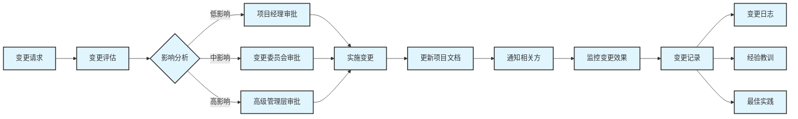

### 15.1.3 项目收尾和评估


**15.2.3.1 项目收尾检查清单**


**交付物验收**

- [ ] 所有计划功能已实现并测试通过
- [ ] 用户培训已完成，满意度达标
- [ ] 技术文档已完善并移交
- [ ] 运维支持流程已建立
- [ ] 安全和合规要求已满足

**知识转移**

- [ ] 项目经验已总结并文档化
- [ ] 最佳实践已提炼并分享
- [ ] 团队技能已评估并记录
- [ ] 后续支持团队已培训到位

**项目关闭**

- [ ] 项目资源已释放
- [ ] 合同和采购已结清
- [ ] 项目文档已归档
- [ ] 项目总结报告已完成

**15.2.3.2 项目成功评估框架**


**定量评估指标**

```python
success_metrics = {
    "效率提升": {
        "开发速度": "代码编写速度提升百分比",
        "交付周期": "功能交付周期缩短百分比", 
        "缺陷修复": "Bug修复时间减少百分比",
        "代码审查": "代码审查效率提升百分比"
    },
    "质量改善": {
        "代码质量": "代码质量评分提升",
        "缺陷密度": "缺陷密度降低百分比",
        "测试覆盖": "测试覆盖率提升百分比",
        "技术债务": "技术债务减少百分比"
    },
    "投资回报": {
        "ROI": "投资回报率",
        "NPV": "净现值",
        "回收期": "投资回收期(月)",
        "成本节约": "年度成本节约金额"
    }
}

```

**定性评估维度**

- 团队满意度和士气变化
- 技术能力和创新能力提升
- 协作效率和沟通改善
- 企业技术形象和竞争力

## 15.2 团队管理最佳实践


### 15.2.1 组织结构设计


**15.3.1.1 AI IDE团队组织架构**


<div class="chart-container">

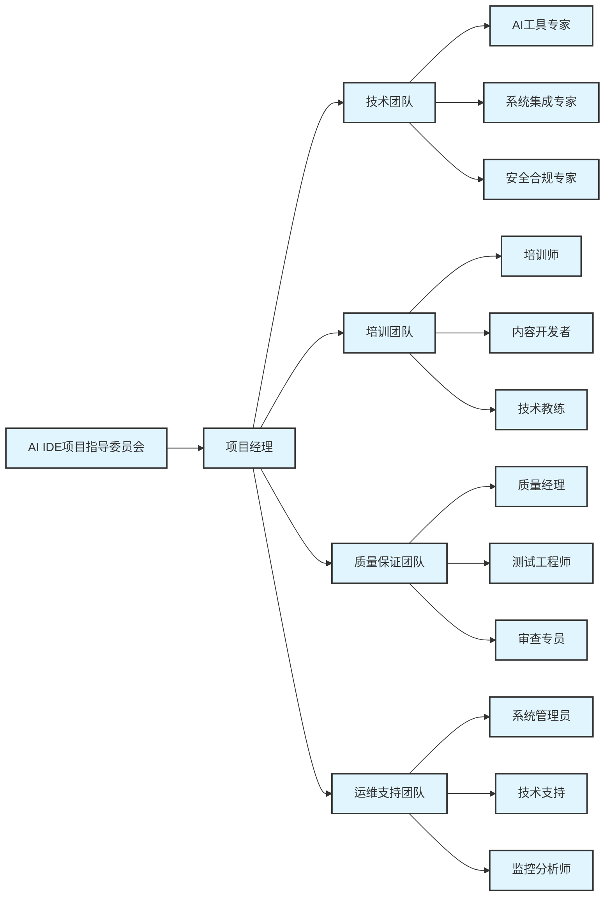

**15.3.1.2 角色职责定义**


**项目经理**

- 整体项目规划和执行管理
- 资源协调和进度控制
- 风险管理和问题解决
- 利益相关者沟通和汇报

**AI工具专家**

- AI工具技术研究和评估
- 工具配置和优化
- 技术问题诊断和解决
- 新技术跟踪和引入

**培训师**

- 培训计划制定和执行
- 培训材料开发和维护
- 培训效果评估和改进
- 技能认证和考核

**质量经理**

- 质量标准制定和执行
- 质量流程设计和优化
- 质量指标监控和分析
- 持续改进推动

### 15.2.2 人员能力发展


**15.3.2.1 技能发展路径**


<div class="chart-container">

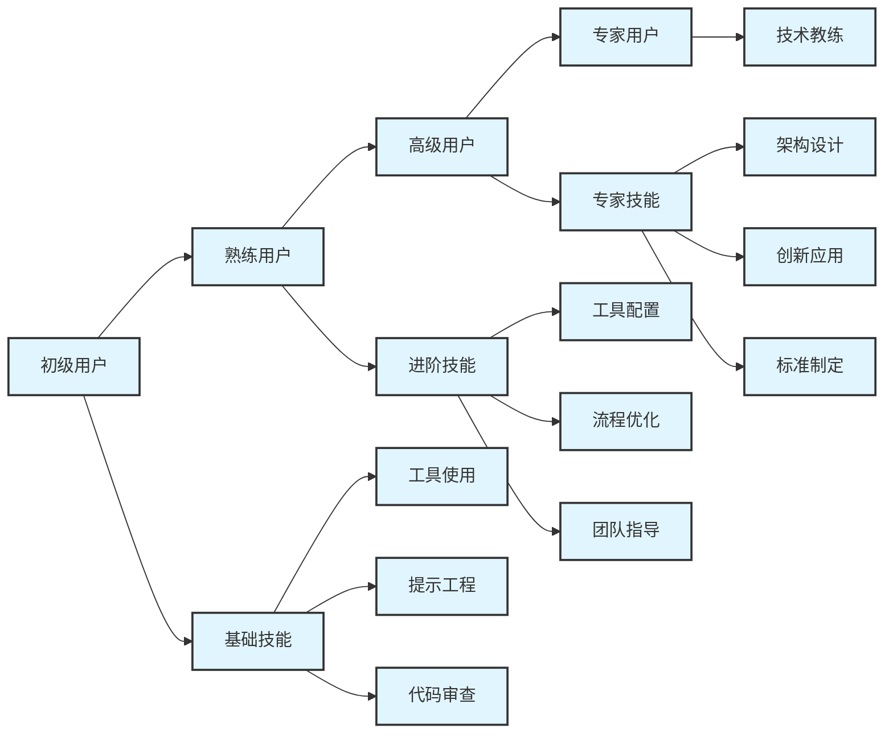

**15.3.2.2 能力评估体系**


**技能评估矩阵**

| 技能领域 | 初级 (1-2分) | 中级 (3-4分) | 高级 (5分) |
| ---------- | -------------- | -------------- | ------------ |
| 工具使用 | 基本操作 | 熟练使用主要功能 | 精通所有功能和配置 |
| 提示工程 | 简单提示 | 结构化提示设计 | 复杂场景提示优化 |
| 代码审查 | 基础检查 | 质量和安全审查 | 架构和最佳实践审查 |
| 问题解决 | 常见问题 | 复杂技术问题 | 创新解决方案设计 |
| 知识分享 | 个人经验 | 团队培训 | 跨团队指导和标准制定 |

**能力发展计划模板**

```python
development_plan_template = {
    "员工信息": {
        "姓名": "",
        "当前职位": "",
        "当前技能等级": "",
        "目标技能等级": ""
    },
    "发展目标": {
        "短期目标": "3个月内达成的具体目标",
        "中期目标": "6-12个月内达成的目标", 
        "长期目标": "1-2年内的职业发展目标"
    },
    "学习计划": {
        "理论学习": ["在线课程", "技术文档", "最佳实践"],
        "实践练习": ["项目实战", "案例分析", "工具试用"],
        "指导支持": ["导师指导", "同事协作", "专家咨询"]
    },
    "评估方式": {
        "阶段评估": "每月技能评估和反馈",
        "项目评估": "实际项目中的表现评价",
        "360度评估": "同事、上级、下级的综合评价"
    }
}

```

### 15.2.3 激励和绩效管理


**15.3.3.1 激励机制设计**


**多层次激励体系**


<div class="chart-container">

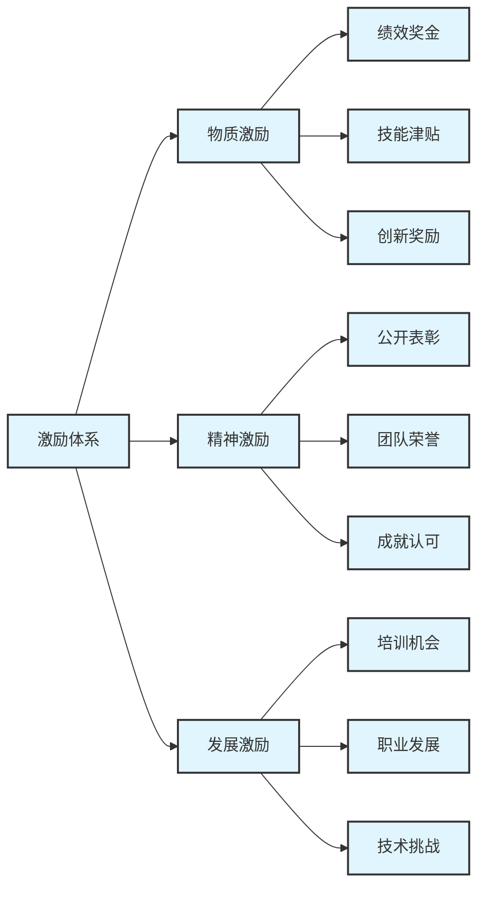

**绩效评估指标**

```python
performance_indicators = {
    "技术能力": {
        "AI工具熟练度": "工具使用技能评估分数",
        "代码质量": "代码审查评分和缺陷率",
        "问题解决": "解决技术问题的效率和质量",
        "创新贡献": "提出和实施的创新想法数量"
    },
    "协作能力": {
        "团队合作": "团队协作效果评价",
        "知识分享": "分享经验和指导他人的频率",
        "沟通效果": "与各方沟通的效果评价",
        "冲突解决": "处理团队冲突的能力"
    },
    "业务贡献": {
        "效率提升": "个人工作效率提升幅度",
        "质量改善": "负责模块的质量改善情况",
        "客户满意": "客户对交付成果的满意度",
        "成本控制": "项目成本控制贡献"
    }
}

```

**15.3.3.2 职业发展通道**


**技术发展路径**

- 初级开发工程师 → 中级开发工程师 → 高级开发工程师
- 高级开发工程师 → 技术专家 → 首席技术专家
- 技术专家 → 架构师 → 首席架构师

**管理发展路径**

- 技术骨干 → 团队负责人 → 项目经理
- 项目经理 → 部门经理 → 技术总监
- 技术总监 → CTO

**专业发展路径**

- AI工具专家 → AI技术顾问 → AI战略专家
- 培训师 → 培训经理 → 学习发展总监
- 质量专员 → 质量经理 → 质量总监

## 15.3 决策支持工具


### 15.3.1 决策框架和模型


**15.4.1.1 RACI责任矩阵**


AI IDE项目关键决策的责任分配：

| 决策事项 | 项目经理 | 技术负责人 | 开发团队 | 高级管理层 |
| ---------- | ---------- | ------------ | ---------- | ------------ |
| 工具选型 | A | R | C | I |
| 预算批准 | R | C | I | A |
| 技术架构 | C | A | R | I |
| 培训计划 | A | C | R | I |
| 质量标准 | C | A | R | I |
| 进度调整 | A | C | I | R |

*R=负责执行, A=批准决策, C=咨询参与, I=知情了解*

**15.4.1.2 决策树模型**


<div class="chart-container">

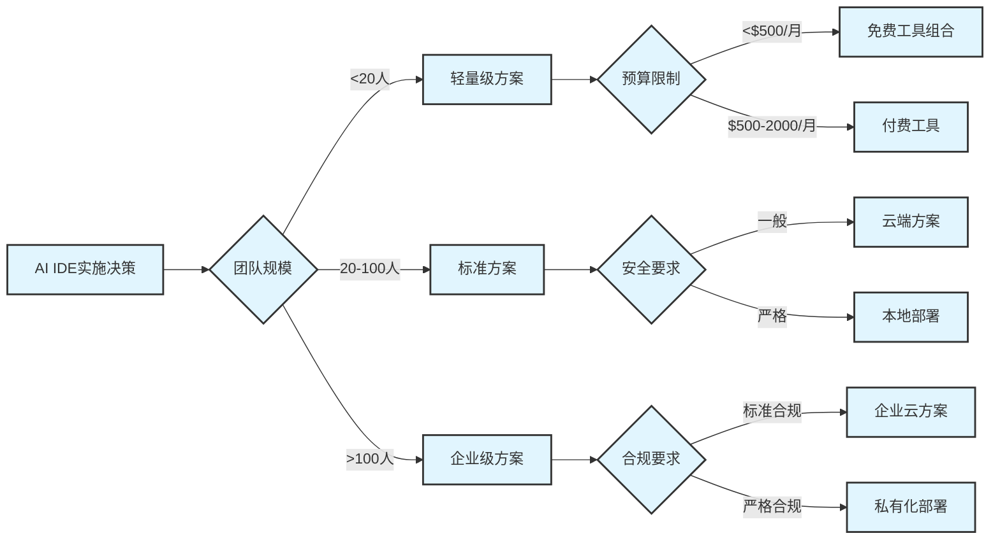

### 15.3.2 数据驱动决策


**15.4.2.1 决策支持仪表板**


**实时监控指标**

```python
dashboard_metrics = {
    "使用情况": {
        "日活跃用户": "每日使用AI工具的用户数",
        "功能使用率": "各功能模块的使用频率",
        "会话时长": "用户平均使用时长",
        "生成代码量": "AI生成的代码行数统计"
    },
    "效果指标": {
        "接受率": "AI建议被采纳的比例",
        "准确率": "AI生成代码的准确性",
        "效率提升": "相比传统方式的效率提升",
        "错误率": "AI生成代码的错误率"
    },
    "业务影响": {
        "交付速度": "功能交付周期变化",
        "质量指标": "代码质量评分变化",
        "成本效益": "投入产出比分析",
        "用户满意度": "开发者满意度评分"
    }
}

```

**决策支持报告模板**

```markdown
# 第15章 AI IDE效果评估报告


## 15.5 执行摘要

- 评估期间：[开始日期] - [结束日期]
- 覆盖团队：[团队数量]人
- 主要发现：[关键发现总结]
- 建议行动：[主要建议]

## 15.6 关键指标表现

### 15.6.1 使用情况

- 用户采用率：XX%（目标：XX%）
- 日均使用时长：XX小时（目标：XX小时）
- 功能覆盖率：XX%（目标：XX%）

### 15.6.2 效果指标

- 开发效率提升：XX%（目标：XX%）
- 代码质量改善：XX%（目标：XX%）
- 缺陷减少：XX%（目标：XX%）

### 15.6.3 投资回报

- 总投资：$XX,XXX
- 累计收益：$XX,XXX
- ROI：XX%
- 回收期：XX个月

## 15.7 问题和挑战

1. [问题描述]
   - 影响：[影响分析]
   - 建议：[解决建议]

## 15.8 下一步行动计划

2. [行动项1] - 负责人：[姓名] - 截止日期：[日期]
3. [行动项2] - 负责人：[姓名] - 截止日期：[日期]

```

### 15.3.3 风险决策管理


**15.8.1.1 风险评估矩阵**


```python
risk_assessment_matrix = {
    "技术风险": {
        "AI工具性能不稳定": {"概率": "中", "影响": "高", "等级": "高"},
        "集成复杂度超预期": {"概率": "中", "影响": "中", "等级": "中"},
        "技术更新频繁": {"概率": "高", "影响": "低", "等级": "中"}
    },
    "人员风险": {
        "团队抵触情绪": {"概率": "中", "影响": "高", "等级": "高"},
        "关键人员流失": {"概率": "低", "影响": "高", "等级": "中"},
        "技能差距过大": {"概率": "中", "影响": "中", "等级": "中"}
    },
    "业务风险": {
        "投资回报不达预期": {"概率": "中", "影响": "高", "等级": "高"},
        "项目延期": {"概率": "中", "影响": "中", "等级": "中"},
        "竞争对手领先": {"概率": "低", "影响": "中", "等级": "低"}
    }
}

```

**15.8.1.2 风险应对策略**


**高风险应对措施**

1. **AI工具性能不稳定**

   - 预防：充分测试和试点验证
   - 缓解：多工具备选方案
   - 转移：供应商性能保证协议
   - 接受：建立性能监控和快速响应机制

1. **团队抵触情绪**

   - 预防：充分沟通和参与式决策
   - 缓解：渐进式推进和激励机制
   - 转移：外部培训和变革管理咨询
   - 接受：建立反馈机制和调整策略

1. **投资回报不达预期**

   - 预防：详细的ROI分析和保守估计
   - 缓解：分阶段投资和快速调整
   - 转移：供应商收益保证条款
   - 接受：建立价值实现跟踪机制

## 15.4 组织变革管理


### 15.4.1 变革管理框架


**15.9.1.1 Kotter 8步变革模型应用**


<div class="chart-container">

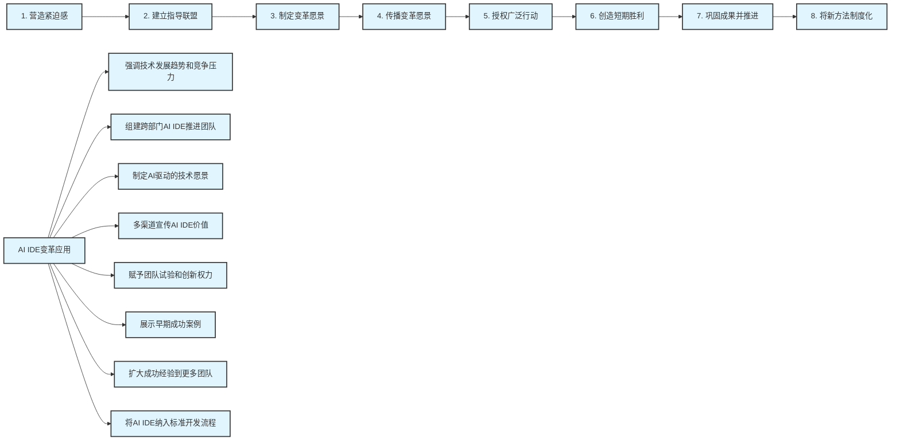

**15.9.1.2 变革阻力分析和应对**


**阻力来源分析**

```python
resistance_analysis = {
    "个人层面": {
        "恐惧失业": {
            "描述": "担心AI工具替代人工工作",
            "应对": "强调AI是辅助工具，提升而非替代"
        },
        "学习负担": {
            "描述": "担心学习新工具增加工作负担",
            "应对": "提供充分培训时间和支持"
        },
        "习惯依赖": {
            "描述": "习惯现有工作方式，不愿改变",
            "应对": "渐进式引入，展示明显收益"
        }
    },
    "团队层面": {
        "文化冲突": {
            "描述": "团队文化与AI工具理念不符",
            "应对": "文化建设和价值观引导"
        },
        "协作困难": {
            "描述": "团队协作模式需要调整",
            "应对": "重新设计协作流程和规范"
        },
        "技能差异": {
            "描述": "团队成员技能水平差异大",
            "应对": "分层培训和结对学习"
        }
    },
    "组织层面": {
        "资源约束": {
            "描述": "预算和人力资源限制",
            "应对": "分阶段投资和ROI论证"
        },
        "流程固化": {
            "描述": "现有流程和制度阻碍变革",
            "应对": "流程重新设计和制度更新"
        },
        "利益冲突": {
            "描述": "不同部门利益不一致",
            "应对": "利益协调和共赢方案设计"
        }
    }
}

```

### 15.4.2 文化建设指导


**15.9.2.1 AI驱动的技术文化**


**文化价值观**

1. **持续学习**：拥抱新技术，持续提升技能
2. **创新实验**：鼓励尝试新方法，容忍失败
3. **协作共享**：促进知识分享，团队协作
4. **质量第一**：重视代码质量，追求卓越
5. **用户导向**：以用户价值为中心，快速响应需求

**文化建设活动**


<div class="chart-container">

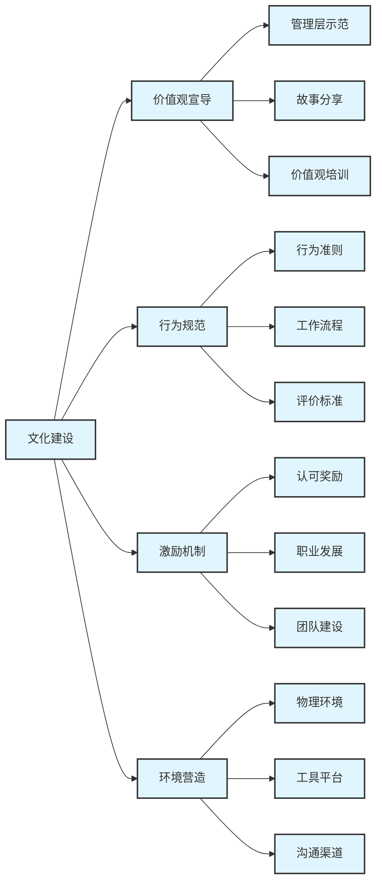

**15.9.2.2 学习型组织建设**


**知识管理体系**

```python
knowledge_management = {
    "知识创造": {
        "实践总结": "项目经验和最佳实践提炼",
        "创新研究": "新技术研究和应用探索",
        "外部学习": "行业交流和标杆学习",
        "培训开发": "内部培训课程和材料开发"
    },
    "知识存储": {
        "知识库": "结构化的知识文档库",
        "案例库": "项目案例和问题解决方案",
        "专家库": "内部专家和技能目录",
        "工具库": "工具模板和配置文件"
    },
    "知识分享": {
        "技术分享": "定期技术分享会和讲座",
        "社区交流": "内部技术社区和论坛",
        "导师制度": "新老员工结对学习",
        "跨团队协作": "跨部门项目和交流"
    },
    "知识应用": {
        "项目实践": "在实际项目中应用知识",
        "问题解决": "利用知识库解决问题",
        "创新应用": "知识的创新性应用",
        "持续改进": "基于知识的流程优化"
    }
}

```

### 15.4.3 沟通和培训策略


**15.9.3.1 多层次沟通策略**


**沟通对象分层**


<div class="chart-container">

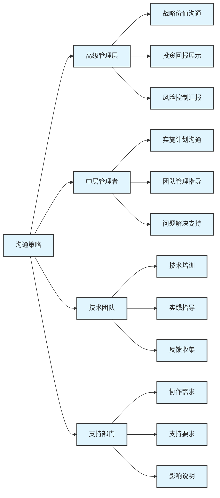

**沟通渠道和频率**

| 沟通对象 | 沟通内容 | 沟通渠道 | 频率 |
| ---------- | ---------- | ---------- | ------ |
| 高级管理层 | 项目进展、ROI分析、重大决策 | 管理层会议、正式报告 | 月度 |
| 中层管理者 | 实施计划、团队管理、问题解决 | 管理者会议、工作坊 | 双周 |
| 技术团队 | 技术培训、实践指导、经验分享 | 技术会议、培训课程 | 周度 |
| 全体员工 | 项目进展、成功案例、政策变化 | 全员邮件、内部网站 | 月度 |

**15.9.3.2 培训体系设计**


**分层培训计划**

```python
training_program = {
    "管理层培训": {
        "目标": "理解AI IDE价值，支持变革推进",
        "内容": [
            "AI IDE技术趋势和商业价值",
            "变革管理和团队领导",
            "投资决策和风险管理",
            "成功案例和最佳实践"
        ],
        "形式": "高管研讨会、外部专家讲座",
        "时长": "4小时",
        "频率": "季度"
    },
    "技术负责人培训": {
        "目标": "掌握技术实施和团队管理技能",
        "内容": [
            "AI IDE技术深度解析",
            "工具选型和架构设计",
            "团队培训和指导方法",
            "质量管理和最佳实践"
        ],
        "形式": "技术工作坊、实操训练",
        "时长": "16小时",
        "频率": "月度"
    },
    "开发者培训": {
        "目标": "熟练使用AI IDE工具，提升开发效率",
        "内容": [
            "AI IDE基础使用方法",
            "高级功能和技巧",
            "代码质量和安全实践",
            "团队协作和知识分享"
        ],
        "形式": "实操培训、在线课程",
        "时长": "8小时",
        "频率": "月度"
    }
}

```

**培训效果评估**


<div class="chart-container">

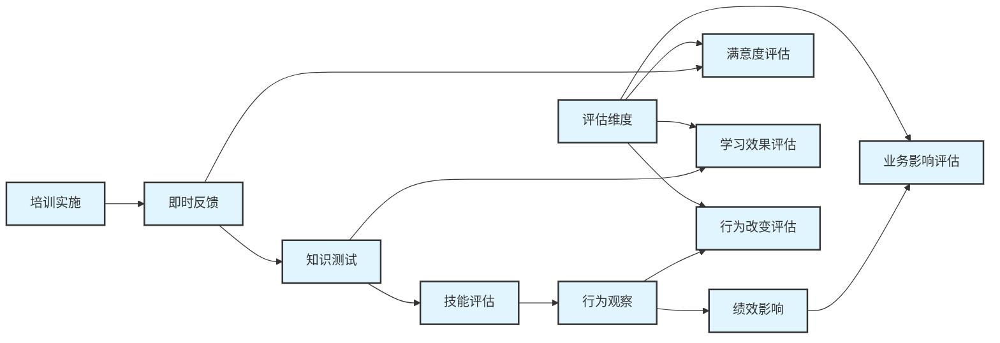

## 15.5 管理效果评估


### 15.5.1 评估指标体系


**15.10.1.1 平衡计分卡方法**


```python
balanced_scorecard = {
    "财务维度": {
        "投资回报率": "ROI = (收益 - 投资) / 投资 * 100%",
        "成本节约": "年度成本节约金额",
        "收入增长": "由于效率提升带来的收入增长",
        "净现值": "NPV = Σ(现金流量/(1+折现率)^t)"
    },
    "客户维度": {
        "内部客户满意度": "开发团队对AI IDE的满意度",
        "外部客户满意度": "最终用户对产品质量的满意度",
        "交付质量": "产品缺陷率和用户反馈",
        "响应速度": "需求响应和问题解决速度"
    },
    "内部流程维度": {
        "开发效率": "代码编写和功能开发速度",
        "质量流程": "代码审查和测试流程效率",
        "协作效率": "团队协作和沟通效率",
        "创新能力": "新技术应用和创新项目数量"
    },
    "学习成长维度": {
        "员工技能": "AI工具使用技能水平",
        "员工满意度": "工作满意度和敬业度",
        "知识管理": "知识分享和传承效果",
        "组织能力": "变革适应和持续改进能力"
    }
}

```

**15.10.1.2 关键绩效指标(KPI)**


**效率类指标**

- 代码编写速度提升率：(新速度 - 原速度) / 原速度 * 100%
- 功能开发周期缩短率：(原周期 - 新周期) / 原周期 * 100%
- 缺陷修复时间减少率：(原时间 - 新时间) / 原时间 * 100%
- 代码审查效率提升率：审查通过的代码量增长百分比

**质量类指标**

- 代码质量评分：基于静态分析工具的综合评分
- 缺陷密度降低率：(原密度 - 新密度) / 原密度 * 100%
- 测试覆盖率提升：测试覆盖率的绝对提升百分点
- 生产环境故障减少率：生产故障数量减少百分比

**协作类指标**

- 团队协作效率：基于协作工具数据的效率评分
- 知识分享频率：技术分享和文档贡献的频次
- 跨团队协作项目数：涉及多团队的协作项目数量
- 沟通效率提升：会议时间减少和决策速度提升

### 15.5.2 数据收集和分析


**15.10.2.1 数据收集方法**


**自动化数据收集**

```python
def automated_data_collection():
    """
    自动化数据收集系统
    """
    data_sources = {
        "版本控制系统": {
            "数据类型": ["提交频率", "代码行数", "文件修改数"],
            "收集方式": "Git API调用",
            "更新频率": "实时"
        },
        "项目管理工具": {
            "数据类型": ["任务完成时间", "里程碑达成", "工作量统计"],
            "收集方式": "Jira/Azure DevOps API",
            "更新频率": "每日"
        },
        "AI工具平台": {
            "数据类型": ["使用时长", "功能使用率", "生成代码量"],
            "收集方式": "工具内置分析API",
            "更新频率": "实时"
        },
        "质量管理系统": {
            "数据类型": ["代码质量评分", "缺陷数量", "测试覆盖率"],
            "收集方式": "SonarQube等工具API",
            "更新频率": "每次构建"
        }
    }
    return data_sources

```

**人工数据收集**

```python
manual_data_collection = {
    "满意度调查": {
        "调查对象": "所有使用AI IDE的员工",
        "调查内容": [
            "工具易用性评价",
            "效率提升感知",
            "学习成本评估",
            "整体满意度评分"
        ],
        "调查频率": "季度",
        "调查方式": "在线问卷"
    },
    "深度访谈": {
        "访谈对象": "关键用户和管理者",
        "访谈内容": [
            "使用体验和问题",
            "改进建议",
            "业务影响评估",
            "未来需求预期"
        ],
        "访谈频率": "半年度",
        "访谈方式": "一对一面谈"
    },
    "焦点小组": {
        "参与对象": "不同角色的代表性用户",
        "讨论内容": [
            "最佳实践分享",
            "问题和挑战讨论",
            "解决方案探讨",
            "未来发展建议"
        ],
        "组织频率": "季度",
        "组织方式": "小组讨论会"
    }
}

```

**15.10.2.2 数据分析框架**


**趋势分析**


<div class="chart-container">

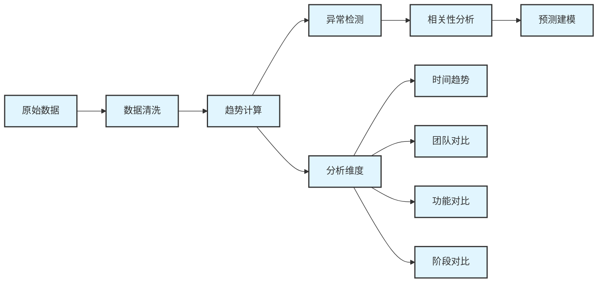

**对比分析方法**

```python
def comparative_analysis(before_data, after_data, metrics):
    """
    实施前后对比分析
    """
    analysis_results = {}
    
    for metric in metrics:
        before_value = before_data[metric]
        after_value = after_data[metric]
        
        # 计算变化率
        change_rate = (after_value - before_value) / before_value * 100
        
        # 统计显著性检验
        significance = statistical_test(before_data[metric], after_data[metric])
        
        # 效果评级
        if change_rate > 20:
            effect_level = "显著提升"
        elif change_rate > 10:
            effect_level = "明显提升"
        elif change_rate > 0:
            effect_level = "轻微提升"
        else:
            effect_level = "无明显变化或下降"
        
        analysis_results[metric] = {
            "变化率": f"{change_rate:.1f}%",
            "显著性": significance,
            "效果评级": effect_level
        }
    
    return analysis_results

```

### 15.5.3 持续改进机制


**15.10.3.1 改进循环流程**


<div class="chart-container">

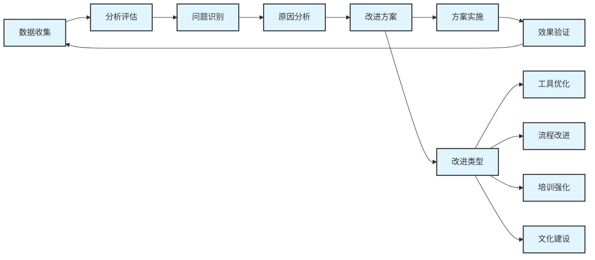

**15.10.3.2 改进建议生成**


**问题分类和改进建议**

```python
improvement_suggestions = {
    "效率问题": {
        "工具响应慢": {
            "原因分析": ["网络延迟", "服务器负载", "配置不当"],
            "改进建议": [
                "优化网络配置",
                "升级服务器资源",
                "调整工具参数"
            ]
        },
        "使用率低": {
            "原因分析": ["培训不足", "工具复杂", "缺乏激励"],
            "改进建议": [
                "加强培训和指导",
                "简化使用流程",
                "建立激励机制"
            ]
        }
    },
    "质量问题": {
        "AI生成代码质量差": {
            "原因分析": ["提示词不当", "模型限制", "缺乏审查"],
            "改进建议": [
                "优化提示词模板",
                "升级AI模型",
                "强化代码审查"
            ]
        },
        "安全漏洞增加": {
            "原因分析": ["安全意识不足", "检查机制缺失", "工具配置问题"],
            "改进建议": [
                "加强安全培训",
                "建立安全检查流程",
                "配置安全扫描工具"
            ]
        }
    },
    "协作问题": {
        "团队协作困难": {
            "原因分析": ["工具不统一", "流程不清晰", "沟通不足"],
            "改进建议": [
                "统一工具标准",
                "优化协作流程",
                "加强团队沟通"
            ]
        }
    }
}

```

**15.10.3.3 最佳实践更新**


**实践库维护**

```python
best_practices_management = {
    "实践收集": {
        "来源": ["项目经验", "用户反馈", "行业标杆", "专家建议"],
        "收集方式": ["经验总结", "案例分析", "调研学习", "专家访谈"],
        "收集频率": "持续进行",
        "质量标准": "经过验证、可复制、有价值"
    },
    "实践评估": {
        "评估维度": ["适用性", "有效性", "可操作性", "创新性"],
        "评估方法": ["专家评审", "试点验证", "效果测量", "用户反馈"],
        "评估周期": "季度评估",
        "评估标准": "5分制评分体系"
    },
    "实践更新": {
        "更新触发": ["新技术出现", "环境变化", "效果下降", "用户需求"],
        "更新流程": ["需求分析", "方案设计", "试点验证", "正式发布"],
        "更新频率": "根据需要",
        "版本管理": "语义化版本控制"
    },
    "实践推广": {
        "推广渠道": ["培训课程", "文档更新", "经验分享", "工具集成"],
        "推广策略": ["分层推广", "重点突破", "示范引领", "激励推动"],
        "推广效果": ["使用率统计", "效果评估", "反馈收集", "持续优化"]
    }
}

```

## 15.6 总结


### 15.6.1 管理最佳实践要点


**项目管理关键要素**

1. **结构化方法**：采用成熟的项目管理方法论
2. **风险管控**：建立全面的风险识别和应对机制
3. **利益相关者管理**：有效协调各方利益和期望
4. **持续监控**：建立实时监控和反馈机制

**团队管理核心原则**

1. **人才发展**：投资于团队能力建设和职业发展
2. **激励机制**：建立多元化的激励和认可体系
3. **文化建设**：营造学习型和创新型组织文化
4. **协作优化**：设计高效的团队协作模式

**决策支持要点**

1. **数据驱动**：基于客观数据进行决策
2. **多维评估**：从多个角度评估方案和效果
3. **风险平衡**：在收益和风险之间找到平衡
4. **持续优化**：建立持续改进的决策机制

### 15.6.2 成功实施建议


**短期行动建议**

- 建立项目管理办公室(PMO)
- 制定详细的实施计划和里程碑
- 组建跨职能的项目团队
- 启动试点项目验证方案

**中期发展建议**

- 建立完善的培训和认证体系
- 优化组织结构和协作流程
- 建立数据驱动的决策机制
- 推广成功经验到更大范围

**长期战略建议**

- 建立AI驱动的企业文化
- 培养数字化转型领导力
- 建立持续创新机制
- 参与行业生态建设

通过系统性的管理最佳实践应用，组织能够更好地推进AI IDE的成功实施，实现技术投资的最大价值回报，并建立可持续的竞争优势。
