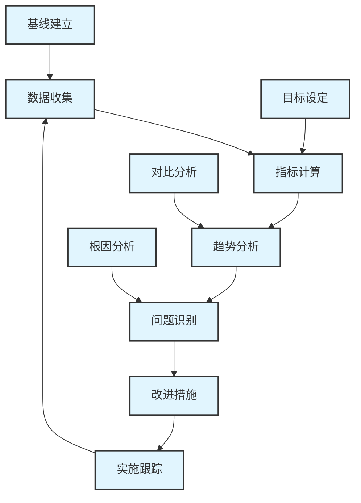
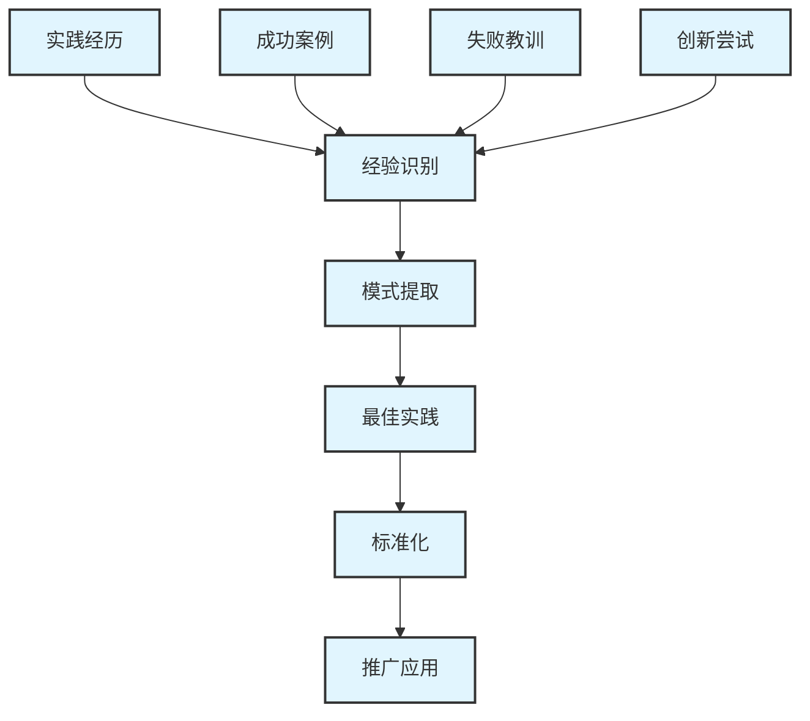

# 第16章 AI IDE操作最佳实践指南


## 16.1 概述


本章整理了AI IDE在软件开发各个阶段的操作最佳实践，提供具体的操作指导、质量标准和常见问题解决方案。通过系统化的实践指南，帮助开发团队更好地利用AI工具提升开发效率和代码质量。

## 16.1 需求分析阶段最佳实践


### 16.1.1 AI辅助需求收集


#### 16.2.1.1 操作指导


**1. 需求文档生成**

```markdown
# 第16章 提示词模板

请基于以下业务描述生成详细的功能需求文档：

业务背景：[描述业务场景]
目标用户：[用户角色定义]
核心功能：[主要功能列表]
约束条件：[技术和业务约束]

请按照以下格式输出：
1. 功能概述
2. 用户故事
3. 验收标准
4. 非功能性需求
5. 风险评估

```

**2. 用户故事优化**

- 使用AI工具分析用户故事的完整性
- 自动生成验收标准草案
- 识别潜在的边界条件和异常场景

#### 16.2.1.2 质量检查清单


- [ ] 需求描述清晰明确，无歧义
- [ ] 用户故事符合INVEST原则
- [ ] 验收标准可测试、可验证
- [ ] 非功能性需求已明确定义
- [ ] 风险点已识别并有应对措施

### 16.1.2 需求分析和建模


#### 16.2.2.1 操作指导


**1. 业务流程分析**

```python
# 第16章 AI辅助流程分析提示词

def analyze_business_process(description):
    prompt = f"""
    请分析以下业务流程，并生成流程图和关键节点分析：
    
    业务描述：{description}
    
    请提供：
    1. Mermaid流程图代码
    2. 关键决策点分析
    3. 异常处理路径
    4. 性能瓶颈识别
    5. 优化建议

    """
    return prompt

```

**2. 数据模型设计**

- 使用AI分析业务实体关系
- 自动生成初始数据模型
- 识别数据一致性要求

#### 16.2.2.2 常见问题解决方案


**问题1：需求理解偏差**

- **现象**：AI生成的需求文档与实际业务需求不符
- **原因**：输入信息不够详细或存在歧义
- **解决方案**：
  - 提供更详细的业务背景信息
  - 使用结构化的需求描述模板
  - 多轮对话澄清细节

**问题2：需求遗漏**

- **现象**：重要的业务需求被遗漏
- **原因**：业务场景分析不够全面
- **解决方案**：
  - 使用需求检查清单
  - 进行多角度需求分析
  - 邀请业务专家参与评审

## 16.2 设计阶段最佳实践


### 16.2.1 架构设计


#### 16.3.1.1 操作指导


**1. 系统架构生成**

```markdown
# 第16章 架构设计提示词模板

请基于以下需求设计系统架构：

功能需求：[核心功能列表]
非功能需求：[性能、安全、可扩展性要求]
技术约束：[技术栈、部署环境限制]
团队规模：[开发团队规模和技能水平]

请提供：
6. 整体架构图（Mermaid格式）
7. 核心组件说明
8. 数据流设计
9. 接口定义
10. 部署架构
11. 技术选型建议

```

**2. 设计模式应用**

- 使用AI推荐适合的设计模式
- 生成设计模式实现代码
- 分析模式应用的优缺点

#### 16.3.1.2 质量检查清单


- [ ] 架构满足所有功能需求
- [ ] 非功能性需求得到充分考虑
- [ ] 组件职责清晰，耦合度低
- [ ] 接口设计合理，易于扩展
- [ ] 技术选型符合团队能力
- [ ] 部署方案可行且高效

### 16.2.2 详细设计


#### 16.3.2.1 操作指导


**1. 类图和时序图生成**

```python
# 第16章 设计图生成提示词

def generate_design_diagrams(requirements):
    prompt = f"""
    基于以下需求生成详细设计图：
    
    需求描述：{requirements}
    
    请生成：
    6. 类图（PlantUML格式）
    7. 时序图（主要业务流程）
    8. 状态图（如适用）
    9. 组件图
    
    并说明：
    - 类之间的关系
    - 方法的职责分工
    - 数据流向
    - 状态转换逻辑

    """
    return prompt

```

**2. 接口设计**

- AI辅助API接口设计
- 自动生成接口文档
- 验证接口设计的一致性

#### 16.3.2.2 常见问题解决方案


**问题1：过度设计**

- **现象**：AI生成的设计过于复杂
- **原因**：没有明确简化要求
- **解决方案**：
  - 明确指定简化原则
  - 分阶段设计，先简后繁
  - 定期评审设计复杂度

**问题2：设计不一致**

- **现象**：不同模块的设计风格不统一
- **原因**：缺乏统一的设计标准
- **解决方案**：
  - 建立设计规范模板
  - 使用一致的命名约定
  - 定期进行设计评审

## 16.3 开发阶段最佳实践


### 16.3.1 代码生成和补全


#### 16.4.1.1 操作指导


**1. 高质量代码生成**

```python
# 第16章 代码生成最佳实践

def generate_high_quality_code():
    """
    代码生成最佳实践指南
    """
    best_practices = {
        "提示词优化": [
            "提供清晰的功能描述",
            "指定编程语言和框架",
            "说明代码风格要求",
            "包含错误处理需求",
            "指定测试要求"
        ],
        "代码审查": [
            "检查逻辑正确性",
            "验证错误处理",
            "确认性能要求",
            "检查安全漏洞",
            "验证编码规范"
        ],
        "迭代优化": [
            "根据反馈调整提示词",
            "逐步完善代码质量",
            "持续学习最佳实践",
            "建立代码模板库"
        ]
    }
    return best_practices

```

**2. 代码补全技巧**

- 编写清晰的注释引导AI补全
- 使用有意义的变量和函数名
- 保持代码结构的一致性

#### 16.4.1.2 质量检查清单


- [ ] 代码逻辑正确，无明显错误
- [ ] 错误处理完整，覆盖异常情况
- [ ] 代码风格符合团队规范
- [ ] 性能满足要求，无明显瓶颈
- [ ] 安全考虑充分，无安全漏洞
- [ ] 可读性良好，注释充分

### 16.3.2 代码重构和优化


#### 16.4.2.1 操作指导


**1. AI辅助重构**

```markdown
# 第16章 重构提示词模板

请对以下代码进行重构优化：

原始代码：
[粘贴代码]

重构目标：
- 提高代码可读性
- 优化性能
- 减少重复代码
- 改善错误处理
- 符合设计模式

请提供：
12. 重构后的代码
13. 重构说明
14. 性能改进分析
15. 潜在风险评估

```

**2. 性能优化**

- 使用AI识别性能瓶颈
- 生成优化方案
- 验证优化效果

#### 16.4.2.2 常见问题解决方案


**问题1：重构破坏功能**

- **现象**：重构后代码功能异常
- **原因**：重构范围过大或理解有误
- **解决方案**：
  - 小步重构，逐步验证
  - 保持完整的测试覆盖
  - 重构前后对比测试

**问题2：过度优化**

- **现象**：代码变得过于复杂
- **原因**：追求极致性能忽视可读性
- **解决方案**：
  - 平衡性能和可读性
  - 基于实际需求优化
  - 定期评估优化效果

## 16.4 测试阶段最佳实践


### 16.4.1 测试用例生成


#### 16.5.1.1 操作指导


**1. 自动化测试用例生成**

```python
# 第16章 测试用例生成提示词

def generate_test_cases(function_spec):
    prompt = f"""
    请为以下函数生成完整的测试用例：
    
    函数规格：{function_spec}
    
    请生成：
    10. 正常情况测试用例
    11. 边界条件测试用例
    12. 异常情况测试用例
    13. 性能测试用例
    14. 安全测试用例
    
    每个测试用例包含：
    - 测试描述
    - 输入数据
    - 预期输出
    - 测试步骤

    """
    return prompt

```

**2. 测试数据生成**

- 使用AI生成多样化测试数据
- 创建边界值和异常数据
- 生成大量数据进行压力测试

#### 16.5.1.2 质量检查清单


- [ ] 测试用例覆盖所有功能点
- [ ] 边界条件测试充分
- [ ] 异常处理测试完整
- [ ] 性能测试用例合理
- [ ] 测试数据真实有效
- [ ] 测试步骤清晰可执行

### 16.4.2 自动化测试


#### 16.5.2.1 操作指导


**1. 测试脚本生成**

```javascript
// 自动化测试脚本模板
describe('AI生成的测试套件', () => {
  beforeEach(() => {
    // 测试环境准备
  });

  test('正常功能测试', async () => {
    // AI生成的测试逻辑
  });

  test('边界条件测试', async () => {
    // AI生成的边界测试
  });

  test('异常处理测试', async () => {
    // AI生成的异常测试
  });

  afterEach(() => {
    // 测试清理
  });
});

```

**2. 测试维护**

- 定期更新测试用例
- 优化测试执行效率
- 维护测试数据的有效性

#### 16.5.2.2 常见问题解决方案


**问题1：测试用例不准确**

- **现象**：AI生成的测试用例验证逻辑错误
- **原因**：对需求理解不准确
- **解决方案**：
  - 提供更详细的需求说明
  - 人工验证测试逻辑
  - 逐步完善测试用例

**问题2：测试覆盖不足**

- **现象**：重要功能点未被测试覆盖
- **原因**：测试用例生成不够全面
- **解决方案**：
  - 使用测试覆盖率工具
  - 补充遗漏的测试场景
  - 建立测试检查清单

## 16.5 部署和运维最佳实践


### 16.5.1 部署自动化


#### 16.6.1.1 操作指导


**1. 部署脚本生成**

```yaml
# 第16章 AI生成的部署配置模板

apiVersion: apps/v1
kind: Deployment
metadata:
  name: ai-generated-app
spec:
  replicas: 3
  selector:
    matchLabels:
      app: ai-generated-app
  template:
    metadata:
      labels:
        app: ai-generated-app
    spec:
      containers:
      - name: app

        image: ai-generated-app:latest
        ports:
        - containerPort: 8080

        env:
        - name: ENV

          value: "production"
        resources:
          requests:
            memory: "256Mi"
            cpu: "250m"
          limits:
            memory: "512Mi"
            cpu: "500m"

```

**2. 监控配置**

- AI辅助生成监控规则
- 自动化告警配置
- 性能指标收集

#### 16.6.1.2 质量检查清单


- [ ] 部署脚本语法正确
- [ ] 环境配置完整
- [ ] 资源限制合理
- [ ] 监控配置有效
- [ ] 回滚机制可用
- [ ] 安全配置充分

### 16.5.2 运维监控


#### 16.6.2.1 操作指导


**1. 日志分析**

```python
# 第16章 AI辅助日志分析

def analyze_logs_with_ai(log_content):
    prompt = f"""
    请分析以下应用日志，识别潜在问题：
    
    日志内容：{log_content}
    
    请提供：
    15. 错误模式识别
    16. 性能问题分析
    17. 异常趋势分析
    18. 优化建议
    19. 告警规则建议

    """
    return prompt

```

**2. 性能优化**

- AI辅助性能瓶颈识别
- 自动化性能调优建议
- 资源使用优化

#### 16.6.2.2 常见问题解决方案


**问题1：监控告警过多**

- **现象**：大量无效告警影响运维效率
- **原因**：告警规则设置不合理
- **解决方案**：
  - 优化告警阈值设置
  - 建立告警优先级
  - 定期评估告警有效性

**问题2：性能问题定位困难**

- **现象**：性能问题难以快速定位
- **原因**：监控指标不够全面
- **解决方案**：
  - 完善监控指标体系
  - 使用AI辅助问题分析
  - 建立问题诊断流程

## 16.6 实践评估和改进方法


### 16.6.1 效果评估框架


#### 16.7.1.1 评估指标体系


**1. 效率指标**

```python
efficiency_metrics = {
    "开发效率": {
        "代码生成速度": "行/小时",
        "功能完成时间": "小时/功能点",
        "Bug修复时间": "小时/Bug",
        "代码审查时间": "分钟/PR"
    },
    "质量指标": {
        "代码质量评分": "1-10分",
        "Bug密度": "Bug数/KLOC",
        "测试覆盖率": "百分比",
        "技术债务": "小时数"
    },
    "学习指标": {
        "新技术掌握速度": "天数",
        "最佳实践应用率": "百分比",
        "知识分享频率": "次/月",
        "创新实践数量": "个/季度"
    }
}

```

**2. 数据收集方法**

- 自动化指标收集
- 定期团队调研
- 项目回顾分析
- 客户反馈收集

#### 16.7.1.2 评估流程


<div class="chart-container">



### 16.6.2 持续改进机制


#### 16.7.2.1 改进流程


**1. 问题识别**

- 定期效果评估
- 团队反馈收集
- 最佳实践对比
- 行业趋势分析

**2. 改进实施**

```python
def implement_improvements():
    """
    持续改进实施流程
    """
    improvement_process = {
        "问题分析": [
            "收集问题反馈",
            "分析问题根因",
            "评估影响范围",
            "制定改进方案"
        ],
        "方案实施": [
            "制定实施计划",
            "分配责任人员",
            "执行改进措施",
            "监控实施进度"
        ],
        "效果验证": [
            "收集效果数据",
            "对比改进前后",
            "评估改进效果",
            "调整优化策略"
        ],
        "经验总结": [
            "总结成功经验",
            "记录失败教训",
            "更新最佳实践",
            "分享改进成果"
        ]
    }
    return improvement_process

```

#### 16.7.2.2 知识管理


**1. 最佳实践库建设**

- 收集整理成功案例
- 建立实践模板库
- 维护知识文档
- 定期更新内容

**2. 经验分享机制**

- 定期技术分享会
- 跨团队经验交流
- 外部最佳实践学习
- 创新实践探索

## 16.7 常见问题解决方案库


### 16.7.1 技术问题


#### 16.8.1.1 代码质量问题


**问题：AI生成代码质量不稳定**

- **症状**：代码风格不一致，存在逻辑错误
- **原因分析**：
  - 提示词描述不够清晰
  - 缺乏代码规范约束
  - 没有充分的代码审查
- **解决方案**：
  - 建立标准化提示词模板
  - 配置代码规范检查工具
  - 实施严格的代码审查流程
  - 建立代码质量门禁

**问题：AI工具响应速度慢**

- **症状**：代码补全延迟，影响开发效率
- **原因分析**：
  - 网络连接不稳定
  - 服务器负载过高
  - 本地配置不当
- **解决方案**：
  - 优化网络连接配置
  - 选择就近服务节点
  - 调整工具配置参数
  - 考虑本地部署方案

#### 16.8.1.2 集成问题


**问题：AI工具与IDE集成不稳定**

- **症状**：插件经常崩溃，功能异常
- **原因分析**：
  - 版本兼容性问题
  - 插件配置错误
  - 资源冲突
- **解决方案**：
  - 检查版本兼容性
  - 重新配置插件设置
  - 清理冲突的插件
  - 联系技术支持

### 16.7.2 流程问题


#### 16.8.2.1 团队协作问题


**问题：团队成员AI工具使用水平不一致**

- **症状**：效率提升差异大，协作困难
- **原因分析**：
  - 培训不充分
  - 缺乏统一标准
  - 经验分享不足
- **解决方案**：
  - 制定分层培训计划
  - 建立使用标准和规范
  - 设立内部技术教练
  - 定期组织经验分享

**问题：代码审查效率低下**

- **症状**：AI生成代码审查时间过长
- **原因分析**：
  - 审查标准不明确
  - 缺乏自动化检查
  - 审查流程不合理
- **解决方案**：
  - 建立AI代码审查清单
  - 引入自动化检查工具
  - 优化审查流程
  - 培训审查技能

### 16.7.3 管理问题


#### 16.8.3.1 效果评估问题


**问题：难以量化AI工具的效果**

- **症状**：无法准确评估投资回报
- **原因分析**：
  - 缺乏基线数据
  - 评估指标不合理
  - 数据收集不充分
- **解决方案**：
  - 建立效果评估基线
  - 设计合理的评估指标
  - 实施自动化数据收集
  - 定期进行效果分析

**问题：团队抗拒使用AI工具**

- **症状**：部分成员不愿意使用AI工具
- **原因分析**：
  - 担心工作被替代
  - 学习成本高
  - 对工具不信任
- **解决方案**：
  - 加强沟通和教育
  - 强调AI工具的辅助作用
  - 提供充分的培训支持
  - 展示成功案例和效果

## 16.8 实践改进方法


### 16.8.1 持续学习机制


#### 16.9.1.1 学习体系建设


**1. 知识更新机制**

```python
def build_learning_system():
    """
    构建持续学习体系
    """
    learning_framework = {
        "技术跟踪": {
            "AI技术发展": "关注最新AI技术趋势",
            "工具更新": "跟踪AI工具功能更新",
            "行业实践": "学习行业最佳实践",
            "标准规范": "了解相关标准和规范"
        },
        "能力提升": {
            "个人技能": "提升AI工具使用技能",
            "团队协作": "改善团队协作效率",
            "问题解决": "增强问题分析解决能力",
            "创新思维": "培养创新应用思维"
        },
        "知识分享": {
            "内部分享": "团队内部经验分享",
            "外部交流": "参与行业交流活动",
            "文档沉淀": "整理实践经验文档",
            "培训输出": "对外培训和咨询"
        }
    }
    return learning_framework

```

**2. 学习资源管理**

- 建立学习资源库
- 定期更新学习材料
- 分享优质学习资源
- 组织学习小组

#### 16.9.1.2 实践反思机制


**1. 定期回顾**

- 项目结束后的实践回顾
- 定期的团队反思会议
- 个人实践经验总结
- 跨项目经验对比

**2. 经验萃取**


<div class="chart-container">



### 16.8.2 创新实践探索


#### 16.9.2.1 创新方向


**1. 技术创新**

- 探索新的AI工具和功能
- 尝试创新的应用场景
- 开发定制化解决方案
- 集成多种AI工具

**2. 流程创新**

- 优化开发流程设计
- 创新团队协作模式
- 改进质量保证机制
- 提升效率评估方法

#### 16.9.2.2 创新实施


**1. 创新项目管理**

```python
def manage_innovation_projects():
    """
    创新项目管理框架
    """
    innovation_process = {
        "创意收集": {
            "来源": ["团队建议", "行业趋势", "技术发展", "客户需求"],
            "评估": ["可行性分析", "价值评估", "风险评估", "资源需求"],
            "筛选": ["优先级排序", "资源匹配", "时间安排", "责任分配"]
        },
        "试点实施": {
            "计划": ["目标设定", "方案设计", "资源准备", "风险预案"],
            "执行": ["按计划实施", "进度监控", "问题解决", "效果跟踪"],
            "评估": ["效果评估", "经验总结", "改进建议", "推广决策"]
        },
        "推广应用": {
            "准备": ["标准化", "文档化", "培训准备", "支持体系"],
            "推广": ["分阶段推广", "培训实施", "支持服务", "效果监控"],
            "优化": ["反馈收集", "持续改进", "版本更新", "最佳实践"]
        }
    }
    return innovation_process

```

**2. 创新成果管理**

- 记录创新实践过程
- 评估创新效果
- 总结成功经验
- 推广优秀实践

## 16.10 总结


本章提供了AI IDE在软件开发全生命周期中的操作最佳实践指南，涵盖了从需求分析到部署运维的各个阶段。通过系统化的实践指导、质量检查清单和问题解决方案，帮助开发团队更好地利用AI工具提升开发效率和质量。

关键要点：

1. **系统化实践**：建立完整的操作实践体系
2. **质量保证**：实施严格的质量控制机制
3. **持续改进**：建立持续学习和改进机制
4. **问题解决**：提供常见问题的解决方案
5. **创新探索**：鼓励创新实践和经验分享

通过遵循这些最佳实践，团队可以更好地发挥AI IDE的价值，实现开发效率和质量的双重提升。

## 16.11 附录A：操作检

查清单

### 16.11.1 A.1 需求分析阶段检查清单


#### 16.11.1.1 需求收集检查清单

- [ ] 业务背景描述清晰完整
- [ ] 目标用户角色明确定义
- [ ] 核心功能列表详细具体
- [ ] 约束条件全面识别
- [ ] 用户故事符合INVEST原则
- [ ] 验收标准可测试可验证
- [ ] 非功能性需求明确定义
- [ ] 风险点识别并有应对措施
- [ ] 需求优先级合理排序
- [ ] 涉众需求充分收集

#### 16.11.1.2 AI辅助需求分析检查清单

- [ ] 提示词描述准确无歧义
- [ ] 业务场景分析全面深入
- [ ] 用户旅程图完整清晰
- [ ] 业务规则识别准确
- [ ] 数据流分析正确
- [ ] 接口需求定义明确
- [ ] 性能需求量化具体
- [ ] 安全需求考虑充分
- [ ] 合规要求识别完整
- [ ] 可扩展性需求明确

### 16.11.2 A.2 设计阶段检查清单


#### 16.11.2.1 架构设计检查清单

- [ ] 整体架构满足功能需求
- [ ] 非功能性需求充分考虑
- [ ] 组件职责清晰边界明确
- [ ] 组件间耦合度低内聚度高
- [ ] 接口设计合理易于扩展
- [ ] 数据流设计正确高效
- [ ] 技术选型符合团队能力
- [ ] 部署架构可行且高效
- [ ] 安全架构设计充分
- [ ] 监控和运维考虑完整

#### 16.11.2.2 详细设计检查清单

- [ ] 类图设计合理完整
- [ ] 时序图流程正确清晰
- [ ] 状态图转换逻辑正确
- [ ] 数据模型设计规范
- [ ] API接口设计一致
- [ ] 错误处理机制完善
- [ ] 日志记录策略合理
- [ ] 配置管理方案可行
- [ ] 测试策略设计充分
- [ ] 文档结构清晰完整

### 16.11.3 A.3 开发阶段检查清单


#### 16.11.3.1 代码质量检查清单

- [ ] 代码逻辑正确无明显错误
- [ ] 错误处理完整覆盖异常情况
- [ ] 代码风格符合团队规范
- [ ] 变量命名清晰有意义
- [ ] 函数职责单一功能明确
- [ ] 注释充分说明清楚
- [ ] 代码结构清晰易读
- [ ] 性能满足要求无瓶颈
- [ ] 安全考虑充分无漏洞
- [ ] 可维护性良好易扩展

#### 16.11.3.2 AI代码生成检查清单

- [ ] 提示词描述清晰准确
- [ ] 生成代码符合需求规格
- [ ] 代码风格符合项目标准
- [ ] 错误处理逻辑完整
- [ ] 边界条件处理正确
- [ ] 性能考虑充分合理
- [ ] 安全措施实施到位
- [ ] 测试用例覆盖充分
- [ ] 文档注释完整清晰
- [ ] 代码审查通过验收

### 16.11.4 A.4 测试阶段检查清单


#### 16.11.4.1 测试用例设计检查清单

- [ ] 功能测试用例覆盖完整
- [ ] 边界条件测试充分
- [ ] 异常情况测试全面
- [ ] 性能测试用例合理
- [ ] 安全测试用例充分
- [ ] 兼容性测试考虑完整
- [ ] 用户体验测试充分
- [ ] 回归测试用例完整
- [ ] 集成测试用例全面
- [ ] 端到端测试覆盖充分

#### 16.11.4.2 自动化测试检查清单

- [ ] 测试脚本语法正确
- [ ] 测试数据准备充分
- [ ] 测试环境配置正确
- [ ] 断言逻辑准确可靠
- [ ] 测试执行稳定可重复
- [ ] 测试报告清晰详细
- [ ] 失败用例分析充分
- [ ] 测试维护成本合理
- [ ] 持续集成集成良好
- [ ] 测试覆盖率达标

### 16.11.5 A.5 部署运维检查清单


#### 16.11.5.1 部署配置检查清单

- [ ] 部署脚本语法正确
- [ ] 环境变量配置完整
- [ ] 依赖关系处理正确
- [ ] 资源限制设置合理
- [ ] 网络配置正确可达
- [ ] 存储配置充分可靠
- [ ] 安全配置实施到位
- [ ] 监控配置有效完整
- [ ] 日志配置合理充分
- [ ] 备份恢复机制可用

#### 16.11.5.2 运维监控检查清单

- [ ] 系统监控指标完整
- [ ] 应用监控配置正确
- [ ] 业务监控指标合理
- [ ] 告警规则设置准确
- [ ] 告警通知机制有效
- [ ] 日志收集分析完整
- [ ] 性能分析工具可用
- [ ] 故障诊断流程清晰
- [ ] 应急响应机制完善
- [ ] 容量规划合理充分

## 16.12 附录B：质量标准


### 16.12.1 B.1 代码质量标准


#### 16.12.1.1 基础质量标准

```python
code_quality_standards = {
    "可读性": {
        "命名规范": "使用有意义的变量和函数名",
        "代码结构": "逻辑清晰，层次分明",
        "注释质量": "关键逻辑有清晰注释",
        "代码长度": "函数不超过50行，类不超过500行"
    },
    "可维护性": {
        "模块化": "功能模块化，职责单一",
        "耦合度": "模块间低耦合，高内聚",
        "可扩展性": "易于扩展和修改",
        "重复代码": "避免重复代码，提取公共逻辑"
    },
    "可靠性": {
        "错误处理": "完整的错误处理机制",
        "边界检查": "充分的边界条件检查",
        "资源管理": "正确的资源分配和释放",
        "并发安全": "线程安全和并发控制"
    },
    "性能": {
        "时间复杂度": "算法时间复杂度合理",
        "空间复杂度": "内存使用效率高",
        "响应时间": "满足性能要求",
        "资源消耗": "CPU和内存使用合理"
    }
}

```

#### 16.12.1.2 AI生成代码特殊标准

- **验证要求**：所有AI生成代码必须经过人工验证
- **测试覆盖**：AI生成代码测试覆盖率不低于80%
- **安全审查**：涉及安全的代码必须经过安全审查
- **性能验证**：关键路径代码必须进行性能测试
- **文档要求**：复杂逻辑必须有详细文档说明

### 16.12.2 B.2 文档质量标准


#### 16.12.2.1 技术文档标准

```markdown
# 第16章 文档质量评估标准


## 16.13 内容质量

- [ ] 信息准确无误
- [ ] 内容完整全面
- [ ] 逻辑清晰连贯
- [ ] 重点突出明确
- [ ] 示例充分恰当

## 16.14 结构质量

- [ ] 章节结构合理
- [ ] 标题层次清晰
- [ ] 目录索引完整
- [ ] 交叉引用准确
- [ ] 版本控制规范

## 16.15 表达质量

- [ ] 语言简洁明了
- [ ] 术语使用一致
- [ ] 格式规范统一
- [ ] 图表清晰美观
- [ ] 代码示例正确

## 16.16 可用性

- [ ] 易于理解掌握
- [ ] 便于查找使用
- [ ] 适合目标读者
- [ ] 实用性强
- [ ] 可操作性好

```

### 16.16.1 B.3 测试质量标准


#### 16.16.1.1 测试覆盖率标准

- **单元测试覆盖率**：≥80%
- **集成测试覆盖率**：≥70%
- **系统测试覆盖率**：≥90%
- **关键路径覆盖率**：100%
- **边界条件覆盖率**：≥95%

#### 16.16.1.2 测试用例质量标准

```python
test_case_quality_standards = {
    "完整性": {
        "功能覆盖": "覆盖所有功能需求",
        "场景覆盖": "覆盖主要使用场景",
        "数据覆盖": "覆盖各种数据类型",
        "环境覆盖": "覆盖不同运行环境"
    },
    "准确性": {
        "预期结果": "预期结果明确正确",
        "测试步骤": "测试步骤清晰准确",
        "断言逻辑": "断言逻辑正确可靠",
        "数据有效性": "测试数据真实有效"
    },
    "可维护性": {
        "用例独立": "测试用例相互独立",
        "数据隔离": "测试数据互不影响",
        "易于修改": "用例易于修改维护",
        "可重复执行": "用例可重复稳定执行"
    }
}

```

## 16.17 附录C：常见问题快速解决指南


### 16.17.1 C.1 技术问题快速解决


#### 16.17.1.1 代码生成问题

**问题：AI生成的代码无法编译**

```bash
# 第16章 快速诊断步骤

21. 检查语法错误
   - 使用IDE语法检查功能
   - 运行编译器检查错误信息

22. 检查依赖引用
   - 确认所需库已正确导入
   - 检查版本兼容性

23. 检查环境配置
   - 确认开发环境配置正确
   - 检查编译器版本

# 第16章 解决方案

- 重新生成代码，提供更详细的上下文
- 手动修复明显的语法错误
- 检查并更新项目依赖

```

**问题：AI工具响应缓慢**

```bash
# 第16章 诊断步骤

24. 检查网络连接

   ping api.openai.com
   curl -I https://api.github.com

25. 检查系统资源

   top
   free -h
   df -h

26. 检查工具配置
   - 查看工具设置中的服务器配置
   - 检查代理设置

# 第16章 解决方案

- 切换到更快的网络连接
- 关闭不必要的应用程序释放资源
- 选择就近的服务器节点
- 调整工具的超时设置

```

#### 16.17.1.2 集成问题

**问题：IDE插件频繁崩溃**

```bash
# 第16章 诊断步骤

27. 查看错误日志
   - 检查IDE错误日志
   - 查看插件特定日志

28. 检查版本兼容性
   - 确认IDE版本
   - 确认插件版本
   - 查看兼容性说明

29. 检查资源冲突
   - 禁用其他插件测试
   - 检查内存使用情况

# 第16章 解决方案

- 更新到兼容版本
- 重新安装插件
- 清理插件缓存
- 联系技术支持

```

### 16.17.2 C.2 流程问题快速解决


#### 16.17.2.1 团队协作问题

**问题：团队成员AI工具使用不一致**

```markdown
# 第16章 快速解决方案

30. 立即行动
   - 召开团队会议统一认识
   - 制定临时使用规范
   - 指定技术负责人协调

31. 短期措施（1-2周）
   - 组织快速培训会议
   - 建立使用标准文档
   - 设立内部答疑渠道

32. 长期措施（1-2月）
   - 建立完整培训体系
   - 制定详细使用规范
   - 建立持续改进机制

```

**问题：代码审查效率低**

```markdown
# 第16章 快速改进措施

33. 优化审查流程
   - 建立AI代码审查清单
   - 设定审查时间限制
   - 使用自动化检查工具

34. 提升审查技能
   - 培训AI代码审查技巧
   - 分享审查最佳实践
   - 建立审查标准模板

35. 工具辅助
   - 使用代码审查工具
   - 集成自动化检查
   - 建立审查指标监控

```

### 16.17.3 C.3 管理问题快速解决


#### 16.17.3.1 效果评估问题

**问题：无法量化AI工具效果**

```python
# 第16章 快速建立评估体系

def quick_evaluation_setup():
    """
    快速建立效果评估体系
    """
    quick_metrics = {
        "立即可测量": {
            "代码提交频率": "git log统计",
            "代码行数变化": "代码统计工具",
            "构建成功率": "CI/CD系统数据",
            "团队满意度": "简单问卷调查"
        },
        "一周内建立": {
            "功能完成速度": "项目管理工具数据",
            "Bug修复时间": "缺陷跟踪系统",
            "代码审查时间": "代码审查工具数据",
            "测试覆盖率": "测试工具报告"
        },
        "一月内完善": {
            "开发效率提升": "综合指标分析",
            "质量改善程度": "质量指标对比",
            "学习曲线分析": "技能评估数据",
            "ROI计算": "成本效益分析"
        }
    }
    return quick_metrics

```

**问题：团队抗拒使用AI工具**

```markdown
# 第16章 快速应对策略

36. 沟通策略
   - 组织开放式讨论会
   - 邀请成功案例分享
   - 强调AI工具的辅助作用
   - 消除工作替代担忧

37. 激励措施
   - 设立使用激励机制
   - 表彰积极使用者
   - 提供学习支持
   - 建立内部竞赛

38. 渐进推进
   - 从愿意尝试的成员开始
   - 展示明显的效果提升
   - 逐步扩大使用范围
   - 建立正向反馈循环

```

## 16.18 附录D：工具和模板


### 16.18.1 D.1 提示词模板库


#### 16.18.1.1 需求分析提示词模板

```markdown
# 第16章 需求分析提示词模板


## 16.19 功能需求分析

请基于以下信息分析功能需求：

**业务背景**：[描述业务场景和目标]
**用户角色**：[定义主要用户角色]
**核心功能**：[列出主要功能点]
**约束条件**：[技术和业务约束]

请提供：
39. 详细的功能需求列表
40. 用户故事（As a...I want...So that...格式）
41. 验收标准（Given...When...Then...格式）
42. 非功能性需求
43. 风险评估和应对措施

## 16.20 业务流程分析

请分析以下业务流程：

**流程描述**：[详细描述业务流程]
**参与角色**：[列出参与的角色]
**输入输出**：[定义输入和输出]
**业务规则**：[说明业务规则]

请生成：
44. Mermaid流程图
45. 关键决策点分析
46. 异常处理路径
47. 性能瓶颈识别
48. 优化改进建议

```

#### 16.20.0.1 代码生成提示词模板

```python
# 第16章 代码生成提示词模板


def generate_code_prompt(requirements):
    """
    生成高质量代码的提示词模板
    """
    prompt_template = f"""
    请基于以下需求生成高质量代码：
    
    **功能需求**：{requirements['function']}
    **技术栈**：{requirements['tech_stack']}
    **编码规范**：{requirements['coding_standards']}
    **性能要求**：{requirements['performance']}
    **安全要求**：{requirements['security']}
    
    请确保代码包含：
    20. 清晰的函数和变量命名
    21. 完整的错误处理机制
    22. 充分的注释说明
    23. 单元测试用例
    24. 性能优化考虑
    25. 安全最佳实践
    
    代码风格要求：
    - 遵循{requirements['style_guide']}编码规范
    - 函数长度不超过50行
    - 使用有意义的变量名
    - 添加必要的类型注解

    """
    return prompt_template

```

### 16.20.1 D.2 检查清单模板


#### 16.20.1.1 代码审查清单模板

```markdown
# 第16章 AI生成代码审查清单


## 16.21 基础检查

- [ ] 代码语法正确，无编译错误
- [ ] 变量命名清晰有意义
- [ ] 函数职责单一，长度合理
- [ ] 代码结构清晰，逻辑正确
- [ ] 注释充分，说明清楚

## 16.22 功能检查

- [ ] 实现符合需求规格
- [ ] 边界条件处理正确
- [ ] 异常情况处理完整
- [ ] 输入验证充分
- [ ] 输出格式正确

## 16.23 质量检查

- [ ] 错误处理机制完善
- [ ] 资源管理正确（内存、文件等）
- [ ] 并发安全考虑充分
- [ ] 性能满足要求
- [ ] 安全漏洞检查通过

## 16.24 可维护性检查

- [ ] 代码可读性良好
- [ ] 模块化程度合理
- [ ] 耦合度低，内聚度高
- [ ] 易于测试和调试
- [ ] 易于扩展和修改

## 16.25 测试检查

- [ ] 单元测试覆盖充分
- [ ] 测试用例设计合理
- [ ] 测试数据有效
- [ ] 测试结果正确
- [ ] 回归测试通过

## 16.26 文档检查

- [ ] 代码注释完整
- [ ] API文档准确
- [ ] 使用示例清晰
- [ ] 变更记录完整
- [ ] 部署说明详细

```

### 16.26.1 D.3 评估工具模板


#### 16.26.1.1 效果评估表格模板

```markdown
# 第16章 AI IDE效果评估表


## 16.27 基本信息

- **评估时间**：[填写评估日期]
- **评估周期**：[填写评估周期]
- **团队规模**：[填写团队人数]
- **项目类型**：[填写项目类型]
- **使用工具**：[填写AI IDE工具]

## 16.28 效率指标

| 指标 | 使用前 | 使用后 | 提升幅度 | 备注 |
| ------ | -------- | -------- | ---------- | ------ |
| 代码编写速度（行/小时） | - | - | - | - |
| 功能完成时间（小时/功能点） | - | - | - | - |
| Bug修复时间（小时/Bug） | - | - | - | - |
| 代码审查时间（分钟/PR） | - | - | - | - |
| 测试用例编写时间 | - | - | - | - |

## 16.29 质量指标

| 指标 | 使用前 | 使用后 | 改善程度 | 备注 |
| ------ | -------- | -------- | ---------- | ------ |
| 代码质量评分（1-10） | - | - | - | - |
| Bug密度（Bug数/KLOC） | - | - | - | - |
| 测试覆盖率（%） | - | - | - | - |
| 技术债务（小时） | - | - | - | - |
| 客户满意度（1-5） | - | - | - | - |

## 16.30 学习指标

| 指标 | 评估结果 | 备注 |
| ------ | ---------- | ------ |
| 新技术掌握速度（天） | - | - |
| 最佳实践应用率（%） | - | - |
| 知识分享频率（次/月） | - | - |
| 创新实践数量（个/季度） | - | - |
| 团队满意度（1-5） | - | - |

## 16.31 成本效益分析

| 项目 | 金额 | 说明 |
| ------ | ------ | ------ |
| 工具许可成本 | - | - |
| 培训成本 | - | - |
| 实施成本 | - | - |
| 维护成本 | - | - |
| **总成本** | - | - |
| 效率提升价值 | - | - |
| 质量改善价值 | - | - |
| 其他收益 | - | - |
| **总收益** | - | - |
| **净收益** | - | - |
| **ROI（%）** | - | - |

## 16.32 定性评估

### 16.32.1 成功因素

- [列出主要成功因素]

### 16.32.2 遇到的问题

- [列出主要问题和挑战]

### 16.32.3 改进建议

- [提出具体改进建议]

### 16.32.4 未来计划

- [制定未来发展计划]

```

这样，我已经完成了任务9.1"编写操作最佳实践"的实施。现在让我更新任务状态并检查是否还有其他子任务需要完成：

<function_calls>
<invoke name="taskStatus">
<parameter name="taskFilePath">.kiro/specs/ai-ide-guide-enhancement/tasks.md
