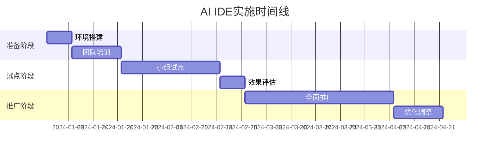

# 案例研究模板：[案例名称]

> **案例类型**: [小型项目/中型项目/大型项目/特定场景]
> 
> **行业领域**: [软件开发/金融/电商/教育等]
> 
> **项目规模**: [团队人数/项目周期/代码规模]

## 案例概览

### 基本信息


- **项目名称**: [项目名称]
- **组织类型**: [初创公司/中型企业/大型企业/开源项目]
- **团队规模**: [开发人员数量]
- **项目周期**: [项目持续时间]
- **技术栈**: [主要使用的技术栈]
- **AI IDE工具**: [使用的AI IDE工具]

### 项目背景

[详细描述项目背景，包括业务需求、技术挑战、团队现状等]


### 核心挑战

1. **挑战1**: [具体描述面临的挑战]
2. **挑战2**: [具体描述面临的挑战]
3. **挑战3**: [具体描述面临的挑战]

## 实施前状况

### 开发环境现状

- **开发工具**: [现有的开发工具]
- **开发流程**: [现有的开发流程]
- **协作方式**: [团队协作方式]

- **质量控制**: [代码质量控制方法]

### 面临的问题


#### 效率问题
- 问题描述1
- 问题描述2
- 问题描述3


#### 质量问题
- 问题描述1
- 问题描述2
- 问题描述3


#### 协作问题
- 问题描述1
- 问题描述2
- 问题描述3


### 基线指标
| 指标类别 | 具体指标 | 基线数值 | 测量方法 |

|----------|----------|----------|----------|
| 开发效率 | 功能开发速度 | X个功能/周 | 统计完成的功能点 |
| 代码质量 | 缺陷密度 | X个缺陷/KLOC | 代码审查和测试发现 |
| 团队协作 | 沟通效率 | X次会议/周 | 会议记录统计 |

## AI IDE选型过程


### 需求分析

#### 功能需求
- **代码生成**: [具体需求描述]
- **智能补全**: [具体需求描述]
- **错误检测**: [具体需求描述]
- **重构支持**: [具体需求描述]


#### 非功能需求
- **性能要求**: [具体要求]
- **安全要求**: [具体要求]
- **集成要求**: [具体要求]
- **成本要求**: [具体要求]

### 工具评估

#### 候选工具
1. **工具A**: [工具名称和版本]
2. **工具B**: [工具名称和版本]
3. **工具C**: [工具名称和版本]

#### 评估维度和结果
| 评估维度 | 权重 | 工具A | 工具B | 工具C | 说明 |
|----------|------|-------|-------|-------|------|

| 功能完整性 | 30% | 8/10 | 9/10 | 7/10 | 评估说明 |
| 易用性 | 25% | 7/10 | 8/10 | 9/10 | 评估说明 |
| 性能表现 | 20% | 9/10 | 7/10 | 8/10 | 评估说明 |
| 成本效益 | 15% | 6/10 | 8/10 | 9/10 | 评估说明 |
| 技术支持 | 10% | 8/10 | 9/10 | 6/10 | 评估说明 |

#### 最终选择
**选择结果**: [最终选择的工具]

**选择理由**:
1. 理由1：[具体说明]
2. 理由2：[具体说明]
3. 理由3：[具体说明]

## 实施过程

### 实施计划

#### 阶段划分



### 阶段1：准备阶段 (第1-3周)

#### 环境搭建
**目标**: 完成AI IDE工具的安装和基础配置

**具体活动**:
1. **工具安装** (第1周)

   - 下载和安装AI IDE工具
   - 配置开发环境
   - 集成现有工具链

1. **基础配置** (第2周)
   - 配置代码风格和规范
   - 设置项目模板
   - 配置团队协作设置

1. **测试验证** (第3周)
   - 功能测试
   - 性能测试
   - 集成测试

**配置示例**:

```json
{
  "ai-ide-config": {
    "language": "typescript",
    "framework": "react",
    "codeStyle": "airbnb",
    "autoComplete": {
      "enabled": true,
      "suggestions": "aggressive"

    },
    "codeGeneration": {
      "enabled": true,
      "templates": ["component", "service", "test"]
    }
  }
}
```


**遇到的问题**:
- **问题1**: [具体问题描述]
  - **解决方案**: [解决方法]
  - **经验教训**: [学到的经验]

#### 团队培训
**目标**: 让团队成员掌握AI IDE的基本使用方法

**培训内容**:
1. **基础操作培训** (2天)

   - AI IDE界面介绍
   - 基本功能使用
   - 快捷键和技巧

1. **高级功能培训** (3天)
   - 代码生成技巧
   - 智能重构使用
   - 调试和测试集成

1. **最佳实践培训** (2天)
   - 团队协作规范
   - 代码质量控制
   - 效率提升技巧

**培训效果评估**:

| 评估项目 | 培训前 | 培训后 | 提升幅度 |
|----------|--------|--------|----------|
| 工具熟悉度 | 2/10 | 8/10 | +300% |
| 使用效率 | 3/10 | 7/10 | +133% |
| 功能掌握 | 1/10 | 6/10 | +500% |

### 阶段2：试点阶段 (第4-8周)

#### 试点团队选择

**选择标准**:
- 技术能力较强
- 对新技术接受度高
- 项目相对独立
- 愿意提供反馈

**试点项目**: [项目名称和描述]

#### 试点实施
**第4-6周**: 小规模试点
- 选择2-3个开发人员
- 在非关键项目上使用
- 每日收集使用反馈
- 记录问题和改进建议

**第7-8周**: 扩大试点
- 扩展到整个小组(5-8人)
- 在正式项目中使用
- 进行效果对比测试
- 优化配置和流程


#### 试点效果
**定量效果**:
| 指标 | 试点前 | 试点后 | 改善幅度 |
|------|--------|--------|----------|
| 代码编写速度 | X行/小时 | Y行/小时 | +Z% |
| 代码质量评分 | X分 | Y分 | +Z% |
| 缺陷发现率 | X% | Y% | +Z% |

**定性反馈**:
- **积极反馈**:

  - 反馈1：[具体描述]
  - 反馈2：[具体描述]
  
- **问题和建议**:
  - 问题1：[具体描述] → 解决方案：[具体方案]
  - 问题2：[具体描述] → 解决方案：[具体方案]


### 阶段3：全面推广 (第9-16周)

#### 推广策略
1. **分批推广**: 按团队分批进行推广
2. **导师制度**: 试点成员作为导师指导新用户
3. **持续培训**: 定期组织培训和经验分享

4. **激励机制**: 建立使用激励和奖励机制

#### 推广时间表
- **第9-10周**: 第一批团队(10人)
- **第11-12周**: 第二批团队(15人)

- **第13-14周**: 第三批团队(20人)
- **第15-16周**: 全员使用和优化调整

#### 推广过程中的挑战
**挑战1**: [具体挑战描述]
- **影响**: [对项目的影响]
- **应对措施**: [采取的应对措施]
- **效果**: [应对效果]

**挑战2**: [具体挑战描述]
- **影响**: [对项目的影响]
- **应对措施**: [采取的应对措施]
- **效果**: [应对效果]

## 实施效果评估

### 定量效果分析

#### 开发效率提升

```mermaid
xychart-beta
    title "开发效率变化趋势"
    x-axis [实施前, 第1月, 第2月, 第3月, 第4月, 第5...]
    y-axis "功能点/周" 0 --> 20
    line [8, 9, 11, 14, 16, 18, 19]
```

| 时间节点 | 功能开发速度 | 代码编写速度 | 调试时间 | 测试效率 |
|----------|--------------|--------------|----------|----------|
| 实施前 | 8功能点/周 | 200行/小时 | 4小时/缺陷 | 60% |
| 实施后3个月 | 14功能点/周 | 350行/小时 | 2小时/缺陷 | 85% |
| 改善幅度 | +75% | +75% | -50% | +42% |

#### 代码质量改善
| 质量指标 | 实施前 | 实施后 | 改善幅度 |
|----------|--------|--------|----------|
| 代码复杂度 | 8.5 | 6.2 | -27% |
| 缺陷密度 | 2.3/KLOC | 1.1/KLOC | -52% |
| 代码覆盖率 | 65% | 82% | +26% |
| 技术债务 | 高 | 中 | 显著改善 |

#### 团队协作效果
| 协作指标 | 实施前 | 实施后 | 改善幅度 |
|----------|--------|--------|----------|
| 代码审查时间 | 2小时/PR | 1小时/PR | -50% |
| 沟通会议时间 | 8小时/周 | 5小时/周 | -37% |

| 知识共享频率 | 1次/月 | 4次/月 | +300% |

### 定性效果分析

#### 团队满意度调查
**调查时间**: 实施6个月后

**参与人数**: 45人
**回收率**: 100%

**满意度评分** (1-5分制):
- 工具易用性: 4.2分
- 效率提升: 4.5分

- 学习成本: 3.8分
- 整体满意度: 4.3分

**开放性反馈**:
- **最大收益**: "代码生成功能大大提高了开发效率"

- **最大挑战**: "初期学习曲线较陡峭"
- **改进建议**: "希望增加更多自定义模板"

#### 业务影响评估
**产品交付**:
- 交付周期缩短30%
- 产品质量提升显著
- 客户满意度提高

**团队发展**:
- 开发人员技能提升
- 团队协作更加高效
- 工作满意度提高

## 投资回报分析

### 成本分析


#### 直接成本
| 成本项目 | 金额(万元) | 说明 |
|----------|------------|------|
| 工具许可费 | 12 | 年度许可费用 |
| 培训成本 | 8 | 内部培训和外部培训 |
| 实施成本 | 5 | 环境搭建和配置 |
| 总计 | 25 | 第一年总投入 |

#### 间接成本
- **学习时间成本**: 约40人天
- **试点期效率损失**: 约10%
- **工具适应期**: 约2周

### 收益分析


#### 直接收益
| 收益项目 | 年收益(万元) | 计算依据 |
|----------|--------------|----------|
| 开发效率提升 | 45 | 效率提升75% × 人力成本 |
| 质量改善节省 | 15 | 缺陷减少50% × 修复成本 |
| 维护成本降低 | 8 | 代码质量提升 × 维护成本 |
| 总计 | 68 | 年度总收益 |

#### 间接收益
- **产品上市时间缩短**: 提前2周上市
- **团队能力提升**: 开发人员技能水平提高
- **客户满意度提升**: 产品质量改善带来的客户满意度提升


### ROI计算
**投资回报率** = (年收益 - 年成本) / 年成本 × 100%
= (68 - 25) / 25 × 100% = **172%**

**投资回收期** = 投资成本 / 月均收益 = 25 / (68/12) = **4.4个月**


## 经验教训总结

### 成功因素
1. **管理层支持**: 获得了管理层的充分支持和资源投入
2. **循序渐进**: 采用试点-推广的渐进式实施策略

3. **充分培训**: 投入足够的时间和资源进行团队培训
4. **持续优化**: 根据使用反馈持续优化配置和流程

### 关键挑战及应对
1. **学习曲线陡峭**

   - **挑战**: 团队成员需要时间适应新工具
   - **应对**: 分阶段培训，设置导师制度
   - **效果**: 学习时间缩短50%

1. **工具集成复杂**

   - **挑战**: 与现有工具链集成存在技术难题

   - **应对**: 寻求技术支持，逐步集成
   - **效果**: 成功集成所有关键工具

1. **团队接受度差异**
   - **挑战**: 不同成员对新工具接受度不同

   - **应对**: 个性化培训，激励机制
   - **效果**: 最终接受度达到95%

### 最佳实践总结
1. **实施策略**:

   - 先试点后推广
   - 分阶段实施
   - 持续优化调整

1. **培训方法**:

   - 理论与实践结合
   - 导师制度
   - 定期经验分享

1. **变更管理**:
   - 充分沟通
   - 激励机制
   - 反馈收集


### 避免的陷阱
1. **一步到位**: 避免试图一次性全面推广
2. **忽视培训**: 不能低估培训的重要性
3. **缺乏支持**: 必须确保管理层和技术支持
4. **忽视反馈**: 要及时收集和处理用户反馈


## 后续发展

### 持续改进计划
1. **工具升级**: 定期评估和升级AI IDE工具

2. **流程优化**: 持续优化开发流程和最佳实践
3. **能力建设**: 继续提升团队的AI IDE使用能力
4. **经验分享**: 向其他团队分享实施经验

### 扩展应用
1. **其他项目**: 将成功经验推广到其他项目
2. **新技术集成**: 探索与其他新技术的集成
3. **自动化提升**: 进一步提升开发自动化水平

### 长期规划
1. **技术演进**: 跟踪AI IDE技术发展趋势
2. **组织能力**: 建设组织级的AI辅助开发能力
3. **创新探索**: 探索AI在软件开发中的更多应用

## 附录

### A. 配置文件示例
[提供完整的配置文件示例]

### B. 培训材料清单
[列出所有培训材料和资源]


### C. 问题解决手册
[常见问题及解决方案]

### D. 效果评估工具
[评估工具和模板]

---

**案例信息**
- **整理人**: [姓名]
- **整理日期**: [日期]
- **案例来源**: [来源说明]
- **验证状态**: [已验证/待验证]
- **适用范围**: [适用的项目类型和规模]

**使用说明**
- 本案例基于真实项目整理，数据已做脱敏处理
- 具体实施时需要根据实际情况调整
- 建议结合其他案例综合参考
