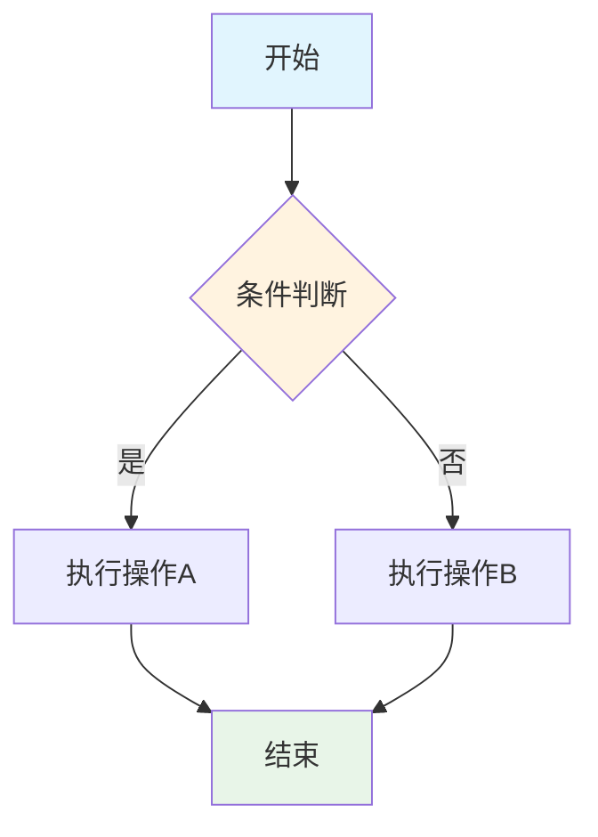
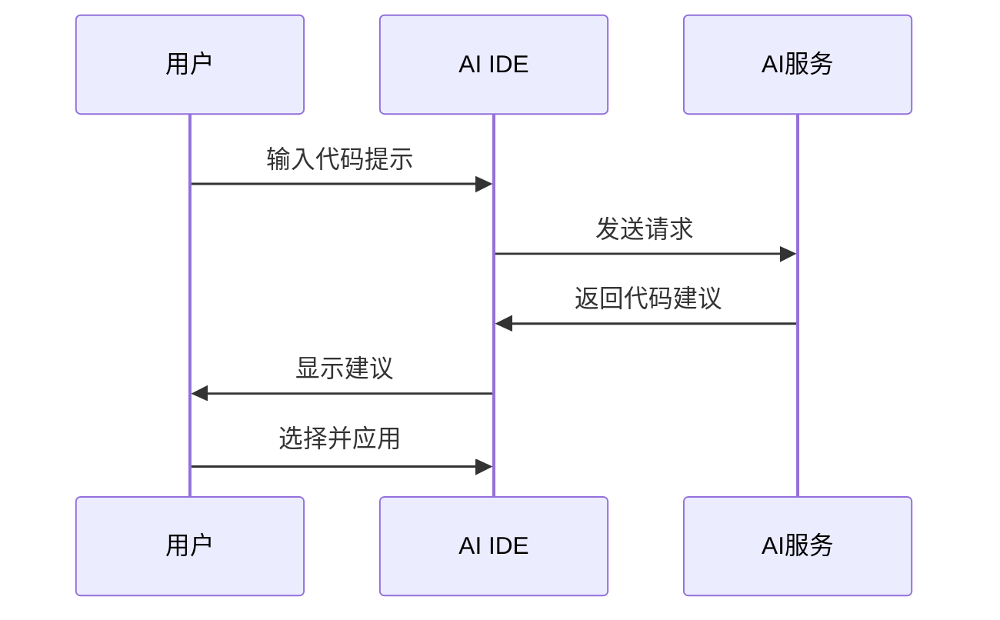
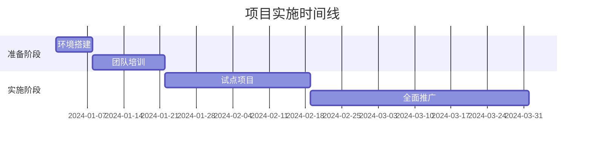

# 文档样式规范指南

## 概述

本文档定义了AI IDE开发指南v2.0项目的统一样式规范，确保所有文档在格式、风格和视觉呈现上保持一致性和专业性。

## 文档结构规范

### 文件命名规范

#### 文档文件命名


- **格式**: `章节编号-章节名称.md`
- **示例**: `03-tool-comparison.md`, `05-roi-assessment.md`
- **规则**:
  - 使用小写字母
  - 单词间用连字符(-)分隔
  - 中文章节使用拼音命名
  - 避免使用特殊字符和空格

#### 图片文件命名

- **格式**: `章节编号-图片类型-描述.扩展名`
- **示例**: `03-table-tool-comparison.png`, `05-chart-roi-trend.svg`
- **图片类型标识**:
  - `table`: 表格
  - `chart`: 图表
  - `diagram`: 流程图/架构图
  - `screenshot`: 截图
  - `icon`: 图标

### 目录结构规范

```markdown
docs/
├── chapters/                    # 章节内容
│   ├── 01-introduction/        # 按章节编号组织
│   ├── 02-ai-ide-overview/
│   └── ...
├── assets/                     # 资源文件
│   ├── images/                 # 图片资源
│   │   ├── charts/            # 图表
│   │   ├── diagrams/          # 流程图/架构图
│   │   └── screenshots/       # 截图
│   ├── templates/             # 模板文件
│   └── downloads/             # 可下载资源
├── templates/                  # 文档模板
└── styles/                    # 样式文件
```

## 文档格式规范

### Markdown语法规范

#### 标题层级

```markdown
# 一级标题 (章节标题)
## 二级标题 (主要部分)
### 三级标题 (子部分)
#### 四级标题 (详细内容)
##### 五级标题 (最小单元)
```


**使用原则**:
- 一级标题仅用于章节标题
- 标题层级不要跳跃，保持连续
- 同级标题格式保持一致
- 标题后空一行再开始正文

#### 段落和换行

```markdown
段落之间使用空行分隔。

这是新的段落。段落内的文字应该保持适当的长度，
避免单行过长影响阅读体验。

- 列表项之间不需要空行
- 除非列表项内容较长
- 需要更好的视觉分隔
```

#### 强调和突出

```markdown
**粗体文字**: 用于重要概念和关键词
*斜体文字*: 用于术语定义和引用
`代码片段`: 用于代码、命令、文件名
> 引用块: 用于重要提示和引用内容
```

### 列表格式规范

#### 无序列表

```markdown
- 一级列表项
  - 二级列表项
  - 二级列表项
    - 三级列表项
- 一级列表项
```

#### 有序列表

```markdown
1. 第一项
2. 第二项
   1. 子项目2.1
   2. 子项目2.2
3. 第三项
```

#### 任务列表

```markdown
- [ ] 未完成任务
- [x] 已完成任务
- [ ] 进行中任务
```

### 表格格式规范

#### 基础表格

```markdown
| 列标题1 | 列标题2 | 列标题3 |
|---------|---------|---------|
| 数据1   | 数据2   | 数据3   |
| 数据4   | 数据5   | 数据6   |
```

#### 对齐方式

```markdown
| 左对齐 | 居中对齐 | 右对齐 |
|:-------|:--------:|-------:|
| 内容   |   内容   |   内容 |
```

#### 复杂表格示例

```markdown
| 工具名称 | 功能评分 | 价格 | 适用场景 | 推荐指数 |
|----------|:--------:|-----:|----------|:--------:|
| GitHub Copilot | 9/10 | $10/月 | 通用开发 | ⭐⭐⭐⭐⭐ |
| Cursor | 8/10 | $20/月 | AI优先开发 | ⭐⭐⭐⭐ |
```

### 代码块格式规范


#### 行内代码

```markdown
使用 `npm install` 命令安装依赖包。
配置文件位于 `config/settings.json`。
```


#### 代码块

````markdown
```javascript
// JavaScript代码示例
function generateCode(prompt) {

  return aiService.generate(prompt);
}

```markdown

```bash


## 命令行示例
npm install ai-ide-tools
npm run setup

```markdown

```json
{
  "name": "ai-ide-config",
  "version": "1.0.0",
  "settings": {
    "autoComplete": true
  }
}

```markdown
````


## 代码块最佳实践
- 始终指定语言类型
- 包含必要的注释
- 保持代码简洁和可读
- 提供完整的上下文

## 视觉设计规范

### 颜色方案

#### 主色调

```css
:root {
  --primary-blue: #2563eb;      /* 主蓝色 - 用于标题和重点 */
  --secondary-green: #10b981;   /* 辅助绿色 - 用于成功和积极信息 */
  --accent-orange: #f59e0b;     /* 强调橙色 - 用于警告和注意 */
  --danger-red: #ef4444;        /* 危险红色 - 用于错误和警告 */
  --neutral-gray: #6b7280;      /* 中性灰色 - 用于次要信息 */
  --background-light: #f9fafb;  /* 浅背景色 */

  --text-dark: #1f2937;         /* 深色文字 */
}
```


#### 颜色使用指南
- **主蓝色**: 章节标题、重要链接、主要按钮
- **辅助绿色**: 成功状态、正面结果、推荐项
- **强调橙色**: 注意事项、重要提示、待办事项
- **危险红色**: 错误信息、风险警告、禁止操作
- **中性灰色**: 次要文字、说明文字、分隔线

### 图表设计规范

#### 表格样式

```css
.comparison-table {
  width: 100%;
  border-collapse: collapse;
  margin: 1.5rem 0;
  font-size: 0.9rem;
  box-shadow: 0 2px 8px rgba(0,0,0,0.1);
}

.comparison-table th {
  background: linear-gradient(135deg, #2563eb, #1d4ed8);
  color: white;
  padding: 12px 16px;
  text-align: left;
  font-weight: 600;
  border-bottom: 2px solid #1e40af;
}

.comparison-table td {
  padding: 10px 16px;
  border-bottom: 1px solid #e5e7eb;
  vertical-align: top;
}

.comparison-table tr:nth-child(even) {
  background-color: #f9fafb;
}

.comparison-table tr:hover {
  background-color: #f3f4f6;
}
```

#### 图表容器

```css
.chart-container {
  margin: 2rem 0;
  padding: 1rem;
  background: white;
  border-radius: 8px;
  box-shadow: 0 2px 4px rgba(0,0,0,0.1);
  text-align: center;
}

.chart-title {
  font-size: 1.2rem;
  font-weight: 600;
  color: #1f2937;
  margin-bottom: 0.5rem;
}

.chart-description {
  font-size: 0.9rem;
  color: #6b7280;
  margin-top: 0.5rem;
  font-style: italic;

}
```

### 图标和符号规范


#### 状态图标
- ✅ 完成/成功/推荐
- ❌ 失败/错误/不推荐
- ⚠️ 警告/注意

- ℹ️ 信息/提示
- 🔧 配置/设置
- 📊 数据/统计
- 🚀 性能/效率
- 💡 建议/最佳实践


#### 评分符号
- ⭐⭐⭐⭐⭐ 优秀 (5星)
- ⭐⭐⭐⭐ 良好 (4星)
- ⭐⭐⭐ 一般 (3星)
- ⭐⭐ 较差 (2星)
- ⭐ 很差 (1星)


#### 优先级标识

- 🔴 高优先级
- 🟡 中优先级
- 🟢 低优先级

## 内容写作规范

### 语言风格


#### 基本原则
1. **简洁明了**: 使用简单直接的语言表达
2. **客观专业**: 保持客观中立的专业态度
3. **逻辑清晰**: 确保内容逻辑关系清楚
4. **读者导向**: 以读者需求为中心组织内容


#### 语言特点
- 使用主动语态而非被动语态
- 避免过于复杂的长句
- 使用具体的数据和例子
- 保持一致的术语使用


#### 示例对比
**❌ 不推荐**:

```markdown
在AI IDE工具的选择过程中，需要被考虑的因素是多方面的，
包括但不限于功能的完整性、使用的便利性、成本的合理性等等。
```

**✅ 推荐**:

```markdown
选择AI IDE工具时，需要考虑三个关键因素：
1. 功能完整性 - 是否满足开发需求
2. 使用便利性 - 学习成本和操作难度
3. 成本合理性 - 价格与价值的匹配度
```


### 术语使用规范


#### 统一术语表
| 中文术语 | 英文术语 | 缩写 | 使用说明 |
|----------|----------|------|----------|
| 人工智能集成开发环境 | AI-Integrated Development Environment | AI IDE | 首次出现时使用全称 |
| 代码生成 | Code Generation | - | 统一使用此术语 |
| 智能补全 | Intelligent Code Completion | - | 不使用"自动补全" |
| 投资回报率 | Return on Investment | ROI | 可直接使用ROI |


#### 术语使用原则
1. **首次出现**: 专业术语首次出现时给出完整定义
2. **保持一致**: 同一概念在全文中使用统一术语
3. **适当解释**: 对复杂术语提供简要解释
4. **避免歧义**: 避免使用可能产生歧义的表达

### 数据和引用规范

#### 数据呈现

```markdown
**正确格式**:
- 性能提升: 75% (基于6个月实测数据)
- 成本节省: ¥50,000/年 (按20人团队计算)
- 用户满意度: 4.2/5.0 (基于100份问卷调查)

**包含要素**:
- 具体数值
- 数据来源
- 时间范围
- 计算基础
```

#### 引用格式

```markdown
**文献引用**:
根据Gartner 2024年报告，AI辅助开发工具的市场采用率预计将达到60%[1]。

**网络资源引用**:
GitHub Copilot官方文档指出，该工具可以提高开发效率30-55%[2]。

**参考文献列表**:
[1] Gartner. "AI Development Tools Market Analysis 2024". 2024年3月.
[2] GitHub. "GitHub Copilot Documentation". https://docs.github.com/copilot. 访问日期: 2024年1月15日.
```

## 图表制作规范

### Mermaid图表规范

#### 流程图



#### 时序图



#### 甘特图



### 图表设计原则


#### 视觉层次
1. **标题**: 清晰明确，使用较大字体
2. **主要内容**: 突出重点信息
3. **辅助信息**: 使用较小字体和浅色
4. **说明文字**: 提供必要的解释


#### 颜色使用
1. **一致性**: 同类信息使用相同颜色
2. **对比度**: 确保文字和背景有足够对比
3. **可访问性**: 考虑色盲用户的需求
4. **专业性**: 使用专业的配色方案

## 质量检查清单


### 格式检查
- [ ] 文件命名符合规范
- [ ] 标题层级正确
- [ ] 列表格式统一
- [ ] 表格对齐正确
- [ ] 代码块语言标识正确


### 内容检查
- [ ] 术语使用一致
- [ ] 数据来源明确
- [ ] 引用格式正确
- [ ] 图表清晰可读

- [ ] 链接有效可访问


### 视觉检查
- [ ] 颜色使用恰当

- [ ] 图标符号统一
- [ ] 间距布局合理
- [ ] 整体风格一致
- [ ] 可读性良好

## 工具和资源


### 推荐工具
1. **Markdown编辑器**: Typora, Mark Text
2. **图表制作**: Mermaid Live Editor, Draw.io
3. **格式检查**: Prettier, markdownlint
4. **颜色工具**: Coolors.co, Adobe Color


### 模板文件
- [章节模板](./chapter-template.md)
- [案例研究模板](./case-study-template.md)
- [图表模板库](../assets/templates/)


### 参考资源
- [Markdown语法指南](https://www.markdownguide.org/)
- [Mermaid文档](https://mermaid-js.github.io/mermaid/)
- [技术写作最佳实践](https://developers.google.com/tech-writing)

---

**文档信息**
- **版本**: v1.0
- **创建日期**: 2024-01-01
- **最后更新**: 2024-01-01
- **维护人**: 项目团队
- **审核状态**: 已审核
