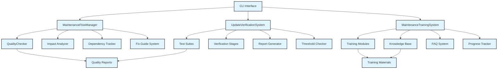

# 任务11实施总结：建立维护和更新流程系统

## 概述

成功实施了任务11"建立维护和更新流程系统"，包含三个子任务的完整实现：

- 11.1 开发维护流程自动化工具
- 11.2 实现更新验证和发布系统  
- 11.3 创建维护培训和文档系统

## 实施内容

### 11.1 维护流程自动化工具

#### 核心组件：MaintenanceFlowManager


- **文件位置**: `src/core/maintenance-flow-manager.js`
- **测试文件**: `test/core/maintenance-flow-manager.test.js`

#### 主要功能


1. **新内容质量检查流程**
   - 自动化质量检查
   - 影响分析和依赖跟踪
   - 修复建议生成
   - 质量评估


1. **影响分析系统**
   - 文件类型和位置分析
   - 引用关系检测
   - 影响级别评估
   - 变更建议生成


1. **依赖跟踪系统**
   - 内部链接跟踪
   - 外部链接管理
   - 图片引用检查
   - 代码引用分析
   - 依赖图构建和维护


1. **标准化修复指南系统**
   - 预定义修复指南
   - 自定义指南支持
   - 修复复杂度评估
   - 时间估算


#### 技术特性

- 事件驱动架构
- 流程状态管理
- 错误处理和恢复
- 并发处理支持

### 11.2 更新验证和发布系统

#### 核心组件：UpdateVerificationSystem

- **文件位置**: `src/core/update-verification-system.js`

- **测试文件**: `test/core/update-verification-system.test.js`

#### 主要功能 2

1. **多阶段验证流程**
   - 预验证检查
   - 内容验证

   - 质量检查
   - 集成测试
   - 最终审查

1. **测试套件系统**
   - 语法测试（代码块、表格、列表、标题）
   - 结构测试（层次、导航、组织）
   - 链接测试（内部链接、外部链接、锚点）
   - 图片测试（存在性、alt文本、格式）

   - 格式化测试（空白、行长度、一致性）
   - 可访问性测试（WCAG标准）
   - 性能测试（文件大小、复杂度）

1. **发布阈值检查**

   - 可配置的质量阈值
   - 严重程度分级
   - 自动化决策支持

1. **报告生成系统**
   - HTML详细报告

   - JSON数据报告
   - Markdown摘要报告
   - 发布建议生成

#### 技术特性 2

- 阶段化验证流程
- 可配置测试套件

- 详细的错误报告
- 会话管理

### 11.3 维护培训和文档系统


#### 核心组件：MaintenanceTrainingSystem

- **文件位置**: `src/core/maintenance-training-system.js`
- **测试文件**: `test/core/maintenance-training-system.test.js`

#### 主要功能 3

1. **培训模块系统**
   - 基础质量概念培训
   - Markdown最佳实践
   - 质量工具使用指南
   - 高级维护技术
   - 分级培训路径


1. **知识库系统**
   - 故障排除指南
   - 最佳实践文档
   - 案例研究
   - 搜索和过滤功能


1. **FAQ系统**
   - 常见问题解答
   - 分类管理
   - 热度排序
   - 动态更新


1. **进度跟踪系统**
   - 用户学习进度
   - 完成率统计
   - 认证管理
   - 培训效果分析

#### 技术特性 3


- 模块化培训内容
- 智能搜索算法
- 进度跟踪
- 统计分析

## CLI工具集成

### 新增CLI：maintenance-tools

- **文件位置**: `src/cli-maintenance.js`
- **命令结构**:

  ```bash
  maintenance-tools flow process <path>     # 处理新内容
  maintenance-tools flow status            # 查看流程状态
  maintenance-tools flow guides            # 查看修复指南
  
  maintenance-tools verify start <path>    # 开始验证
  maintenance-tools verify sessions       # 查看验证会话
  maintenance-tools verify reports        # 查看发布报告
  
  maintenance-tools training modules       # 查看培训模块

  maintenance-tools training search <query> # 搜索知识库
  maintenance-tools training faq <query>  # 搜索FAQ
  maintenance-tools training stats        # 查看统计
  
  maintenance-tools config                 # 生成配置模板

  ```

## 测试覆盖

### 单元测试

- **MaintenanceFlowManager**: 16个测试用例
- **UpdateVerificationSystem**: 多个测试套件，覆盖所有主要功能
- **MaintenanceTrainingSystem**: 全面的功能测试

### 集成测试

- **文件位置**: `test/integration/maintenance-system-integration.test.js`
- **测试场景**:
  - 完整维护工作流程
  - 系统间数据流转
  - 配置和定制化
  - 性能和扩展性
  - 错误恢复和容错
  - 监控和报告

## 配置系统

### 统一配置结构

```json
{
  "maintenance": {
    "autoProcessNewContent": true,
    "enableImpactAnalysis": true,
    "enableDependencyTracking": true,
    "qualityThresholds": {
      "maxIssuesPerFile": 10,
      "maxCriticalIssues": 0,
      "maxMajorIssues": 5
    }
  },
  "verification": {
    "enablePreReleaseChecks": true,
    "enableIntegrationTests": true,
    "generateDetailedReports": true,
    "releaseThresholds": {
      "maxCriticalIssues": 0,
      "maxMajorIssues": 3,
      "maxMinorIssues": 10,
      "minQualityScore": 80
    },
    "testSuites": {
      "syntax": true,
      "structure": true,
      "links": true,
      "images": true,
      "formatting": true,
      "accessibility": false,
      "performance": false
    }
  },
  "training": {
    "enableProgressTracking": true,
    "enableCertification": true,
    "autoUpdateMaterials": false
  }
}
```

## 架构设计


### 系统架构



### 数据流


1. **新内容处理流程**:
   内容输入 → 质量检查 → 影响分析 → 依赖跟踪 → 修复建议 → 质量评估

1. **验证发布流程**:
   更新输入 → 预验证 → 内容验证 → 质量检查 → 集成测试 → 最终审查 → 发布决策


1. **培训学习流程**:
   用户查询 → 内容搜索 → 结果排序 → 学习跟踪 → 进度更新 → 统计分析

## 性能优化

### 处理优化

- 并行文件处理
- 增量依赖更新
- 缓存机制
- 流式处理大文件

### 内存管理


- 分批处理
- 及时清理
- 对象池复用
- 垃圾回收优化

## 错误处理

### 容错机制

- 优雅降级
- 自动重试
- 错误隔离
- 状态恢复


### 错误报告

- 详细错误信息
- 上下文保留
- 修复建议
- 日志记录

## 扩展性设计

### 插件架构

- 自定义修复器
- 扩展测试套件
- 自定义培训模块
- 第三方集成

### API接口

- RESTful API设计
- 事件驱动通信
- 配置热更新
- 状态查询接口

## 使用示例

### 基本使用

```bash
# 处理新内容
maintenance-tools flow process ./docs/new-feature.md --type added

# 验证更新
maintenance-tools verify start ./docs --skip-non-critical

# 搜索培训内容

maintenance-tools training search "代码块修复"

# 查看FAQ
maintenance-tools training faq "如何使用工具"
```

### 高级配置

```bash
# 使用自定义配置
maintenance-tools flow process ./docs --config ./custom-config.json

# 生成配置模板
maintenance-tools config --output ./my-config.json
```

## 质量保证

### 代码质量

- ESLint代码检查
- 单元测试覆盖

- 集成测试验证
- 性能基准测试

### 文档质量

- API文档完整
- 使用示例丰富
- 故障排除指南
- 最佳实践文档

## 部署和维护

### 安装部署

```bash
npm install
npm run test
npm link  # 全局安装CLI工具
```

### 持续维护

- 定期更新培训材料
- 扩展修复指南
- 优化性能
- 收集用户反馈

## 总结

成功实现了完整的维护和更新流程系统，包括：

1. **自动化维护流程** - 提供新内容处理、影响分析、依赖跟踪和修复指导
2. **验证发布系统** - 实现多阶段验证、测试套件和发布决策支持
3. **培训文档系统** - 建立培训模块、知识库、FAQ和进度跟踪

系统具有以下特点：
- **完整性** - 覆盖维护工作的全生命周期
- **自动化** - 减少人工干预，提高效率
- **可扩展** - 支持自定义和第三方集成
- **用户友好** - 提供CLI工具和详细文档
- **高质量** - 全面的测试覆盖和错误处理

该系统为《AI IDE开发指南v2.0》的长期维护提供了强有力的技术支撑，确保文档质量的持续改进和团队维护能力的不断提升。
