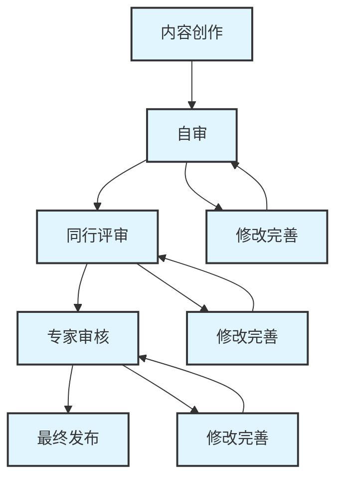

# 内容审核流程


## 审核流程概述


本文档定义了AI IDE开发指南v2.0项目的内容审核流程，确保所有发布的内容都经过严格的质量控制。

## 审核层级


### 三级审核体系


<div class="chart-container">



#### 第一级：自审 (Self Review)

- **责任人**: 内容创作者
- **审核内容**: 基础质量检查
- **审核标准**: 内容质量检查清单
- **时间要求**: 创作完成后立即进行

#### 第二级：同行评审 (Peer Review)

- **责任人**: 同组其他成员
- **审核内容**: 内容质量和技术准确性
- **审核标准**: 内容质量标准
- **时间要求**: 2个工作日内完成

#### 第三级：专家审核 (Expert Review)

- **责任人**: 技术专家或项目负责人
- **审核内容**: 整体质量和发布准备
- **审核标准**: 发布质量标准
- **时间要求**: 3个工作日内完成

## 审核类型


### 1. 新内容审核


#### 适用范围

- 新创建的章节内容
- 新增的案例研究
- 新开发的工具和模板

#### 审核流程

1. **创作者自审** (1天)

   - 使用自审检查清单
   - 确保内容完整性
   - 检查格式规范

1. **同行评审** (2天)

   - 技术准确性验证
   - 内容逻辑性检查
   - 可读性评估

1. **专家审核** (3天)

   - 整体质量评估
   - 与项目目标一致性检查
   - 发布准备确认

### 2. 内容修订审核


#### 适用范围 2

- 现有内容的重大修改
- 技术信息更新
- 结构调整

#### 审核流程 2

1. **变更影响评估**

   - 评估修改范围和影响
   - 确定审核级别
   - 制定审核计划

1. **针对性审核**

   - 重点审核修改部分
   - 检查与其他内容的一致性
   - 验证修改的必要性和准确性

### 3. 快速审核


#### 适用范围 3

- 小幅文字修改
- 格式调整
- 链接更新

#### 审核流程 3

- 同行快速审核（1天内）
- 专家确认（必要时）

## 审核标准


### 内容审核维度


#### 1. 技术准确性

- **检查要点**:
  - 技术概念是否正确
  - 代码示例是否可运行
  - 工具信息是否最新
  - 配置参数是否准确

- **审核方法**:
  - 技术验证测试
  - 专家知识验证
  - 官方文档对照
  - 实际操作验证

#### 2. 内容完整性

- **检查要点**:
  - 是否涵盖所有必要信息
  - 逻辑结构是否完整
  - 案例是否完整
  - 引用是否完整

- **审核方法**:
  - 对照内容大纲
  - 检查章节完整性
  - 验证交叉引用
  - 确认附件完整性

#### 3. 格式规范性

- **检查要点**:
  - 是否符合文档模板
  - 标题层级是否正确
  - 图表格式是否统一
  - 代码格式是否规范

- **审核方法**:
  - 模板对照检查
  - 格式一致性检查
  - 样式规范验证
  - 自动化格式检查

#### 4. 可读性和实用性

- **检查要点**:
  - 语言是否清晰易懂
  - 结构是否逻辑清晰
  - 是否具有实际指导价值
  - 目标读者是否明确

- **审核方法**:
  - 可读性测试
  - 用户体验评估
  - 实用性验证
  - 目标受众匹配度检查

## 审核工具和模板


### 审核检查清单


#### 自审检查清单

```markdown
## 内容自审检查清单


### 基础检查

- [ ] 内容是否完整？
- [ ] 拼写和语法是否正确？
- [ ] 格式是否符合模板要求？
- [ ] 图表是否清晰可读？

### 技术检查

- [ ] 技术信息是否准确？
- [ ] 代码示例是否可运行？
- [ ] 链接是否有效？
- [ ] 版本信息是否最新？

### 质量检查

- [ ] 逻辑结构是否清晰？
- [ ] 表达是否简洁明了？
- [ ] 是否具有实用价值？
- [ ] 是否符合项目目标？

```

#### 同行评审模板

```markdown
## 同行评审报告


**审核人**: [姓名]
**审核日期**: [日期]
**内容标题**: [标题]
**内容版本**: [版本号]

### 审核结果

- [ ] 通过 - 可以进入下一审核阶段
- [ ] 有条件通过 - 需要小幅修改
- [ ] 不通过 - 需要重大修改

### 详细评价


#### 技术准确性 (1-5分): ___

**评价**: 

#### 内容完整性 (1-5分): ___

**评价**: 

#### 格式规范性 (1-5分): ___

**评价**: 

#### 可读性实用性 (1-5分): ___

**评价**: 

### 具体问题和建议

1. 
2. 
3. 

### 优点和亮点

1. 
2. 
3. 

### 总体建议


**审核人签名**: ___________

```

#### 专家审核模板

```markdown
## 专家审核报告


**审核专家**: [姓名和职位]
**审核日期**: [日期]
**内容标题**: [标题]
**审核类型**: [新内容/修订内容/发布审核]

### 审核决定

- [ ] 批准发布
- [ ] 有条件批准 - 需要指定修改
- [ ] 需要重新审核
- [ ] 拒绝发布

### 专业评估


#### 行业标准符合度

**评分**: ___/10
**评价**: 

#### 技术前瞻性

**评分**: ___/10
**评价**: 

#### 实践指导价值

**评分**: ___/10
**评价**: 

#### 市场适用性

**评分**: ___/10
**评价**: 

### 战略建议


#### 内容定位

**建议**: 

#### 目标受众

**建议**: 

#### 市场竞争力

**建议**: 

### 修改要求

#### 必须修改项

1. 
2. 
3. 

#### 建议修改项

1. 
2. 
3. 

### 专家签名和日期

**签名**: ___________
**日期**: ___________

```

## 审核流程管理


### 审核任务分配


#### 分配原则

1. **专业匹配**: 根据内容类型分配相应专业背景的审核人
2. **工作负载平衡**: 合理分配审核任务，避免过度集中
3. **利益回避**: 避免审核自己参与创作的内容
4. **经验互补**: 新手与经验丰富者搭配

#### 分配流程

1. **任务发布**: 项目管理员发布审核任务
2. **审核人确认**: 审核人确认接受任务
3. **时间安排**: 确定审核时间表
4. **进度跟踪**: 跟踪审核进度

### 审核进度管理


#### 进度跟踪工具

```markdown
## 审核进度跟踪表


| 内容标题 | 创作者 | 自审状态 | 同行评审 | 专家审核 | 当前状态 | 预计完成 |
| --------- | -------- | ---------- | ---------- | ---------- | ---------- | ---------- |
| 工具对比 | 张三 | 完成 | 进行中 | 待开始 | 同行评审 | 2024-01-15 |
| ROI评估 | 李四 | 进行中 | 待开始 | 待开始 | 自审 | 2024-01-20 |

```

#### 进度报告

- **周报**: 每周汇总审核进度
- **月报**: 每月分析审核质量趋势
- **问题报告**: 及时报告审核中发现的重大问题

### 审核质量控制


#### 审核人员培训

1. **质量标准培训**: 定期培训质量标准和审核要求
2. **工具使用培训**: 培训审核工具和模板的使用
3. **经验分享**: 组织审核经验分享会
4. **持续学习**: 鼓励学习行业最佳实践

#### 审核质量评估

1. **审核一致性检查**: 定期检查不同审核人的一致性
2. **审核效果评估**: 评估审核对内容质量的改善效果
3. **审核效率分析**: 分析审核时间和效率
4. **改进建议收集**: 收集审核流程改进建议

## 争议解决机制


### 争议类型

1. **技术争议**: 对技术准确性的不同观点
2. **标准争议**: 对质量标准理解的分歧
3. **优先级争议**: 对修改优先级的不同意见
4. **资源争议**: 对审核资源分配的争议

### 解决流程

1. **内部协商**: 相关人员内部协商解决
2. **专家仲裁**: 邀请技术专家进行仲裁
3. **项目组决策**: 项目组集体决策
4. **升级处理**: 向上级管理层报告处理

### 争议记录

- 记录争议内容和各方观点
- 记录解决过程和最终决定
- 总结经验教训，完善流程
- 更新相关标准和指导文件
