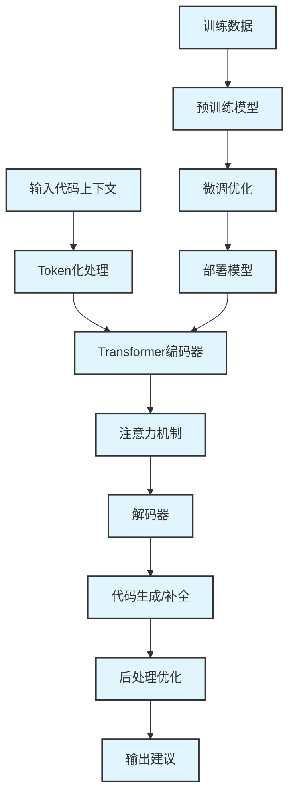
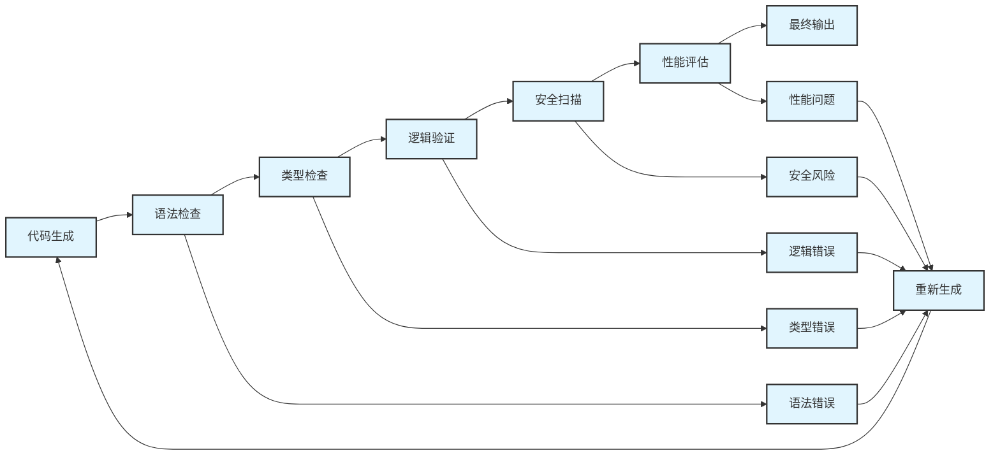

# AI IDE技术发展趋势分析报告


## 概述


本报告深入分析AI IDE技术的核心原理、当前发展状况以及未来趋势，为技术决策提供参考依据。

## AI IDE核心技术原理


### 1. 大语言模型(LLM)基础


#### 技术架构


<div class="chart-container">



#### 关键技术组件


**1. 代码理解模块**

- **语法分析**: 解析代码结构和语法树
- **语义理解**: 理解代码逻辑和意图
- **上下文感知**: 分析文件间依赖关系
- **模式识别**: 识别常见编程模式

**2. 代码生成引擎**

- **序列到序列模型**: 基于Transformer架构
- **注意力机制**: 关注相关代码片段
- **束搜索算法**: 生成多个候选方案
- **概率排序**: 按可能性排序建议

**3. 质量评估系统**

- **语法检查**: 确保生成代码语法正确
- **逻辑验证**: 检查代码逻辑合理性
- **性能评估**: 评估代码执行效率
- **安全审查**: 检测潜在安全问题

### 2. 智能补全技术


#### 技术演进历程


| 阶段 | 时期 | 技术特点 | 代表产品 |
| ------ | ------ | ---------- | ---------- |
| 1.0 | 2010-2015 | 基于规则的静态补全 | IntelliSense, Eclipse |
| 2.0 | 2016-2019 | 基于统计的动态补全 | Kite, TabNine |
| 3.0 | 2020-2022 | 基于深度学习的智能补全 | GitHub Copilot |
| 4.0 | 2023-现在 | 基于大模型的全栈辅助 | Cursor, Claude Code |

#### 核心算法原理


**1. 上下文编码**

```python
# 伪代码示例

def context_encoding(code_context):
    # 提取语法特征
    syntax_features = parse_syntax(code_context)
    
    # 提取语义特征  
    semantic_features = extract_semantics(code_context)
    
    # 编码上下文向量
    context_vector = transformer_encode(
        syntax_features + semantic_features
    )
    
    return context_vector

```

**2. 候选生成**

```python
def generate_candidates(context_vector, model):
    # 解码生成候选
    candidates = model.decode(
        context_vector,
        max_length=100,
        num_beams=5,
        temperature=0.7
    )
    
    # 过滤和排序
    filtered_candidates = filter_by_syntax(candidates)
    ranked_candidates = rank_by_probability(filtered_candidates)
    
    return ranked_candidates[:3]  # 返回前3个候选

```

### 3. 代码生成技术


#### 生成策略


**1. 模板驱动生成**

- 基于预定义模板
- 参数化填充
- 适用于标准化场景

**2. 示例驱动生成**

- 基于相似代码示例
- 模式匹配和适配
- 适用于常见编程任务

**3. 意图驱动生成**

- 基于自然语言描述
- 意图理解和转换
- 适用于复杂逻辑实现

#### 质量保证机制


<div class="chart-container">



## 当前技术发展状况


### 1. 模型能力现状


#### 主流模型对比


| 模型 | 参数规模 | 训练数据 | 代码能力 | 多语言支持 |
| ------ | ---------- | ---------- | ---------- | ------------ |
| GPT-4 | ~1.7T | 通用+代码 | 优秀 | 50+ |
| Claude-3 | ~200B | 通用+代码 | 优秀 | 40+ |
| CodeT5+ | 16B | 代码专用 | 良好 | 20+ |
| StarCoder | 15B | 代码专用 | 良好 | 80+ |
| CodeGen | 16B | 代码专用 | 良好 | 30+ |

#### 性能基准测试


**HumanEval基准测试结果**

```yaml
GPT-4: 67.0% (Pass@1)
Claude-3: 61.4% (Pass@1)  
GitHub Copilot: 47.7% (Pass@1)
StarCoder: 33.6% (Pass@1)
CodeT5+: 30.9% (Pass@1)

```

**MBPP基准测试结果**

```yaml

GPT-4: 76.8% (Pass@1)
Claude-3: 71.2% (Pass@1)
GitHub Copilot: 58.1% (Pass@1)
StarCoder: 52.7% (Pass@1)
CodeT5+: 49.3% (Pass@1)
```

### 2. 技术成熟度分析


#### 技术成熟度曲线


<div class="chart-container">

```mermaid
graph LR
    A[技术触发期] --> B[期望膨胀期]
graph LR
    A[技术触发期] --> B[期望膨胀期]
    B --> C[幻灭低谷期]
    C --> D[启蒙爬升期]
    D --> E[生产成熟期]
    
    F[代码补全] --> E
    G[代码生成] --> D
    H[代码审查] --> D
    I[自动测试] --> C
    J[自动重构] --> C
    K[需求分析] --> B
    L[架构设计] --> B

#### 各技术领域成熟度


| 技术领域 | 成熟度 | 商业化程度 | 主要挑战 |
| ---------- | -------- | ------------ | ---------- |
| 代码补全 | 成熟 | 高 | 准确性优化 |
| 代码生成 | 较成熟 | 中高 | 复杂逻辑处理 |
| 错误检测 | 较成熟 | 中 | 误报率控制 |
| 代码审查 | 发展中 | 中 | 上下文理解 |
| 自动测试 | 发展中 | 低 | 测试覆盖度 |
| 自动重构 | 早期 | 低 | 安全性保证 |

### 3. 行业应用现状


#### 采用率统计


**开发者使用情况**
- 个人开发者使用率: 78%
- 企业团队使用率: 45%
- 大型企业使用率: 62%
- 开源项目使用率: 83%

**按编程语言分布**

```yaml

Python: 85%
Python: 85%
JavaScript: 82%
TypeScript: 79%
Java: 71%
C#: 68%
Go: 65%
C++: 58%
Rust: 52%

#### 效果评估


**生产力提升**

- 代码编写速度: +35-55%
- 调试时间减少: -25-40%
- 代码质量提升: +15-30%
- 学习新技术速度: +40-60%

**成本效益**

- 开发成本降低: 20-35%
- 上市时间缩短: 15-25%
- 维护成本降低: 10-20%
- 培训成本降低: 30-50%

## 技术发展趋势


### 1. 短期趋势(2024-2025)


#### 技术改进方向


**1. 模型能力增强**

- **更大规模模型**: 参数规模向10T+发展
- **多模态融合**: 代码+文档+图像理解
- **实时学习**: 基于用户反馈的在线学习
- **专业化模型**: 针对特定领域的专用模型

**2. 用户体验优化**

- **响应速度提升**: 延迟降低到50ms以下
- **个性化定制**: 基于个人编程习惯的定制
- **智能交互**: 更自然的人机交互方式
- **无缝集成**: 与开发工具链深度集成

**3. 企业级功能**

- **本地部署**: 支持完全本地化部署
- **数据安全**: 增强的数据保护机制
- **合规支持**: 满足各种行业合规要求
- **管理控制**: 企业级管理和监控功能

#### 新兴技术应用


**1. 检索增强生成(RAG)**


<div class="chart-container">

```mermaid
graph TB
    A[用户查询] --> B[向量化]
    B --> C[相似性搜索]
graph TB
    A[用户查询] --> B[向量化]
    B --> C[相似性搜索]
    C --> D[知识库检索]
    D --> E[上下文构建]
    E --> F[LLM生成]
    F --> G[结果输出]
    
    H[代码库] --> I[向量化存储]
    I --> D
    J[文档库] --> I
    K[API文档] --> I
**2. 强化学习优化**
- 基于用户反馈的模型优化
- 代码质量评估的强化学习
- 个性化推荐系统

**3. 联邦学习**
- 保护隐私的分布式训练
- 企业间知识共享
- 个性化模型训练

### 2. 中期趋势(2025-2027)


#### 技术突破方向


**1. 全栈开发助手**
- **端到端开发**: 从需求到部署的全流程支持
- **架构设计**: 自动化系统架构设计
- **性能优化**: 智能性能调优建议
- **安全加固**: 自动化安全漏洞修复

**2. 智能协作平台**
- **团队协作**: AI驱动的团队协作优化
- **知识管理**: 智能化团队知识管理
- **项目管理**: AI辅助的项目管理
- **代码审查**: 自动化代码审查流程

**3. 跨语言能力**
- **语言转换**: 自动化编程语言转换
- **API适配**: 跨平台API自动适配
- **框架迁移**: 自动化框架迁移工具
- **标准统一**: 跨语言编程标准统一

#### 新兴应用场景


**1. 低代码/无代码平台**
- 自然语言编程
- 可视化编程增强
- 业务逻辑自动生成

**2. 教育培训**
- 个性化编程教学
- 智能作业批改
- 编程能力评估

**3. 代码治理**
- 技术债务分析
- 代码质量监控
- 重构建议生成

### 3. 长期趋势(2027-2030)


#### 技术革命方向


**1. 通用人工智能(AGI)应用**
- **自主编程**: 完全自主的软件开发
- **创新设计**: AI驱动的创新解决方案
- **复杂推理**: 处理复杂业务逻辑
- **自我进化**: 自我学习和改进能力

**2. 量子计算集成**
- **量子算法**: 量子计算算法自动生成
- **混合计算**: 经典-量子混合编程
- **优化问题**: 量子优化算法应用

**3. 生物计算融合**
- **DNA编程**: 生物计算编程支持
- **神经网络**: 生物神经网络模拟
- **进化算法**: 生物进化算法应用

## 技术挑战与解决方案


### 1. 当前主要挑战


#### 技术挑战


**1. 准确性问题**
- **幻觉现象**: 生成不存在的API或函数
- **上下文丢失**: 长代码序列的上下文理解
- **逻辑错误**: 生成逻辑不正确的代码

**解决方案**:

```python

## 多层验证机制

def validate_generated_code(code, context):

## 多层验证机制 2


def validate_generated_code(code, context):

    # 语法验证
    if not syntax_check(code):

        return False, "语法错误"
    
    # 类型检查
    if not type_check(code, context):

        return False, "类型错误"
    
    # API验证
    if not api_exists_check(code):

        return False, "API不存在"

    
    # 逻辑验证
    if not logic_check(code, context):
        return False, "逻辑错误"
    
    return True, "验证通过"
**2. 性能问题**
- **响应延迟**: 模型推理时间过长
- **资源消耗**: 计算资源需求大
- **并发处理**: 多用户并发支持

**解决方案**:
- 模型压缩和量化
- 边缘计算部署
- 缓存机制优化
- 异步处理架构


**3. 安全性问题**
- **代码泄露**: 训练数据中的敏感代码
- **恶意代码**: 生成有害代码的风险
- **隐私保护**: 用户代码隐私保护

**解决方案**:
- 差分隐私技术
- 联邦学习框架

- 代码脱敏处理
- 安全审计机制

## 商业挑战


**1. 成本控制**
- 计算成本高昂
- 人才成本上升
- 基础设施投入大


**2. 市场竞争**
- 技术同质化严重
- 价格战激烈
- 用户粘性不足

**3. 法律合规**
- 知识产权争议
- 数据保护法规
- 行业监管要求

### 2. 未来解决方向


#### 技术创新


**1. 新型架构**
- **混合专家模型(MoE)**: 提高效率和专业性
- **神经符号结合**: 结合符号推理和神经网络
- **因果推理**: 增强逻辑推理能力


**2. 训练方法创新**
- **自监督学习**: 减少标注数据依赖
- **元学习**: 快速适应新任务
- **持续学习**: 避免灾难性遗忘

**3. 评估体系**
- **多维度评估**: 功能性、安全性、可维护性
- **实时评估**: 在线评估和反馈
- **用户导向**: 基于用户满意度的评估

## 行业影响分析


### 1. 对软件开发行业的影响


#### 开发模式变革


**传统开发模式**


<div class="chart-container">

```mermaid
graph LR
    A[需求分析] --> B[系统设计]
    B --> C[编码实现]
graph LR
    A[需求分析] --> B[系统设计]
    B --> C[编码实现]
    C --> D[测试验证]
    D --> E[部署上线]

    E --> F[维护更新]


**AI辅助开发模式**


<div class="chart-container">

```mermaid
graph LR
    A[需求分析] --> B[AI辅助设计]
    B --> C[AI代码生成]
graph LR
    A[需求分析] --> B[AI辅助设计]
    B --> C[AI代码生成]
    C --> D[AI测试生成]
    D --> E[自动化部署]
    E --> F[智能监控]
    
    G[AI助手] --> B
    G --> C
    G --> D
    G --> E
    G --> F

#### 角色职能变化


| 角色 | 传统职能 | AI时代职能 | 变化趋势 |
| ------ | ---------- | ------------ | ---------- |
| 初级开发者 | 编写简单代码 | AI协作编程 | 向AI协调者转变 |

| 中级开发者 | 模块开发 | 架构设计+AI管理 | 向系统架构师转变 |
| 高级开发者 | 系统设计 | 业务创新+AI策略 | 向技术领导者转变 |
| 架构师 | 技术架构 | 业务架构+AI治理 | 向业务架构师转变 |

#### 技能需求变化


**新增技能需求**
- AI工具使用和管理
- 提示工程(Prompt Engineering)
- AI模型评估和优化
- 人机协作设计
- AI伦理和安全

**传统技能演进**
- 编码技能 → 代码审查和优化
- 调试技能 → AI辅助问题诊断
- 测试技能 → AI测试策略设计
- 文档技能 → AI文档生成管理

### 2. 对企业的影响


#### 组织结构调整


**开发团队重组**


<div class="chart-container">

```mermaid
graph TB
    A[传统开发团队] --> B[AI增强开发团队]
    
graph TB
    A[传统开发团队] --> B[AI增强开发团队]
    
    C[产品经理] --> D[AI产品经理]
    E[架构师] --> F[AI架构师]
    G[开发者] --> H[AI协作开发者]
    I[测试工程师] --> J[AI测试工程师]
    K[运维工程师] --> L[AI运维工程师]
    
    M[新增角色]
    M --> N[AI训练师]
    M --> O[提示工程师]
    M --> P[AI质量工程师]
#### 投资回报分析


**成本结构变化**
- 工具许可成本: +15-25%
- 人力成本: -20-30%
- 培训成本: +10-15%
- 基础设施成本: +5-10%

**收益提升**
- 开发效率: +30-50%
- 产品质量: +20-35%
- 上市速度: +25-40%
- 创新能力: +40-60%

### 3. 对教育的影响


#### 计算机教育变革


**课程体系调整**
- 增加AI编程课程
- 强化算法和数据结构
- 重视软件工程实践
- 培养创新思维能力

**教学方法创新**
- AI辅助个性化教学
- 智能作业批改系统
- 虚拟编程导师
- 实时学习反馈

## 投资机会分析


### 1. 技术投资方向


#### 核心技术领域


**1. 模型技术**
- 大语言模型优化
- 多模态模型开发
- 专用模型训练
- 模型压缩技术

**2. 基础设施**
- AI计算平台
- 模型服务框架
- 开发工具链
- 数据处理平台

**3. 应用场景**
- 垂直领域应用
- 企业级解决方案
- 教育培训平台
- 开发者工具

#### 投资风险评估


| 投资领域 | 风险等级 | 预期回报 | 投资周期 |
| ---------- | ---------- | ---------- | ---------- |
| 基础模型 | 高 | 高 | 3-5年 |
| 应用工具 | 中 | 中高 | 1-3年 |
| 垂直应用 | 中低 | 中 | 1-2年 |
| 基础设施 | 低 | 中低 | 2-4年 |

### 2. 市场机会


#### 市场规模预测


```php

2024年: $2.9B
2025年: $4.8B (+65%)
2024年: $2.9B
2025年: $4.8B (+65%)
2026年: $7.2B (+50%)

2027年: $10.1B (+40%)
2028年: $13.5B (+34%)
2029年: $17.2B (+27%)
2030年: $21.8B (+27%)

#### 细分市场机会


**1. 企业级市场**
- 市场规模: $8.5B (2030年)

- 增长率: 35%/年
- 主要需求: 安全、合规、定制

**2. 开发者工具市场**
- 市场规模: $6.2B (2030年)
- 增长率: 28%/年
- 主要需求: 效率、易用、集成

**3. 教育培训市场**
- 市场规模: $4.1B (2030年)
- 增长率: 42%/年

- 主要需求: 个性化、互动、效果

## 结论与建议


### 1. 技术发展总结


**当前状态**
- AI IDE技术已进入快速发展期
- 基础功能(代码补全)已相对成熟
- 高级功能(代码生成、审查)仍在发展中
- 企业级应用需求快速增长

**发展趋势**
- 模型能力持续增强
- 应用场景不断扩展
- 用户体验显著改善

- 商业模式日趋成熟

### 2. 战略建议


#### 对企业的建议


**1. 技术选型策略**
- 基于实际需求选择工具
- 重视数据安全和合规
- 考虑长期技术演进

- 建立试点验证机制

**2. 组织准备**
- 制定AI转型战略
- 投资人才培养
- 建立治理机制
- 培育创新文化

**3. 实施路径**

- 从低风险场景开始
- 逐步扩大应用范围
- 建立反馈优化机制
- 持续跟踪技术发展

#### 对开发者的建议


**1. 技能发展**
- 学习AI工具使用
- 培养提示工程能力
- 提升系统思维
- 关注AI伦理问题

**2. 职业规划**
- 向AI协作方向发展
- 培养跨领域能力
- 重视创新思维
- 建立持续学习习惯

### 3. 未来展望


AI IDE技术将继续快速发展，预计在未来5-10年内将彻底改变软件开发行业。企业和个人都需要积极拥抱这一变革，通过合理的策略和投资，在AI时代获得竞争优势。

同时，我们也需要关注AI技术带来的挑战，包括技术风险、伦理问题和社会影响，确保AI技术的健康发展和负责任应用。

---

*报告完成时间: 2024年12月*
*版本: v1.0*
*下次更新: 2025年6月*
