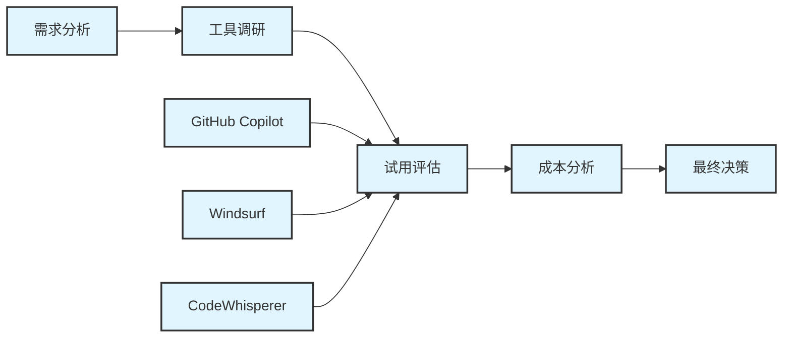

# AI IDE实践案例与最佳实践汇编


## 概述


本文档收集了不同规模企业和团队在AI IDE实施过程中的真实案例，总结了成功经验和失败教训，为读者提供实用的参考和指导。

## 企业实施案例


### 1. 小型企业案例


#### 案例1: 初创科技公司 - TechStart Inc.


**公司背景**

- 规模: 15人开发团队
- 业务: SaaS产品开发
- 技术栈: React + Node.js + MongoDB
- 预算: 有限，注重成本效益

**实施过程**

**第一阶段: 工具选型 (2周)**


<div class="chart-container">



**选型决策过程**:

1. **需求分析**:

   - 主要需求: 代码补全、函数生成
   - 预算限制: <$200/月
   - 技术要求: JavaScript/TypeScript支持

1. **工具对比**:

| 工具 | 月成本 | 功能评分 | 学习成本 | 最终评分 |
| ------ | -------- | ---------- | ---------- | ---------- |
| GitHub Copilot | $150 | 4.5/5 | 低 | 4.2/5 |
| Windsurf | $150 | 4.3/5 | 低 | 4.1/5 |
| CodeWhisperer | $0 | 3.8/5 | 中 | 3.9/5 |

1. **最终选择**: GitHub Copilot

   - 理由: 功能强大，团队熟悉VS Code生态

**第二阶段: 试点实施 (4周)**

**实施策略**:

```python
# 实施计划

implementation_plan = {
    "week_1": {
        "目标": "工具安装和基础培训",
        "活动": [
            "为所有开发者安装GitHub Copilot",
            "组织2小时培训会议",
            "建立使用指南文档"
        ],
        "成功指标": "100%开发者完成安装"
    },
    "week_2": {
        "目标": "日常开发集成",
        "活动": [
            "在新功能开发中使用Copilot",
            "收集使用反馈",
            "优化提示词技巧"
        ],
        "成功指标": "每日使用率>50%"
    },
    "week_3": {
        "目标": "团队协作优化",
        "活动": [
            "建立代码审查标准",
            "分享最佳实践",
            "解决使用问题"
        ],
        "成功指标": "代码质量保持稳定"
    },
    "week_4": {
        "目标": "效果评估",
        "活动": [
            "统计开发效率数据",
            "评估代码质量",
            "制定长期使用策略"
        ],
        "成功指标": "ROI分析完成"
    }
}

```

**第三阶段: 全面推广 (8周)**

**推广策略**:

1. **培训体系建立**:

   - 新员工入职培训包含AI工具使用
   - 每周分享最佳实践案例
   - 建立内部知识库

1. **质量控制机制**:

   - AI生成代码必须经过人工审查
   - 建立代码质量检查清单
   - 定期进行安全审计

1. **效果监控**:

   - 每周统计开发效率指标
   - 月度代码质量评估
   - 季度ROI分析

**实施效果**

**定量效果**:

```yaml
开发效率提升:
- 代码编写速度: +42%
- 功能开发周期: -28%
- Bug修复时间: -35%
- 新功能上线速度: +38%

成本效益:
- 工具成本: $150/月
- 效率提升价值: $8,500/月
- ROI: 5,567%
- 投资回收期: 0.5个月

```

**定性效果**:

- 开发者满意度显著提升
- 学习新技术速度加快
- 代码一致性改善
- 团队协作效率提高

**遇到的问题与解决方案**:

1. **过度依赖问题**:

   - **问题**: 部分开发者过度依赖AI建议
   - **解决**: 建立代码审查机制，强调人工验证

1. **代码质量担忧**:

   - **问题**: 担心AI生成代码质量不稳定
   - **解决**: 制定质量检查标准，增加测试覆盖

1. **学习曲线**:

   - **问题**: 新员工需要时间适应AI工具
   - **解决**: 建立系统化培训流程

**经验总结**:

- 从小规模试点开始，逐步推广
- 重视培训和最佳实践分享
- 建立质量控制机制
- 持续监控和优化

#### 案例2: 移动应用开发公司 - MobileFirst Studio


**公司背景**

- 规模: 8人开发团队
- 业务: iOS/Android应用开发
- 技术栈: Swift, Kotlin, React Native
- 特点: 项目周期短，客户需求变化快

**实施挑战**:

1. 多技术栈支持需求
2. 快速原型开发需求
3. 客户定制化要求高

**解决方案**:

**工具组合策略**:


<div class="chart-container">

```mermaid
graph TB
graph TB
    A[主力工具: Cursor] --> B[Swift开发]
    A --> C[Kotlin开发]
    A --> D[React Native开发]
    E[辅助工具: GitHub Copilot] --> F[代码补全]
    G[专用工具: CodeWhisperer] --> H[AWS集成]
    I[工作流程]
    I --> J[需求分析 + AI辅助]
    J --> K[快速原型 + AI生成]
    K --> L[迭代开发 + AI优化]
    L --> M[测试部署 + AI检查]
%% Standard styling
classDef default fill:#e1f5fe,stroke:#333,stroke-width:2px
classDef highlight fill:#bbdefb,stroke:#333,stroke-width:3px
classDef process fill:#90caf9,stroke:#333,stroke-width:2px
classDef decision fill:#64b5f6,stroke:#333,stroke-width:2px
```

**实施效果**:

- 原型开发速度提升60%
- 跨平台代码复用率提高45%
- 客户满意度提升30%
- 项目交付周期缩短25%

### 2. 中型企业案例


#### 案例3: 电商平台公司 - EcommerceHub


**公司背景**

- 规模: 120人技术团队
- 业务: B2B电商平台
- 技术栈: Java Spring Boot + Vue.js + MySQL
- 特点: 业务复杂，系统庞大，团队分布式

**实施策略**

**分阶段实施计划**:

```bash

Phase 1 (月1-2): 前端团队试点
├── 目标: 验证AI工具在前端开发中的效果
├── 范围: 30人前端团队
├── 工具: GitHub Copilot + Cursor
└── 成功标准: 开发效率提升>25%

Phase 2 (月3-4): 后端团队扩展
├── 目标: 扩展到后端Java开发
├── 范围: 50人后端团队
├── 工具: GitHub Copilot + IntelliJ IDEA集成
└── 成功标准: 代码质量保持稳定

Phase 3 (月5-6): 全团队覆盖
├── 目标: 覆盖所有开发团队
├── 范围: 120人技术团队
├── 工具: 企业版工具 + 定制化配置
└── 成功标准: 整体ROI>300%

Phase 4 (月7-8): 流程优化
├── 目标: 优化开发流程和工具配置
├── 范围: 全团队 + DevOps
├── 工具: 集成CI/CD + 自动化测试
└── 成功标准: 端到端效率提升>40%
```

**团队管理策略**:

1. **分层培训体系**:

```python
training_system = {
    "初级开发者": {
training_system = {
    "初级开发者": {
        "培训内容": [
            "AI工具基础使用",
            "代码补全技巧",
            "常见问题解决"
        ],
        "培训时长": "4小时",
        "考核标准": "基础操作熟练度测试"
    },
    "中级开发者": {
        "培训内容": [
            "高级功能使用",
            "代码生成优化",
            "团队协作最佳实践"
        ],
        "培训时长": "6小时",
        "考核标准": "实际项目应用评估"
    },
    "高级开发者": {
        "培训内容": [
            "AI工具管理配置",
            "团队标准制定",
            "效果评估方法"
        ],
        "培训时长": "8小时",
        "考核标准": "团队指导能力评估"
    }
}

14. **质量保证体系**:


<div class="chart-container">

```mermaid
graph TB
    A[AI代码生成] --> B[自动化检查]
graph TB
    A[AI代码生成] --> B[自动化检查]
    B --> C[同行评审]
    C --> D[技术负责人审核]
    D --> E[集成测试]
    E --> F[代码合并]
    
    G[质量门禁]
    G --> H[语法检查]
    G --> I[安全扫描]
    G --> J[性能测试]
    G --> K[合规检查]
    
    B --> G

**实施效果**:

**团队效率提升**:

```markdown

前端团队:
前端团队:
- 组件开发速度: +55%
- UI实现效率: +48%
- 测试用例编写: +62%

后端团队:
- API开发速度: +38%
- 数据库操作代码: +45%
- 业务逻辑实现: +32%

DevOps团队:
- 配置脚本编写: +67%
- 监控代码生成: +58%
- 自动化测试: +43%

**业务价值**:
- 产品迭代周期从6周缩短到4周
- 新功能上线速度提升40%
- 技术债务减少25%
- 团队满意度提升35%

**挑战与解决方案**:

15. **团队协作挑战**:
   - **问题**: 不同团队使用不同AI工具，协作困难
   - **解决**: 统一工具标准，建立跨团队最佳实践

16. **代码一致性问题**:
   - **问题**: AI生成代码风格不统一
   - **解决**: 建立代码规范模板，配置AI工具遵循团队标准

17. **安全合规要求**:
   - **问题**: 企业对代码安全有严格要求
   - **解决**: 部署企业版工具，建立安全审计流程

#### 案例4: 金融科技公司 - FinTechPro


**公司背景**
- 规模: 200人开发团队
- 业务: 数字银行平台
- 技术栈: .NET Core + Angular + SQL Server
- 特点: 高安全要求，严格合规，复杂业务逻辑

**特殊要求**:
18. 数据不能离开企业内网
19. 所有代码必须通过安全审计
20. 符合金融行业合规要求
21. 高可用性和性能要求

**解决方案**:

**本地化部署架构**:


<div class="chart-container">

```mermaid
graph TB
    A[企业内网] --> B[AI模型服务器]
    B --> C[代码生成服务]
graph TB
    A[企业内网] --> B[AI模型服务器]
    B --> C[代码生成服务]
    C --> D[安全审计模块]
    D --> E[合规检查模块]
    E --> F[开发者IDE]
    
    G[外部模型] --> H[离线训练]
    H --> I[模型导入]
    I --> B
    
    J[企业代码库] --> K[私有训练数据]
    K --> L[模型微调]
    L --> B
**实施策略**:

1. **工具选择**: Tabnine Enterprise (支持本地部署)
2. **部署方式**: 私有云 + 本地模型
3. **安全措施**: 端到端加密 + 访问控制
4. **合规保证**: 审计日志 + 合规检查

**实施过程**:

**第一阶段: 基础设施建设 (8周)**

```python
infrastructure_setup = {
    "week_1_2": {
        "任务": "硬件采购和环境搭建",
infrastructure_setup = {
    "week_1_2": {
        "任务": "硬件采购和环境搭建",
        "交付物": [
            "AI服务器集群",
            "网络安全配置",
            "基础监控系统"
        ]
    },
    "week_3_4": {
        "任务": "AI模型部署和配置",
        "交付物": [
            "Tabnine企业版部署",
            "模型微调环境",
            "API接口配置"
        ]
    },
    "week_5_6": {
        "任务": "安全和合规系统集成",
        "交付物": [
            "安全审计模块",
            "合规检查系统",
            "访问控制配置"
        ]
    },
    "week_7_8": {
        "任务": "测试和优化",
        "交付物": [
            "性能测试报告",
            "安全测试报告",
            "用户接受测试"
        ]
    }
}
**第二阶段: 试点推广 (12周)**

**试点团队选择**:
- 核心业务团队: 20人
- 基础设施团队: 15人
- 测试团队: 10人

**培训计划**:


<div class="chart-container">

```mermaid
graph LR
    A[管理层培训] --> B[技术负责人培训]
    B --> C[开发团队培训]
graph LR
    A[管理层培训] --> B[技术负责人培训]
    B --> C[开发团队培训]
    C --> D[实践指导]
    D --> E[效果评估]
    
    F[安全合规培训] --> G[工具使用培训]
    G --> H[最佳实践培训]
    H --> I[问题解决培训]
**第三阶段: 全面部署 (16周)**

**分批推广策略**:

1. **批次1**: 核心业务系统开发团队 (50人)
2. **批次2**: 支撑系统开发团队 (80人)
3. **批次3**: 运维和测试团队 (70人)

**实施效果**:

**安全合规效果**:

- 代码安全漏洞检出率: 95%
- 合规检查通过率: 98%
- 安全审计零问题
- 数据泄露风险: 0

**开发效率效果**:

- 业务逻辑开发效率: +35%
- 测试用例生成效率: +58%
- 文档生成效率: +72%
- 代码审查效率: +45%

**成本效益分析**:

```yaml

投资成本:
- 硬件设备: $150,000
投资成本:
- 硬件设备: $150,000
- 软件许可: $240,000/年
- 实施服务: $80,000
- 培训成本: $50,000

总投资: $520,000

年度收益:
- 开发效率提升: $1,200,000
- 质量改善节省: $300,000
- 合规成本降低: $150,000

总收益: $1,650,000

ROI: 217%
投资回收期: 5.7个月
### 3. 大型企业案例


#### 案例5: 跨国软件公司 - GlobalSoft Corp


**公司背景**
- 规模: 2000+开发者，分布在15个国家
- 业务: 企业级软件解决方案
- 技术栈: 多技术栈 (Java, .NET, Python, JavaScript等)
- 特点: 多地协作，复杂项目管理，严格质量要求

**实施挑战**:
29. 多地团队协作复杂
30. 技术栈多样化
31. 质量标准统一困难
32. 大规模部署管理复杂

**解决方案架构**:


<div class="chart-container">

```mermaid
graph TB
    A[全球AI IDE平台] --> B[北美区域]
    A --> C[欧洲区域]
    A --> D[亚太区域]
graph TB
    A[全球AI IDE平台] --> B[北美区域]
    A --> C[欧洲区域]
    A --> D[亚太区域]
    
    B --> E[美国团队]
    B --> F[加拿大团队]
    
    C --> G[英国团队]
    C --> H[德国团队]
    C --> I[法国团队]
    
    D --> J[中国团队]
    D --> K[印度团队]
    D --> L[日本团队]
    
    M[中央管理平台]
    M --> N[统一配置管理]
    M --> O[全局监控分析]
    M --> P[最佳实践共享]
    M --> Q[合规性管理]

**1. 统一平台建设**

```python
platform_architecture = {
    "核心组件": {
        "AI模型服务": "多模型支持，区域化部署",
        "配置管理": "统一配置，本地化定制",
platform_architecture = {
    "核心组件": {
        "AI模型服务": "多模型支持，区域化部署",
        "配置管理": "统一配置，本地化定制",
        "监控分析": "实时监控，全局分析",
        "用户管理": "SSO集成，权限控制"
    },
    "区域适配": {
        "语言支持": "多语言界面和文档",
        "合规要求": "各地法规适配",
        "网络优化": "就近访问，CDN加速",
        "时区处理": "全球时区支持"
    },
    "技术栈支持": {
        "Java生态": "IntelliJ IDEA, Eclipse集成",
        ".NET生态": "Visual Studio集成",
        "Web前端": "VS Code, WebStorm集成",
        "移动开发": "Android Studio, Xcode集成"
    }
}

**Phase 1: 基础设施建设 (6个月)**
- 全球平台架构设计和实施
- 区域化部署和网络优化
- 安全和合规框架建立
- 基础监控和管理系统

**Phase 2: 试点推广 (4个月)**

- 选择3个区域进行试点
- 每个区域选择50-100人团队
- 收集反馈和优化平台
- 建立最佳实践库

**Phase 3: 全面推广 (8个月)**
- 分批次覆盖所有区域和团队
- 持续优化和功能增强
- 建立全球支持体系
- 效果评估和ROI分析

**实施效果**:

**全球协作效果**:

```markdown

跨地区协作效率:

- 代码共享效率: +65%
- 知识传递速度: +78%
跨地区协作效率:

- 代码共享效率: +65%
- 知识传递速度: +78%
- 项目交付协调: +45%
- 技术标准统一: +82%

多技术栈支持:

- Java项目效率: +42%
- .NET项目效率: +38%
- Web前端效率: +55%
- 移动开发效率: +48%
- 全球开发标准统一度: 95%
- 代码质量一致性: 90%
- 合规检查通过率: 98%
- 团队满意度: 4.3/5.0

**业务价值**:

- 产品开发周期缩短30%
- 跨地区项目成功率提升25%
- 技术债务减少40%
- 创新项目数量增加60%

## 行业最佳实践总结


### 1. 工具选型最佳实践


#### 选型决策框架


<div class="chart-container">

```mermaid
graph TB
    A[需求分析] --> B[工具调研]
    B --> C[试用评估]
    C --> D[成本分析]
    D --> E[风险评估]
graph TB
    A[需求分析] --> B[工具调研]
    B --> C[试用评估]
    C --> D[成本分析]
    D --> E[风险评估]
    E --> F[最终决策]
    
    G[团队规模] --> A
    H[技术栈] --> A
    I[预算限制] --> A
    J[安全要求] --> A
    
    K[功能对比] --> C
    L[性能测试] --> C
    M[用户体验] --> C
    
    N[TCO计算] --> D
    O[ROI预测] --> D
    
    P[技术风险] --> E
    Q[商业风险] --> E
    R[合规风险] --> E

**功能评估维度**:
- [ ] 代码补全准确度 (权重: 25%)
- [ ] 代码生成质量 (权重: 20%)
- [ ] 错误检测能力 (权重: 15%)
- [ ] IDE集成程度 (权重: 15%)
- [ ] 多语言支持 (权重: 10%)
- [ ] 响应速度 (权重: 10%)
- [ ] 学习曲线 (权重: 5%)

**非功能评估维度**:
- [ ] 数据安全性
- [ ] 合规性支持
- [ ] 可扩展性
- [ ] 可靠性
- [ ] 技术支持质量
- [ ] 社区活跃度
- [ ] 长期发展前景

#### 试用评估方法


**1. 定量评估**:

```python
def evaluate_tool_performance(tool_name, test_cases):
    """
    工具性能定量评估
    """
    results = {
def evaluate_tool_performance(tool_name, test_cases):
    """
    工具性能定量评估
    """
    results = {
        "completion_accuracy": 0,
        "generation_quality": 0,
        "response_time": 0,
        "error_detection": 0
    }
    
    for case in test_cases:


        # 代码补全准确度测试
        completion_result = test_code_completion(tool_name, case)
        results["completion_accuracy"] += completion_result.accuracy
        

        # 代码生成质量测试
        generation_result = test_code_generation(tool_name, case)
        results["generation_quality"] += generation_result.quality_score
        

        # 响应时间测试
        response_time = measure_response_time(tool_name, case)
        results["response_time"] += response_time
        

        # 错误检测能力测试
        error_detection = test_error_detection(tool_name, case)
        results["error_detection"] += error_detection.accuracy
    

    # 计算平均值
    for key in results:
        results[key] /= len(test_cases)
    
    return results
- 开发者满意度调查
- 学习曲线评估
- 团队协作影响分析

## 2. 实施部署最佳实践


#### 实施方法论


**1. 渐进式实施策略**


<div class="chart-container">

```mermaid
graph LR
    A[个人试用] --> B[小团队试点]
    B --> C[部门推广]
    C --> D[全公司部署]
    
graph LR
    A[个人试用] --> B[小团队试点]
    B --> C[部门推广]
    C --> D[全公司部署]
    
    E[1-2周] --> A
    F[4-6周] --> B
    G[8-12周] --> C
    H[16-24周] --> D
- 建立回退机制和应急预案
- 持续监控和反馈收集
- 定期评估和调整策略

#### 培训体系建设


**1. 分层培训策略**

```python
training_framework = {
    "管理层": {
        "内容": ["AI IDE价值认知", "投资回报分析", "风险管理"],
        "时长": "2小时",
        "方式": "高管研讨会"
training_framework = {
    "管理层": {
        "内容": ["AI IDE价值认知", "投资回报分析", "风险管理"],
        "时长": "2小时",
        "方式": "高管研讨会"
    },
    "技术负责人": {
        "内容": ["工具深度使用", "团队管理", "最佳实践制定"],
        "时长": "8小时",
        "方式": "技术工作坊"
    },
    "开发者": {
        "内容": ["基础使用", "进阶技巧", "实践案例"],
        "时长": "4小时",
        "方式": "实操培训"
    },

    "新员工": {
        "内容": ["入门指导", "公司标准", "实践练习"],
        "时长": "2小时",
        "方式": "入职培训"
    }
}
- 定期组织经验分享会
- 建立专家支持网络
- 跟踪最新技术发展

#### 质量保证体系


**1. 代码质量控制**


<div class="chart-container">

```mermaid
graph TB
    A[AI代码生成] --> B[自动化检查]
    B --> C{质量门禁}
    C -->|通过| D[人工审查]
    C -->|不通过| E[重新生成]
graph TB
    A[AI代码生成] --> B[自动化检查]
    B --> C{质量门禁}
    C -->|通过| D[人工审查]
    C -->|不通过| E[重新生成]
    D --> F{审查结果}
    F -->|通过| G[代码合并]
    F -->|不通过| H[修改优化]
    H --> D
    E --> A
    
    I[质量标准]
    I --> J[语法正确性]
    I --> K[逻辑合理性]
    I --> L[安全性检查]
    I --> M[性能要求]
    I --> N[编码规范]
    
    B --> I
- 敏感信息泄露检查
- 第三方安全审计
- 合规性检查和认证

### 3. 团队管理最佳实践


#### 角色定义和职责


**1. AI IDE管理员**
- 工具配置和维护
- 用户权限管理
- 性能监控和优化
- 技术支持和问题解决

**2. 技术教练**
- 最佳实践推广
- 团队培训和指导
- 经验分享和知识传递
- 新技术评估和引入

**3. 质量守护者**
- 代码质量标准制定
- 审查流程设计和执行
- 质量指标监控
- 持续改进推动

#### 协作模式优化


**1. 人机协作模式**

```python
collaboration_patterns = {
    "辅助模式": {
        "描述": "AI作为辅助工具，人类主导开发",
        "适用场景": "复杂业务逻辑，创新性开发",
        "优势": "保持人类创造力，确保代码质量",
collaboration_patterns = {
    "辅助模式": {
        "描述": "AI作为辅助工具，人类主导开发",
        "适用场景": "复杂业务逻辑，创新性开发",
        "优势": "保持人类创造力，确保代码质量",
        "注意事项": "避免过度依赖，保持技能水平"
    },
    "协作模式": {
        "描述": "人机平等协作，各自发挥优势",
        "适用场景": "标准化开发，重复性任务",
        "优势": "效率最大化，质量有保障",
        "注意事项": "明确分工，建立信任机制"
    },
    "监督模式": {
        "描述": "AI主导生成，人类监督和验证",
        "适用场景": "简单功能实现，代码重构",
        "优势": "速度快，一致性好",
        "注意事项": "严格验证，防止错误传播"
    }
}

<div class="chart-container">

```mermaid
graph TB
    A[需求分析] --> B[AI辅助设计]
    B --> C[代码生成]
    C --> D[人工审查]
    D --> E[测试验证]
graph TB
    A[需求分析] --> B[AI辅助设计]
    B --> C[代码生成]
    C --> D[人工审查]
    D --> E[测试验证]
    E --> F[集成部署]
    
    G[团队协作点]
    G --> H[需求讨论]
    G --> I[设计评审]
    G --> J[代码审查]
    G --> K[测试协作]
    
    L[知识共享]
    L --> M[最佳实践]
    L --> N[经验教训]
    L --> O[技术创新]

#### 评估指标体系


**1. 效率指标**

```python
efficiency_metrics = {
    "开发效率": {
        "代码编写速度": "行数/小时",
        "功能完成时间": "小时/功能点",
        "Bug修复时间": "小时/Bug",
efficiency_metrics = {
    "开发效率": {
        "代码编写速度": "行数/小时",
        "功能完成时间": "小时/功能点",
        "Bug修复时间": "小时/Bug",
        "代码审查时间": "分钟/PR"
    },
    "质量指标": {
        "代码质量评分": "1-10分",
        "Bug密度": "Bug数/KLOC",
        "测试覆盖率": "百分比",
        "技术债务": "小时数"
    },
    "协作指标": {

        "知识共享频率": "次数/月",
        "团队满意度": "1-5分",
        "学习效率": "技能提升速度",
        "创新项目数": "个数/季度"
    }
}
- 客户满意度
- 市场竞争力
- 收入增长

#### 数据收集和分析


**1. 自动化数据收集**

```python
def collect_metrics_automatically():
    """
    自动化指标收集系统
    """
    metrics = {}
def collect_metrics_automatically():
    """
    自动化指标收集系统
    """
    metrics = {}
    
    # 从版本控制系统收集数据
    git_metrics = collect_git_metrics()
    metrics.update(git_metrics)
    
    # 从项目管理工具收集数据
    project_metrics = collect_project_metrics()
    metrics.update(project_metrics)
    
    # 从CI/CD系统收集数据
    cicd_metrics = collect_cicd_metrics()
    metrics.update(cicd_metrics)
    
    # 从AI工具收集使用数据
    ai_tool_metrics = collect_ai_tool_metrics()
    metrics.update(ai_tool_metrics)
    
    return metrics
- 月度质量分析
- 季度ROI评估
- 年度战略回顾

### 5. 持续优化最佳实践


#### 反馈循环机制


<div class="chart-container">

```mermaid
graph LR
    A[数据收集] --> B[分析评估]
    B --> C[问题识别]
    C --> D[改进措施]
    D --> E[实施优化]
graph LR
    A[数据收集] --> B[分析评估]
    B --> C[问题识别]
    C --> D[改进措施]
    D --> E[实施优化]
    E --> F[效果验证]
    F --> A

    
    G[用户反馈] --> B
    H[性能监控] --> B
    I[质量指标] --> B

**1. 新技术跟踪**

- 关注AI技术发展趋势
- 评估新工具和功能
- 试点创新应用场景
- 分享创新经验

**2. 最佳实践演进**
- 定期回顾和更新实践
- 跨团队经验交流
- 行业标杆学习
- 持续改进文化建设

## 经验教训总结


### 成功因素


1. **领导层支持**: 管理层的重视和支持是成功的关键
2. **渐进式实施**: 从小规模试点开始，逐步扩大范围
3. **充分培训**: 投资于团队培训和能力建设
4. **质量控制**: 建立严格的质量保证机制
5. **持续优化**: 建立反馈循环和持续改进机制

### 常见陷阱


1. **过度依赖**: 完全依赖AI工具，忽视人工验证
2. **质量忽视**: 只关注效率提升，忽视代码质量
3. **培训不足**: 缺乏系统性培训，导致使用效果不佳
4. **安全忽视**: 忽视数据安全和合规要求
5. **一刀切**: 所有场景使用相同策略，缺乏灵活性

### 风险应对


1. **技术风险**: 建立多工具备选方案，避免单点依赖
2. **安全风险**: 实施严格的安全措施和审计机制
3. **人员风险**: 投资培训，建立知识传承机制
4. **业务风险**: 建立回退机制，确保业务连续性

## 未来发展建议


### 短期建议 (6-12个月)


1. **工具整合**: 整合多个AI工具，建立统一平台
2. **流程优化**: 优化开发流程，提高人机协作效率
3. **能力建设**: 加强团队AI工具使用能力培养
4. **标准制定**: 建立企业级AI辅助开发标准

### 中期建议 (1-2年)


1. **智能化升级**: 探索更高级的AI功能应用
2. **生态建设**: 建立完整的AI辅助开发生态系统
3. **创新应用**: 探索AI在软件开发全生命周期的应用
4. **人才培养**: 培养AI时代的复合型技术人才

### 长期建议 (2-5年)


1. **技术引领**: 参与AI辅助开发技术标准制定
2. **生态共建**: 与产业链合作伙伴共建AI开发生态
3. **创新驱动**: 基于AI技术驱动业务模式创新
4. **文化变革**: 建立AI原生的企业技术文化

---

*案例收集时间: 2024年12月*
*涵盖企业规模: 8-2000人*
*行业覆盖: 科技、金融、电商、制造等*
*更新频率: 季度更新*
